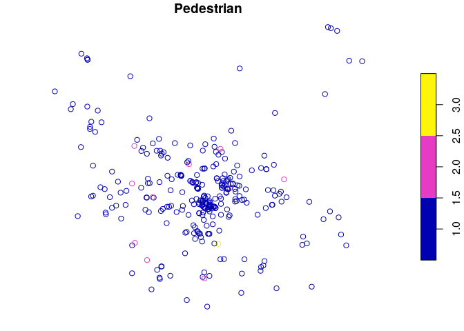
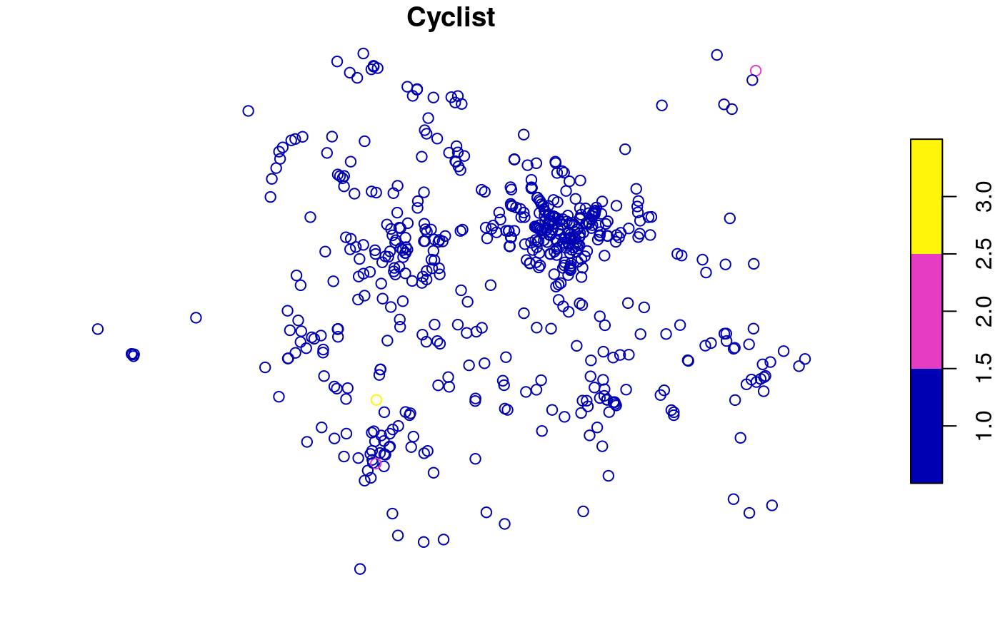
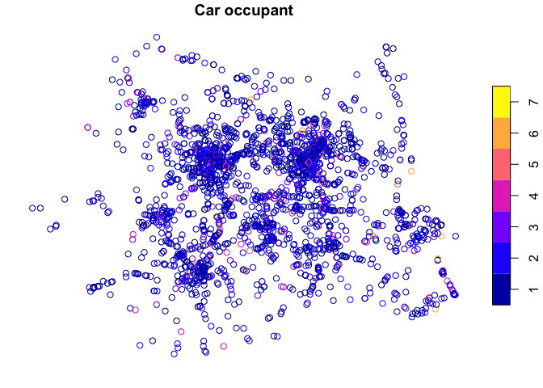
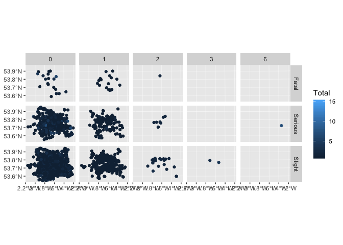

[](https://www.tidyverse.org/lifecycle/#maturing)
[](https://travis-ci.org/ITSLeeds/stats19)
[](https://codecov.io/gh/ITSLeeds/stats19)
[](https://gitter.im/stats19/Lobby?source=orgpage)
[](http://www.r-pkg.org/pkg/stats19)
[](http://www.r-pkg.org/pkg/stats19)

<!-- README.md is generated from README.Rmd. Please edit that file -->

# stats19

**stats19** provides functions for downloading and formatting road crash
data. Specifically, it enables access to the UK’s official road traffic
casualty database,
[STATS19](https://data.gov.uk/dataset/cb7ae6f0-4be6-4935-9277-47e5ce24a11f/road-safety-data).
(The name comes from the form used by the police to record car crashes
and other incidents resulting in casualties on the roads).

**Note**: The Department for Transport refers to “accidents”, but
“crashes” is a more appropriate term, as emphasised in the “crash not
accident” arguments of road safety advocacy groups such as
[RoadPeace](http://www.roadpeace.org/take-action/crash-not-accident/).
We use the term “accidents” only in reference to nomenclature within the
data as provided.

The data is provided by the UK’s Department for Transport (DfT) as a
series of `.csv` files that are stored in dozens of `.zip` files.
Finding, reading-in and formatting the data for research can be a time
consuming process subject to human error. **stats19** speeds up these
vital data access and cleaning stages of the research process, enabling
reproducibility, by streamlining the work into 3 stages:

  - **Download**: This single `dl_stats19()` function accepts `year`,
    `type` and `filename` arguments to make it easy to find the right
    file for your research question.

  - **Read**: STATS19 data is provided in a particular format that
    benefits from being read-in with pre-specified column types. This is
    taken care of with `read_*()` functions providing access to the 3
    main tables in STATS19 data:
    
      - `read_accidents()` reads-in the crash data (which has one row
        per incident)
      - `read_casualties()` reads-in the casualty data (which has one
        row per person injured or killed)
      - `read_vehicles()` reads-in the vehicles table, which contains
        information on the vehicles involved in the crashes (and has one
        row per vehicle)

  - **Format**: Each of the `read_*()` functions has a `format`
    parameter which, when `TRUE`, adds labels to the tables. The raw
    data provided by the DfT contains only integers. Running
    `read_*(..., format = TRUE)` converts these integer values to the
    corresponding character variables for each of the three tables. For
    example, `read_accidents(format = TRUE)` converts values in the
    `accident_severity` column from `1`, `2` and `3` to `Slight`,
    `Serious` and `Fatal`. To read-in raw data without formatting, set
    `format = FALSE`.

A full description of the stats19 data and variables they contain can be
found in a
[document](http://data.dft.gov.uk/road-accidents-safety-data/Brief-guide-to%20road-accidents-and-safety-data.doc)
provided by the UK’s Department for Transport (DfT).

## Installation

Install and load the latest version with:

``` r
devtools::install_github("ITSLeeds/stats19")
```

``` r
library(stats19)
#> Data provided under the conditions of the Open Government License.
#> If you use data from this package, mention the source
#> (Department for Transport), cite the package and link to:
#> www.nationalarchives.gov.uk/doc/open-government-licence/version/3/.
```

<!-- You can install the released version of stats19 from [CRAN](https://CRAN.R-project.org) with: -->

<!-- ``` r -->

<!-- install.packages("stats19") -->

<!-- ``` -->

## Data download

**stats19** enables download of raw stats19 data with `dl_*` functions.
The following code chunk, for example, downloads and unzips a .zip file
containing Stats19 data from 2017:

``` r
dl_stats19(year = 2017, type = "Accidents")
#> Files identified: dftRoadSafetyData_Accidents_2017.zip
#> Attempt downloading from:
#>    http://data.dft.gov.uk.s3.amazonaws.com/road-accidents-safety-data/dftRoadSafetyData_Accidents_2017.zip
#> Data saved at /tmp/Rtmp2GCAwb/dftRoadSafetyData_Accidents_2017/Acc.csv
```

Currently, these files are downloaded to a default location of `tempdir`
which is a platform independent “safe” but temporary location to
download the data in. Once downloaded, they are unzipped under original
DfT file names. The `dl_stats19()` function prints out the location and
final file name(s) of unzipped files(s) as shown above. Data files from
other years can be downloaded in an interactive manner. Providing just
the year for example, would present the following options:

``` r
dl_stats19(year = 2017)
```

    Multiple matches. Which do you want to download?
    
    1: dftRoadSafetyData_Vehicles_2017.zip
    2: dftRoadSafetyData_Casualties_2017.zip
    3: dftRoadSafetyData_Accidents_2017.zip
    
    Selection: 
    Enter an item from the menu, or 0 to exit

## Reading-in and formatting STATS19 data

As mentioned above STATS19 contains 3 main tables:

  - Accidents, the main table which contains information on the crash
    time, location and other variables (32 columns in total)
  - Casualties, containing data on people hurt or killed in each crash
    (16 columns in total)
  - Vehicles, containing data on vehicles involved in or causing each
    crash (23 columns in total)

Code to read-in and format each of these tables is now demonstrated.

### Crash data

After raw data files have been downloaded as described in the previous
section, they can then be read-in as follows:

``` r
crashes_2017_raw = read_accidents(year = 2017, format = FALSE)
#> Reading in:
#> /tmp/Rtmp2GCAwb/dftRoadSafetyData_Accidents_2017/Acc.csv
crashes_2017 = format_accidents(crashes_2017_raw)
nrow(crashes_2017_raw)
#> [1] 129982
ncol(crashes_2017_raw)
#> [1] 32
nrow(crashes_2017)
#> [1] 129982
ncol(crashes_2017)
#> [1] 32
```

What just happened? We read-in data on all road crashes recorded by the
police in 2017 across Great Britain. The dataset contains 32 columns
(variables) for 129,982 crashes.

This work was done by `read_accidents(format = FALSE)`, which imported
the “raw” Stats19 data without cleaning messy column names or
re-categorising the outputs. `format_accidents()` automates the process
of matching column names with variable names and labels in a [`.xls`
file](http://data.dft.gov.uk/road-accidents-safety-data/Road-Accident-Safety-Data-Guide.xls)
provided by the DfT. This means `crashes_2017` is much more usable than
`crashes_2017_raw`, as shown below, which shows some key variables in
the messy and clean datasets:

``` r
crashes_2017_raw[c(7, 18, 23, 25)]
#> # A tibble: 129,982 x 4
#>    Accident_Severity Speed_limit `Pedestrian_Crossing-Hum… Light_Conditions
#>                <int>       <int>                     <int>            <int>
#>  1                 1          30                         0                4
#>  2                 3          30                         0                4
#>  3                 3          30                         0                4
#>  4                 3          30                         0                4
#>  5                 2          20                         0                4
#>  6                 3          30                         0                4
#>  7                 3          40                         0                4
#>  8                 3          30                         2                4
#>  9                 2          50                         0                4
#> 10                 2          30                         0                4
#> # ... with 129,972 more rows
crashes_2017[c(7, 18, 23, 25)]
#> # A tibble: 129,982 x 4
#>    accident_severity speed_limit pedestrian_crossing_hu… light_conditions  
#>    <chr>                   <int> <chr>                   <chr>             
#>  1 Fatal                      30 None within 50 metres   Darkness - lights…
#>  2 Slight                     30 None within 50 metres   Darkness - lights…
#>  3 Slight                     30 None within 50 metres   Darkness - lights…
#>  4 Slight                     30 None within 50 metres   Darkness - lights…
#>  5 Serious                    20 None within 50 metres   Darkness - lights…
#>  6 Slight                     30 None within 50 metres   Darkness - lights…
#>  7 Slight                     40 None within 50 metres   Darkness - lights…
#>  8 Slight                     30 Control by other autho… Darkness - lights…
#>  9 Serious                    50 None within 50 metres   Darkness - lights…
#> 10 Serious                    30 None within 50 metres   Darkness - lights…
#> # ... with 129,972 more rows
```

By default, `format = TRUE`, meaning that the two stages of
`read_accidents(format = FALSE)` and `format_accidents()` yield the same
result as `read_accidents(format = TRUE)`. For the full list of columns,
run `names(crashes_2017)` or see the
vignette.

<!-- This means `crashes_2017` is much more usable than `crashes_2017_raw`, as shown below, which shows three records and some key variables in the messy and clean datasets: -->

**Note**: As indicated above, the term “accidents” is only used as
directly provided by the DfT; “crashes” is a more appropriate term,
hence we call our resultant datasets `crashes_*`.

## Casualties data

As with `crashes_2017`, casualty data for 2017 can be downloaded,
read-in and formated as follows:

``` r
dl_stats19(year = 2017, type = "casualties")
#> Files identified: dftRoadSafetyData_Casualties_2017.zip
#> Attempt downloading from:
#>    http://data.dft.gov.uk.s3.amazonaws.com/road-accidents-safety-data/dftRoadSafetyData_Casualties_2017.zip
#> Data saved at /tmp/Rtmp2GCAwb/dftRoadSafetyData_Casualties_2017/Cas.csv
casualties_2017 = read_casualties(year = 2017)
nrow(casualties_2017)
#> [1] 170993
ncol(casualties_2017)
#> [1] 16
```

The results show that there were 170,993 casualties reported by the
police in the STATS19 dataset in 2017, and 16 columns (variables).
Values for a sample of these columns are shown below:

``` r
casualties_2017[c(4, 5, 6, 14)]
#> # A tibble: 170,993 x 4
#>    casualty_class  sex_of_casualty age_of_casualty casualty_type           
#>    <chr>           <chr>                     <int> <chr>                   
#>  1 Passenger       Female                       18 Car occupant            
#>  2 Driver or rider Male                         19 Motorcycle 50cc and und…
#>  3 Passenger       Male                         18 Motorcycle 50cc and und…
#>  4 Passenger       Female                       33 Car occupant            
#>  5 Driver or rider Female                       31 Car occupant            
#>  6 Passenger       Male                          3 Car occupant            
#>  7 Pedestrian      Male                         45 Pedestrian              
#>  8 Driver or rider Male                         14 Motorcycle 125cc and un…
#>  9 Driver or rider Female                       58 Car occupant            
#> 10 Driver or rider Male                         27 Car occupant            
#> # ... with 170,983 more rows
```

The full list of column names in the `casualties` dataset is:

``` r
names(casualties_2017)
#>  [1] "accident_index"                    
#>  [2] "vehicle_reference"                 
#>  [3] "casualty_reference"                
#>  [4] "casualty_class"                    
#>  [5] "sex_of_casualty"                   
#>  [6] "age_of_casualty"                   
#>  [7] "age_band_of_casualty"              
#>  [8] "casualty_severity"                 
#>  [9] "pedestrian_location"               
#> [10] "pedestrian_movement"               
#> [11] "car_passenger"                     
#> [12] "bus_or_coach_passenger"            
#> [13] "pedestrian_road_maintenance_worker"
#> [14] "casualty_type"                     
#> [15] "casualty_home_area_type"           
#> [16] "casualty_imd_decile"
```

## Vehicles data

Data for vehicles involved in crashes in 2017 can be downloaded, read-in
and formated as follows:

``` r
dl_stats19(year = 2017, type = "vehicles")
#> Files identified: dftRoadSafetyData_Vehicles_2017.zip
#> Attempt downloading from:
#>    http://data.dft.gov.uk.s3.amazonaws.com/road-accidents-safety-data/dftRoadSafetyData_Vehicles_2017.zip
#> Data saved at /tmp/Rtmp2GCAwb/dftRoadSafetyData_Vehicles_2017/Veh.csv
vehicles_2017 = read_vehicles(year = 2017)
nrow(vehicles_2017)
#> [1] 238926
ncol(vehicles_2017)
#> [1] 23
```

The results show that there were 238,926 vehicles involved in crashes
reported by the police in the STATS19 dataset in 2017, with 23 columns
(variables). Values for a sample of these columns are shown below:

``` r
vehicles_2017[c(3, 14:16)]
#> # A tibble: 238,926 x 4
#>    vehicle_type          journey_purpose_of_dr… sex_of_driver age_of_driver
#>    <chr>                 <chr>                  <chr>                 <int>
#>  1 Car                   Not known              Male                     24
#>  2 Motorcycle 50cc and … Not known              Male                     19
#>  3 Car                   Not known              Male                     33
#>  4 Car                   Not known              Male                     40
#>  5 Car                   Not known              Not known                -1
#>  6 Car                   Not known              Male                     35
#>  7 Car                   Not known              Female                   31
#>  8 Car                   Not known              Female                   37
#>  9 Car                   Not known              Female                   29
#> 10 Car                   Not known              Male                     78
#> # ... with 238,916 more rows
```

The full list of column names in the `vehicles` dataset is:

``` r
names(vehicles_2017)
#>  [1] "accident_index"                   "vehicle_reference"               
#>  [3] "vehicle_type"                     "towing_and_articulation"         
#>  [5] "vehicle_manoeuvre"                "vehicle_location_restricted_lane"
#>  [7] "junction_location"                "skidding_and_overturning"        
#>  [9] "hit_object_in_carriageway"        "vehicle_leaving_carriageway"     
#> [11] "hit_object_off_carriageway"       "first_point_of_impact"           
#> [13] "was_vehicle_left_hand_drive"      "journey_purpose_of_driver"       
#> [15] "sex_of_driver"                    "age_of_driver"                   
#> [17] "age_band_of_driver"               "engine_capacity_cc"              
#> [19] "propulsion_code"                  "age_of_vehicle"                  
#> [21] "driver_imd_decile"                "driver_home_area_type"           
#> [23] "vehicle_imd_decile"
```

<!-- More data can be read-in as follows: -->

## Creating geographic crash data

An important feature of STATS19 data is that the “accidents” table
contains geographic coordinates. These are provided at \~10m resolution
in the UK’s official coordinate reference system (the Ordnance Survey
National Grid, EPSG code 27700). **stats19** converts the non-geographic
tables created by `format_accidents()` into the geographic data form of
the [`sf` package](https://cran.r-project.org/package=sf) with the
function `format_sf()` as follows:

``` r
crashes_sf = format_sf(crashes_2017)
#> 19 rows removed with no coordinates
```

The note arises because `NA` values are not permitted in `sf`
coordinates, and so rows containing no coordinates are automatically
removed. Having the data in a standard geographic form allows various
geographic operations to be performed on it. The following code chunk,
for example, returns all crashes within the boundary of the Leeds local
authority. This requires the **ukboundaries** GitHub package:

``` r
devtools::install_github("Robinlovelace/ukboundaries")
```

``` r
library(sf)
#> Linking to GEOS 3.7.0, GDAL 2.3.2, PROJ 5.2.0
leeds_osgb = st_transform(ukboundaries::leeds, crs = 27700)
#> Using default data cache directory ~/.ukboundaries/cache 
#> Use cache_dir() to change it.
crashes_leeds = crashes_sf[leeds_osgb, ]
nrow(crashes_sf)
#> [1] 129963
nrow(crashes_leeds)
#> [1] 1713
```

This subsetting has selected the 1,713 crashes which occurred within the
Leeds boundary.

## Joining tables

The three main tables we have just read-in can be joined by shared key
variables. This is demonstrated in the code chunk below, which subsets
all casualties that took place in Leeds, and counts the number of
casualties by severity for each crash:

``` r
library(tidyverse)
sel = casualties_2017$accident_index %in% crashes_leeds$accident_index
casualties_leeds = casualties_2017[sel, ]
cas_types = casualties_leeds %>% 
  select(accident_index, casualty_type) %>% 
  mutate(n = 1) %>% 
  group_by(accident_index, casualty_type) %>% 
  summarise(n = sum(n)) %>% 
  spread(casualty_type, n, fill = 0) 
cas_types$Total = rowSums(cas_types[-1])
crashes_joined = left_join(crashes_leeds, cas_types, by = "accident_index")
```

What just happened? We found the subset of casualties that took place in
Leeds with reference to the `accident_index` variable. Then we used
functions from the **tidyverse** package **dplyr** (and `spread()` from
**tidyr**) to create a dataset with a column for each casualty type. We
then joined the updated casualty data onto the `crashes_leeds` dataset.
The result is a spatial (`sf`) data frame of crashes in Leeds, with
columns counting how many road users of different types were hurt. The
original and joined data look like this:

``` r
crashes_leeds
#> Simple feature collection with 1713 features and 30 fields
#> geometry type:  POINT
#> dimension:      XY
#> bbox:           xmin: 415248 ymin: 423230 xmax: 445477 ymax: 449559
#> epsg (SRID):    27700
#> proj4string:    +proj=tmerc +lat_0=49 +lon_0=-2 +k=0.9996012717 +x_0=400000 +y_0=-100000 +ellps=airy +towgs84=446.448,-125.157,542.06,0.15,0.247,0.842,-20.489 +units=m +no_defs
#> # A tibble: 1,713 x 31
#>    accident_index longitude latitude police_force accident_severi…
#>    <chr>              <dbl>    <dbl> <chr>        <chr>           
#>  1 2017120223550      -1.31     53.9 North Yorks… Slight          
#>  2 2017133AP0313      -1.60     53.8 West Yorksh… Serious         
#>  3 2017133BE0850      -1.53     53.8 West Yorksh… Slight          
#>  4 2017134110858      -1.56     53.8 West Yorksh… Slight          
#>  5 2017134111495      -1.55     53.8 West Yorksh… Slight          
#>  6 2017134111706      -1.46     53.8 West Yorksh… Slight          
#>  7 2017134120471      -1.34     53.8 West Yorksh… Slight          
#>  8 2017134121054      -1.36     53.8 West Yorksh… Serious         
#>  9 2017134121066      -1.54     53.8 West Yorksh… Slight          
#> 10 2017134121358      -1.52     53.8 West Yorksh… Serious         
#> # ... with 1,703 more rows, and 26 more variables:
#> #   number_of_vehicles <int>, number_of_casualties <int>, date <chr>,
#> #   day_of_week <chr>, time <chr>, local_authority_district <chr>,
#> #   local_authority_highway <chr>, first_road_class <chr>,
#> #   first_road_number <int>, road_type <chr>, speed_limit <int>,
#> #   junction_detail <chr>, junction_control <chr>,
#> #   second_road_class <chr>, second_road_number <int>,
#> #   pedestrian_crossing_human_control <chr>,
#> #   pedestrian_crossing_physical_facilities <chr>, light_conditions <chr>,
#> #   weather_conditions <chr>, road_surface_conditions <chr>,
#> #   special_conditions_at_site <chr>, carriageway_hazards <chr>,
#> #   urban_or_rural_area <chr>,
#> #   did_police_officer_attend_scene_of_accident <int>,
#> #   lsoa_of_accident_location <chr>, geometry <POINT [m]>
cas_types
#> # A tibble: 1,713 x 17
#> # Groups:   accident_index [1,713]
#>    accident_index `Bus or coach o… `Car occupant` Cyclist `Goods vehicle …
#>    <chr>                     <dbl>          <dbl>   <dbl>            <dbl>
#>  1 2017120223550                 0              0       2                0
#>  2 2017133AP0313                 0              0       0                0
#>  3 2017133BE0850                 0              0       1                0
#>  4 2017134110858                 0              2       0                0
#>  5 2017134111495                 0              1       0                0
#>  6 2017134111706                 0              1       0                0
#>  7 2017134120471                 0              2       0                0
#>  8 2017134121054                 0              3       0                0
#>  9 2017134121066                 0              0       0                0
#> 10 2017134121358                 0              0       0                0
#> # ... with 1,703 more rows, and 12 more variables: `Goods vehicle (over
#> #   3.5t. and under 7.5t.) occupant` <dbl>, `Minibus (8 - 16 passenger
#> #   seats) occupant` <dbl>, `Motorcycle - unknown cc rider or
#> #   passenger` <dbl>, `Motorcycle 125cc and under rider or
#> #   passenger` <dbl>, `Motorcycle 50cc and under rider or
#> #   passenger` <dbl>, `Motorcycle over 125cc and up to 500cc rider or
#> #   passenger` <dbl>, `Motorcycle over 500cc rider or passenger` <dbl>,
#> #   `Other vehicle occupant` <dbl>, Pedestrian <dbl>, `Taxi/Private hire
#> #   car occupant` <dbl>, `Van / Goods vehicle (3.5 tonnes mgw or under)
#> #   occupant` <dbl>, Total <dbl>
crashes_joined
#> Simple feature collection with 1713 features and 46 fields
#> geometry type:  POINT
#> dimension:      XY
#> bbox:           xmin: 415248 ymin: 423230 xmax: 445477 ymax: 449559
#> epsg (SRID):    27700
#> proj4string:    +proj=tmerc +lat_0=49 +lon_0=-2 +k=0.9996012717 +x_0=400000 +y_0=-100000 +ellps=airy +towgs84=446.448,-125.157,542.06,0.15,0.247,0.842,-20.489 +units=m +no_defs
#> # A tibble: 1,713 x 47
#>    accident_index longitude latitude police_force accident_severi…
#>    <chr>              <dbl>    <dbl> <chr>        <chr>           
#>  1 2017120223550      -1.31     53.9 North Yorks… Slight          
#>  2 2017133AP0313      -1.60     53.8 West Yorksh… Serious         
#>  3 2017133BE0850      -1.53     53.8 West Yorksh… Slight          
#>  4 2017134110858      -1.56     53.8 West Yorksh… Slight          
#>  5 2017134111495      -1.55     53.8 West Yorksh… Slight          
#>  6 2017134111706      -1.46     53.8 West Yorksh… Slight          
#>  7 2017134120471      -1.34     53.8 West Yorksh… Slight          
#>  8 2017134121054      -1.36     53.8 West Yorksh… Serious         
#>  9 2017134121066      -1.54     53.8 West Yorksh… Slight          
#> 10 2017134121358      -1.52     53.8 West Yorksh… Serious         
#> # ... with 1,703 more rows, and 42 more variables:
#> #   number_of_vehicles <int>, number_of_casualties <int>, date <chr>,
#> #   day_of_week <chr>, time <chr>, local_authority_district <chr>,
#> #   local_authority_highway <chr>, first_road_class <chr>,
#> #   first_road_number <int>, road_type <chr>, speed_limit <int>,
#> #   junction_detail <chr>, junction_control <chr>,
#> #   second_road_class <chr>, second_road_number <int>,
#> #   pedestrian_crossing_human_control <chr>,
#> #   pedestrian_crossing_physical_facilities <chr>, light_conditions <chr>,
#> #   weather_conditions <chr>, road_surface_conditions <chr>,
#> #   special_conditions_at_site <chr>, carriageway_hazards <chr>,
#> #   urban_or_rural_area <chr>,
#> #   did_police_officer_attend_scene_of_accident <int>,
#> #   lsoa_of_accident_location <chr>, `Bus or coach occupant (17 or more
#> #   pass seats)` <dbl>, `Car occupant` <dbl>, Cyclist <dbl>, `Goods
#> #   vehicle (7.5 tonnes mgw and over) occupant` <dbl>, `Goods vehicle
#> #   (over 3.5t. and under 7.5t.) occupant` <dbl>, `Minibus (8 - 16
#> #   passenger seats) occupant` <dbl>, `Motorcycle - unknown cc rider or
#> #   passenger` <dbl>, `Motorcycle 125cc and under rider or
#> #   passenger` <dbl>, `Motorcycle 50cc and under rider or
#> #   passenger` <dbl>, `Motorcycle over 125cc and up to 500cc rider or
#> #   passenger` <dbl>, `Motorcycle over 500cc rider or passenger` <dbl>,
#> #   `Other vehicle occupant` <dbl>, Pedestrian <dbl>, `Taxi/Private hire
#> #   car occupant` <dbl>, `Van / Goods vehicle (3.5 tonnes mgw or under)
#> #   occupant` <dbl>, Total <dbl>, geometry <POINT [m]>
```

This join operation has enabled us to georeference the casualty data,
enabling us to explore the spatial distribution of different casualty
types as follows:

``` r
plot(crashes_joined[crashes_joined$Pedestrian > 0, "Pedestrian"])
plot(crashes_joined[crashes_joined$Cyclist > 0, "Cyclist"])
plot(crashes_joined[crashes_joined$`Car occupant` > 0, "Car occupant"])
```



It is clear that pedestrians, cyclists and car occupants tend to get
hurt in different places. Car occupant casualties, for example, are
comparatively common on the outskirts of Leeds, where speed limits tend
to be higher and where there are comparatively higher volumes of motor
traffic, compared with the city centre.

Another way of visualising these data is to show the spatial
distribution of crashes causing pedestrian casualties by number of
pedestrians hurt and crash severity. This is easily done with
**ggplot2**:

``` r
ggplot(crashes_joined, aes(colour = Total)) +
  geom_sf() +
  facet_grid(vars(accident_severity), vars(Pedestrian))
```



These figures suggest that pedestrian casualties tend to happen more
frequently near the city centre, compared with other types of casualty.

## Time series analysis

We can also explore weekly and seasonal trends in crashes by aggregating
crashes by day of the year:

``` r
crashes_dates = crashes_joined %>% 
  st_set_geometry(NULL) %>% 
  group_by(date = lubridate::dmy(date)) %>% 
  summarise(Pedestrian = sum(Pedestrian), Cyclist = sum(Cyclist),
            `Car occupant` = sum(`Car occupant`)) %>% 
  gather(mode, casualties, -date)
ggplot(crashes_dates, aes(date, casualties)) +
  geom_smooth(aes(colour = mode), method = "loess") +
  ylab("Casualties per day")
```


Different types of crashes also tend to happen at different times of
day. This is illustrated in the plot below, which shows the times of day
when people who were travelling by different modes were most commonly
injured.

``` r
crash_times = crashes_joined %>% 
  st_set_geometry(NULL) %>% 
  group_by(hour = as.numeric(str_sub(time, 1, 2))) %>% 
  summarise(Pedestrian = sum(Pedestrian), Cyclist = sum(Cyclist),
            `Car occupant` = sum(`Car occupant`)) %>% 
  gather(mode, casualties, -hour)
ggplot(crash_times, aes(hour, casualties)) +
  geom_smooth(aes(colour = mode), method = "loess")
```


Note that cycling manifests distinct morning and afternoon peaks (see
Lovelace, Roberts, and Kellar 2016 for more on this).

## Next steps

There is much important research that needs to be done to help make the
transport systems in many cities safer. Even if you’re not working with
UK data, we hope that the data provided by **stats19** data can help
safety researchers develop new methods to better understand the reasons
why people are needlessly hurt and killed on the roads.

The next step is to gain a deeper understanding of **stats19** and the
data it provides. Then it’s time to pose interesting research questions,
some of which could provide an evidence-base in support policies that
save lives (e.g. Sarkar, Webster, and Kumari 2018). For more on these
next steps, see the package’s introductory vignette.

## Further information

The **stats19** package builds on previous work, including:

  - code in the [bikeR](https://github.com/Robinlovelace/bikeR) repo
    underlying an academic paper on collisions involving cyclists
  - functions in
    [**stplanr**](https://github.com/ropensci/stplanr/blob/master/R/load-stats19.R)
    for downloading Stats19 data
  - updated functions related to the
    [CyIPT](https://github.com/cyipt/stats19) project

## References

<div id="refs" class="references">

<div id="ref-lovelace_who_2016">

Lovelace, Robin, Hannah Roberts, and Ian Kellar. 2016. “Who, Where,
When: The Demographic and Geographic Distribution of Bicycle Crashes in
West Yorkshire.” *Transportation Research Part F: Traffic Psychology and
Behaviour*, Bicycling and bicycle safety, 41, Part B.
<https://doi.org/10.1016/j.trf.2015.02.010>.

</div>

<div id="ref-sarkar_street_2018">

Sarkar, Chinmoy, Chris Webster, and Sarika Kumari. 2018. “Street
Morphology and Severity of Road Casualties: A 5-Year Study of Greater
London.” *International Journal of Sustainable Transportation* 12 (7):
510–25. <https://doi.org/10.1080/15568318.2017.1402972>.

</div>

</div>
