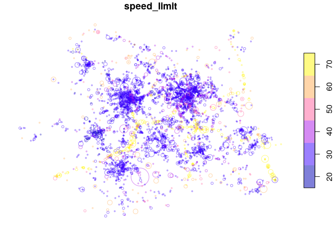
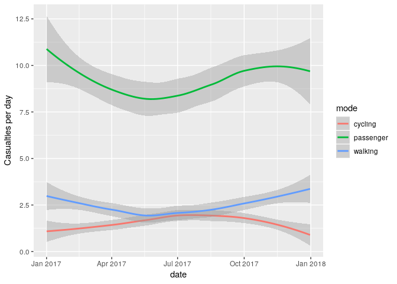
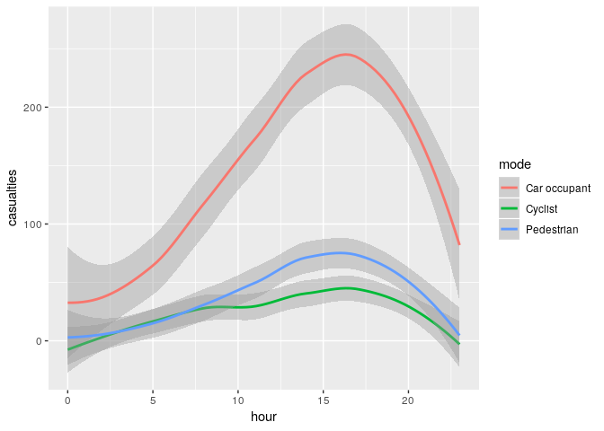

[](https://www.tidyverse.org/lifecycle/#maturing)
[](https://travis-ci.org/ropensci/stats19)
[](https://codecov.io/gh/ropensci/stats19)
[](https://gitter.im/stats19/Lobby?source=orgpage)
[](http://www.r-pkg.org/pkg/stats19)
[](http://www.r-pkg.org/pkg/stats19)
[](https://github.com/ropensci/onboarding/issues/266)

<!-- README.md is generated from README.Rmd. Please edit that file -->

# stats19

**stats19** provides functions for downloading and formatting road crash
data. Specifically, it enables access to the UK’s official road traffic
casualty database,
[STATS19](https://data.gov.uk/dataset/cb7ae6f0-4be6-4935-9277-47e5ce24a11f/road-safety-data).
(The name comes from the form used by the police to record car crashes
and other incidents resulting in casualties on the roads.)

A full overview of STATS19 variables be found in a
[document](http://data.dft.gov.uk/road-accidents-safety-data/Brief-guide-to%20road-accidents-and-safety-data.doc)
provided by the UK’s Department for Transport (DfT).

The raw data is provided as a series of `.csv` files that contain
integers and which are stored in dozens of `.zip` files. Finding,
reading-in and formatting the data for research can be a time consuming
process subject to human error. **stats19** speeds up these vital but
boring and error-prone stages of the research process with a single
function: `get_stats19()`. By allowing public access to properly
labelled road crash data, **stats19** aims to make road safety research
more reproducible and accessible.

For transparency and modularity, each stage can be undertaken
separately, as documented in the [stats19
vignette](https://itsleeds.github.io/stats19/articles/stats19.html).

## Installation

Install and load the latest version with:

``` r
remotes::install_github("ropensci/stats19")
```

``` r
library(stats19)
#> Data provided under OGL v3.0. Cite the source and link to:
#> www.nationalarchives.gov.uk/doc/open-government-licence/version/3/
```

<!-- You can install the released version of stats19 from [CRAN](https://CRAN.R-project.org) with: -->

<!-- ``` r -->

<!-- install.packages("stats19") -->

<!-- ``` -->

## get\_stats19()

`get_stats19()` requires `year` and `type` parameters, mirroring the
provision of STATS19 data files, which are categorised by year (from
1979 onward) and type (with separate tables for crashes, casualties and
vehicles, as outlined below). The following command, for example, gets
crash data from 2017 (**note**: we follow the “crash not accident”
campaign of
[RoadPeace](http://www.roadpeace.org/take-action/crash-not-accident/) in
naming crashes, although the DfT refers to the relevant tables as
‘accidents’ data):

``` r
crashes = get_stats19(year = 2017, type = "accident")
#> Files identified: dftRoadSafetyData_Accidents_2017.zip
#>    http://data.dft.gov.uk.s3.amazonaws.com/road-accidents-safety-data/dftRoadSafetyData_Accidents_2017.zip
#> Attempt downloading from:
#> Data saved at /tmp/RtmpIosDPA/dftRoadSafetyData_Accidents_2017/Acc.csv
#> Reading in:
#> /tmp/RtmpIosDPA/dftRoadSafetyData_Accidents_2017/Acc.csv
```

What just happened? We read-in data on all road crashes recorded by the
police in 2017 across Great Britain. The dataset contains 32 columns
(variables) for 129,982 crashes. The contents of this dataset, and other
datasets provided by **stats19**, are outlined below and described in
more detail in the [stats19
vignette](https://itsleeds.github.io/stats19/articles/stats19.html).

We will see below how the function also works to get the corresponding
casualty and vehicle datasets for 2017. The package also allows STATS19
files to be downloaded and read-in separately, allowing more control
over what you download, and subsequently read-in, with
`read_accidents()`, `read_casualties()` and `read_vehicles()`, as
described in the vignette.

## Data download

Data files can be downloaded without reading them in using the function
`dl_stats19()`. If there are multiple matches, you will be asked to
choose from a range of options. Providing just the year, for example,
will result in the following options:

``` r
dl_stats19(year = 2017)
```

    Multiple matches. Which do you want to download?
    
    1: dftRoadSafetyData_vehicles.zip
    2: dftRoadSafetyData_casualties.zip
    3: dftRoadSafetyData_Accidents_2017.zip
    
    Selection: 
    Enter an item from the menu, or 0 to exit

## Using the data

STATS19 data consists of 3 main tables:

  - Accidents, the main table which contains information on the crash
    time, location and other variables (32 columns in total)
  - Casualties, containing data on people hurt or killed in each crash
    (16 columns in total)
  - Vehicles, containing data on vehicles involved in or causing each
    crash (23 columns in total)

The contents of each is outlined below.

### Crash data

Crash data was downloaded and read-in using the function
`get_stats19()`, as described above.

``` r
nrow(crashes)
#> [1] 129982
ncol(crashes)
#> [1] 32
```

Some of the key variables in this dataset include:

``` r
crashes[c(7, 18, 23, 25)]
#> # A tibble: 129,982 x 4
#>    accident_severity speed_limit pedestrian_crossing_hu… light_conditions  
#>    <chr>                   <int> <chr>                   <chr>             
#>  1 Fatal                      30 None within 50 metres   Darkness - lights…
#>  2 Slight                     30 None within 50 metres   Darkness - lights…
#>  3 Slight                     30 None within 50 metres   Darkness - lights…
#>  4 Slight                     30 None within 50 metres   Darkness - lights…
#>  5 Serious                    20 None within 50 metres   Darkness - lights…
#>  6 Slight                     30 None within 50 metres   Darkness - lights…
#>  7 Slight                     40 None within 50 metres   Darkness - lights…
#>  8 Slight                     30 Control by other autho… Darkness - lights…
#>  9 Serious                    50 None within 50 metres   Darkness - lights…
#> 10 Serious                    30 None within 50 metres   Darkness - lights…
#> # … with 129,972 more rows
```

For the full list of columns, run `names(crashes)` or see the
[vignette](https://github.com/ropensci/stats19/blob/master/vignettes/stats19.Rmd).

<!-- This means `crashes` is much more usable than `crashes_raw`, as shown below, which shows three records and some key variables in the messy and clean datasets: -->

### Casualties data

As with `crashes`, casualty data for 2017 can be downloaded, read-in and
formatted as follows:

``` r
casualties = get_stats19(year = 2017, type = "casualties")
#> Files identified: dftRoadSafetyData_Casualties_2017.zip
#>    http://data.dft.gov.uk.s3.amazonaws.com/road-accidents-safety-data/dftRoadSafetyData_Casualties_2017.zip
#> Attempt downloading from:
#> Data saved at /tmp/RtmpIosDPA/dftRoadSafetyData_Casualties_2017/Cas.csv
nrow(casualties)
#> [1] 170993
ncol(casualties)
#> [1] 16
```

The results show that there were 170,993 casualties reported by the
police in the STATS19 dataset in 2017, and 16 columns (variables).
Values for a sample of these columns are shown below:

``` r
casualties[c(4, 5, 6, 14)]
#> # A tibble: 170,993 x 4
#>    casualty_class  sex_of_casualty age_of_casualty casualty_type           
#>    <chr>           <chr>                     <int> <chr>                   
#>  1 Passenger       Female                       18 Car occupant            
#>  2 Driver or rider Male                         19 Motorcycle 50cc and und…
#>  3 Passenger       Male                         18 Motorcycle 50cc and und…
#>  4 Passenger       Female                       33 Car occupant            
#>  5 Driver or rider Female                       31 Car occupant            
#>  6 Passenger       Male                          3 Car occupant            
#>  7 Pedestrian      Male                         45 Pedestrian              
#>  8 Driver or rider Male                         14 Motorcycle 125cc and un…
#>  9 Driver or rider Female                       58 Car occupant            
#> 10 Driver or rider Male                         27 Car occupant            
#> # … with 170,983 more rows
```

The full list of column names in the `casualties` dataset is:

``` r
names(casualties)
#>  [1] "accident_index"                    
#>  [2] "vehicle_reference"                 
#>  [3] "casualty_reference"                
#>  [4] "casualty_class"                    
#>  [5] "sex_of_casualty"                   
#>  [6] "age_of_casualty"                   
#>  [7] "age_band_of_casualty"              
#>  [8] "casualty_severity"                 
#>  [9] "pedestrian_location"               
#> [10] "pedestrian_movement"               
#> [11] "car_passenger"                     
#> [12] "bus_or_coach_passenger"            
#> [13] "pedestrian_road_maintenance_worker"
#> [14] "casualty_type"                     
#> [15] "casualty_home_area_type"           
#> [16] "casualty_imd_decile"
```

### Vehicles data

Data for vehicles involved in crashes in 2017 can be downloaded, read-in
and formatted as follows:

``` r
vehicles = get_stats19(year = 2017, type = "vehicles")
#> Files identified: dftRoadSafetyData_Vehicles_2017.zip
#>    http://data.dft.gov.uk.s3.amazonaws.com/road-accidents-safety-data/dftRoadSafetyData_Vehicles_2017.zip
#> Attempt downloading from:
#> Data saved at /tmp/RtmpIosDPA/dftRoadSafetyData_Vehicles_2017/Veh.csv
nrow(vehicles)
#> [1] 238926
ncol(vehicles)
#> [1] 23
```

The results show that there were 238,926 vehicles involved in crashes
reported by the police in the STATS19 dataset in 2017, with 23 columns
(variables). Values for a sample of these columns are shown below:

``` r
vehicles[c(3, 14:16)]
#> # A tibble: 238,926 x 4
#>    vehicle_type          journey_purpose_of_dr… sex_of_driver age_of_driver
#>    <chr>                 <chr>                  <chr>                 <int>
#>  1 Car                   Not known              Male                     24
#>  2 Motorcycle 50cc and … Not known              Male                     19
#>  3 Car                   Not known              Male                     33
#>  4 Car                   Not known              Male                     40
#>  5 Car                   Not known              Not known                -1
#>  6 Car                   Not known              Male                     35
#>  7 Car                   Not known              Female                   31
#>  8 Car                   Not known              Female                   37
#>  9 Car                   Not known              Female                   29
#> 10 Car                   Not known              Male                     78
#> # … with 238,916 more rows
```

The full list of column names in the `vehicles` dataset is:

``` r
names(vehicles)
#>  [1] "accident_index"                   "vehicle_reference"               
#>  [3] "vehicle_type"                     "towing_and_articulation"         
#>  [5] "vehicle_manoeuvre"                "vehicle_location_restricted_lane"
#>  [7] "junction_location"                "skidding_and_overturning"        
#>  [9] "hit_object_in_carriageway"        "vehicle_leaving_carriageway"     
#> [11] "hit_object_off_carriageway"       "first_point_of_impact"           
#> [13] "was_vehicle_left_hand_drive"      "journey_purpose_of_driver"       
#> [15] "sex_of_driver"                    "age_of_driver"                   
#> [17] "age_band_of_driver"               "engine_capacity_cc"              
#> [19] "propulsion_code"                  "age_of_vehicle"                  
#> [21] "driver_imd_decile"                "driver_home_area_type"           
#> [23] "vehicle_imd_decile"
```

## Creating geographic crash data

An important feature of STATS19 data is that the “accidents” table
contains geographic coordinates. These are provided at ~10m resolution
in the UK’s official coordinate reference system (the Ordnance Survey
National Grid, EPSG code 27700). **stats19** converts the non-geographic
tables created by `format_accidents()` into the geographic data form of
the [`sf` package](https://cran.r-project.org/package=sf) with the
function `format_sf()` as follows:

``` r
crashes_sf = format_sf(crashes)
#> 19 rows removed with no coordinates
```

The note arises because `NA` values are not permitted in `sf`
coordinates, and so rows containing no coordinates are automatically
removed. Having the data in a standard geographic form allows various
geographic operations to be performed on it. The following code chunk,
for example, returns all crashes within the boundary of West Yorkshire
(which is contained in the object
[`police_boundaries`](https://itsleeds.github.io/stats19/reference/police_boundaries.html),
an `sf` data frame containing all police jurisdictions in England and
Wales).

``` r
library(sf)
#> Linking to GEOS 3.7.0, GDAL 2.3.2, PROJ 5.2.0
library(dplyr)
#> 
#> Attaching package: 'dplyr'
#> The following objects are masked from 'package:stats':
#> 
#>     filter, lag
#> The following objects are masked from 'package:base':
#> 
#>     intersect, setdiff, setequal, union
wy = filter(police_boundaries, pfa16nm == "West Yorkshire")
crashes_wy = crashes_sf[wy, ]
nrow(crashes_sf)
#> [1] 129963
nrow(crashes_wy)
#> [1] 4371
```

This subsetting has selected the 4,371 crashes which occurred within
West Yorkshire in 2017.

## Joining tables

The three main tables we have just read-in can be joined by shared key
variables. This is demonstrated in the code chunk below, which subsets
all casualties that took place in Leeds, and counts the number of
casualties by severity for each crash:

``` r
sel = casualties$accident_index %in% crashes_wy$accident_index
casualties_wy = casualties[sel, ]
cas_types = casualties_wy %>% 
  select(accident_index, casualty_type) %>% 
  mutate(n = 1) %>% 
  group_by(accident_index, casualty_type) %>% 
  summarise(n = sum(n)) %>% 
  tidyr::spread(casualty_type, n, fill = 0) 
cas_types$Total = rowSums(cas_types[-1])
cj = left_join(crashes_wy, cas_types, by = "accident_index")
```

What just happened? We found the subset of casualties that took place in
West Yorkshire with reference to the `accident_index` variable. Then we
used functions from the **tidyverse** package **dplyr** (and `spread()`
from **tidyr**) to create a dataset with a column for each casualty
type. We then joined the updated casualty data onto the `crashes_wy`
dataset. The result is a spatial (`sf`) data frame of crashes in Leeds,
with columns counting how many road users of different types were hurt.
The original and joined data look like this:

``` r
crashes_wy[1:2, c(1, 5)] %>% st_drop_geometry()
#> # A tibble: 2 x 2
#>   accident_index accident_severity
#> * <chr>          <chr>            
#> 1 2017120009776  Slight           
#> 2 2017120010412  Slight
cas_types[1:2, c("accident_index", "Cyclist")]
#> # A tibble: 2 x 2
#> # Groups:   accident_index [2]
#>   accident_index Cyclist
#>   <chr>            <dbl>
#> 1 2017120009776        0
#> 2 2017120010412        1
cj[1:2, c(1, 5, 34)] %>% st_drop_geometry()
#> # A tibble: 2 x 3
#>   accident_index accident_severity Cyclist
#> * <chr>          <chr>               <dbl>
#> 1 2017120009776  Slight                  0
#> 2 2017120010412  Slight                  1
```

## Mapping crashes

The join operation added a geometry column to the casualty data,
enabling it to be mapped (for more advanced maps, see the
[vignette](https://itsleeds.github.io/stats19/articles/stats19.html)):

``` r
cex = cj$Total / 3
plot(cj["speed_limit"], cex = cex)
```



The spatial distribution of crashes in West Yorkshire clearly relates to
the region’s geography. Crashes tend to happen on busy Motorway roads
(with high speed limits, as shown in the map above) and city centres, of
Leeds and Bradford in particular. The severity and number of people hurt
(proportional to circle width in the map above) in crashes is related to
the speed limit roads. This can be seen by comparing the previous map
with an overview of the area, from an academic paper on the social,
spatial and temporal distribution of bike crashes (Lovelace, Roberts,
and Kellar
2016):


## Time series analysis

We can also explore weekly and seasonal trends in crashes by aggregating
crashes by day of the year:

``` r
library(ggplot2)
crashes_dates = cj %>% 
  st_set_geometry(NULL) %>% 
  group_by(date = lubridate::dmy(date)) %>% 
  summarise(
    walking = sum(Pedestrian),
    cycling = sum(Cyclist),
    passenger = sum(`Car occupant`)
    ) %>% 
  tidyr::gather(mode, casualties, -date)
ggplot(crashes_dates, aes(date, casualties)) +
  geom_smooth(aes(colour = mode), method = "loess") +
  ylab("Casualties per day")
```



Different types of crashes also tend to happen at different times of
day. This is illustrated in the plot below, which shows the times of day
when people who were travelling by different modes were most commonly
injured.

``` r
library(stringr)

crash_times = cj %>% 
  st_set_geometry(NULL) %>% 
  group_by(hour = as.numeric(str_sub(time, 1, 2))) %>% 
  summarise(
    walking = sum(Pedestrian),
    cycling = sum(Cyclist),
    passenger = sum(`Car occupant`)
    ) %>% 
  tidyr::gather(mode, casualties, -hour)

ggplot(crash_times, aes(hour, casualties)) +
  geom_line(aes(colour = mode))
```



Note that cycling manifests distinct morning and afternoon peaks (see
Lovelace, Roberts, and Kellar 2016 for more on this).

## Next steps

There is much important research that needs to be done to help make the
transport systems in many cities safer. Even if you’re not working with
UK data, we hope that the data provided by **stats19** data can help
safety researchers develop new methods to better understand the reasons
why people are needlessly hurt and killed on the roads.

The next step is to gain a deeper understanding of **stats19** and the
data it provides. Then it’s time to pose interesting research questions,
some of which could provide an evidence-base in support policies that
save lives (e.g. Sarkar, Webster, and Kumari 2018). For more on these
next steps, see the package’s introductory
[vignette](https://itsleeds.github.io/stats19/articles/stats19.html).

## Further information

The **stats19** package builds on previous work, including:

  - code in the [bikeR](https://github.com/Robinlovelace/bikeR) repo
    underlying an academic paper on collisions involving cyclists
  - functions in
    [**stplanr**](https://github.com/ropensci/stplanr/blob/master/R/load-stats19.R)
    for downloading Stats19 data
  - updated functions related to the
    [CyIPT](https://github.com/cyipt/stats19)
project

[](https://ropensci.org)

## References

<div id="refs" class="references">

<div id="ref-lovelace_who_2016">

Lovelace, Robin, Hannah Roberts, and Ian Kellar. 2016. “Who, Where,
When: The Demographic and Geographic Distribution of Bicycle Crashes in
West Yorkshire.” *Transportation Research Part F: Traffic Psychology and
Behaviour*, Bicycling and bicycle safety, 41, Part B.
<https://doi.org/10.1016/j.trf.2015.02.010>.

</div>

<div id="ref-sarkar_street_2018">

Sarkar, Chinmoy, Chris Webster, and Sarika Kumari. 2018. “Street
Morphology and Severity of Road Casualties: A 5-Year Study of Greater
London.” *International Journal of Sustainable Transportation* 12 (7):
510–25. <https://doi.org/10.1080/15568318.2017.1402972>.

</div>

</div>
