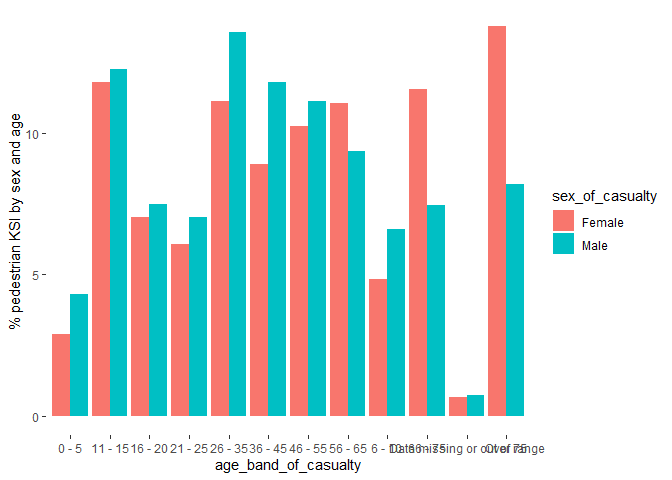
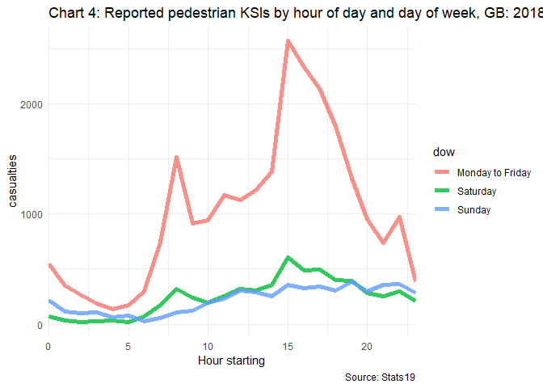
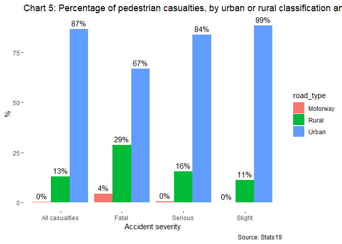

# Reproducing Reported road casualties in Great Britain: pedestrian
factsheet 2022
Blaise Kelly

# Introduction

This document aims to reproduce the 2018-2022 sections of the
[“Accredited official statistics Reported road casualties in Great
Britain: pedestrian factsheet,
2022”](https://www.gov.uk/government/statistics/reported-road-casualties-great-britain-pedestrian-factsheet-2022/reported-road-casualties-in-great-britain-pedestrian-factsheet-2022#further-information)
report published on 28th September 2023.

# Main findings

Averaged over the period 2018 to 2022:

- an average of 41 pedestrians died and 505 were seriously injured
  (adjusted) per week in reported road collisions

- a majority of pedestrian fatalities (57%) do not occur at or within
  20m of a junction compared to 46% of all seriously injured (adjusted)
  casualties

- 84% of pedestrian fatalities were in collisions involving a single car

- 32% of pedestrian fatalities occurred on rural roads compared to 12%
  of all pedestrian casualties

- 58% of pedestrian killed or seriously injured (KSI) casualties were
  male

The most common contributory factor allocated to pedestrians *no
contributory factors included in this data?*

# Pedestrian traffic and reported casualties

In 2022, 556 pedestrians were killed in Great Britain, whilst 6986 were
reported to be seriously injured (adjusted) and 13,041 slightly injured
(adjusted).

Between 2021 and 2022, pedestrian fatalities increased by 8% while
pedestrian traffic (distance walked) increased by ?.

| accident_year | Fatal | Serious | Slight | total |
|--------------:|------:|--------:|-------:|------:|
|          2018 |   492 |    6041 |  16214 | 22747 |
|          2019 |   517 |    6065 |  15505 | 22087 |
|          2020 |   368 |    4067 |  10347 | 14782 |
|          2021 |   385 |    4816 |  11475 | 16676 |
|          2022 |   417 |    5757 |  13184 | 19358 |

Table 2:

# Sex and age comparisons

Between 2018 and 2022, 55% of pedestrian casualties were male and 45%
female.

There are 1.2 times more male than female pedestrian casualties overall.
*Age bands in this data are different to those in the report, so have
skipped*

# Which vehicles are involved in collisions with pedestrians?

Between 2018 and 2022, most pedestrian fatalities occurred in a 1
vehicle collisions involving a car (1278).

However, the highest proportion of casualties from single vehicle
collisions involve a HGV (15.7%).

| vehicle_type                          | number_of_vehicles | Fatal | Serious | Slight |  pc_fatal |
|:--------------------------------------|:-------------------|------:|--------:|-------:|----------:|
| Bus or coach (17 or more pass seats)  | 1                  |   106 |    1048 |   2328 | 0.1047182 |
| Car                                   | 1                  |  1598 |   20799 |  51554 | 1.5786770 |
| Goods 7.5 tonnes mgw and over         | 1                  |   171 |     329 |    400 | 0.1689323 |
| Goods over 3.5t. and under 7.5t       | 1                  |    40 |     126 |    274 | 0.0395163 |
| Motorcycle - unknown cc               | 1                  |    NA |     126 |    346 |        NA |
| Motorcycle 125cc and under            | 1                  |    25 |     918 |   1638 | 0.0246977 |
| Motorcycle 50cc and under             | 1                  |     2 |     137 |    393 | 0.0019758 |
| Motorcycle over 125cc and up to 500cc | 1                  |    11 |     255 |    454 | 0.0108670 |
| Motorcycle over 500cc                 | 1                  |    69 |     362 |    467 | 0.0681657 |
| Other vehicle                         | 1                  |    38 |     354 |    911 | 0.0375405 |
| Pedal cycle                           | 1                  |    17 |     922 |   1634 | 0.0167944 |
| Van / Goods 3.5 tonnes mgw or under   | 1                  |   186 |    1933 |   4710 | 0.1837509 |
| ALL                                   | 2                  |   250 |    1760 |   3632 | 0.2469770 |
| ALL                                   | 3 or more          |    97 |     332 |    472 | 0.0958271 |

Table 3: Pedestrian casualties in reported road collisions by severity
showing other vehicles involved GB: 2018 to 2022

# Time of day of collisions

The weekday peak time for pedestrian KSIs is from 3pm to 6pm. By
contrast, the peak is later in the early evening at weekends.

# What type of road?

Chart 5 shows that between 2018 and 2022, 67% of pedestrian fatalities
occurred on urban roads compared to 87% of all pedestrian casualties. 4%
of pedestrian fatalities occurred on motorways. This would be people
outside their vehicles whether they are moving at the time or not.

# Vehicle movement on the road

| junction_detail                     | Fatal | Serious | Slight | all_casualties |
|:------------------------------------|------:|--------:|-------:|---------------:|
| Crossroads                          |   7.0 |     8.4 |    7.7 |            7.9 |
| Mini-roundabout                     |   0.8 |     1.0 |    1.2 |            1.1 |
| More than 4 arms (not roundabout)   |   0.9 |     1.7 |    1.7 |            1.7 |
| Not at junction or within 20 metres |  56.6 |    45.6 |   45.8 |           46.0 |
| Other junction                      |   4.8 |     6.6 |    6.2 |            6.3 |
| Private drive or entrance           |   1.3 |     1.7 |    2.1 |            2.0 |
| Roundabout                          |   2.7 |     2.7 |    2.9 |            2.9 |
| Slip road                           |   1.0 |     0.6 |    0.6 |            0.6 |
| T or staggered junction             |  24.8 |    31.0 |   30.3 |           30.4 |
| unknown (self reported)             |    NA |     0.5 |    1.5 |            1.2 |

Table 4: Percentage of pedestrian KSI casualties by severity and
junction detail where the collision occurred, GB: 2018 to 2022

A majority of pedestrian fatalities (57%) do not occur at or within 20m
of a junction compared to 46% of serious injuries. However, NA% of
fatalities occur at a junction compared to 43% of serious injuries.
Pedestrian fatalities at roundabouts represent 4% of all fatalities in
contrast to 4% of serious injuries.
