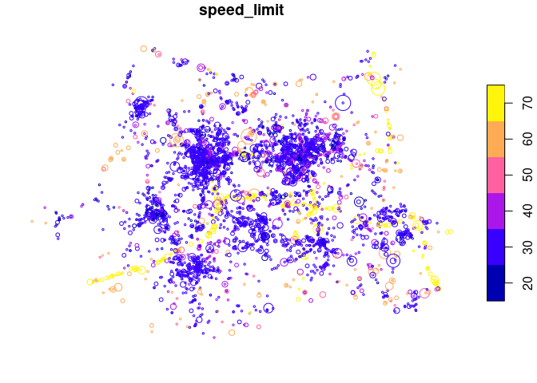

<!-- badges: start -->
<!-- [](https://travis-ci.org/ropensci/stats19) -->

[](https://www.r-pkg.org/pkg/stats19)
[](https://github.com/ropensci/stats19/actions)
[](https://www.r-pkg.org/pkg/stats19)
[](https://lifecycle.r-lib.org/articles/stages.html)
[](https://github.com/ropensci/software-review/issues/266)
[](https://doi.org/10.21105/joss.01181)

<!-- badges: end -->

<!-- [](https://doi.org/10.5281/zenodo.2540781) -->
<!-- [](https://gitter.im/stats19/Lobby?source=orgpage) -->
<!-- README.md is generated from README.Rmd. Please edit that file -->

# stats19 <a href='https://docs.ropensci.org/stats19/'></a>

**stats19** provides functions for downloading and formatting road crash
data. Specifically, it enables access to the UK’s official road traffic
casualty database,
[STATS19](https://www.data.gov.uk/dataset/cb7ae6f0-4be6-4935-9277-47e5ce24a11f/road-accidents-safety-data).
(The name comes from the form used by the police to record car crashes
and other incidents resulting in casualties on the roads.)

The raw data is provided as a series of `.csv` files that contain
integers and which are stored in dozens of `.zip` files. Finding,
reading-in and formatting the data for research can be a time consuming
process subject to human error. **stats19** speeds up these vital but
boring and error-prone stages of the research process with a single
function: `get_stats19()`. By allowing public access to properly
labelled road crash data, **stats19** aims to make road safety research
more reproducible and accessible.

For transparency and modularity, each stage can be undertaken
separately, as documented in the [stats19
vignette](https://itsleeds.github.io/stats19/articles/stats19.html).

The package has now been peer reviewed and is stable, and has been
published in the Journal of Open Source Software (Lovelace et al. 2019).
Please tell people about the package, link to it and cite it if you use
it in your work.

## Installation

Install and load the latest version with:

``` r
remotes::install_github("ropensci/stats19")
```

``` r
library(stats19)
```

You can install the released version of stats19 from
[CRAN](https://cran.r-project.org/package=stats19) with:

``` r
install.packages("stats19")
```

## get_stats19()

`get_stats19()` requires `year` and `type` parameters, mirroring the
provision of STATS19 data files, which are categorised by year (from
1979 onward) and type (with separate tables for crashes, casualties and
vehicles, as outlined below). The following command, for example, gets
crash data from 2022 (**note**: we follow the “crash not accident”
campaign of
[RoadPeace](https://www.roadpeace.org/working-for-change/crash-not-accident/)
in naming crashes, although the DfT refers to the relevant tables as
‘accidents’ data):

``` r
crashes = get_stats19(year = 2022, type = "collision")
#> Files identified: dft-road-casualty-statistics-collision-2022.csv
#>    https://data.dft.gov.uk/road-accidents-safety-data/dft-road-casualty-statistics-collision-2022.csv
#> Data already exists in data_dir, not downloading
#> Reading in:
#> ~/data/stats19/dft-road-casualty-statistics-collision-2022.csv
#> date and time columns present, creating formatted datetime column
#> Warning: NAs introduced by coercion
#> Warning: NAs introduced by coercion
#> Warning: NAs introduced by coercion
```

What just happened? For the `year` 2022 we read-in crash-level
(`type = "collision"`) data on all road crashes recorded by the police
across Great Britain. The dataset contains 37 columns (variables) for
106,004 crashes. We were not asked to download the file (by default you
are asked to confirm the file that will be downloaded). The contents of
this dataset, and other datasets provided by **stats19**, are outlined
below and described in more detail in the [stats19
vignette](https://itsleeds.github.io/stats19/articles/stats19.html).

We will see below how the function also works to get the corresponding
casualty and vehicle datasets for 2022. The package also allows STATS19
files to be downloaded and read-in separately, allowing more control
over what you download, and subsequently read-in, with
`read_collisions()`, `read_casualties()` and `read_vehicles()`, as
described in the vignette.

## Data download

Data files can be downloaded without reading them in using the function
`dl_stats19()`. If there are multiple matches, you will be asked to
choose from a range of options. Providing just the year, for example,
will result in the following options:

``` r
dl_stats19(year = 2022, data_dir = tempdir())
```

    Multiple matches. Which do you want to download?

    1: dft-road-casualty-statistics-casualty-2022.csv
    2: dft-road-casualty-statistics-vehicle-2022.csv
    3: dft-road-casualty-statistics-collision-2022.csv

    Selection: 
    Enter an item from the menu, or 0 to exit

## Using the data

STATS19 data consists of 3 main tables:

- Collisions, the main table which contains information on the crash
  time, location and other variables (37 columns in total)
- Casualties, containing data on people hurt or killed in each crash (19
  columns in total)
- Vehicles, containing data on vehicles involved in or causing each
  crash (28 columns in total)

The contents of each is outlined below.

### Crash data

Crash data was downloaded and read-in using the function
`get_stats19()`, as described above.

``` r
nrow(crashes)
#> [1] 106004
ncol(crashes)
#> [1] 37
```

Some of the key variables in this dataset include:

``` r
key_column_names = grepl(pattern = "severity|speed|pedestrian|light_conditions", x = names(crashes))
crashes[key_column_names]
#> # A tibble: 106,004 × 5
#>    accident_severity speed_limit pedestrian_crossing_hu…¹ pedestrian_crossing_…²
#>    <chr>             <chr>       <chr>                    <chr>                 
#>  1 Slight            30          None within 50 metres    No physical crossing …
#>  2 Slight            50          None within 50 metres    Pelican, puffin, touc…
#>  3 Slight            30          None within 50 metres    No physical crossing …
#>  4 Slight            30          None within 50 metres    No physical crossing …
#>  5 Slight            50          None within 50 metres    No physical crossing …
#>  6 Serious           30          None within 50 metres    No physical crossing …
#>  7 Slight            30          None within 50 metres    No physical crossing …
#>  8 Slight            40          None within 50 metres    No physical crossing …
#>  9 Slight            30          None within 50 metres    Pedestrian phase at t…
#> 10 Serious           20          None within 50 metres    Zebra                 
#> # ℹ 105,994 more rows
#> # ℹ abbreviated names: ¹​pedestrian_crossing_human_control,
#> #   ²​pedestrian_crossing_physical_facilities
#> # ℹ 1 more variable: light_conditions <chr>
```

For the full list of columns, run `names(crashes)` or see the
[vignette](https://github.com/ropensci/stats19/blob/master/vignettes/stats19.Rmd).

<!-- This means `crashes` is much more usable than `crashes_raw`, as shown below, which shows three records and some key variables in the messy and clean datasets: -->

### Casualties data

As with `crashes`, casualty data for 2022 can be downloaded, read-in and
formatted as follows:

``` r
casualties = get_stats19(year = 2022, type = "casualty", ask = FALSE, format = TRUE)
#> Files identified: dft-road-casualty-statistics-casualty-2022.csv
#>    https://data.dft.gov.uk/road-accidents-safety-data/dft-road-casualty-statistics-casualty-2022.csv
#> Data already exists in data_dir, not downloading
#> Warning: The following named parsers don't match the column names:
#> accident_severity, carriageway_hazards, date, day_of_week,
#> did_police_officer_attend_scene_of_accident, first_road_class,
#> first_road_number, junction_control, junction_detail, Latitude,
#> light_conditions, local_authority_district, local_authority_highway,
#> local_authority_ons_district, location_easting_osgr, location_northing_osgr,
#> longitude, lsoa_of_accident_location, number_of_casualties, number_of_vehicles,
#> pedestrian_crossing_human_control, pedestrian_crossing_physical_facilities,
#> police_force, road_surface_conditions, road_type, second_road_class,
#> second_road_number, special_conditions_at_site, speed_limit, time,
#> trunk_road_flag, urban_or_rural_area, weather_conditions, vehicle_text,
#> vehicle_type, age_band_of_driver, age_of_driver, age_of_vehicle,
#> driver_home_area_type, driver_imd_decile, engine_capacity_cc,
#> first_point_of_impact, generic_make_model, hit_object_in_carriageway,
#> hit_object_off_carriageway, journey_purpose_of_driver, junction_location,
#> propulsion_code, sex_of_driver, skidding_and_overturning,
#> towing_and_articulation, vehicle_direction_from, vehicle_direction_to,
#> vehicle_leaving_carriageway, vehicle_left_hand_drive,
#> vehicle_location_restricted_lane, vehicle_manoeuvre
#> Warning in asMethod(object): NAs introduced by coercion
nrow(casualties)
#> [1] 135480
ncol(casualties)
#> [1] 19
```

The results show that there were 135,480 casualties reported by the
police in the STATS19 dataset in 2022, and 19 columns (variables).
Values for a sample of these columns are shown below:

``` r
casualties[c(4, 5, 6, 14)]
#> # A tibble: 135,480 × 4
#>    vehicle_reference casualty_reference casualty_class  bus_or_coach_passenger  
#>    <chr>             <chr>              <chr>           <chr>                   
#>  1 2                 1                  Driver or rider Not a bus or coach pass…
#>  2 1                 1                  Driver or rider Not a bus or coach pass…
#>  3 1                 1                  Driver or rider Not a bus or coach pass…
#>  4 1                 1                  Driver or rider Not a bus or coach pass…
#>  5 1                 2                  Passenger       Not a bus or coach pass…
#>  6 1                 1                  Driver or rider Not a bus or coach pass…
#>  7 2                 2                  Driver or rider Not a bus or coach pass…
#>  8 3                 3                  Driver or rider Not a bus or coach pass…
#>  9 1                 1                  Driver or rider Not a bus or coach pass…
#> 10 1                 2                  Passenger       Not a bus or coach pass…
#> # ℹ 135,470 more rows
```

The full list of column names in the `casualties` dataset is:

``` r
names(casualties)
#>  [1] "accident_index"                     "accident_year"                     
#>  [3] "accident_reference"                 "vehicle_reference"                 
#>  [5] "casualty_reference"                 "casualty_class"                    
#>  [7] "sex_of_casualty"                    "age_of_casualty"                   
#>  [9] "age_band_of_casualty"               "casualty_severity"                 
#> [11] "pedestrian_location"                "pedestrian_movement"               
#> [13] "car_passenger"                      "bus_or_coach_passenger"            
#> [15] "pedestrian_road_maintenance_worker" "casualty_type"                     
#> [17] "casualty_home_area_type"            "casualty_imd_decile"               
#> [19] "lsoa_of_casualty"
```

### Vehicles data

Data for vehicles involved in crashes in 2022 can be downloaded, read-in
and formatted as follows:

``` r
vehicles = get_stats19(year = 2022, type = "vehicle", ask = FALSE, format = TRUE)
#> Files identified: dft-road-casualty-statistics-vehicle-2022.csv
#>    https://data.dft.gov.uk/road-accidents-safety-data/dft-road-casualty-statistics-vehicle-2022.csv
#> Data already exists in data_dir, not downloading
#> Warning: The following named parsers don't match the column names:
#> accident_severity, carriageway_hazards, date, day_of_week,
#> did_police_officer_attend_scene_of_accident, first_road_class,
#> first_road_number, junction_control, junction_detail, Latitude,
#> light_conditions, local_authority_district, local_authority_highway,
#> local_authority_ons_district, location_easting_osgr, location_northing_osgr,
#> longitude, lsoa_of_accident_location, number_of_casualties, number_of_vehicles,
#> pedestrian_crossing_human_control, pedestrian_crossing_physical_facilities,
#> police_force, road_surface_conditions, road_type, second_road_class,
#> second_road_number, special_conditions_at_site, speed_limit, time,
#> trunk_road_flag, urban_or_rural_area, weather_conditions, age_band_of_casualty,
#> age_of_casualty, bus_or_coach_passenger, car_passenger, casualty_class,
#> casualty_home_area_type, casualty_imd_decile, casualty_reference,
#> casualty_severity, casualty_type, pedestrian_location, pedestrian_movement,
#> pedestrian_road_maintenance_worker, sex_of_casualty, vehicle_text
#> Warning in asMethod(object): NAs introduced by coercion
nrow(vehicles)
#> [1] 193545
ncol(vehicles)
#> [1] 28
```

The results show that there were 193,545 vehicles involved in crashes
reported by the police in the STATS19 dataset in 2022, with 28 columns
(variables). Values for a sample of these columns are shown below:

``` r
vehicles[c(3, 14:16)]
#> # A tibble: 193,545 × 4
#>    accident_reference vehicle_leaving_carriageway hit_object_off_carriageway 
#>    <chr>              <chr>                       <chr>                      
#>  1 010352073          Did not leave carriageway   None                       
#>  2 010352073          Did not leave carriageway   None                       
#>  3 010352573          Nearside                    Road sign or traffic signal
#>  4 010352573          Did not leave carriageway   None                       
#>  5 010352575          Did not leave carriageway   None                       
#>  6 010352575          Did not leave carriageway   None                       
#>  7 010352578          Did not leave carriageway   None                       
#>  8 010352578          Did not leave carriageway   None                       
#>  9 010352580          Did not leave carriageway   None                       
#> 10 010352580          Did not leave carriageway   None                       
#> # ℹ 193,535 more rows
#> # ℹ 1 more variable: first_point_of_impact <chr>
```

The full list of column names in the `vehicles` dataset is:

``` r
names(vehicles)
#>  [1] "accident_index"                   "accident_year"                   
#>  [3] "accident_reference"               "vehicle_reference"               
#>  [5] "vehicle_type"                     "towing_and_articulation"         
#>  [7] "vehicle_manoeuvre"                "vehicle_direction_from"          
#>  [9] "vehicle_direction_to"             "vehicle_location_restricted_lane"
#> [11] "junction_location"                "skidding_and_overturning"        
#> [13] "hit_object_in_carriageway"        "vehicle_leaving_carriageway"     
#> [15] "hit_object_off_carriageway"       "first_point_of_impact"           
#> [17] "vehicle_left_hand_drive"          "journey_purpose_of_driver"       
#> [19] "sex_of_driver"                    "age_of_driver"                   
#> [21] "age_band_of_driver"               "engine_capacity_cc"              
#> [23] "propulsion_code"                  "age_of_vehicle"                  
#> [25] "generic_make_model"               "driver_imd_decile"               
#> [27] "driver_home_area_type"            "lsoa_of_driver"
```

## Creating geographic crash data

An important feature of STATS19 data is that the collision table
contains geographic coordinates. These are provided at ~10m resolution
in the UK’s official coordinate reference system (the Ordnance Survey
National Grid, EPSG code 27700). **stats19** converts the non-geographic
tables created by `format_collisions()` into the geographic data form of
the [`sf` package](https://cran.r-project.org/package=sf) with the
function `format_sf()` as follows:

``` r
crashes_sf = format_sf(crashes)
#> 22 rows removed with no coordinates
```

The note arises because `NA` values are not permitted in `sf`
coordinates, and so rows containing no coordinates are automatically
removed. Having the data in a standard geographic form allows various
geographic operations to be performed on it. The following code chunk,
for example, returns all crashes within the boundary of West Yorkshire
(which is contained in the object
[`police_boundaries`](https://itsleeds.github.io/stats19/reference/police_boundaries.html),
an `sf` data frame containing all police jurisdictions in England and
Wales).

``` r
library(sf)
library(dplyr)
wy = filter(police_boundaries, pfa16nm == "West Yorkshire")
#> old-style crs object detected; please recreate object with a recent sf::st_crs()
crashes_wy = crashes_sf[wy, ]
nrow(crashes_sf)
#> [1] 105982
nrow(crashes_wy)
#> [1] 4400
```

This subsetting has selected the 4,400 crashes which occurred within
West Yorkshire in 2022.

## Joining tables

The three main tables we have just read-in can be joined by shared key
variables. This is demonstrated in the code chunk below, which subsets
all casualties that took place in Leeds, and counts the number of
casualties by severity for each crash:

``` r
sel = casualties$accident_index %in% crashes_wy$accident_index
casualties_wy = casualties[sel, ]
names(casualties_wy)
#>  [1] "accident_index"                     "accident_year"                     
#>  [3] "accident_reference"                 "vehicle_reference"                 
#>  [5] "casualty_reference"                 "casualty_class"                    
#>  [7] "sex_of_casualty"                    "age_of_casualty"                   
#>  [9] "age_band_of_casualty"               "casualty_severity"                 
#> [11] "pedestrian_location"                "pedestrian_movement"               
#> [13] "car_passenger"                      "bus_or_coach_passenger"            
#> [15] "pedestrian_road_maintenance_worker" "casualty_type"                     
#> [17] "casualty_home_area_type"            "casualty_imd_decile"               
#> [19] "lsoa_of_casualty"
cas_types = casualties_wy %>%
  select(accident_index, casualty_type) %>%
  mutate(n = 1) %>%
  group_by(accident_index, casualty_type) %>%
  summarise(n = sum(n)) %>%
  tidyr::spread(casualty_type, n, fill = 0)
cas_types$Total = rowSums(cas_types[-1])
cj = left_join(crashes_wy, cas_types, by = "accident_index")
```

What just happened? We found the subset of casualties that took place in
West Yorkshire with reference to the `accident_index` variable. Then we
used functions from the **tidyverse** package **dplyr** (and `spread()`
from **tidyr**) to create a dataset with a column for each casualty
type. We then joined the updated casualty data onto the `crashes_wy`
dataset. The result is a spatial (`sf`) data frame of crashes in Leeds,
with columns counting how many road users of different types were hurt.
The original and joined data look like this:

``` r
crashes_wy %>%
  select(accident_index, accident_severity) %>% 
  st_drop_geometry()
#> # A tibble: 4,400 × 2
#>    accident_index accident_severity
#>  * <chr>          <chr>            
#>  1 2022121205585  Slight           
#>  2 2022131127664  Slight           
#>  3 2022131127681  Serious          
#>  4 2022131127764  Serious          
#>  5 2022131127766  Slight           
#>  6 2022131127829  Slight           
#>  7 2022131127841  Serious          
#>  8 2022131127847  Slight           
#>  9 2022131127861  Slight           
#> 10 2022131127881  Slight           
#> # ℹ 4,390 more rows
cas_types[1:2, c("accident_index", "Cyclist")]
#> # A tibble: 2 × 2
#> # Groups:   accident_index [2]
#>   accident_index Cyclist
#>   <chr>            <dbl>
#> 1 2022121205585        0
#> 2 2022131127664        0
cj[1:2, c(1, 5, 34)] %>% st_drop_geometry()
#> # A tibble: 2 × 3
#>   accident_index latitude lsoa_of_accident_location
#> * <chr>             <dbl> <chr>                    
#> 1 2022121205585      53.8 E01027904                
#> 2 2022131127664      53.7 E01011132
```

## Mapping crashes

The join operation added a geometry column to the casualty data,
enabling it to be mapped (for more advanced maps, see the
[vignette](https://itsleeds.github.io/stats19/articles/stats19.html)):

``` r
cex = cj$Total / 3
plot(cj["speed_limit"], cex = cex)
```



The spatial distribution of crashes in West Yorkshire clearly relates to
the region’s geography. Crashes tend to happen on busy Motorway roads
(with a high speed limit, of 70 miles per hour, as shown in the map
above) and city centres, of Leeds and Bradford in particular. The
severity and number of people hurt (proportional to circle width in the
map above) in crashes is related to the speed limit.

STATS19 data can be used as the basis of road safety research. The map
below, for example, shows the results of an academic paper on the
social, spatial and temporal distribution of bike crashes in West
Yorkshire, which estimated the number of crashes per billion km cycled
based on commuter cycling as a proxy for cycling levels overall (more
sophisticated measures of cycling levels are now possible thanks to new
data sources) (Lovelace, Roberts, and Kellar 2016):


## Time series analysis

We can also explore seasonal trends in crashes by aggregating crashes by
day of the year:

``` r
library(ggplot2)
head(cj$date)
#> [1] "2022-08-03" "2022-01-01" "2022-01-01" "2022-01-01" "2022-01-01"
#> [6] "2022-01-01"
class(cj$date)
#> [1] "Date"
crashes_dates = cj %>% 
  st_set_geometry(NULL) %>% 
  group_by(date) %>% 
  summarise(
    walking = sum(Pedestrian),
    cycling = sum(Cyclist),
    passenger = sum(`Car occupant`)
    ) %>% 
  tidyr::gather(mode, casualties, -date)
ggplot(crashes_dates, aes(date, casualties)) +
  geom_smooth(aes(colour = mode), method = "loess") +
  ylab("Casualties per day")
#> `geom_smooth()` using formula = 'y ~ x'
```


Different types of crashes also tend to happen at different times of
day. This is illustrated in the plot below, which shows the times of day
when people who were travelling by different modes were most commonly
injured.

``` r
library(stringr)

crash_times = cj %>% 
  st_set_geometry(NULL) %>% 
  group_by(hour = as.numeric(str_sub(time, 1, 2))) %>% 
  summarise(
    walking = sum(Pedestrian),
    cycling = sum(Cyclist),
    passenger = sum(`Car occupant`)
    ) %>% 
  tidyr::gather(mode, casualties, -hour)

ggplot(crash_times, aes(hour, casualties)) +
  geom_line(aes(colour = mode))
```


Note that cycling manifests distinct morning and afternoon peaks (see
Lovelace, Roberts, and Kellar 2016 for more on this).

## Usage in research and policy contexts

Examples of how the package can been used for policy making include:

- Use of the package in a web app created by the library service of the
  UK Parliament. See commonslibrary.parliament.uk[^1] screenshots of
  which from December 2019 are shown below, for details.


- Use of methods taught in the
  [stats19-training](https://docs.ropensci.org/stats19/articles/stats19-training.html)
  vignette by road safety analysts at Essex Highways and the Safer Essex
  Roads Partnership ([SERP](https://saferessexroads.org/)) to inform the
  deployment of proactive front-line police enforcement in the region
  (credit: Will Cubbin).

- Mention of road crash data analysis based on the package in an
  [article](https://www.theguardian.com/cities/2019/oct/07/a-deadly-problem-should-we-ban-suvs-from-our-cities)
  on urban SUVs. The question of how vehicle size and type relates to
  road safety is an important area of future research. A starting point
  for researching this topic can be found in the
  [`stats19-vehicles`](https://docs.ropensci.org/stats19/articles/stats19-vehicles.html)
  vignette, representing a possible next step in terms of how the data
  can be used.

## Next steps

There is much important research that needs to be done to help make the
transport systems in many cities safer. Even if you’re not working with
UK data, we hope that the data provided by **stats19** data can help
safety researchers develop new methods to better understand the reasons
why people are needlessly hurt and killed on the roads.

The next step is to gain a deeper understanding of **stats19** and the
data it provides. Then it’s time to pose interesting research questions,
some of which could provide an evidence-base in support policies that
save lives. For more on these next steps, see the package’s introductory
[vignette](https://itsleeds.github.io/stats19/articles/stats19.html).

## Further information

The **stats19** package builds on previous work, including:

- code in the [bikeR](https://github.com/Robinlovelace/bikeR) repo
  underlying an academic paper on collisions involving cyclists
- functions in [**stplanr**](https://docs.ropensci.org/stplanr/) for
  downloading Stats19 data
- updated functions related to the
  [CyIPT](https://github.com/cyipt/stats19) project

[](https://ropensci.org)

## References

<div id="refs" class="references csl-bib-body hanging-indent">

<div id="ref-lovelace_stats19_2019" class="csl-entry">

Lovelace, Robin, Malcolm Morgan, Layik Hama, Mark Padgham, and M
Padgham. 2019. “Stats19 A Package for Working with Open Road Crash
Data.” *Journal of Open Source Software* 4 (33): 1181.
<https://doi.org/10.21105/joss.01181>.

</div>

<div id="ref-lovelace_who_2016" class="csl-entry">

Lovelace, Robin, Hannah Roberts, and Ian Kellar. 2016. “Who, Where,
When: The Demographic and Geographic Distribution of Bicycle Crashes in
West Yorkshire.” *Transportation Research Part F: Traffic Psychology and
Behaviour*, Bicycling and bicycle safety, 41, Part B.
<https://doi.org/10.1016/j.trf.2015.02.010>.

</div>

</div>

[^1]:  Got to the following URL:
    commonslibrary.parliament.uk/constituency-data-traffic-accidents
    online
