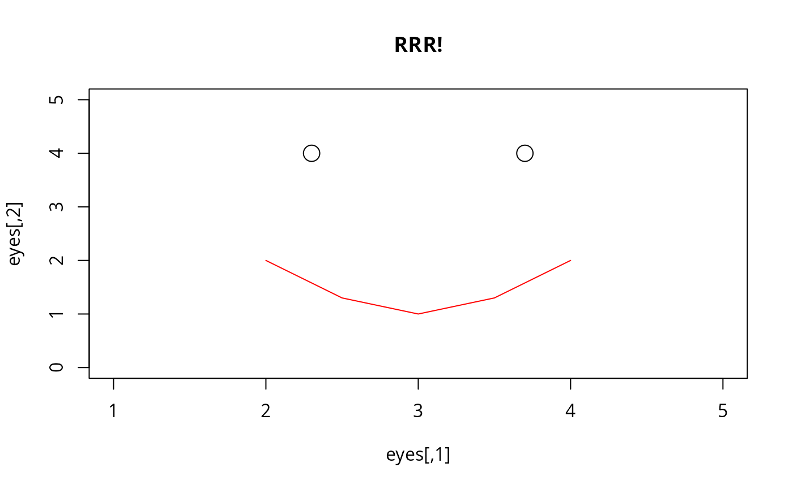
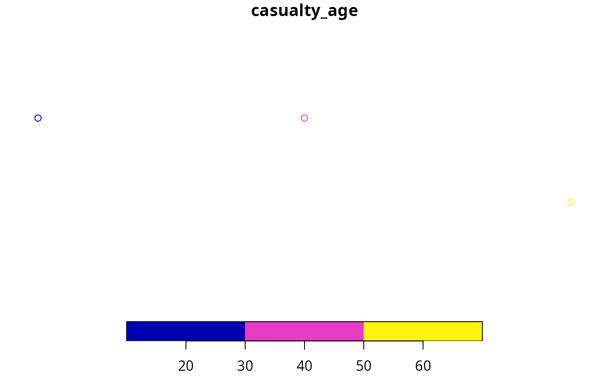
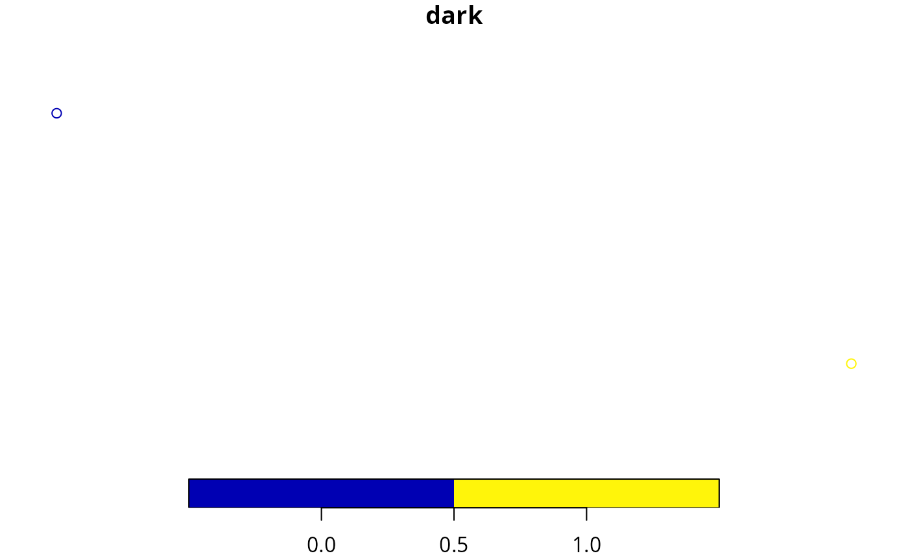

# Introduction to R for road safety: an introduction to R and practical exercises

## Note

This introductory practical vignette has largely been replaced by the
workbook “Reproducible Road Safety Research with R”, which can be found
at <https://itsleeds.github.io/rrsrr/> and as a PDF at
[racfoundation.org](https://www.racfoundation.org/wp-content/uploads/Reproducible_road_safety_research_with_R_Lovelace_December_2020.pdf)
(Lovelace 2020). That workbook is more comprehensive than the content in
this tutorial and is the recommended place to learn about using R for
reproducible road safety research.

## Introduction

This document provides information, code and exercises to test and
improve your R skills with an emphasis on road safety research. It was
initially developed to support a [2 day
course](https://www.racfoundation.org/introduction-to-r-for-road-safety).
The course is based on open road crash records from the **stats19**
package (Lovelace, Morgan, et al. 2019). However, the content should be
of use for anyone working with road crash data that has (at a minimum):

- A timestamp
- A location (or address that can be geocoded)
- Attribute data, such as severity of crash, mode of vehicles involved
  etc.

You should type, run and ensure you understand each line of code in this
document.

Code and data supporting the content can be found in the package’s
GitHub repo at
[github.com/ropensci/stats19](https://github.com/ropensci/stats19/). The
‘[issue tracker](https://github.com/ropensci/stats19/issues)’ associated
with that repo is a good place to ask questions about the course.

### Prerequisites

If you are not experienced with R, it is strongly advised that you
read-up on and more importantly **test out** R and RStudio before
attempting analyse road crash data with R. See the
`stats19-training-setup` vignette at
<https://docs.ropensci.org/stats19/articles/stats19-training-setup.html>
for guidance on getting started with R, RStudio and installing R
packages.

The completing the course requires that the following packages, which
can be installed with
[`install.packages()`](https://rdrr.io/r/utils/install.packages.html),
can be loaded as follows:

``` r

library(pct)      # access travel data from DfT-funded PCT project 
library(sf)       # spatial vector data classes
library(stats19)  # get stats19 data
library(stplanr)  # transport planning tools
library(tidyverse)# packages for 'data science'
library(tmap)     # interactive maps
```

You should type, run and ensure you understand each line of code in this
document.

    #> Warning in utils::citation(..., lib.loc = lib.loc): could not determine year
    #> for 'stats19' from package DESCRIPTION file

## R and RStudio

The learning outcomes of this first session are to learn: RStudio main
features and scripts, R objects and functions, subsetting, basic
plotting, and getting help.

The first exercise is to open up RStudio and take a look around and
identify the main components, shown in the figure below. **Explore each
of the main components of RStudio.** Try changing the Global Settings
(in the Tools menu) and see RStudio’s short cuts by pressing
`Alt-Shift-K` (or `Option+Shift+K` on Mac).


### Projects and scripts

Projects are a way to organise related work together. Each project has
its own folder and Rproj file. **Advice: always working from projects
will make your life easier!** Start a new project with:

> File \> New Project You can choose to create a new directory (folder)
> or associate a project with an existing directory. Make a new project
> called stats1-course and save it in a sensible place on your computer.
> Notice that stats1-course now appears in the top right of RStudio.

Scripts are the files where R code is stored. **Keeping your code in
sensibly named, well organised and reproducible scripts will make your
life easier:** you could simply type all our code into the console, but
that require retyping commands each time you run it. Instead, code that
you want to keep and share should be saved script files, plain text
files that have the `.R` extension.

Make a new script with Flie \> New File \> Rscript or Ctrl+Shift+N

Save the script and give it a sensible name like `stats19-lesson-1.R`
with File \> Save, the save button on the toolbar, or Ctrl+S.

**Pro tip:** You can also create new R scripts by typing and running
this command in the R console:

``` r

file.edit("stats19-lesson-1.R")
```

Keeping scripts and other files associated with a project in a single
folder per project (in an RStudio project) will help you find things you
need and develop an efficient workflow.

### Writing and running code

Let’s start with some basic R operations. Write this code into your new
`stats19-lesson-1.R` R script and execute the result line-by-line by
pressing Ctrl+Enter

``` r

x = 1:5
y = c(0, 1, 3, 9, 18)
plot(x, y)
```

This code creates two objects, both are vectors of 5 elements, and then
plots them (bonus: check their length using the
[`length()`](https://rdrr.io/r/base/length.html) function). Save the
script by pressing Ctrl+S.

There are several ways to run code within a script and it is worth
becoming familiar with each. Try running the code you saved in the
previous section using each of these methods:

1.  Place the cursor in different places on each line of code and press
    `Ctrl+Enter` to run that line of code.
2.  Highlight a block of code or part of a line of code and press
    `Ctrl+Enter` to run the highlighted code.
3.  Press `Ctrl+Shift+Enter` to run all the code in a script.
4.  Press the Run button on the toolbar to run all the code in a script.
5.  Use the function [`source()`](https://rdrr.io/r/base/source.html) to
    run all the code in a script e.g. `source("stats19-lesson-1.R")`

**Pro tip:** Try jumping between the console and the source editor by
pressing Ctl+1 and Ctl+2.

### Viewing Objects

Create new objects by typing and running the following code chunk in a
new script, e.g. called `objects.R`.

``` r

vehicle_type = c("car", "bus", "tank")
casualty_type = c("pedestrian", "cyclist", "cat")
casualty_age = seq(from = 20, to = 60, by = 20)
set.seed(1)
dark = sample(x = c(TRUE, FALSE), size = 3, replace = TRUE)
small_matrix = matrix(1:24, nrow = 12)
crashes = data.frame(vehicle_type, casualty_type, casualty_age, dark)
```

We can view the objects in a range of ways:

1.  Type the name of the object into the console, e.g. `crashes` and
    `small_matrix`, and run that code. Scroll up to see the numbers that
    didn’t fit on the screen.
2.  Use the [`head()`](https://rdrr.io/r/utils/head.html) function to
    view just the first 6 rows e.g. `head(small_matrix)`
3.  Bonus: use the `n` argument in the previous function call to show
    only the first 2 rows of `small_matrix`
4.  Click on the `crashes` object in the environment tab to View it in a
    spreadsheet.
5.  Run the command `View(vehicle_type)`. What just happened?

We can also get an overview of an object using a range of functions,
including [`summary()`](https://rdrr.io/r/base/summary.html),
[`class()`](https://rdrr.io/r/base/class.html),
[`typeof()`](https://rdrr.io/r/base/typeof.html),
[`dim()`](https://rdrr.io/r/base/dim.html), and
[`length()`](https://rdrr.io/r/base/length.html).

You can, for example, view a summary of the `casualty_age` variable by
running the following line of code:

``` r

summary(casualty_age)
#>    Min. 1st Qu.  Median    Mean 3rd Qu.    Max. 
#>      20      30      40      40      50      60
```

**Exercise** try these functions on each of the objects, what results do
they give?

**Bonus**: Find out the class of the column `vehicle_type` in the data
frame `crashes` with the command `class(crashes$vehicle_type)`. Why has
it changed? Create a new object called `crashes_char` that keeps the
class of the character vectors intact by using the function
[`tibble::tibble()`](https://tibble.tidyverse.org/reference/tibble.html)
(see [tibble.tidyverse.org](https://tibble.tidyverse.org/) and Section 4
for details).

### Autocompletion

RStudio can help you write code by autocompleting it. RStudio will look
for similar objects and functions after typing the first three letters
of a name.


When there is more than one option you can select from the list using
the mouse or arrow keys. Within a function, you can get a list of
arguments by pressing Tab.


### Getting help

Every function in R has a help page. You can view the help using `?` for
example [`?sum`](https://rdrr.io/r/base/sum.html). Many packages also
contain vignettes, these are long form help documents containing
examples and guides.
[`vignette()`](https://rdrr.io/r/utils/vignette.html) will show a list
of all the vignettes available, or you can show a specific vignette for
example
[`vignette(topic = "sf1", package = "sf")`](https://r-spatial.github.io/sf/articles/sf1.html).

### Commenting Code

It is good practice to use comments in your code to explain what it
does. You can comment code using `#`

For example:

``` r

# Create vector objects (a whole line comment)
x = 1:5 # a seqence of consecutive integers (inline comment)
y = c(0, 1, 3, 9, 18.1) 
```

You can comment/uncomment a whole block of text by selecting it and
using `Ctrl+Shift+C`.

**Pro tip:** You can add a comment section using Ctrl + Shift + R

### The global environment

The Environment tab shows all the objects in your environment, this
includes datasets, parameters, and any functions you have created. By
default, new objects appear in the Global Environment but you can see
other environments with the drop-down menu. For example, each package
has its own environment.

Sometimes you wish to remove things from your environment, perhaps
because you no longer need them or things are getting cluttered.

You can remove an object with the
[`rm()`](https://rdrr.io/r/base/rm.html) function e.g. `rm(x)` or
`rm(x, y)` or you can clear your whole environment with the broom button
on the Environment Tab.

1.  Remove the object `x` that was created in a previous section.
2.  What happens when you try to print the `x` by entering it into the
    console?
3.  Try running the following commands in order:
    [`save.image(); rm(list = ls()); load(".RData")`](https://rdrr.io/r/base/save.html).
    What happened?
4.  How big (how many bytes) is the `.RData` file in your project’s
    folder?
5.  Tidy up by removing the `.Rdata` file with `file.remove(".Rdata")`.

### Debugging Code

All the code shown so far is reproducible. To test RStudio’s debugging
features, let’s write some code that fails, as illustrated in the figure
below.


1.  What is the problem with the code shown in the figure?
2.  Create other types of error in the code you have run (e.g. no
    symetrical brackets and other typos)
3.  Does RStudio pick up on the errors? And what happens when you try to
    run buggy code?

**Always address debugging prompts to ensure your code is reproducible**

### Saving R objects

We have already seen that you can save R scripts. You can also save
individual R objects in the RDS format.

``` r

saveRDS(crashes, "crashes.Rds")
```

We can also read back in our data.

``` r

crashes2 = readRDS("crashes.Rds")
identical(crashes, crashes2)
#> [1] TRUE
```

R also supports many other formats, including CSV files, which can be
created and imported with the functions
[`readr::read_csv()`](https://readr.tidyverse.org/reference/read_delim.html)
and
[`readr::write_csv()`](https://readr.tidyverse.org/reference/write_delim.html)
(see also the [readr](https://readr.tidyverse.org/) package).

``` r

readr::write_csv(crashes, "crashes.csv")
crashes3 = readr::read_csv("crashes.csv")
identical(crashes3, crashes) 
```

Notice that `crashes3` and `crashes` are not identical, what has
changed? Hint: read the help page associated with
[`?readr::write_csv`](https://readr.tidyverse.org/reference/write_delim.html).

## Manipulating R objects

### Subsetting by index or name

Subsetting returns part of an R object. It can be done by providing
numbers representing the positions of the elements we want (e.g. the
2^(nd) element) or with a logical vector, with values associated with
`TRUE` returned. Two dimension object such as matrices and data frames
can be subset by rows and columns. Subsetting in base R is done with
square brackets `[]` after the name of an object. **Run the following
commands to practice subsetting.**

``` r

casualty_age[2:3] # second and third casualty_age
crashes[c(1, 2), ] # first and second row of crashes
crashes$vehicle_type # returns just one column
crashes[, c("casualty_type", "casualty_age")] # first and third columns
```

1.  Use the `$` operator to print the `dark` column of `crashes`.
2.  Subset the crashes with the `[,]` syntax so that only the first and
    third columns of `crashes` are returned.
3.  Return the 2^(nd) row and the 3^(rd) column of the `crashes`
    dataset.
4.  Return the 2^(nd) row and the columns 2:3 of the `crashes` dataset.
5.  **Bonus**: what is the
    [`class()`](https://rdrr.io/r/base/class.html) of the objects
    created by each of the previous exercises?

### Subsetting by values

It is also possible to subset objects by the values of their elements.
This works because the `[` operator accepts logical vectors returned by
queries such as ‘is it less than 3?’ (`x < 3` in R) and ‘was it light?’
(`crashes$dark == FALSE`), as demonstrated below:

``` r

x[c(TRUE, FALSE, TRUE, FALSE, TRUE)] # 1st, 3rd, and 5th element in x
x[x == 5] # only when x == 5 (notice the use of double equals)
x[x < 3] # less than 3
x[x < 3] = 0 # assign specific elements
casualty_age[casualty_age %% 6 == 0] # just the ages that are a multiple of 6
crashes[crashes$dark == FALSE, ]
```

1.  Subset the `casualty_age` object using the inequality (`<`) so that
    only elements less than 50 are returned.
2.  Subset the `crashes` data frame so that only tanks are returned
    using the `==` operator.
3.  **Bonus**: assign the age of all tanks to 61.

### Dealing with NAs and recoding

R objects can have a value of NA. This is how R represents missing data.

``` r

z = c(4, 5, NA, 7)
```

NA values are common in real-world data but can cause trouble, for
example

``` r

sum(z) # result is NA
```

Some functions can be told to ignore NA values.

``` r

sum(z, na.rm = TRUE) # result is equal to 4 + 5 + 7
```

You can find NAs using the [`is.na()`](https://rdrr.io/r/base/NA.html)
function, and then remove them

``` r

is.na(z)
z_nona = z[!is.na(z)] # note the use of the not operator !
sum(z)
```

If you remove records with NAs be warned: the average of a value
excluding NAs may not be representative.

### Changing class

Sometimes you may want to change the class of an object. This is called
class coercion, and can be done with functions such as
[`as.logical()`](https://rdrr.io/r/base/logical.html),
[`as.numeric()`](https://rdrr.io/r/base/numeric.html) and
[`as.matrix()`](https://rdrr.io/r/base/matrix.html).

1.  Coerce the `vehicle_type` column of `crashes` to the class
    `character`.
2.  Coerce the `crashes` object into a matrix. What happened to the
    values?
3.  **Bonus:** What is the difference between the output of
    [`summary()`](https://rdrr.io/r/base/summary.html) on `character`
    and `factor` variables?

### Recoding values

Often it is useful to ‘recode’ values. In the raw STATS19 files, for
example, -1 means NA. There are many ways to recode values in R, the
simplest and most mature of which is the use of factors, as shown below:

``` r

z = c(1, 2, -1, 1, 3)
l = c(NA, "a", "b", "c") # labels in ascending order
z_factor = factor(z, labels = l)
z_charcter = as.character(z_factor)
z_charcter
#> [1] "a" "b" NA  "a" "c"
```

1.  Recode `z` to Slight, Serious and Fatal for 1:3 respectively.
2.  Bonus: read the help file at
    [`?dplyr::case_when`](https://dplyr.tidyverse.org/reference/case-and-replace-when.html)
    and try to recode the values using this function.

### Now you are ready to use R

**Bonus: reproduce the following plot**

``` r

eyes = c(2.3, 4, 3.7, 4)
eyes = matrix(eyes, ncol = 2, byrow = T)
mouth = c(2, 2, 2.5, 1.3, 3, 1, 3.5, 1.3, 4, 2)
mouth = matrix(mouth, ncol = 2, byrow = T)
plot(eyes, type = "p", main = "RRR!", cex = 2, xlim = c(1, 5), ylim = c(0, 5))
lines(mouth, type = "l", col = "red")
```



## R Packages

### What are packages?

R has over 15,000 packages (effectively plugins for base R), extending
it in almost every direction of statistics and computing. Packages
provide additional functions, data and documentation. They are very
often written by subject-matter experts and therefore tend to fit well
with the workflow of the analyst in that particular specialism. There
are two main stages to using a package: installing it and loading it. A
third stage is updating it, this is also important.

Install new packages from [The Comprehensive R Archive
Network](https://cran.r-project.org/) with the command
[`install.packages()`](https://rdrr.io/r/utils/install.packages.html)
(or
[`remotes::install_github()`](https://remotes.r-lib.org/reference/install_github.html)
to install from GitHub). Update packages with the command
`update.package()` or in Tools \> Check for Package Updates in RStudio.
You only need to install a package once.

``` r

install.packages("sf")
# remotes::install_github("r-spatial/sf")
```

Installed packages are loaded with the command
[`library()`](https://rdrr.io/r/base/library.html). Usually, the package
will load silently. In some cases the package will provide a message, as
illustrated below.

``` r

library(sf)
#> Linking to GEOS 3.14.1, GDAL 3.12.2, PROJ 9.7.1; sf_use_s2() is TRUE
```

To use a function in a package without first loading the package, use
double colons, as shown below (this calls the
[`tibble()`](https://tibble.tidyverse.org/reference/tibble.html)
function from the `tibble` package).

``` r

crashes_tibble = tibble::tibble(
  vehicle_type,
  casualty_type,
  casualty_age,
  dark
)
```

1.  Take a look in the Packages tab in the Files pane in RStudio (bottom
    right by default).
2.  What version of the `stats19` package is installed on your computer?
3.  Run the command
    [`update.packages()`](https://rdrr.io/r/utils/update.packages.html).
    What happens? Why?

### ggplot2

Let’s take a look at a particular package. `ggplot2` is a generic
plotting package that is part of the
[‘tidyverse’](https://tidyverse.org/) meta-package, which is an
“opinionated collection of R packages designed for data science”. All
packages in the tidyverse “share an underlying design philosophy,
grammar, and data structures”. `ggplot2` is flexible, popular, and has
dozens of add-on packages which build on it, such as `gganimate`. To
plot non-spatial data, it works as follows (see figure below, left for
result):

``` r

library(ggplot2)
ggplot(crashes) + geom_point(aes(x = casualty_type, y = casualty_age))
```

Note that the `+` operator adds layers onto one another.

1.  Install a package that build on `ggplot2` that begins with with
    `gg`. Hint: enter `install.packages(gg)` and hit Tab when your
    cursor is between the `g` and the `)`.
2.  Open a help page in the newly installed package with the
    `?package_name::function()` syntax.
3.  Attach the package.
4.  **Bonus:** try using functionality from the new ‘gg’ package
    building on the example above to create plots like those shown below
    (hint: the right plot below uses the economist theme from the
    `ggthemes` package, try other themes).


### dplyr and pipes

Another useful package in the tidyverse is `dplyr`. It provides
functions for manipulating data frames and using the pipe operator
`%>%`. The pipe puts the output of one command into the first argument
of the next, as shown below (note the results are the same):

``` r

library(dplyr)
#> 
#> Attaching package: 'dplyr'
#> The following objects are masked from 'package:stats':
#> 
#>     filter, lag
#> The following objects are masked from 'package:base':
#> 
#>     intersect, setdiff, setequal, union
class(crashes)       
#> [1] "data.frame"
crashes %>% class()
#> [1] "data.frame"
```

Useful `dplyr` functions are demonstrated below.

``` r

crashes %>%
  filter(casualty_age > 50) # filter rows
crashes %>%
  select(casualty_type) # select just one column
crashes %>%
  group_by(dark) %>% 
  summarise(mean_age = mean(casualty_age))
```

1.  Use `dplyr` to filter row in which `casualty_age` is less than 18,
    and then 28.
2.  Use the `arrange` function to sort the `crashes` object in
    descending order of age (hint: see the
    [`?arrange`](https://dplyr.tidyverse.org/reference/arrange.html)
    help page).
3.  Read the help page of
    [`dplyr::mutate()`](https://dplyr.tidyverse.org/reference/mutate.html).
    What does the function do?
4.  Use the mutate function to create a new variable, `birth_year`, in
    the `crashes` data.frame which is defined as the current year minus
    their age.
5.  **Bonus:** Use the `%>%` operator to filter the output from the
    previous exercise so that only observations with `birth_year` after
    1969 are returned.

## Temporal data

For the analysis and manipulation of temporal data we will first load
the R package `lubridate`:

``` r

library(lubridate)
```

The simplest example of a Date object that we can analyze is just the
current date, i.e.

``` r

today()
#> [1] "2026-07-30"
```

We can manipulate this object using several `lubridate` functions to
extract the current day, month, year, weekday and so on…

``` r

x = today()
day(x)
month(x)
year(x)
weekdays(x)
```

Exercises:

1.  Look at the help page of the function `month` to see how it is
    possible to extract the current month as character vector
2.  Look at other functions in lubridate to extract the current weekday
    as a number, the week of year and the day of the year

Date variables are often stored simply as a character vectors. This is a
problem, since R is not always smart enough to distinguish between
character vectors representing Dates. `lubridate` provides functions
that can translate a wide range of date encodings such as
[`ymd()`](https://lubridate.tidyverse.org/reference/ymd.html), which
extracts the Year Month and Day from a character string, as demonstrated
below.

``` r

as.Date("2019-10-17") # works
as.Date("2019 10 17") # fails
ymd("2019 10 17") # works
dmy("17/10/2019") # works
```

Import function such as `read_csv` try to recognize the Date variables.
Sometimes this fails. You can manually create Date objects, as shown
below.

``` r

x = c("2009-01-01", "2009-02-02", "2009-03-03")
x_date = ymd(x)
x_date
#> [1] "2009-01-01" "2009-02-02" "2009-03-03"
```

Exercises:

1.  Extract the day, the year-day, the month and the weekday (as a
    non-abbreviated character vector) of each element of `x_date`.
2.  Convert `"09/09/93"` into a date object and extract its weekday.
3.  **Bonus:** Read the help page of `as.Date` and `strptime` for
    further details on base R functions for dates.
4.  **Bonus:** Read the Chapter 16 of [R for Data Science
    book](https://r4ds.had.co.nz/dates-and-times.html) for further
    details on `lubridate` package.

We can use Dates also for subsetting events in a dataframe. For example,
if we define `x_date` as before and add it to the `crash` dataset, i.e.

``` r

crashes$casualty_day = x_date
```

then we can subset events using Dates. For example

``` r

filter(crashes, day(casualty_day) < 7) # the events that ocurred in the first week of the month
#>   vehicle_type casualty_type casualty_age  dark casualty_day
#> 1          car    pedestrian           20  TRUE   2009-01-01
#> 2          bus       cyclist           40 FALSE   2009-02-02
#> 3         tank           cat           60  TRUE   2009-03-03
filter(crashes, weekdays(casualty_day) == "Monday") # the events occurred on monday
#>   vehicle_type casualty_type casualty_age  dark casualty_day
#> 1          bus       cyclist           40 FALSE   2009-02-02
```

Exercises:

1.  Select only the events (rows in `crashes`) that occurred in January
2.  Select only the events that ocurred in an odd year-day
3.  Select only the events that ocurred in a leap-year (HINT: check the
    function `leap_year`)
4.  Select only the events that ocurred during the weekend or in June
5.  Select only the events that ocurred during the weekend and in June
6.  Count how many events ocurred during each day of the week.

Now we’ll take a look at the time components of a Date. Using the
function `hms` (acronym for Hour Minutes Seconds) and its subfunctions
such as `hm` or `ms`, we can parse a character vector representing
several times as an Hour object (which is tecnically called a Period
object).

``` r

x = c("18:23:35", "00:00:01", "12:34:56")
x_hour = hms(x)
x_hour
#> [1] "18H 23M 35S" "1S"          "12H 34M 56S"
```

We can manipulate these objects using several `lubridate` functions to
extract the hour component, the minutes and so on:

``` r

hour(x_hour)
#> [1] 18  0 12
minute(x_hour)
#> [1] 23  0 34
second(x_hour)
#> [1] 35  1 56
```

If the Hour data do not specify the seconds, then we just have to use a
subfunction of `hms`, namely `hm`, and everything works as before.

``` r

x = c("18:23", "00:00", "12:34")
(x_hour = hm(x))
#> [1] "18H 23M 0S" "0S"         "12H 34M 0S"
```

We can use Hour data also for subsetting events, like we did for Dates.
Let’s add a new column to crashes data,

``` r

crashes$casualty_hms = hms(c("18:23:35", "00:00:01", "12:34:56"))
crashes$casualty_hour = hour(crashes$casualty_hms)
```

Exercises:

1.  Filter only the events that ocurred after midday (i.e. the PM
    events). Hint: your answer may include `>= 12`.
2.  Filter only the events that ocurred between 15:00 and 19:00
3.  **Bonus (difficult):** run the following code, which downloades data
    for car crashes occurred during 2022.

``` r

library(stats19)
crashes_2022 = stats19::get_stats19(year = 2022, type = "ac")
crashes_2022
```

Extract the weekday from the variable called `date`. How many crashes
happened on Monday?

**Advanced challenge:** calculate how many crashes occurred for each day
of the week. Then plot it with ggplot2. Repeat the same exercises
extracting the hour of the car accident from the variable called time.
How would you combine the two informations in a single plot?

## Spatial data

### sf objects

All road crashes happen somewhere and, in the UK at least, all
collisions recorded by the police are given geographic coordinates,
something that can help prioritise interventions to save lives by
intervening in and around ‘crash hotspots’. R has strong geographic data
capabilities, with the `sf` package provides a generic class for spatial
vector data: points, lines and polygons, are represented in `sf` objects
as a special ‘geometry column’, typically called ‘geom’ or ‘geometry’,
extending the data frame class we’ve already seen in `crashes`.

Create an `sf` data frame called `crashes_sf` as follows:

``` r

library(sf) # load the sf package for working with spatial data
crashes_sf = crashes # create copy of crashes dataset
crashes_sf$longitude = c(-1.3, -1.2, -1.1)
crashes_sf$latitude = c(50.7, 50.7, 50.68)
crashes_sf = st_as_sf(crashes_sf, coords = c("longitude", "latitude"), crs = 4326)
# plot(crashes_sf[1:4]) # basic plot
# mapview::mapview(crashes_sf) # for interactive map
```

1.  Plot only the geometry column of `crashes_sf` (hint: the solution
    may contain `$geometry`). If the result is like the figure below,
    congratulations, it worked!).
2.  Plot `crashes_sf`, only showing the age variable.
3.  Plot the 2^(nd) and 3^(rd) crashes, showing which happened in the
    dark.
4.  **Bonus**: How far are the points apart (hint: `sf` functions begin
    with `st_`)?
5.  **Bonus**: Near which settlement did the tank runover the cat?



### Reading and writing spatial data

You can read and write spatial data with
[`read_sf()`](https://r-spatial.github.io/sf/reference/st_read.html) and
[`write_sf()`](https://r-spatial.github.io/sf/reference/st_write.html),
as shown below (see
[`?read_sf`](https://r-spatial.github.io/sf/reference/st_read.html)).

``` r

write_sf(zones, "zones.geojson") # save geojson file
write_sf(zones, "zmapinfo", driver = "MapInfo file")
read_sf("zmapinfo") # read in mapinfo file
```

See [Chapter 6](https://r.geocompx.org/read-write.html) of
Geocomputation with R for further information.

### sf polygons

Note: the code beyond this point is not evaluated in the vignette:

``` r

knitr::opts_chunk$set(eval = FALSE)
```

`sf` objects can also represent administrative zones. This is
illustrated below with reference to `zones`, a spatial object
representing the Isle of Wight, that we will download using the `pct`
package (note: the `[1:9]` appended to the function selects only the
first 9 columns).

``` r

zones = pct::get_pct_zones("isle-of-wight")[1:9]
```

1.  What is the class of the `zones` object?
2.  What are its column names?
3.  Print its first 2 rows and columns 6:8 (the result is below).

### Spatial subsetting and sf plotting

Like index and value subsetting, spatial subsetting can be done with the
`[` notation. Subset the `zones` that contain features in `crashes_sf`
as follows:

``` r

zones_containing_crashes = zones[crashes_sf, ]
```

To plot a new layer on top of an existing `sf` plot, use the
`add = TRUE` argument. Remember to plot only the `geometry` column of
objects to avoid multiple maps. Colours can be set with the `col`
argument.

1.  Plot the geometry of the zones, with the zones containing crashes
    overlaid on top in red.
2.  Plot the zone containing the 2^(nd) crash in blue.
3.  **Bonus:** plot all zones that intersect with a zone containing
    crashes, with the actual crash points plotted in black.

### Geographic joins

Geographic joins involve assigning values from one object to a new
column in another, based on the geographic relationship between them.
With `sf` objects it works as follows:

``` r

zones_joined = st_join(zones[1], crashes_sf)
```

1.  Plot the `casualty_age` variable of the new `zones_joined` object
    (see the figure below to verify the result).
2.  How many zones are returned in the previous command?
3.  Select only the `geo_code` column from the `zones` and the `dark`
    column from `crashes_sf` and use the `left = FALSE` argument to
    return only zones in which crashes occured. Plot the result.

See [Chapter 4](https://r.geocompx.org/spatial-operations.html) of
Geocomputation with R (Lovelace, Nowosad, et al. 2019) for further
information on geographic joins.

### CRSs

Get and set Coordinate Reference Systems (CRSs) with the command
[`st_crs()`](https://r-spatial.github.io/sf/reference/st_crs.html).
Transform CRSs with the command
[`st_transform()`](https://r-spatial.github.io/sf/reference/st_transform.html),
as demonstrated in the code chunk below, which converts the ‘lon/lat’
geographic CRS of `crashes_sf` into the projected CRS of the British
National Grid:

``` r

crashes_osgb = st_transform(crashes_sf, 27700)
```

1.  Try to subset the zones with the `crashes_osgb`. What does the error
    message say?
2.  Create `zones_osgb` by transforming the `zones` object.
3.  **Bonus:** use
    [`st_crs()`](https://r-spatial.github.io/sf/reference/st_crs.html)
    to find out the units measurement of the British National Grid?

For more information on CRSs see [Chapter
6](https://r.geocompx.org/reproj-geo-data.html) of Geocompuation with R.

### Buffers

Buffers are polygons surrounding geometries of a (usually) fixed
distance. Currently buffer operations in R only work on objects with
projected CRSs.

1.  Find out and read the help page of `sf`’s buffer function.
2.  Create an object called `crashes_1km_buffer` representing the area
    within 1 km of the crashes.
3.  **Bonus:** try creating buffers on the geographic version of the
    `crashes_sf` object. What happens?

### Attribute operations on sf objects

Because `sf` objects are `data.frame`s, we can do non-spatial operations
on them. Try the following attribute operations on the `zones` data.

``` r

# load example dataset if it doesn't already exist
zones = pct::get_pct_zones("isle-of-wight")
sel = zones$all > 3000  # create a subsetting object
zones_large = zones[sel, ] # subset areas with a popualtion over 100,000
zones_2 = zones[zones$geo_name == "Isle of Wight 002",] # subset based on 'equality' query
zones_first_and_third_column = zones[c(1, 3)]
zones_just_all = zones["all"]
```

1.  Practice subsetting techniques you have learned on the
    `sf data.frame` object `zones`:
    1.  Create an object called `zones_small` which contains only
        regions with less than 3000 people in the `all` column
    2.  Create a selection object called `sel_high_car` which is `TRUE`
        for regions with above median numbers of people who travel by
        car and `FALSE` otherwise
    3.  Create an object called `zones_foot` which contains only the
        foot attribute from `zones`
    4.  Bonus: plot `zones_foot` using the function `plot` to show where
        walking is a popular mode of travel to work
    5.  Bonus: bulding on your answers to previous questions, use
        [`filter()`](https://dplyr.tidyverse.org/reference/filter.html)
        from the `dplyr` package to subset small regions where car use
        is high.
2.  Bonus: What is the population density of each region (hint: you may
    need to use the functions
    [`st_area()`](https://r-spatial.github.io/sf/reference/geos_measures.html),
    [`as.numeric()`](https://rdrr.io/r/base/numeric.html) and use the
    ‘all’ column)?
3.  Bonus: Which zone has the highest percentage of people who cycle?

### Matching roads to crashes

I think you forgot something here. For example we could introduce
`st_nearest_feature`? Or counting using `st_within` and `st_buffer`.

## Visualising spatial datasets

So far we have used the
[`plot()`](https://rdrr.io/r/graphics/plot.default.html) function to
make maps. That’s fine for basic visualisation, but for
publication-quality maps, we recommend using `tmap` (see Chapter 8 of
Geocomputation with R for reasons and alternatives). Load the package as
follows:

``` r

library(tmap)
tmap_mode("plot")
```

1.  Create the following plots using
    [`plot()`](https://rdrr.io/r/graphics/plot.default.html) and
    `tm_shape() + tm_polygons()` functions (note: the third figure
    relies on setting `tmap_mode("view")`.
2.  Add an additional layer to the interactive map showing the location
    of crashes, using marker and dot symbols.
3.  Bonus: Change the default basemap (hint: you may need to search in
    the package documentation or online for the solution).

## Analysing point data from stats19

Based on the saying “don’t run before you can walk”, we’ve learned the
vital foundations of R before tackling a real dataset. Temporal and
spatial attributes are key to road crash data, hence the emphasis on
`lubridate` and `sf`. Visualisation is key to understanding and policy
influence, which is where `tmap` comes in. With these solid foundations,
plus knowledge of how to ask for help (read R’s internal help functions,
ask colleagues, create new comments on online forums/GitHub, generally
in that order of priority), you are ready to test the methods on some
real data.

Before doing so, take a read of the `stats19` vignette, which can be
launched as follows:

``` r

vignette(package = "stats19") # view all vignettes available on stats19
vignette("stats19") # view the introductory vignette
```

This should now be sufficient to tackle the following exercises:

1.  Download and plot all crashes reported in Great Britain in 2018
    (hint: see [the stats19
    vignette](https://docs.ropensci.org/stats19/articles/stats19.html))
2.  Find the function in the `stats19` package that converts a
    `data.frame` object into an `sf` data frame. Use this function to
    convert the road crashes into an `sf` object, called `crashes_sf`,
    for example.
3.  Filter crashes that happened in the Isle of Wight based on attribute
    data (hint: the relevant column contains the word `local`)
4.  Filter crashes happened in the Isle of Wight using geographic
    subsetting (hint: remember
    [`st_crs()`](https://r-spatial.github.io/sf/reference/st_crs.html)?)
5.  **Bonus:** Which type of subsetting yielded more results and why?
6.  **Bonus:** how many crashes happened in each zone?
7.  Create a new column called `month` in the crash data using the
    function
    [`lubridate::month()`](https://lubridate.tidyverse.org/reference/month.html)
    and the `date` column.
8.  Create an object called `a_zones_may` representing all the crashes
    that happened in the Isle of Wight in the month of May
9.  Bonus: Calculate the average (`mean`) speed limit associated with
    each crash that happened in May across the zones of the Isle of
    Wight (the result is shown in the map)

## Analysing crash data on road networks

Road network data can be accessed from a range of sources, including
OpenStreetMap (OSM) and Ordnance Survey. We will use some OSM data from
the Ilse of Wight, which can be loaded as follows:

``` r

u = "https://github.com/ropensci/stats19/releases/download/1.1.0/roads_key.Rds"
roads_wgs = readRDS(url(u))
roads = roads_wgs %>% st_transform(crs = 27700)
```

You should already have road crashes for the Isle of Wight from the
previous stage. If not, load crash data as follows:

``` r

u = "https://github.com/ropensci/stats19/releases/download/1.1.0/car_collisions_2022_iow.Rds"
crashes_iow = readRDS(url(u))
```

1.  Plot the roads with the crashes overlaid.
2.  Create a buffer around the roads with a distance of 200 m.
3.  How many crashes fall outside the buffered roads?
4.  Bonus: Use the
    [`aggregate()`](https://rdrr.io/r/stats/aggregate.html) function to
    identify how many crashes happened per segment and plot the result
    (hint: see
    [`?aggregate.sf`](https://r-spatial.github.io/sf/reference/aggregate.sf.html)
    and take a read of Section
    [4.2.5](https://r.geocompx.org/spatial-operations.html) of
    Geocomputation with R) with `tmap` and plot the crashes that
    happened outside the road buffers on top.

## Bonus exercises

Identify a region and zonal units of interest from
<https://geoportal.statistics.gov.uk/> or from the object
`police_boundaries` in the `stats19` package.

1.  Read them into R as an `sf` object
2.  Create a map showing the number of crashes in each zone
3.  Identify the average speed limit associated with crashes in each
    zone
4.  Identify an interesting question you can ask to the data and use
    exploratory data analysis to find answers
5.  Check another [related
    project](https://github.com/agila5/leeds_seminar) for further
    information on smoothing techniques of counts on a linear network.

## References

Lovelace, Robin. 2020. *Reproducible Road Safety Research with R*. Royal
Automotive Club Foundation.

Lovelace, Robin, Malcolm Morgan, Layik Hama, Mark Padgham, and M
Padgham. 2019. “Stats19 A Package for Working with Open Road Crash
Data.” *Journal of Open Source Software* 4 (33): 1181.
<https://doi.org/10.21105/joss.01181>.

Lovelace, Robin, Jakub Nowosad, and Jannes Muenchow. 2019.
*Geocomputation with R*. CRC Press.
