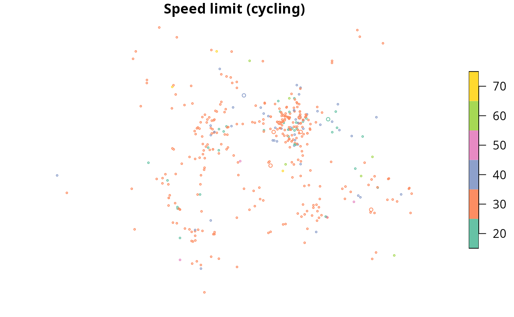
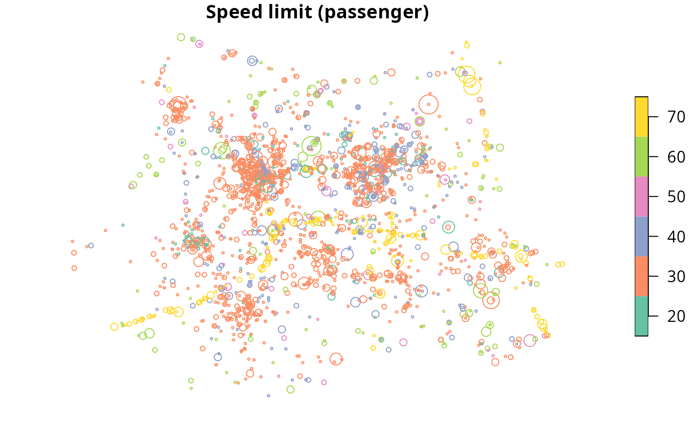
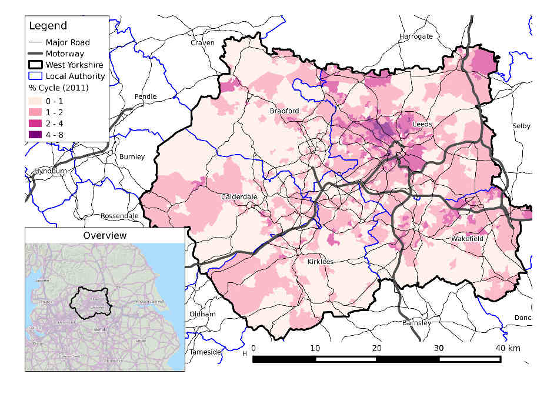
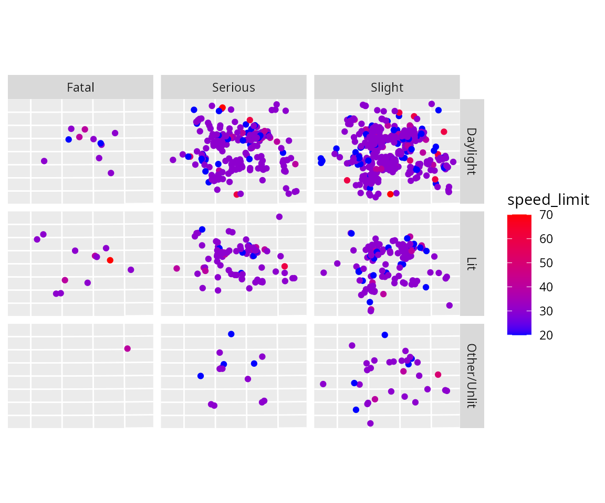
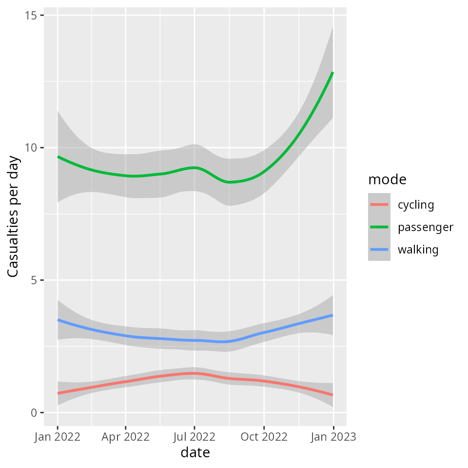
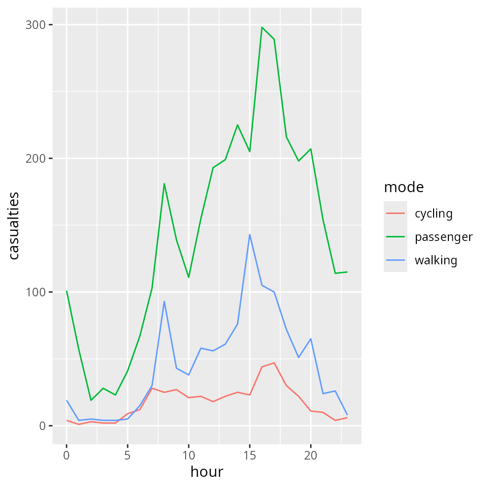

# Introducing stats19

## Introduction

**stats19** enables access to and processing of Great Britain’s official
road traffic casualty database,
[STATS19](https://www.data.gov.uk/dataset/cb7ae6f0-4be6-4935-9277-47e5ce24a11f/road-accidents-safety-data).
A description of variables in the database can be found in a
[guidance](https://www.gov.uk/guidance/road-accident-and-safety-statistics-guidance)
provided by the UK’s Department for Transport (DfT). The datasets are
collectively called STATS19 after the form used to report them, which
can be found
[here](https://assets.publishing.service.gov.uk/government/uploads/system/uploads/attachment_data/file/995422/stats19.pdf).
This vignette focuses on how to use the **stats19** package to work with
STATS19 data.

**Note**: The Department for Transport used to refer to ‘accidents’, but
“crashes” may be a more appropriate term, as emphasised in the “crash
not accident” arguments of road safety advocacy groups such as
[RoadPeace](https://www.roadpeace.org/working-for-change/crash-not-accident/).
We use the term collision only in reference to nomenclature within the
data as provided.

The development version is hosted on
[GitHub](https://github.com/ITSLeeds/stats19) and can be installed and
loaded as follows:

``` r

# from CRAN
install.packages("stats19")
# you can install the latest development (discoraged) using:
remotes::install_github("ITSLeeds/stats19")
```

``` r

library(stats19)
#> Data provided under OGL v3.0. Cite the source and link to:
#> www.nationalarchives.gov.uk/doc/open-government-licence/version/3/
```

## Functions

The easiest way to get STATS19 data is with
[`get_stats19()`](https://docs.ropensci.org/stats19/reference/get_stats19.md).
This function takes 2 main arguments, `year` and `type`. The year can be
any year between 1979 and 202x where x is the current year minus one or
two due to the delay in publishing STATS19 statistics. The type can be
one of `accidents`, `casualties` and `vehicles`, described below.
[`get_stats19()`](https://docs.ropensci.org/stats19/reference/get_stats19.md)
performs 3 jobs, corresponding to three main types of functions:

- **Download**: A
  [`dl_stats19()`](https://docs.ropensci.org/stats19/reference/dl_stats19.md)
  function accepts `year`, `type` and `filename` arguments to make it
  easy to find the right file to download only.

- **Read**: STATS19 data is provided in a particular format that
  benefits from being read-in with pre-specified column types. This is
  taken care of with `read_*()` functions providing access to the 3 main
  tables in STATS19 data:

  - [`read_collisions()`](https://docs.ropensci.org/stats19/reference/read_collisions.md)
    reads-in the crash data (which has one row per incident)
  - [`read_casualties()`](https://docs.ropensci.org/stats19/reference/read_casualties.md)
    reads-in the casualty data (which has one row per person injured or
    killed)
  - [`read_vehicles()`](https://docs.ropensci.org/stats19/reference/read_vehicles.md)
    reads-in the vehicles table, which contains information on the
    vehicles involved in the crashes (and has one row per vehicle)

- **Format**: There are corresponding `format_*()` functions for each of
  the `read_*()` functions. These have been exported for convenience, as
  the two sets of functions are closely related, there is also a
  `format` parameter for the `read_*()` functions, which by default is
  `TRUE`, adds labels to the tables. The raw data provided by the DfT
  contains only integers. Running `read_*(..., format = TRUE)` converts
  these integer values to the corresponding character variables for each
  of the three tables. For example, `read_collisions(format = TRUE)`
  converts values in the `collision_severity` column from `1`, `2` and
  `3` to `Slight`, `Serious` and `Fatal` using `fromat_collisions()`
  function. To read-in raw data without formatting, set
  `format = FALSE`.

Multiple functions (`read_*` and `format_*`) are needed for each step
because of the structure of STATS19 data, which are divided into 3
tables:

1.  “accident circumstances, with details about location, severity,
    weather, etc.;
2.  casualties, referencing knowledge about the victims; and
3.  vehicles, which contains more information about the vehicle type and
    manoeuvres, as well the some information about the driver.”

Data files containing multiple years worth of data can be downloaded.
Datasets since 1979 are broadly consistent, meaning that STATS19 data
represents a rich historic geographic record of road casualties at a
national level.

## Download STATS19 data

**stats19** enables download of raw STATS19 data with `dl_*` functions.
The following code chunk, for example, downloads a file containing
STATS19 data from 2022:

``` r

dl_stats19(year = 2022, type = "collision", ask = FALSE)
#> Files identified: dft-road-casualty-statistics-collision-2022.csv
#> Data saved at /tmp/Rtmpi6daIR/dft-road-casualty-statistics-collision-2022.csv
#> NULL
```

Note that in the previous command, `ask = FALSE`, meaning you will not
be asked. By default you are asked to confirm, before downloading large
files. Currently, these files are downloaded to a default location of
`tempdir` which is a platform independent “safe” but temporary location
to download the data in. The
[`dl_stats19()`](https://docs.ropensci.org/stats19/reference/dl_stats19.md)
function prints out the location and final file name(s) of files(s) as
shown above.

[`dl_stats19()`](https://docs.ropensci.org/stats19/reference/dl_stats19.md)
takes three parameters. Supplying a `file_name` is interpreted to mean
that the user is aware of what to download and the other two parameters
will be ignored. You can also use `year` and `type` to “search” through
the file names, which are stored in a lazy-loaded dataset called
[`stats19::file_names`](https://docs.ropensci.org/stats19/reference/file_names.md).

To see how `file_names` was created, see
[`?file_names`](https://docs.ropensci.org/stats19/reference/file_names.md).
Data files from other years can be selected interactively. Just
providing a year, for example, presents the user with multiple options
(from `file_names`), illustrated below:

``` r

dl_stats19(year = 2022)
```

    Multiple matches. Which do you want to download?

    1: dft-road-casualty-statistics-casualty-2022.csv
    2: dft-road-casualty-statistics-vehicle-2022.csv
    3: dft-road-casualty-statistics-accident-2022.csv

    Selection: 
    Enter an item from the menu, or 0 to exit

When R is running interactively, you can select which of the 3 matching
files to download: those relating to vehicles, casualties or accidents
in 2022.

## Read STATS19 data

In a similar approach to the download section before, we can read files
downloaded using a `data_dir` location of the file and the `filename` to
read. The code below downloads and reads-in the 2022 crash data:

``` r

crashes_2022_raw = get_stats19(year = 2022, type = "collision", format = FALSE)
#> Files identified: dft-road-casualty-statistics-collision-2022.csv
#> Data already exists in data_dir, not downloading: dft-road-casualty-statistics-collision-2022.csv
#> Reading in: /tmp/Rtmpi6daIR/dft-road-casualty-statistics-collision-2022.csv
```

**stats19** imports data with
[`readr::read_csv()`](https://readr.tidyverse.org/reference/read_delim.html)
which results in a ‘tibble’ object: a data frame with more user-friendly
printing and a few other features.

``` r

class(crashes_2022_raw)
#> [1] "tbl_df"     "tbl"        "data.frame"
dim(crashes_2022_raw)
#> [1] 106004     44
```

There are three `read_*()` functions, corresponding to the three
different classes of data provided by the DfT: 1.
[`read_collisions()`](https://docs.ropensci.org/stats19/reference/read_collisions.md)
2.
[`read_casualties()`](https://docs.ropensci.org/stats19/reference/read_casualties.md)
3.
[`read_vehicles()`](https://docs.ropensci.org/stats19/reference/read_vehicles.md)

In all cases, a default parameter `read_*(format = TRUE)` returns the
data in formatted form, as described above. Data can also be imported in
the form directly provided by the DfT by passing `format = FALSE`, and
then subsequently formatted with additional `format_*()` functions, as
described in a final section of this vignette. Each of these `read_*()`
functions is now described in more detail.

### Crash data

After raw data files have been downloaded as described in the previous
section, they can then be read-in as follows:

``` r

crashes_2022_raw = read_collisions(year = 2022, format = FALSE)
#> Reading in: /tmp/Rtmpi6daIR/dft-road-casualty-statistics-collision-2022.csv
crashes_2022 = format_collisions(crashes_2022_raw)
#> date and time columns present, creating formatted datetime column
nrow(crashes_2022_raw)
#> [1] 106004
ncol(crashes_2022_raw)
#> [1] 44
nrow(crashes_2022)
#> [1] 106004
ncol(crashes_2022)
#> [1] 42
```

What just happened? We read-in data on all road crashes recorded by the
police in 2022 across Great Britain.

This work was done by `read_collisions(format = FALSE)`, which imported
the “raw” STATS19 data without cleaning messy column names or
re-categorising the outputs.
[`format_collisions()`](https://docs.ropensci.org/stats19/reference/format_collisions.md)
function automates the process of matching column names with variable
names provided by the DfT. This means `crashes_2022` is much more usable
than `crashes_2022_raw`, as shown below, which shows some key variables
in the messy and clean datasets:

``` r

names(crashes_2022_raw)
#>  [1] "collision_index"                                 
#>  [2] "collision_year"                                  
#>  [3] "collision_reference"                             
#>  [4] "location_easting_osgr"                           
#>  [5] "location_northing_osgr"                          
#>  [6] "longitude"                                       
#>  [7] "latitude"                                        
#>  [8] "police_force"                                    
#>  [9] "collision_severity"                              
#> [10] "number_of_vehicles"                              
#> [11] "number_of_casualties"                            
#> [12] "date"                                            
#> [13] "day_of_week"                                     
#> [14] "time"                                            
#> [15] "local_authority_district"                        
#> [16] "local_authority_ons_district"                    
#> [17] "local_authority_highway"                         
#> [18] "local_authority_highway_current"                 
#> [19] "first_road_class"                                
#> [20] "first_road_number"                               
#> [21] "road_type"                                       
#> [22] "speed_limit"                                     
#> [23] "junction_detail_historic"                        
#> [24] "junction_detail"                                 
#> [25] "junction_control"                                
#> [26] "second_road_class"                               
#> [27] "second_road_number"                              
#> [28] "pedestrian_crossing_human_control_historic"      
#> [29] "pedestrian_crossing_physical_facilities_historic"
#> [30] "pedestrian_crossing"                             
#> [31] "light_conditions"                                
#> [32] "weather_conditions"                              
#> [33] "road_surface_conditions"                         
#> [34] "special_conditions_at_site"                      
#> [35] "carriageway_hazards_historic"                    
#> [36] "carriageway_hazards"                             
#> [37] "urban_or_rural_area"                             
#> [38] "did_police_officer_attend_scene_of_accident"     
#> [39] "trunk_road_flag"                                 
#> [40] "lsoa_of_accident_location"                       
#> [41] "enhanced_severity_collision"                     
#> [42] "collision_injury_based"                          
#> [43] "collision_adjusted_severity_serious"             
#> [44] "collision_adjusted_severity_slight"
crashes_2022_raw[c(8, 18, 23, 25)]
#> # A tibble: 106,004 × 4
#>    police_force local_authority_highwa…¹ junction_detail_hist…² junction_control
#>    <chr>        <chr>                    <chr>                  <chr>           
#>  1 11           E06000005                3                      4               
#>  2 11           E06000005                3                      4               
#>  3 7            E06000007                9                      4               
#>  4 7            E06000007                0                      NA              
#>  5 7            E06000007                1                      4               
#>  6 4            E06000009                3                      4               
#>  7 16           E06000010                3                      4               
#>  8 16           E06000010                0                      NA              
#>  9 16           E06000010                3                      2               
#> 10 16           E06000011                1                      4               
#> # ℹ 105,994 more rows
#> # ℹ abbreviated names: ¹​local_authority_highway_current,
#> #   ²​junction_detail_historic
crashes_2022[c(8, 18, 23, 25)]
#> # A tibble: 106,004 × 4
#>    police_force local_authority_highway_curr…¹ junction_detail second_road_class
#>    <chr>        <chr>                          <chr>           <chr>            
#>  1 Durham       E06000005                      T or staggered… Unclassified     
#>  2 Durham       E06000005                      T or staggered… Unclassified     
#>  3 Cheshire     E06000007                      19              Unclassified     
#>  4 Cheshire     E06000007                      Not at junctio… Not at junction …
#>  5 Cheshire     E06000007                      Not at junctio… A                
#>  6 Lancashire   E06000009                      T or staggered… Unclassified     
#>  7 Humberside   E06000010                      T or staggered… Unclassified     
#>  8 Humberside   E06000010                      Not at junctio… Not at junction …
#>  9 Humberside   E06000010                      T or staggered… Unclassified     
#> 10 Humberside   E06000011                      Not at junctio… B                
#> # ℹ 105,994 more rows
#> # ℹ abbreviated name: ¹​local_authority_highway_current
```

By default, `format = TRUE`, meaning that the two stages of
`read_collisions(format = FALSE)` and
[`format_collisions()`](https://docs.ropensci.org/stats19/reference/format_collisions.md)
yield the same result as `read_collisions(format = TRUE)`. For the full
list of columns, run `names(crashes_2022)`.

**Note**: As indicated above, the term collision is only used as
directly provided by the DfT; “crashes” is a more appropriate term,
hence we call our resultant datasets `crashes_*`.

## Format STATS19 data

It is also possible to import the “raw” data as provided by the DfT. The
packaged datasets `stats19_variables` and `stats19_schema` provide
summary information about the contents of this data guide. These contain
the full variable names in the guide (`stats19_variables`) and a
complete look up table relating integer values to the `.csv` files
provided by the DfT and their labels (`stats19_schema`). The first rows
of each dataset are shown below:

``` r

stats19_variables
#> # A tibble: 111 × 4
#> # Groups:   table [4]
#>    table    variable                  note                     type     
#>    <chr>    <chr>                     <chr>                    <chr>    
#>  1 casualty age_band_of_casualty      NA                       character
#>  2 casualty age_of_casualty           NA                       numeric  
#>  3 casualty bus_or_coach_passenger    NA                       character
#>  4 casualty car_passenger             NA                       character
#>  5 casualty casualty_adjusted_serious NA                       numeric  
#>  6 casualty casualty_adjusted_slight  NA                       numeric  
#>  7 casualty casualty_class            NA                       character
#>  8 casualty casualty_distance_banding field introduced in 2023 character
#>  9 casualty casualty_imd_decile       field introduced in 2016 character
#> 10 casualty casualty_injury_based     NA                       character
#> # ℹ 101 more rows
stats19_schema
#>                     table                                         variable
#> 1               collision                                  collision_index
#> 2               collision                                   collision_year
#> 3               collision                                 collision_ref_no
#> 4               collision                            location_easting_osgr
#> 5               collision                           location_northing_osgr
#> 6               collision                                        longitude
#> 7               collision                                         latitude
#> 8               collision                                     police_force
#> 9               collision                                     police_force
#> 10              collision                                     police_force
#> 11              collision                                     police_force
#> 12              collision                                     police_force
#> 13              collision                                     police_force
#> 14              collision                                     police_force
#> 15              collision                                     police_force
#> 16              collision                                     police_force
#> 17              collision                                     police_force
#> 18              collision                                     police_force
#> 19              collision                                     police_force
#> 20              collision                                     police_force
#> 21              collision                                     police_force
#> 22              collision                                     police_force
#> 23              collision                                     police_force
#> 24              collision                                     police_force
#> 25              collision                                     police_force
#> 26              collision                                     police_force
#> 27              collision                                     police_force
#> 28              collision                                     police_force
#> 29              collision                                     police_force
#> 30              collision                                     police_force
#> 31              collision                                     police_force
#> 32              collision                                     police_force
#> 33              collision                                     police_force
#> 34              collision                                     police_force
#> 35              collision                                     police_force
#> 36              collision                                     police_force
#> 37              collision                                     police_force
#> 38              collision                                     police_force
#> 39              collision                                     police_force
#> 40              collision                                     police_force
#> 41              collision                                     police_force
#> 42              collision                                     police_force
#> 43              collision                                     police_force
#> 44              collision                                     police_force
#> 45              collision                                     police_force
#> 46              collision                                     police_force
#> 47              collision                                     police_force
#> 48              collision                                     police_force
#> 49              collision                                     police_force
#> 50              collision                                     police_force
#> 51              collision                                     police_force
#> 52              collision                                     police_force
#> 53              collision                                     police_force
#> 54              collision                                     police_force
#> 55              collision                                     police_force
#> 56              collision                                     police_force
#> 57              collision                                     police_force
#> 58              collision                                     police_force
#> 59              collision                                     police_force
#> 60              collision                               collision_severity
#> 61              collision                               collision_severity
#> 62              collision                               collision_severity
#> 63              collision                      enhanced_collision_severity
#> 64              collision                      enhanced_collision_severity
#> 65              collision                      enhanced_collision_severity
#> 66              collision                      enhanced_collision_severity
#> 67              collision                      enhanced_collision_severity
#> 68              collision                      enhanced_collision_severity
#> 69              collision                               number_of_vehicles
#> 70              collision                             number_of_casualties
#> 71              collision                                             date
#> 72              collision                                      day_of_week
#> 73              collision                                      day_of_week
#> 74              collision                                      day_of_week
#> 75              collision                                      day_of_week
#> 76              collision                                      day_of_week
#> 77              collision                                      day_of_week
#> 78              collision                                      day_of_week
#> 79              collision                                             time
#> 80              collision                         local_authority_district
#> 81              collision                         local_authority_district
#> 82              collision                         local_authority_district
#> 83              collision                         local_authority_district
#> 84              collision                         local_authority_district
#> 85              collision                         local_authority_district
#> 86              collision                         local_authority_district
#> 87              collision                         local_authority_district
#> 88              collision                         local_authority_district
#> 89              collision                         local_authority_district
#> 90              collision                         local_authority_district
#> 91              collision                         local_authority_district
#> 92              collision                         local_authority_district
#> 93              collision                         local_authority_district
#> 94              collision                         local_authority_district
#> 95              collision                         local_authority_district
#> 96              collision                         local_authority_district
#> 97              collision                         local_authority_district
#> 98              collision                         local_authority_district
#> 99              collision                         local_authority_district
#> 100             collision                         local_authority_district
#> 101             collision                         local_authority_district
#> 102             collision                         local_authority_district
#> 103             collision                         local_authority_district
#> 104             collision                         local_authority_district
#> 105             collision                         local_authority_district
#> 106             collision                         local_authority_district
#> 107             collision                         local_authority_district
#> 108             collision                         local_authority_district
#> 109             collision                         local_authority_district
#> 110             collision                         local_authority_district
#> 111             collision                         local_authority_district
#> 112             collision                         local_authority_district
#> 113             collision                         local_authority_district
#> 114             collision                         local_authority_district
#> 115             collision                         local_authority_district
#> 116             collision                         local_authority_district
#> 117             collision                         local_authority_district
#> 118             collision                         local_authority_district
#> 119             collision                         local_authority_district
#> 120             collision                         local_authority_district
#> 121             collision                         local_authority_district
#> 122             collision                         local_authority_district
#> 123             collision                         local_authority_district
#> 124             collision                         local_authority_district
#> 125             collision                         local_authority_district
#> 126             collision                         local_authority_district
#> 127             collision                         local_authority_district
#> 128             collision                         local_authority_district
#> 129             collision                         local_authority_district
#> 130             collision                         local_authority_district
#> 131             collision                         local_authority_district
#> 132             collision                         local_authority_district
#> 133             collision                         local_authority_district
#> 134             collision                         local_authority_district
#> 135             collision                         local_authority_district
#> 136             collision                         local_authority_district
#> 137             collision                         local_authority_district
#> 138             collision                         local_authority_district
#> 139             collision                         local_authority_district
#> 140             collision                         local_authority_district
#> 141             collision                         local_authority_district
#> 142             collision                         local_authority_district
#> 143             collision                         local_authority_district
#> 144             collision                         local_authority_district
#> 145             collision                         local_authority_district
#> 146             collision                         local_authority_district
#> 147             collision                         local_authority_district
#> 148             collision                         local_authority_district
#> 149             collision                         local_authority_district
#> 150             collision                         local_authority_district
#> 151             collision                         local_authority_district
#> 152             collision                         local_authority_district
#> 153             collision                         local_authority_district
#> 154             collision                         local_authority_district
#> 155             collision                         local_authority_district
#> 156             collision                         local_authority_district
#> 157             collision                         local_authority_district
#> 158             collision                         local_authority_district
#> 159             collision                         local_authority_district
#> 160             collision                         local_authority_district
#> 161             collision                         local_authority_district
#> 162             collision                         local_authority_district
#> 163             collision                         local_authority_district
#> 164             collision                         local_authority_district
#> 165             collision                         local_authority_district
#> 166             collision                         local_authority_district
#> 167             collision                         local_authority_district
#> 168             collision                         local_authority_district
#> 169             collision                         local_authority_district
#> 170             collision                         local_authority_district
#> 171             collision                         local_authority_district
#> 172             collision                         local_authority_district
#> 173             collision                         local_authority_district
#> 174             collision                         local_authority_district
#> 175             collision                         local_authority_district
#> 176             collision                         local_authority_district
#> 177             collision                         local_authority_district
#> 178             collision                         local_authority_district
#> 179             collision                         local_authority_district
#> 180             collision                         local_authority_district
#> 181             collision                         local_authority_district
#> 182             collision                         local_authority_district
#> 183             collision                         local_authority_district
#> 184             collision                         local_authority_district
#> 185             collision                         local_authority_district
#> 186             collision                         local_authority_district
#> 187             collision                         local_authority_district
#> 188             collision                         local_authority_district
#> 189             collision                         local_authority_district
#> 190             collision                         local_authority_district
#> 191             collision                         local_authority_district
#> 192             collision                         local_authority_district
#> 193             collision                         local_authority_district
#> 194             collision                         local_authority_district
#> 195             collision                         local_authority_district
#> 196             collision                         local_authority_district
#> 197             collision                         local_authority_district
#> 198             collision                         local_authority_district
#> 199             collision                         local_authority_district
#> 200             collision                         local_authority_district
#> 201             collision                         local_authority_district
#> 202             collision                         local_authority_district
#> 203             collision                         local_authority_district
#> 204             collision                         local_authority_district
#> 205             collision                         local_authority_district
#> 206             collision                         local_authority_district
#> 207             collision                         local_authority_district
#> 208             collision                         local_authority_district
#> 209             collision                         local_authority_district
#> 210             collision                         local_authority_district
#> 211             collision                         local_authority_district
#> 212             collision                         local_authority_district
#> 213             collision                         local_authority_district
#> 214             collision                         local_authority_district
#> 215             collision                         local_authority_district
#> 216             collision                         local_authority_district
#> 217             collision                         local_authority_district
#> 218             collision                         local_authority_district
#> 219             collision                         local_authority_district
#> 220             collision                         local_authority_district
#> 221             collision                         local_authority_district
#> 222             collision                         local_authority_district
#> 223             collision                         local_authority_district
#> 224             collision                         local_authority_district
#> 225             collision                         local_authority_district
#> 226             collision                         local_authority_district
#> 227             collision                         local_authority_district
#> 228             collision                         local_authority_district
#> 229             collision                         local_authority_district
#> 230             collision                         local_authority_district
#> 231             collision                         local_authority_district
#> 232             collision                         local_authority_district
#> 233             collision                         local_authority_district
#> 234             collision                         local_authority_district
#> 235             collision                         local_authority_district
#> 236             collision                         local_authority_district
#> 237             collision                         local_authority_district
#> 238             collision                         local_authority_district
#> 239             collision                         local_authority_district
#> 240             collision                         local_authority_district
#> 241             collision                         local_authority_district
#> 242             collision                         local_authority_district
#> 243             collision                         local_authority_district
#> 244             collision                         local_authority_district
#> 245             collision                         local_authority_district
#> 246             collision                         local_authority_district
#> 247             collision                         local_authority_district
#> 248             collision                         local_authority_district
#> 249             collision                         local_authority_district
#> 250             collision                         local_authority_district
#> 251             collision                         local_authority_district
#> 252             collision                         local_authority_district
#> 253             collision                         local_authority_district
#> 254             collision                         local_authority_district
#> 255             collision                         local_authority_district
#> 256             collision                         local_authority_district
#> 257             collision                         local_authority_district
#> 258             collision                         local_authority_district
#> 259             collision                         local_authority_district
#> 260             collision                         local_authority_district
#> 261             collision                         local_authority_district
#> 262             collision                         local_authority_district
#> 263             collision                         local_authority_district
#> 264             collision                         local_authority_district
#> 265             collision                         local_authority_district
#> 266             collision                         local_authority_district
#> 267             collision                         local_authority_district
#> 268             collision                         local_authority_district
#> 269             collision                         local_authority_district
#> 270             collision                         local_authority_district
#> 271             collision                         local_authority_district
#> 272             collision                         local_authority_district
#> 273             collision                         local_authority_district
#> 274             collision                         local_authority_district
#> 275             collision                         local_authority_district
#> 276             collision                         local_authority_district
#> 277             collision                         local_authority_district
#> 278             collision                         local_authority_district
#> 279             collision                         local_authority_district
#> 280             collision                         local_authority_district
#> 281             collision                         local_authority_district
#> 282             collision                         local_authority_district
#> 283             collision                         local_authority_district
#> 284             collision                         local_authority_district
#> 285             collision                         local_authority_district
#> 286             collision                         local_authority_district
#> 287             collision                         local_authority_district
#> 288             collision                         local_authority_district
#> 289             collision                         local_authority_district
#> 290             collision                         local_authority_district
#> 291             collision                         local_authority_district
#> 292             collision                         local_authority_district
#> 293             collision                         local_authority_district
#> 294             collision                         local_authority_district
#> 295             collision                         local_authority_district
#> 296             collision                         local_authority_district
#> 297             collision                         local_authority_district
#> 298             collision                         local_authority_district
#> 299             collision                         local_authority_district
#> 300             collision                         local_authority_district
#> 301             collision                         local_authority_district
#> 302             collision                         local_authority_district
#> 303             collision                         local_authority_district
#> 304             collision                         local_authority_district
#> 305             collision                         local_authority_district
#> 306             collision                         local_authority_district
#> 307             collision                         local_authority_district
#> 308             collision                         local_authority_district
#> 309             collision                         local_authority_district
#> 310             collision                         local_authority_district
#> 311             collision                         local_authority_district
#> 312             collision                         local_authority_district
#> 313             collision                         local_authority_district
#> 314             collision                         local_authority_district
#> 315             collision                         local_authority_district
#> 316             collision                         local_authority_district
#> 317             collision                         local_authority_district
#> 318             collision                         local_authority_district
#> 319             collision                         local_authority_district
#> 320             collision                         local_authority_district
#> 321             collision                         local_authority_district
#> 322             collision                         local_authority_district
#> 323             collision                         local_authority_district
#> 324             collision                         local_authority_district
#> 325             collision                         local_authority_district
#> 326             collision                         local_authority_district
#> 327             collision                         local_authority_district
#> 328             collision                         local_authority_district
#> 329             collision                         local_authority_district
#> 330             collision                         local_authority_district
#> 331             collision                         local_authority_district
#> 332             collision                         local_authority_district
#> 333             collision                         local_authority_district
#> 334             collision                         local_authority_district
#> 335             collision                         local_authority_district
#> 336             collision                         local_authority_district
#> 337             collision                         local_authority_district
#> 338             collision                         local_authority_district
#> 339             collision                         local_authority_district
#> 340             collision                         local_authority_district
#> 341             collision                         local_authority_district
#> 342             collision                         local_authority_district
#> 343             collision                         local_authority_district
#> 344             collision                         local_authority_district
#> 345             collision                         local_authority_district
#> 346             collision                         local_authority_district
#> 347             collision                         local_authority_district
#> 348             collision                         local_authority_district
#> 349             collision                         local_authority_district
#> 350             collision                         local_authority_district
#> 351             collision                         local_authority_district
#> 352             collision                         local_authority_district
#> 353             collision                         local_authority_district
#> 354             collision                         local_authority_district
#> 355             collision                         local_authority_district
#> 356             collision                         local_authority_district
#> 357             collision                         local_authority_district
#> 358             collision                         local_authority_district
#> 359             collision                         local_authority_district
#> 360             collision                         local_authority_district
#> 361             collision                         local_authority_district
#> 362             collision                         local_authority_district
#> 363             collision                         local_authority_district
#> 364             collision                         local_authority_district
#> 365             collision                         local_authority_district
#> 366             collision                         local_authority_district
#> 367             collision                         local_authority_district
#> 368             collision                         local_authority_district
#> 369             collision                         local_authority_district
#> 370             collision                         local_authority_district
#> 371             collision                         local_authority_district
#> 372             collision                         local_authority_district
#> 373             collision                         local_authority_district
#> 374             collision                         local_authority_district
#> 375             collision                         local_authority_district
#> 376             collision                         local_authority_district
#> 377             collision                         local_authority_district
#> 378             collision                         local_authority_district
#> 379             collision                         local_authority_district
#> 380             collision                         local_authority_district
#> 381             collision                         local_authority_district
#> 382             collision                         local_authority_district
#> 383             collision                         local_authority_district
#> 384             collision                         local_authority_district
#> 385             collision                         local_authority_district
#> 386             collision                         local_authority_district
#> 387             collision                         local_authority_district
#> 388             collision                         local_authority_district
#> 389             collision                         local_authority_district
#> 390             collision                         local_authority_district
#> 391             collision                         local_authority_district
#> 392             collision                         local_authority_district
#> 393             collision                         local_authority_district
#> 394             collision                         local_authority_district
#> 395             collision                         local_authority_district
#> 396             collision                         local_authority_district
#> 397             collision                         local_authority_district
#> 398             collision                         local_authority_district
#> 399             collision                         local_authority_district
#> 400             collision                         local_authority_district
#> 401             collision                         local_authority_district
#> 402             collision                         local_authority_district
#> 403             collision                         local_authority_district
#> 404             collision                         local_authority_district
#> 405             collision                         local_authority_district
#> 406             collision                         local_authority_district
#> 407             collision                         local_authority_district
#> 408             collision                         local_authority_district
#> 409             collision                         local_authority_district
#> 410             collision                         local_authority_district
#> 411             collision                         local_authority_district
#> 412             collision                         local_authority_district
#> 413             collision                         local_authority_district
#> 414             collision                         local_authority_district
#> 415             collision                         local_authority_district
#> 416             collision                         local_authority_district
#> 417             collision                         local_authority_district
#> 418             collision                         local_authority_district
#> 419             collision                         local_authority_district
#> 420             collision                         local_authority_district
#> 421             collision                         local_authority_district
#> 422             collision                         local_authority_district
#> 423             collision                         local_authority_district
#> 424             collision                         local_authority_district
#> 425             collision                         local_authority_district
#> 426             collision                         local_authority_district
#> 427             collision                         local_authority_district
#> 428             collision                         local_authority_district
#> 429             collision                         local_authority_district
#> 430             collision                         local_authority_district
#> 431             collision                         local_authority_district
#> 432             collision                         local_authority_district
#> 433             collision                         local_authority_district
#> 434             collision                         local_authority_district
#> 435             collision                         local_authority_district
#> 436             collision                         local_authority_district
#> 437             collision                         local_authority_district
#> 438             collision                         local_authority_district
#> 439             collision                         local_authority_district
#> 440             collision                         local_authority_district
#> 441             collision                         local_authority_district
#> 442             collision                         local_authority_district
#> 443             collision                         local_authority_district
#> 444             collision                         local_authority_district
#> 445             collision                         local_authority_district
#> 446             collision                         local_authority_district
#> 447             collision                         local_authority_district
#> 448             collision                         local_authority_district
#> 449             collision                         local_authority_district
#> 450             collision                         local_authority_district
#> 451             collision                         local_authority_district
#> 452             collision                         local_authority_district
#> 453             collision                         local_authority_district
#> 454             collision                         local_authority_district
#> 455             collision                         local_authority_district
#> 456             collision                         local_authority_district
#> 457             collision                         local_authority_district
#> 458             collision                         local_authority_district
#> 459             collision                         local_authority_district
#> 460             collision                         local_authority_district
#> 461             collision                         local_authority_district
#> 462             collision                         local_authority_district
#> 463             collision                         local_authority_district
#> 464             collision                         local_authority_district
#> 465             collision                         local_authority_district
#> 466             collision                         local_authority_district
#> 467             collision                         local_authority_district
#> 468             collision                         local_authority_district
#> 469             collision                         local_authority_district
#> 470             collision                         local_authority_district
#> 471             collision                         local_authority_district
#> 472             collision                         local_authority_district
#> 473             collision                         local_authority_district
#> 474             collision                         local_authority_district
#> 475             collision                         local_authority_district
#> 476             collision                         local_authority_district
#> 477             collision                         local_authority_district
#> 478             collision                         local_authority_district
#> 479             collision                         local_authority_district
#> 480             collision                         local_authority_district
#> 481             collision                         local_authority_district
#> 482             collision                         local_authority_district
#> 483             collision                         local_authority_district
#> 484             collision                         local_authority_district
#> 485             collision                         local_authority_district
#> 486             collision                         local_authority_district
#> 487             collision                         local_authority_district
#> 488             collision                         local_authority_district
#> 489             collision                         local_authority_district
#> 490             collision                         local_authority_district
#> 491             collision                         local_authority_district
#> 492             collision                         local_authority_district
#> 493             collision                         local_authority_district
#> 494             collision                         local_authority_district
#> 495             collision                         local_authority_district
#> 496             collision                         local_authority_district
#> 497             collision                         local_authority_district
#> 498             collision                         local_authority_district
#> 499             collision                         local_authority_district
#> 500             collision                         local_authority_district
#> 501             collision                         local_authority_district
#> 502             collision                         local_authority_district
#> 503             collision                         local_authority_district
#> 504             collision                         local_authority_district
#> 505             collision                         local_authority_district
#> 506             collision                         local_authority_district
#> 507             collision                         local_authority_district
#> 508             collision                         local_authority_district
#> 509             collision                         local_authority_district
#> 510             collision                         local_authority_district
#> 511             collision                         local_authority_district
#> 512             collision                         local_authority_district
#> 513             collision                         local_authority_district
#> 514             collision                         local_authority_district
#> 515             collision                         local_authority_district
#> 516             collision                         local_authority_district
#> 517             collision                         local_authority_district
#> 518             collision                         local_authority_district
#> 519             collision                         local_authority_district
#> 520             collision                         local_authority_district
#> 521             collision                         local_authority_district
#> 522             collision                         local_authority_district
#> 523             collision                         local_authority_district
#> 524             collision                         local_authority_district
#> 525             collision                         local_authority_district
#> 526             collision                         local_authority_district
#> 527             collision                         local_authority_district
#> 528             collision                         local_authority_district
#> 529             collision                         local_authority_district
#> 530             collision                         local_authority_district
#> 531             collision                         local_authority_district
#> 532             collision                         local_authority_district
#> 533             collision                         local_authority_district
#> 534             collision                         local_authority_district
#> 535             collision                         local_authority_district
#> 536             collision                         local_authority_district
#> 537             collision                         local_authority_district
#> 538             collision                         local_authority_district
#> 539             collision                         local_authority_district
#> 540             collision                         local_authority_district
#> 541             collision                         local_authority_district
#> 542             collision                         local_authority_district
#> 543             collision                         local_authority_district
#> 544             collision                         local_authority_district
#> 545             collision                         local_authority_district
#> 546             collision                         local_authority_district
#> 547             collision                         local_authority_district
#> 548             collision                         local_authority_district
#> 549             collision                         local_authority_district
#> 550             collision                         local_authority_district
#> 551             collision                         local_authority_district
#> 552             collision                         local_authority_district
#> 553             collision                         local_authority_district
#> 554             collision                         local_authority_district
#> 555             collision                         local_authority_district
#> 556             collision                         local_authority_district
#> 557             collision                         local_authority_district
#> 558             collision                         local_authority_district
#> 559             collision                         local_authority_district
#> 560             collision                         local_authority_district
#> 561             collision                         local_authority_district
#> 562             collision                         local_authority_district
#> 563             collision                         local_authority_district
#> 564             collision                         local_authority_district
#> 565             collision                         local_authority_district
#> 566             collision                         local_authority_district
#> 567             collision                         local_authority_district
#> 568             collision                         local_authority_district
#> 569             collision                         local_authority_district
#> 570             collision                         local_authority_district
#> 571             collision                         local_authority_district
#> 572             collision                         local_authority_district
#> 573             collision                         local_authority_district
#> 574             collision                         local_authority_district
#> 575             collision                         local_authority_district
#> 576             collision                         local_authority_district
#> 577             collision                         local_authority_district
#> 578             collision                         local_authority_district
#> 579             collision                         local_authority_district
#> 580             collision                         local_authority_district
#> 581             collision                         local_authority_district
#> 582             collision                         local_authority_district
#> 583             collision                         local_authority_district
#> 584             collision                         local_authority_district
#> 585             collision                         local_authority_district
#> 586             collision                         local_authority_district
#> 587             collision                         local_authority_district
#> 588             collision                         local_authority_district
#> 589             collision                         local_authority_district
#> 590             collision                         local_authority_district
#> 591             collision                         local_authority_district
#> 592             collision                         local_authority_district
#> 593             collision                         local_authority_district
#> 594             collision                         local_authority_district
#> 595             collision                         local_authority_district
#> 596             collision                         local_authority_district
#> 597             collision                         local_authority_district
#> 598             collision                         local_authority_district
#> 599             collision                         local_authority_district
#> 600             collision                         local_authority_district
#> 601             collision                         local_authority_district
#> 602             collision                         local_authority_district
#> 603             collision                         local_authority_district
#> 604             collision                         local_authority_district
#> 605             collision                         local_authority_district
#> 606             collision                         local_authority_district
#> 607             collision                         local_authority_district
#> 608             collision                         local_authority_district
#> 609             collision                         local_authority_district
#> 610             collision                         local_authority_district
#> 611             collision                         local_authority_district
#> 612             collision                         local_authority_district
#> 613             collision                     local_authority_ons_district
#> 614             collision                     local_authority_ons_district
#> 615             collision                     local_authority_ons_district
#> 616             collision                     local_authority_ons_district
#> 617             collision                     local_authority_ons_district
#> 618             collision                     local_authority_ons_district
#> 619             collision                     local_authority_ons_district
#> 620             collision                     local_authority_ons_district
#> 621             collision                     local_authority_ons_district
#> 622             collision                     local_authority_ons_district
#> 623             collision                     local_authority_ons_district
#> 624             collision                     local_authority_ons_district
#> 625             collision                     local_authority_ons_district
#> 626             collision                     local_authority_ons_district
#> 627             collision                     local_authority_ons_district
#> 628             collision                     local_authority_ons_district
#> 629             collision                     local_authority_ons_district
#> 630             collision                     local_authority_ons_district
#> 631             collision                     local_authority_ons_district
#> 632             collision                     local_authority_ons_district
#> 633             collision                     local_authority_ons_district
#> 634             collision                     local_authority_ons_district
#> 635             collision                     local_authority_ons_district
#> 636             collision                     local_authority_ons_district
#> 637             collision                     local_authority_ons_district
#> 638             collision                     local_authority_ons_district
#> 639             collision                     local_authority_ons_district
#> 640             collision                     local_authority_ons_district
#> 641             collision                     local_authority_ons_district
#> 642             collision                     local_authority_ons_district
#> 643             collision                     local_authority_ons_district
#> 644             collision                     local_authority_ons_district
#> 645             collision                     local_authority_ons_district
#> 646             collision                     local_authority_ons_district
#> 647             collision                     local_authority_ons_district
#> 648             collision                     local_authority_ons_district
#> 649             collision                     local_authority_ons_district
#> 650             collision                     local_authority_ons_district
#> 651             collision                     local_authority_ons_district
#> 652             collision                     local_authority_ons_district
#> 653             collision                     local_authority_ons_district
#> 654             collision                     local_authority_ons_district
#> 655             collision                     local_authority_ons_district
#> 656             collision                     local_authority_ons_district
#> 657             collision                     local_authority_ons_district
#> 658             collision                     local_authority_ons_district
#> 659             collision                     local_authority_ons_district
#> 660             collision                     local_authority_ons_district
#> 661             collision                     local_authority_ons_district
#> 662             collision                     local_authority_ons_district
#> 663             collision                     local_authority_ons_district
#> 664             collision                     local_authority_ons_district
#> 665             collision                     local_authority_ons_district
#> 666             collision                     local_authority_ons_district
#> 667             collision                     local_authority_ons_district
#> 668             collision                     local_authority_ons_district
#> 669             collision                     local_authority_ons_district
#> 670             collision                     local_authority_ons_district
#> 671             collision                     local_authority_ons_district
#> 672             collision                     local_authority_ons_district
#> 673             collision                     local_authority_ons_district
#> 674             collision                     local_authority_ons_district
#> 675             collision                     local_authority_ons_district
#> 676             collision                     local_authority_ons_district
#> 677             collision                     local_authority_ons_district
#> 678             collision                     local_authority_ons_district
#> 679             collision                     local_authority_ons_district
#> 680             collision                     local_authority_ons_district
#> 681             collision                     local_authority_ons_district
#> 682             collision                     local_authority_ons_district
#> 683             collision                     local_authority_ons_district
#> 684             collision                     local_authority_ons_district
#> 685             collision                     local_authority_ons_district
#> 686             collision                     local_authority_ons_district
#> 687             collision                     local_authority_ons_district
#> 688             collision                     local_authority_ons_district
#> 689             collision                     local_authority_ons_district
#> 690             collision                     local_authority_ons_district
#> 691             collision                     local_authority_ons_district
#> 692             collision                     local_authority_ons_district
#> 693             collision                     local_authority_ons_district
#> 694             collision                     local_authority_ons_district
#> 695             collision                     local_authority_ons_district
#> 696             collision                     local_authority_ons_district
#> 697             collision                     local_authority_ons_district
#> 698             collision                     local_authority_ons_district
#> 699             collision                     local_authority_ons_district
#> 700             collision                     local_authority_ons_district
#> 701             collision                     local_authority_ons_district
#> 702             collision                     local_authority_ons_district
#> 703             collision                     local_authority_ons_district
#> 704             collision                     local_authority_ons_district
#> 705             collision                     local_authority_ons_district
#> 706             collision                     local_authority_ons_district
#> 707             collision                     local_authority_ons_district
#> 708             collision                     local_authority_ons_district
#> 709             collision                     local_authority_ons_district
#> 710             collision                     local_authority_ons_district
#> 711             collision                     local_authority_ons_district
#> 712             collision                     local_authority_ons_district
#> 713             collision                     local_authority_ons_district
#> 714             collision                     local_authority_ons_district
#> 715             collision                     local_authority_ons_district
#> 716             collision                     local_authority_ons_district
#> 717             collision                     local_authority_ons_district
#> 718             collision                     local_authority_ons_district
#> 719             collision                     local_authority_ons_district
#> 720             collision                     local_authority_ons_district
#> 721             collision                     local_authority_ons_district
#> 722             collision                     local_authority_ons_district
#> 723             collision                     local_authority_ons_district
#> 724             collision                     local_authority_ons_district
#> 725             collision                     local_authority_ons_district
#> 726             collision                     local_authority_ons_district
#> 727             collision                     local_authority_ons_district
#> 728             collision                     local_authority_ons_district
#> 729             collision                     local_authority_ons_district
#> 730             collision                     local_authority_ons_district
#> 731             collision                     local_authority_ons_district
#> 732             collision                     local_authority_ons_district
#> 733             collision                     local_authority_ons_district
#> 734             collision                     local_authority_ons_district
#> 735             collision                     local_authority_ons_district
#> 736             collision                     local_authority_ons_district
#> 737             collision                     local_authority_ons_district
#> 738             collision                     local_authority_ons_district
#> 739             collision                     local_authority_ons_district
#> 740             collision                     local_authority_ons_district
#> 741             collision                     local_authority_ons_district
#> 742             collision                     local_authority_ons_district
#> 743             collision                     local_authority_ons_district
#> 744             collision                     local_authority_ons_district
#> 745             collision                     local_authority_ons_district
#> 746             collision                     local_authority_ons_district
#> 747             collision                     local_authority_ons_district
#> 748             collision                     local_authority_ons_district
#> 749             collision                     local_authority_ons_district
#> 750             collision                     local_authority_ons_district
#> 751             collision                     local_authority_ons_district
#> 752             collision                     local_authority_ons_district
#> 753             collision                     local_authority_ons_district
#> 754             collision                     local_authority_ons_district
#> 755             collision                     local_authority_ons_district
#> 756             collision                     local_authority_ons_district
#> 757             collision                     local_authority_ons_district
#> 758             collision                     local_authority_ons_district
#> 759             collision                     local_authority_ons_district
#> 760             collision                     local_authority_ons_district
#> 761             collision                     local_authority_ons_district
#> 762             collision                     local_authority_ons_district
#> 763             collision                     local_authority_ons_district
#> 764             collision                     local_authority_ons_district
#> 765             collision                     local_authority_ons_district
#> 766             collision                     local_authority_ons_district
#> 767             collision                     local_authority_ons_district
#> 768             collision                     local_authority_ons_district
#> 769             collision                     local_authority_ons_district
#> 770             collision                     local_authority_ons_district
#> 771             collision                     local_authority_ons_district
#> 772             collision                     local_authority_ons_district
#> 773             collision                     local_authority_ons_district
#> 774             collision                     local_authority_ons_district
#> 775             collision                     local_authority_ons_district
#> 776             collision                     local_authority_ons_district
#> 777             collision                     local_authority_ons_district
#> 778             collision                     local_authority_ons_district
#> 779             collision                     local_authority_ons_district
#> 780             collision                     local_authority_ons_district
#> 781             collision                     local_authority_ons_district
#> 782             collision                     local_authority_ons_district
#> 783             collision                     local_authority_ons_district
#> 784             collision                     local_authority_ons_district
#> 785             collision                     local_authority_ons_district
#> 786             collision                     local_authority_ons_district
#> 787             collision                     local_authority_ons_district
#> 788             collision                     local_authority_ons_district
#> 789             collision                     local_authority_ons_district
#> 790             collision                     local_authority_ons_district
#> 791             collision                     local_authority_ons_district
#> 792             collision                     local_authority_ons_district
#> 793             collision                     local_authority_ons_district
#> 794             collision                     local_authority_ons_district
#> 795             collision                     local_authority_ons_district
#> 796             collision                     local_authority_ons_district
#> 797             collision                     local_authority_ons_district
#> 798             collision                     local_authority_ons_district
#> 799             collision                     local_authority_ons_district
#> 800             collision                     local_authority_ons_district
#> 801             collision                     local_authority_ons_district
#> 802             collision                     local_authority_ons_district
#> 803             collision                     local_authority_ons_district
#> 804             collision                     local_authority_ons_district
#> 805             collision                     local_authority_ons_district
#> 806             collision                     local_authority_ons_district
#> 807             collision                     local_authority_ons_district
#> 808             collision                     local_authority_ons_district
#> 809             collision                     local_authority_ons_district
#> 810             collision                     local_authority_ons_district
#> 811             collision                     local_authority_ons_district
#> 812             collision                     local_authority_ons_district
#> 813             collision                     local_authority_ons_district
#> 814             collision                     local_authority_ons_district
#> 815             collision                     local_authority_ons_district
#> 816             collision                     local_authority_ons_district
#> 817             collision                     local_authority_ons_district
#> 818             collision                     local_authority_ons_district
#> 819             collision                     local_authority_ons_district
#> 820             collision                     local_authority_ons_district
#> 821             collision                     local_authority_ons_district
#> 822             collision                     local_authority_ons_district
#> 823             collision                     local_authority_ons_district
#> 824             collision                     local_authority_ons_district
#> 825             collision                     local_authority_ons_district
#> 826             collision                     local_authority_ons_district
#> 827             collision                     local_authority_ons_district
#> 828             collision                     local_authority_ons_district
#> 829             collision                     local_authority_ons_district
#> 830             collision                     local_authority_ons_district
#> 831             collision                     local_authority_ons_district
#> 832             collision                     local_authority_ons_district
#> 833             collision                     local_authority_ons_district
#> 834             collision                     local_authority_ons_district
#> 835             collision                     local_authority_ons_district
#> 836             collision                     local_authority_ons_district
#> 837             collision                     local_authority_ons_district
#> 838             collision                     local_authority_ons_district
#> 839             collision                     local_authority_ons_district
#> 840             collision                     local_authority_ons_district
#> 841             collision                     local_authority_ons_district
#> 842             collision                     local_authority_ons_district
#> 843             collision                     local_authority_ons_district
#> 844             collision                     local_authority_ons_district
#> 845             collision                     local_authority_ons_district
#> 846             collision                     local_authority_ons_district
#> 847             collision                     local_authority_ons_district
#> 848             collision                     local_authority_ons_district
#> 849             collision                     local_authority_ons_district
#> 850             collision                     local_authority_ons_district
#> 851             collision                     local_authority_ons_district
#> 852             collision                     local_authority_ons_district
#> 853             collision                     local_authority_ons_district
#> 854             collision                     local_authority_ons_district
#> 855             collision                     local_authority_ons_district
#> 856             collision                     local_authority_ons_district
#> 857             collision                     local_authority_ons_district
#> 858             collision                     local_authority_ons_district
#> 859             collision                     local_authority_ons_district
#> 860             collision                     local_authority_ons_district
#> 861             collision                     local_authority_ons_district
#> 862             collision                     local_authority_ons_district
#> 863             collision                     local_authority_ons_district
#> 864             collision                     local_authority_ons_district
#> 865             collision                     local_authority_ons_district
#> 866             collision                     local_authority_ons_district
#> 867             collision                     local_authority_ons_district
#> 868             collision                     local_authority_ons_district
#> 869             collision                     local_authority_ons_district
#> 870             collision                     local_authority_ons_district
#> 871             collision                     local_authority_ons_district
#> 872             collision                     local_authority_ons_district
#> 873             collision                     local_authority_ons_district
#> 874             collision                     local_authority_ons_district
#> 875             collision                     local_authority_ons_district
#> 876             collision                     local_authority_ons_district
#> 877             collision                     local_authority_ons_district
#> 878             collision                     local_authority_ons_district
#> 879             collision                     local_authority_ons_district
#> 880             collision                     local_authority_ons_district
#> 881             collision                     local_authority_ons_district
#> 882             collision                     local_authority_ons_district
#> 883             collision                     local_authority_ons_district
#> 884             collision                     local_authority_ons_district
#> 885             collision                     local_authority_ons_district
#> 886             collision                     local_authority_ons_district
#> 887             collision                     local_authority_ons_district
#> 888             collision                     local_authority_ons_district
#> 889             collision                     local_authority_ons_district
#> 890             collision                     local_authority_ons_district
#> 891             collision                     local_authority_ons_district
#> 892             collision                     local_authority_ons_district
#> 893             collision                     local_authority_ons_district
#> 894             collision                     local_authority_ons_district
#> 895             collision                     local_authority_ons_district
#> 896             collision                     local_authority_ons_district
#> 897             collision                     local_authority_ons_district
#> 898             collision                     local_authority_ons_district
#> 899             collision                     local_authority_ons_district
#> 900             collision                     local_authority_ons_district
#> 901             collision                     local_authority_ons_district
#> 902             collision                     local_authority_ons_district
#> 903             collision                     local_authority_ons_district
#> 904             collision                     local_authority_ons_district
#> 905             collision                     local_authority_ons_district
#> 906             collision                     local_authority_ons_district
#> 907             collision                     local_authority_ons_district
#> 908             collision                     local_authority_ons_district
#> 909             collision                     local_authority_ons_district
#> 910             collision                     local_authority_ons_district
#> 911             collision                     local_authority_ons_district
#> 912             collision                     local_authority_ons_district
#> 913             collision                     local_authority_ons_district
#> 914             collision                     local_authority_ons_district
#> 915             collision                     local_authority_ons_district
#> 916             collision                     local_authority_ons_district
#> 917             collision                     local_authority_ons_district
#> 918             collision                     local_authority_ons_district
#> 919             collision                     local_authority_ons_district
#> 920             collision                     local_authority_ons_district
#> 921             collision                     local_authority_ons_district
#> 922             collision                     local_authority_ons_district
#> 923             collision                     local_authority_ons_district
#> 924             collision                     local_authority_ons_district
#> 925             collision                     local_authority_ons_district
#> 926             collision                     local_authority_ons_district
#> 927             collision                     local_authority_ons_district
#> 928             collision                     local_authority_ons_district
#> 929             collision                     local_authority_ons_district
#> 930             collision                     local_authority_ons_district
#> 931             collision                     local_authority_ons_district
#> 932             collision                     local_authority_ons_district
#> 933             collision                     local_authority_ons_district
#> 934             collision                     local_authority_ons_district
#> 935             collision                     local_authority_ons_district
#> 936             collision                     local_authority_ons_district
#> 937             collision                     local_authority_ons_district
#> 938             collision                     local_authority_ons_district
#> 939             collision                     local_authority_ons_district
#> 940             collision                     local_authority_ons_district
#> 941             collision                     local_authority_ons_district
#> 942             collision                     local_authority_ons_district
#> 943             collision                     local_authority_ons_district
#> 944             collision                     local_authority_ons_district
#> 945             collision                     local_authority_ons_district
#> 946             collision                     local_authority_ons_district
#> 947             collision                     local_authority_ons_district
#> 948             collision                     local_authority_ons_district
#> 949             collision                     local_authority_ons_district
#> 950             collision                     local_authority_ons_district
#> 951             collision                     local_authority_ons_district
#> 952             collision                     local_authority_ons_district
#> 953             collision                     local_authority_ons_district
#> 954             collision                     local_authority_ons_district
#> 955             collision                     local_authority_ons_district
#> 956             collision                     local_authority_ons_district
#> 957             collision                     local_authority_ons_district
#> 958             collision                     local_authority_ons_district
#> 959             collision                     local_authority_ons_district
#> 960             collision                     local_authority_ons_district
#> 961             collision                     local_authority_ons_district
#> 962             collision                     local_authority_ons_district
#> 963             collision                     local_authority_ons_district
#> 964             collision                     local_authority_ons_district
#> 965             collision                     local_authority_ons_district
#> 966             collision                     local_authority_ons_district
#> 967             collision                     local_authority_ons_district
#> 968             collision                     local_authority_ons_district
#> 969             collision                     local_authority_ons_district
#> 970             collision                     local_authority_ons_district
#> 971             collision                     local_authority_ons_district
#> 972             collision                     local_authority_ons_district
#> 973             collision                     local_authority_ons_district
#> 974             collision                     local_authority_ons_district
#> 975             collision                     local_authority_ons_district
#> 976             collision                     local_authority_ons_district
#> 977             collision                     local_authority_ons_district
#> 978             collision                     local_authority_ons_district
#> 979             collision                     local_authority_ons_district
#> 980             collision                     local_authority_ons_district
#> 981             collision                     local_authority_ons_district
#> 982             collision                     local_authority_ons_district
#> 983             collision                     local_authority_ons_district
#> 984             collision                     local_authority_ons_district
#> 985             collision                     local_authority_ons_district
#> 986             collision                     local_authority_ons_district
#> 987             collision                     local_authority_ons_district
#> 988             collision                     local_authority_ons_district
#> 989             collision                     local_authority_ons_district
#> 990             collision                     local_authority_ons_district
#> 991             collision                     local_authority_ons_district
#> 992             collision                     local_authority_ons_district
#> 993             collision                     local_authority_ons_district
#> 994             collision                     local_authority_ons_district
#> 995             collision                     local_authority_ons_district
#> 996             collision                     local_authority_ons_district
#> 997             collision                     local_authority_ons_district
#> 998             collision                     local_authority_ons_district
#> 999             collision                     local_authority_ons_district
#> 1000            collision                     local_authority_ons_district
#> 1001            collision                     local_authority_ons_district
#> 1002            collision                     local_authority_ons_district
#> 1003            collision                     local_authority_ons_district
#> 1004            collision                     local_authority_ons_district
#> 1005            collision                     local_authority_ons_district
#> 1006            collision                     local_authority_ons_district
#> 1007            collision                     local_authority_ons_district
#> 1008            collision                     local_authority_ons_district
#> 1009            collision                     local_authority_ons_district
#> 1010            collision                     local_authority_ons_district
#> 1011            collision                     local_authority_ons_district
#> 1012            collision                     local_authority_ons_district
#> 1013            collision                     local_authority_ons_district
#> 1014            collision                     local_authority_ons_district
#> 1015            collision                     local_authority_ons_district
#> 1016            collision                     local_authority_ons_district
#> 1017            collision                     local_authority_ons_district
#> 1018            collision                     local_authority_ons_district
#> 1019            collision                     local_authority_ons_district
#> 1020            collision                     local_authority_ons_district
#> 1021            collision                     local_authority_ons_district
#> 1022            collision                     local_authority_ons_district
#> 1023            collision                     local_authority_ons_district
#> 1024            collision                     local_authority_ons_district
#> 1025            collision                     local_authority_ons_district
#> 1026            collision                     local_authority_ons_district
#> 1027            collision                     local_authority_ons_district
#> 1028            collision                     local_authority_ons_district
#> 1029            collision                     local_authority_ons_district
#> 1030            collision                     local_authority_ons_district
#> 1031            collision                     local_authority_ons_district
#> 1032            collision                     local_authority_ons_district
#> 1033            collision                     local_authority_ons_district
#> 1034            collision                     local_authority_ons_district
#> 1035            collision                     local_authority_ons_district
#> 1036            collision                          local_authority_highway
#> 1037            collision                          local_authority_highway
#> 1038            collision                          local_authority_highway
#> 1039            collision                          local_authority_highway
#> 1040            collision                          local_authority_highway
#> 1041            collision                          local_authority_highway
#> 1042            collision                          local_authority_highway
#> 1043            collision                          local_authority_highway
#> 1044            collision                          local_authority_highway
#> 1045            collision                          local_authority_highway
#> 1046            collision                          local_authority_highway
#> 1047            collision                          local_authority_highway
#> 1048            collision                          local_authority_highway
#> 1049            collision                          local_authority_highway
#> 1050            collision                          local_authority_highway
#> 1051            collision                          local_authority_highway
#> 1052            collision                          local_authority_highway
#> 1053            collision                          local_authority_highway
#> 1054            collision                          local_authority_highway
#> 1055            collision                          local_authority_highway
#> 1056            collision                          local_authority_highway
#> 1057            collision                          local_authority_highway
#> 1058            collision                          local_authority_highway
#> 1059            collision                          local_authority_highway
#> 1060            collision                          local_authority_highway
#> 1061            collision                          local_authority_highway
#> 1062            collision                          local_authority_highway
#> 1063            collision                          local_authority_highway
#> 1064            collision                          local_authority_highway
#> 1065            collision                          local_authority_highway
#> 1066            collision                          local_authority_highway
#> 1067            collision                          local_authority_highway
#> 1068            collision                          local_authority_highway
#> 1069            collision                          local_authority_highway
#> 1070            collision                          local_authority_highway
#> 1071            collision                          local_authority_highway
#> 1072            collision                          local_authority_highway
#> 1073            collision                          local_authority_highway
#> 1074            collision                          local_authority_highway
#> 1075            collision                          local_authority_highway
#> 1076            collision                          local_authority_highway
#> 1077            collision                          local_authority_highway
#> 1078            collision                          local_authority_highway
#> 1079            collision                          local_authority_highway
#> 1080            collision                          local_authority_highway
#> 1081            collision                          local_authority_highway
#> 1082            collision                          local_authority_highway
#> 1083            collision                          local_authority_highway
#> 1084            collision                          local_authority_highway
#> 1085            collision                          local_authority_highway
#> 1086            collision                          local_authority_highway
#> 1087            collision                          local_authority_highway
#> 1088            collision                          local_authority_highway
#> 1089            collision                          local_authority_highway
#> 1090            collision                          local_authority_highway
#> 1091            collision                          local_authority_highway
#> 1092            collision                          local_authority_highway
#> 1093            collision                          local_authority_highway
#> 1094            collision                          local_authority_highway
#> 1095            collision                          local_authority_highway
#> 1096            collision                          local_authority_highway
#> 1097            collision                          local_authority_highway
#> 1098            collision                          local_authority_highway
#> 1099            collision                          local_authority_highway
#> 1100            collision                          local_authority_highway
#> 1101            collision                          local_authority_highway
#> 1102            collision                          local_authority_highway
#> 1103            collision                          local_authority_highway
#> 1104            collision                          local_authority_highway
#> 1105            collision                          local_authority_highway
#> 1106            collision                          local_authority_highway
#> 1107            collision                          local_authority_highway
#> 1108            collision                          local_authority_highway
#> 1109            collision                          local_authority_highway
#> 1110            collision                          local_authority_highway
#> 1111            collision                          local_authority_highway
#> 1112            collision                          local_authority_highway
#> 1113            collision                          local_authority_highway
#> 1114            collision                          local_authority_highway
#> 1115            collision                          local_authority_highway
#> 1116            collision                          local_authority_highway
#> 1117            collision                          local_authority_highway
#> 1118            collision                          local_authority_highway
#> 1119            collision                          local_authority_highway
#> 1120            collision                          local_authority_highway
#> 1121            collision                          local_authority_highway
#> 1122            collision                          local_authority_highway
#> 1123            collision                          local_authority_highway
#> 1124            collision                          local_authority_highway
#> 1125            collision                          local_authority_highway
#> 1126            collision                          local_authority_highway
#> 1127            collision                          local_authority_highway
#> 1128            collision                          local_authority_highway
#> 1129            collision                          local_authority_highway
#> 1130            collision                          local_authority_highway
#> 1131            collision                          local_authority_highway
#> 1132            collision                          local_authority_highway
#> 1133            collision                          local_authority_highway
#> 1134            collision                          local_authority_highway
#> 1135            collision                          local_authority_highway
#> 1136            collision                          local_authority_highway
#> 1137            collision                          local_authority_highway
#> 1138            collision                          local_authority_highway
#> 1139            collision                          local_authority_highway
#> 1140            collision                          local_authority_highway
#> 1141            collision                          local_authority_highway
#> 1142            collision                          local_authority_highway
#> 1143            collision                          local_authority_highway
#> 1144            collision                          local_authority_highway
#> 1145            collision                          local_authority_highway
#> 1146            collision                          local_authority_highway
#> 1147            collision                          local_authority_highway
#> 1148            collision                          local_authority_highway
#> 1149            collision                          local_authority_highway
#> 1150            collision                          local_authority_highway
#> 1151            collision                          local_authority_highway
#> 1152            collision                          local_authority_highway
#> 1153            collision                          local_authority_highway
#> 1154            collision                          local_authority_highway
#> 1155            collision                          local_authority_highway
#> 1156            collision                          local_authority_highway
#> 1157            collision                          local_authority_highway
#> 1158            collision                          local_authority_highway
#> 1159            collision                          local_authority_highway
#> 1160            collision                          local_authority_highway
#> 1161            collision                          local_authority_highway
#> 1162            collision                          local_authority_highway
#> 1163            collision                          local_authority_highway
#> 1164            collision                          local_authority_highway
#> 1165            collision                          local_authority_highway
#> 1166            collision                          local_authority_highway
#> 1167            collision                          local_authority_highway
#> 1168            collision                          local_authority_highway
#> 1169            collision                          local_authority_highway
#> 1170            collision                          local_authority_highway
#> 1171            collision                          local_authority_highway
#> 1172            collision                          local_authority_highway
#> 1173            collision                          local_authority_highway
#> 1174            collision                          local_authority_highway
#> 1175            collision                          local_authority_highway
#> 1176            collision                          local_authority_highway
#> 1177            collision                          local_authority_highway
#> 1178            collision                          local_authority_highway
#> 1179            collision                          local_authority_highway
#> 1180            collision                          local_authority_highway
#> 1181            collision                          local_authority_highway
#> 1182            collision                          local_authority_highway
#> 1183            collision                          local_authority_highway
#> 1184            collision                          local_authority_highway
#> 1185            collision                          local_authority_highway
#> 1186            collision                          local_authority_highway
#> 1187            collision                          local_authority_highway
#> 1188            collision                          local_authority_highway
#> 1189            collision                          local_authority_highway
#> 1190            collision                          local_authority_highway
#> 1191            collision                          local_authority_highway
#> 1192            collision                          local_authority_highway
#> 1193            collision                          local_authority_highway
#> 1194            collision                          local_authority_highway
#> 1195            collision                          local_authority_highway
#> 1196            collision                          local_authority_highway
#> 1197            collision                          local_authority_highway
#> 1198            collision                          local_authority_highway
#> 1199            collision                          local_authority_highway
#> 1200            collision                          local_authority_highway
#> 1201            collision                          local_authority_highway
#> 1202            collision                          local_authority_highway
#> 1203            collision                          local_authority_highway
#> 1204            collision                          local_authority_highway
#> 1205            collision                          local_authority_highway
#> 1206            collision                          local_authority_highway
#> 1207            collision                          local_authority_highway
#> 1208            collision                          local_authority_highway
#> 1209            collision                          local_authority_highway
#> 1210            collision                          local_authority_highway
#> 1211            collision                          local_authority_highway
#> 1212            collision                          local_authority_highway
#> 1213            collision                          local_authority_highway
#> 1214            collision                          local_authority_highway
#> 1215            collision                          local_authority_highway
#> 1216            collision                          local_authority_highway
#> 1217            collision                          local_authority_highway
#> 1218            collision                          local_authority_highway
#> 1219            collision                          local_authority_highway
#> 1220            collision                          local_authority_highway
#> 1221            collision                          local_authority_highway
#> 1222            collision                          local_authority_highway
#> 1223            collision                          local_authority_highway
#> 1224            collision                          local_authority_highway
#> 1225            collision                          local_authority_highway
#> 1226            collision                          local_authority_highway
#> 1227            collision                          local_authority_highway
#> 1228            collision                          local_authority_highway
#> 1229            collision                          local_authority_highway
#> 1230            collision                          local_authority_highway
#> 1231            collision                          local_authority_highway
#> 1232            collision                          local_authority_highway
#> 1233            collision                          local_authority_highway
#> 1234            collision                          local_authority_highway
#> 1235            collision                          local_authority_highway
#> 1236            collision                          local_authority_highway
#> 1237            collision                          local_authority_highway
#> 1238            collision                          local_authority_highway
#> 1239            collision                          local_authority_highway
#> 1240            collision                          local_authority_highway
#> 1241            collision                          local_authority_highway
#> 1242            collision                          local_authority_highway
#> 1243            collision                          local_authority_highway
#> 1244            collision                          local_authority_highway
#> 1245            collision                          local_authority_highway
#> 1246            collision                          local_authority_highway
#> 1247            collision                          local_authority_highway
#> 1248            collision                          local_authority_highway
#> 1249            collision                          local_authority_highway
#> 1250            collision                          local_authority_highway
#> 1251            collision                          local_authority_highway
#> 1252            collision                          local_authority_highway
#> 1253            collision                          local_authority_highway
#> 1254            collision                          local_authority_highway
#> 1255            collision                          local_authority_highway
#> 1256            collision                  local_authority_highway_current
#> 1257            collision                                 first_road_class
#> 1258            collision                                 first_road_class
#> 1259            collision                                 first_road_class
#> 1260            collision                                 first_road_class
#> 1261            collision                                 first_road_class
#> 1262            collision                                 first_road_class
#> 1263            collision                                 first_road_class
#> 1264            collision                                first_road_number
#> 1265            collision                                first_road_number
#> 1266            collision                                first_road_number
#> 1267            collision                                        road_type
#> 1268            collision                                        road_type
#> 1269            collision                                        road_type
#> 1270            collision                                        road_type
#> 1271            collision                                        road_type
#> 1272            collision                                        road_type
#> 1273            collision                                        road_type
#> 1274            collision                                        road_type
#> 1275            collision                                      speed_limit
#> 1276            collision                                      speed_limit
#> 1277            collision                                      speed_limit
#> 1278            collision                         junction_detail_historic
#> 1279            collision                         junction_detail_historic
#> 1280            collision                         junction_detail_historic
#> 1281            collision                         junction_detail_historic
#> 1282            collision                         junction_detail_historic
#> 1283            collision                         junction_detail_historic
#> 1284            collision                         junction_detail_historic
#> 1285            collision                         junction_detail_historic
#> 1286            collision                         junction_detail_historic
#> 1287            collision                         junction_detail_historic
#> 1288            collision                         junction_detail_historic
#> 1289            collision                                  junction_detail
#> 1290            collision                                  junction_detail
#> 1291            collision                                  junction_detail
#> 1292            collision                                  junction_detail
#> 1293            collision                                  junction_detail
#> 1294            collision                                  junction_detail
#> 1295            collision                                  junction_detail
#> 1296            collision                                 junction_control
#> 1297            collision                                 junction_control
#> 1298            collision                                 junction_control
#> 1299            collision                                 junction_control
#> 1300            collision                                 junction_control
#> 1301            collision                                 junction_control
#> 1302            collision                                 junction_control
#> 1303            collision                                second_road_class
#> 1304            collision                                second_road_class
#> 1305            collision                                second_road_class
#> 1306            collision                                second_road_class
#> 1307            collision                                second_road_class
#> 1308            collision                                second_road_class
#> 1309            collision                                second_road_class
#> 1310            collision                                second_road_class
#> 1311            collision                                second_road_class
#> 1312            collision                               second_road_number
#> 1313            collision                               second_road_number
#> 1314            collision                               second_road_number
#> 1315            collision       pedestrian_crossing_human_control_historic
#> 1316            collision       pedestrian_crossing_human_control_historic
#> 1317            collision       pedestrian_crossing_human_control_historic
#> 1318            collision       pedestrian_crossing_human_control_historic
#> 1319            collision       pedestrian_crossing_human_control_historic
#> 1320            collision pedestrian_crossing_physical_facilities_historic
#> 1321            collision pedestrian_crossing_physical_facilities_historic
#> 1322            collision pedestrian_crossing_physical_facilities_historic
#> 1323            collision pedestrian_crossing_physical_facilities_historic
#> 1324            collision pedestrian_crossing_physical_facilities_historic
#> 1325            collision pedestrian_crossing_physical_facilities_historic
#> 1326            collision pedestrian_crossing_physical_facilities_historic
#> 1327            collision pedestrian_crossing_physical_facilities_historic
#> 1328            collision                              pedestrian_crossing
#> 1329            collision                              pedestrian_crossing
#> 1330            collision                              pedestrian_crossing
#> 1331            collision                              pedestrian_crossing
#> 1332            collision                              pedestrian_crossing
#> 1333            collision                              pedestrian_crossing
#> 1334            collision                              pedestrian_crossing
#> 1335            collision                              pedestrian_crossing
#> 1336            collision                              pedestrian_crossing
#> 1337            collision                              pedestrian_crossing
#> 1338            collision                                 light_conditions
#> 1339            collision                                 light_conditions
#> 1340            collision                                 light_conditions
#> 1341            collision                                 light_conditions
#> 1342            collision                                 light_conditions
#> 1343            collision                                 light_conditions
#> 1344            collision                               weather_conditions
#> 1345            collision                               weather_conditions
#> 1346            collision                               weather_conditions
#> 1347            collision                               weather_conditions
#> 1348            collision                               weather_conditions
#> 1349            collision                               weather_conditions
#> 1350            collision                               weather_conditions
#> 1351            collision                               weather_conditions
#> 1352            collision                               weather_conditions
#> 1353            collision                               weather_conditions
#> 1354            collision                          road_surface_conditions
#> 1355            collision                          road_surface_conditions
#> 1356            collision                          road_surface_conditions
#> 1357            collision                          road_surface_conditions
#> 1358            collision                          road_surface_conditions
#> 1359            collision                          road_surface_conditions
#> 1360            collision                          road_surface_conditions
#> 1361            collision                          road_surface_conditions
#> 1362            collision                          road_surface_conditions
#> 1363            collision                       special_conditions_at_site
#> 1364            collision                       special_conditions_at_site
#> 1365            collision                       special_conditions_at_site
#> 1366            collision                       special_conditions_at_site
#> 1367            collision                       special_conditions_at_site
#> 1368            collision                       special_conditions_at_site
#> 1369            collision                       special_conditions_at_site
#> 1370            collision                       special_conditions_at_site
#> 1371            collision                       special_conditions_at_site
#> 1372            collision                       special_conditions_at_site
#> 1373            collision                     carriageway_hazards_historic
#> 1374            collision                     carriageway_hazards_historic
#> 1375            collision                     carriageway_hazards_historic
#> 1376            collision                     carriageway_hazards_historic
#> 1377            collision                     carriageway_hazards_historic
#> 1378            collision                     carriageway_hazards_historic
#> 1379            collision                     carriageway_hazards_historic
#> 1380            collision                     carriageway_hazards_historic
#> 1381            collision                     carriageway_hazards_historic
#> 1382            collision                     carriageway_hazards_historic
#> 1383            collision                              carriageway_hazards
#> 1384            collision                              carriageway_hazards
#> 1385            collision                              carriageway_hazards
#> 1386            collision                              carriageway_hazards
#> 1387            collision                              carriageway_hazards
#> 1388            collision                              carriageway_hazards
#> 1389            collision                              carriageway_hazards
#> 1390            collision                              carriageway_hazards
#> 1391            collision                              carriageway_hazards
#> 1392            collision                              carriageway_hazards
#> 1393            collision                              carriageway_hazards
#> 1394            collision                              carriageway_hazards
#> 1395            collision                              carriageway_hazards
#> 1396            collision                              carriageway_hazards
#> 1397            collision                              urban_or_rural_area
#> 1398            collision                              urban_or_rural_area
#> 1399            collision                              urban_or_rural_area
#> 1400            collision                              urban_or_rural_area
#> 1401            collision     did_police_officer_attend_scene_of_collision
#> 1402            collision     did_police_officer_attend_scene_of_collision
#> 1403            collision     did_police_officer_attend_scene_of_collision
#> 1404            collision     did_police_officer_attend_scene_of_collision
#> 1405            collision      did_police_officer_attend_scene_of_accident
#> 1406            collision      did_police_officer_attend_scene_of_accident
#> 1407            collision      did_police_officer_attend_scene_of_accident
#> 1408            collision      did_police_officer_attend_scene_of_accident
#> 1409            collision                                  trunk_road_flag
#> 1410            collision                                  trunk_road_flag
#> 1411            collision                                  trunk_road_flag
#> 1412            collision                       lsoa_of_collision_location
#> 1413            collision                        lsoa_of_accident_location
#> 1414            collision                           collision_injury_based
#> 1415            collision                           collision_injury_based
#> 1416            collision                       collision_adjusted_serious
#> 1417            collision                        collision_adjusted_slight
#> 1418              vehicle                                  collision_index
#> 1419              vehicle                                   collision_year
#> 1420              vehicle                                 collision_ref_no
#> 1421              vehicle                                vehicle_reference
#> 1422              vehicle                                     vehicle_type
#> 1423              vehicle                                     vehicle_type
#> 1424              vehicle                                     vehicle_type
#> 1425              vehicle                                     vehicle_type
#> 1426              vehicle                                     vehicle_type
#> 1427              vehicle                                     vehicle_type
#> 1428              vehicle                                     vehicle_type
#> 1429              vehicle                                     vehicle_type
#> 1430              vehicle                                     vehicle_type
#> 1431              vehicle                                     vehicle_type
#> 1432              vehicle                                     vehicle_type
#> 1433              vehicle                                     vehicle_type
#> 1434              vehicle                                     vehicle_type
#> 1435              vehicle                                     vehicle_type
#> 1436              vehicle                                     vehicle_type
#> 1437              vehicle                                     vehicle_type
#> 1438              vehicle                                     vehicle_type
#> 1439              vehicle                                     vehicle_type
#> 1440              vehicle                                     vehicle_type
#> 1441              vehicle                                     vehicle_type
#> 1442              vehicle                                     vehicle_type
#> 1443              vehicle                                     vehicle_type
#> 1444              vehicle                                     vehicle_type
#> 1445              vehicle                                     vehicle_type
#> 1446              vehicle                                     vehicle_type
#> 1447              vehicle                                     vehicle_type
#> 1448              vehicle                                     vehicle_type
#> 1449              vehicle                                     vehicle_type
#> 1450              vehicle                                     vehicle_type
#> 1451              vehicle                                     vehicle_type
#> 1452              vehicle                          towing_and_articulation
#> 1453              vehicle                          towing_and_articulation
#> 1454              vehicle                          towing_and_articulation
#> 1455              vehicle                          towing_and_articulation
#> 1456              vehicle                          towing_and_articulation
#> 1457              vehicle                          towing_and_articulation
#> 1458              vehicle                          towing_and_articulation
#> 1459              vehicle                          towing_and_articulation
#> 1460              vehicle                       vehicle_manoeuvre_historic
#> 1461              vehicle                       vehicle_manoeuvre_historic
#> 1462              vehicle                       vehicle_manoeuvre_historic
#> 1463              vehicle                       vehicle_manoeuvre_historic
#> 1464              vehicle                       vehicle_manoeuvre_historic
#> 1465              vehicle                       vehicle_manoeuvre_historic
#> 1466              vehicle                       vehicle_manoeuvre_historic
#> 1467              vehicle                       vehicle_manoeuvre_historic
#> 1468              vehicle                       vehicle_manoeuvre_historic
#> 1469              vehicle                       vehicle_manoeuvre_historic
#> 1470              vehicle                       vehicle_manoeuvre_historic
#> 1471              vehicle                       vehicle_manoeuvre_historic
#> 1472              vehicle                       vehicle_manoeuvre_historic
#> 1473              vehicle                       vehicle_manoeuvre_historic
#> 1474              vehicle                       vehicle_manoeuvre_historic
#> 1475              vehicle                       vehicle_manoeuvre_historic
#> 1476              vehicle                       vehicle_manoeuvre_historic
#> 1477              vehicle                       vehicle_manoeuvre_historic
#> 1478              vehicle                       vehicle_manoeuvre_historic
#> 1479              vehicle                       vehicle_manoeuvre_historic
#> 1480              vehicle                                vehicle_manoeuvre
#> 1481              vehicle                                vehicle_manoeuvre
#> 1482              vehicle                                vehicle_manoeuvre
#> 1483              vehicle                                vehicle_manoeuvre
#> 1484              vehicle                                vehicle_manoeuvre
#> 1485              vehicle                                vehicle_manoeuvre
#> 1486              vehicle                                vehicle_manoeuvre
#> 1487              vehicle                                vehicle_manoeuvre
#> 1488              vehicle                                vehicle_manoeuvre
#> 1489              vehicle                                vehicle_manoeuvre
#> 1490              vehicle                                vehicle_manoeuvre
#> 1491              vehicle                                vehicle_manoeuvre
#> 1492              vehicle                                vehicle_manoeuvre
#> 1493              vehicle                                vehicle_manoeuvre
#> 1494              vehicle                                vehicle_manoeuvre
#> 1495              vehicle                                vehicle_manoeuvre
#> 1496              vehicle                                vehicle_manoeuvre
#> 1497              vehicle                                vehicle_manoeuvre
#> 1498              vehicle                                vehicle_manoeuvre
#> 1499              vehicle                           vehicle_direction_from
#> 1500              vehicle                           vehicle_direction_from
#> 1501              vehicle                           vehicle_direction_from
#> 1502              vehicle                           vehicle_direction_from
#> 1503              vehicle                           vehicle_direction_from
#> 1504              vehicle                           vehicle_direction_from
#> 1505              vehicle                           vehicle_direction_from
#> 1506              vehicle                           vehicle_direction_from
#> 1507              vehicle                           vehicle_direction_from
#> 1508              vehicle                           vehicle_direction_from
#> 1509              vehicle                           vehicle_direction_from
#> 1510              vehicle                             vehicle_direction_to
#> 1511              vehicle                             vehicle_direction_to
#> 1512              vehicle                             vehicle_direction_to
#> 1513              vehicle                             vehicle_direction_to
#> 1514              vehicle                             vehicle_direction_to
#> 1515              vehicle                             vehicle_direction_to
#> 1516              vehicle                             vehicle_direction_to
#> 1517              vehicle                             vehicle_direction_to
#> 1518              vehicle                             vehicle_direction_to
#> 1519              vehicle                             vehicle_direction_to
#> 1520              vehicle                             vehicle_direction_to
#> 1521              vehicle        vehicle_location_restricted_lane_historic
#> 1522              vehicle        vehicle_location_restricted_lane_historic
#> 1523              vehicle        vehicle_location_restricted_lane_historic
#> 1524              vehicle        vehicle_location_restricted_lane_historic
#> 1525              vehicle        vehicle_location_restricted_lane_historic
#> 1526              vehicle        vehicle_location_restricted_lane_historic
#> 1527              vehicle        vehicle_location_restricted_lane_historic
#> 1528              vehicle        vehicle_location_restricted_lane_historic
#> 1529              vehicle        vehicle_location_restricted_lane_historic
#> 1530              vehicle        vehicle_location_restricted_lane_historic
#> 1531              vehicle        vehicle_location_restricted_lane_historic
#> 1532              vehicle        vehicle_location_restricted_lane_historic
#> 1533              vehicle        vehicle_location_restricted_lane_historic
#> 1534              vehicle                 vehicle_location_restricted_lane
#> 1535              vehicle                 vehicle_location_restricted_lane
#> 1536              vehicle                 vehicle_location_restricted_lane
#> 1537              vehicle                 vehicle_location_restricted_lane
#> 1538              vehicle                 vehicle_location_restricted_lane
#> 1539              vehicle                 vehicle_location_restricted_lane
#> 1540              vehicle                 vehicle_location_restricted_lane
#> 1541              vehicle                 vehicle_location_restricted_lane
#> 1542              vehicle                 vehicle_location_restricted_lane
#> 1543              vehicle                                junction_location
#> 1544              vehicle                                junction_location
#> 1545              vehicle                                junction_location
#> 1546              vehicle                                junction_location
#> 1547              vehicle                                junction_location
#> 1548              vehicle                                junction_location
#> 1549              vehicle                                junction_location
#> 1550              vehicle                                junction_location
#> 1551              vehicle                                junction_location
#> 1552              vehicle                                junction_location
#> 1553              vehicle                                junction_location
#> 1554              vehicle                         skidding_and_overturning
#> 1555              vehicle                         skidding_and_overturning
#> 1556              vehicle                         skidding_and_overturning
#> 1557              vehicle                         skidding_and_overturning
#> 1558              vehicle                         skidding_and_overturning
#> 1559              vehicle                         skidding_and_overturning
#> 1560              vehicle                         skidding_and_overturning
#> 1561              vehicle                         skidding_and_overturning
#> 1562              vehicle                        hit_object_in_carriageway
#> 1563              vehicle                        hit_object_in_carriageway
#> 1564              vehicle                        hit_object_in_carriageway
#> 1565              vehicle                        hit_object_in_carriageway
#> 1566              vehicle                        hit_object_in_carriageway
#> 1567              vehicle                        hit_object_in_carriageway
#> 1568              vehicle                        hit_object_in_carriageway
#> 1569              vehicle                        hit_object_in_carriageway
#> 1570              vehicle                        hit_object_in_carriageway
#> 1571              vehicle                        hit_object_in_carriageway
#> 1572              vehicle                        hit_object_in_carriageway
#> 1573              vehicle                        hit_object_in_carriageway
#> 1574              vehicle                        hit_object_in_carriageway
#> 1575              vehicle                        hit_object_in_carriageway
#> 1576              vehicle                      vehicle_leaving_carriageway
#> 1577              vehicle                      vehicle_leaving_carriageway
#> 1578              vehicle                      vehicle_leaving_carriageway
#> 1579              vehicle                      vehicle_leaving_carriageway
#> 1580              vehicle                      vehicle_leaving_carriageway
#> 1581              vehicle                      vehicle_leaving_carriageway
#> 1582              vehicle                      vehicle_leaving_carriageway
#> 1583              vehicle                      vehicle_leaving_carriageway
#> 1584              vehicle                      vehicle_leaving_carriageway
#> 1585              vehicle                      vehicle_leaving_carriageway
#> 1586              vehicle                      vehicle_leaving_carriageway
#> 1587              vehicle                       hit_object_off_carriageway
#> 1588              vehicle                       hit_object_off_carriageway
#> 1589              vehicle                       hit_object_off_carriageway
#> 1590              vehicle                       hit_object_off_carriageway
#> 1591              vehicle                       hit_object_off_carriageway
#> 1592              vehicle                       hit_object_off_carriageway
#> 1593              vehicle                       hit_object_off_carriageway
#> 1594              vehicle                       hit_object_off_carriageway
#> 1595              vehicle                       hit_object_off_carriageway
#> 1596              vehicle                       hit_object_off_carriageway
#> 1597              vehicle                       hit_object_off_carriageway
#> 1598              vehicle                       hit_object_off_carriageway
#> 1599              vehicle                       hit_object_off_carriageway
#> 1600              vehicle                       hit_object_off_carriageway
#> 1601              vehicle                            first_point_of_impact
#> 1602              vehicle                            first_point_of_impact
#> 1603              vehicle                            first_point_of_impact
#> 1604              vehicle                            first_point_of_impact
#> 1605              vehicle                            first_point_of_impact
#> 1606              vehicle                            first_point_of_impact
#> 1607              vehicle                            first_point_of_impact
#> 1608              vehicle                          vehicle_left_hand_drive
#> 1609              vehicle                          vehicle_left_hand_drive
#> 1610              vehicle                          vehicle_left_hand_drive
#> 1611              vehicle                          vehicle_left_hand_drive
#> 1612              vehicle               journey_purpose_of_driver_historic
#> 1613              vehicle               journey_purpose_of_driver_historic
#> 1614              vehicle               journey_purpose_of_driver_historic
#> 1615              vehicle               journey_purpose_of_driver_historic
#> 1616              vehicle               journey_purpose_of_driver_historic
#> 1617              vehicle               journey_purpose_of_driver_historic
#> 1618              vehicle               journey_purpose_of_driver_historic
#> 1619              vehicle               journey_purpose_of_driver_historic
#> 1620              vehicle                        journey_purpose_of_driver
#> 1621              vehicle                        journey_purpose_of_driver
#> 1622              vehicle                        journey_purpose_of_driver
#> 1623              vehicle                        journey_purpose_of_driver
#> 1624              vehicle                        journey_purpose_of_driver
#> 1625              vehicle                        journey_purpose_of_driver
#> 1626              vehicle                        journey_purpose_of_driver
#> 1627              vehicle                                    sex_of_driver
#> 1628              vehicle                                    sex_of_driver
#> 1629              vehicle                                    sex_of_driver
#> 1630              vehicle                                    sex_of_driver
#> 1631              vehicle                                    age_of_driver
#> 1632              vehicle                                    age_of_driver
#> 1633              vehicle                               age_band_of_driver
#> 1634              vehicle                               age_band_of_driver
#> 1635              vehicle                               age_band_of_driver
#> 1636              vehicle                               age_band_of_driver
#> 1637              vehicle                               age_band_of_driver
#> 1638              vehicle                               age_band_of_driver
#> 1639              vehicle                               age_band_of_driver
#> 1640              vehicle                               age_band_of_driver
#> 1641              vehicle                               age_band_of_driver
#> 1642              vehicle                               age_band_of_driver
#> 1643              vehicle                               age_band_of_driver
#> 1644              vehicle                               age_band_of_driver
#> 1645              vehicle                               engine_capacity_cc
#> 1646              vehicle                               engine_capacity_cc
#> 1647              vehicle                                  propulsion_code
#> 1648              vehicle                                  propulsion_code
#> 1649              vehicle                                  propulsion_code
#> 1650              vehicle                                  propulsion_code
#> 1651              vehicle                                  propulsion_code
#> 1652              vehicle                                  propulsion_code
#> 1653              vehicle                                  propulsion_code
#> 1654              vehicle                                  propulsion_code
#> 1655              vehicle                                  propulsion_code
#> 1656              vehicle                                  propulsion_code
#> 1657              vehicle                                  propulsion_code
#> 1658              vehicle                                  propulsion_code
#> 1659              vehicle                                  propulsion_code
#> 1660              vehicle                                   age_of_vehicle
#> 1661              vehicle                               generic_make_model
#> 1662              vehicle                               generic_make_model
#> 1663              vehicle                                driver_imd_decile
#> 1664              vehicle                                driver_imd_decile
#> 1665              vehicle                                driver_imd_decile
#> 1666              vehicle                                driver_imd_decile
#> 1667              vehicle                                driver_imd_decile
#> 1668              vehicle                                driver_imd_decile
#> 1669              vehicle                                driver_imd_decile
#> 1670              vehicle                                driver_imd_decile
#> 1671              vehicle                                driver_imd_decile
#> 1672              vehicle                                driver_imd_decile
#> 1673              vehicle                                driver_imd_decile
#> 1674              vehicle                                   lsoa_of_driver
#> 1675              vehicle                                    escooter_flag
#> 1676              vehicle                                    escooter_flag
#> 1677              vehicle                          driver_distance_banding
#> 1678              vehicle                          driver_distance_banding
#> 1679              vehicle                          driver_distance_banding
#> 1680              vehicle                          driver_distance_banding
#> 1681              vehicle                          driver_distance_banding
#> 1682              vehicle                          driver_distance_banding
#> 1683             casualty                                  collision_index
#> 1684             casualty                                   collision_year
#> 1685             casualty                                 collision_ref_no
#> 1686             casualty                                vehicle_reference
#> 1687             casualty                               casualty_reference
#> 1688             casualty                                   casualty_class
#> 1689             casualty                                   casualty_class
#> 1690             casualty                                   casualty_class
#> 1691             casualty                                  sex_of_casualty
#> 1692             casualty                                  sex_of_casualty
#> 1693             casualty                                  sex_of_casualty
#> 1694             casualty                                  sex_of_casualty
#> 1695             casualty                                  age_of_casualty
#> 1696             casualty                                  age_of_casualty
#> 1697             casualty                             age_band_of_casualty
#> 1698             casualty                             age_band_of_casualty
#> 1699             casualty                             age_band_of_casualty
#> 1700             casualty                             age_band_of_casualty
#> 1701             casualty                             age_band_of_casualty
#> 1702             casualty                             age_band_of_casualty
#> 1703             casualty                             age_band_of_casualty
#> 1704             casualty                             age_band_of_casualty
#> 1705             casualty                             age_band_of_casualty
#> 1706             casualty                             age_band_of_casualty
#> 1707             casualty                             age_band_of_casualty
#> 1708             casualty                             age_band_of_casualty
#> 1709             casualty                                casualty_severity
#> 1710             casualty                                casualty_severity
#> 1711             casualty                                casualty_severity
#> 1712             casualty                       enhanced_casualty_severity
#> 1713             casualty                       enhanced_casualty_severity
#> 1714             casualty                       enhanced_casualty_severity
#> 1715             casualty                       enhanced_casualty_severity
#> 1716             casualty                       enhanced_casualty_severity
#> 1717             casualty                       enhanced_casualty_severity
#> 1718             casualty                              pedestrian_location
#> 1719             casualty                              pedestrian_location
#> 1720             casualty                              pedestrian_location
#> 1721             casualty                              pedestrian_location
#> 1722             casualty                              pedestrian_location
#> 1723             casualty                              pedestrian_location
#> 1724             casualty                              pedestrian_location
#> 1725             casualty                              pedestrian_location
#> 1726             casualty                              pedestrian_location
#> 1727             casualty                              pedestrian_location
#> 1728             casualty                              pedestrian_location
#> 1729             casualty                              pedestrian_location
#> 1730             casualty                              pedestrian_movement
#> 1731             casualty                              pedestrian_movement
#> 1732             casualty                              pedestrian_movement
#> 1733             casualty                              pedestrian_movement
#> 1734             casualty                              pedestrian_movement
#> 1735             casualty                              pedestrian_movement
#> 1736             casualty                              pedestrian_movement
#> 1737             casualty                              pedestrian_movement
#> 1738             casualty                              pedestrian_movement
#> 1739             casualty                              pedestrian_movement
#> 1740             casualty                              pedestrian_movement
#> 1741             casualty                                    car_passenger
#> 1742             casualty                                    car_passenger
#> 1743             casualty                                    car_passenger
#> 1744             casualty                                    car_passenger
#> 1745             casualty                                    car_passenger
#> 1746             casualty                           bus_or_coach_passenger
#> 1747             casualty                           bus_or_coach_passenger
#> 1748             casualty                           bus_or_coach_passenger
#> 1749             casualty                           bus_or_coach_passenger
#> 1750             casualty                           bus_or_coach_passenger
#> 1751             casualty                           bus_or_coach_passenger
#> 1752             casualty                           bus_or_coach_passenger
#> 1753             casualty               pedestrian_road_maintenance_worker
#> 1754             casualty               pedestrian_road_maintenance_worker
#> 1755             casualty               pedestrian_road_maintenance_worker
#> 1756             casualty               pedestrian_road_maintenance_worker
#> 1757             casualty               pedestrian_road_maintenance_worker
#> 1758             casualty                                    casualty_type
#> 1759             casualty                                    casualty_type
#> 1760             casualty                                    casualty_type
#> 1761             casualty                                    casualty_type
#> 1762             casualty                                    casualty_type
#> 1763             casualty                                    casualty_type
#> 1764             casualty                                    casualty_type
#> 1765             casualty                                    casualty_type
#> 1766             casualty                                    casualty_type
#> 1767             casualty                                    casualty_type
#> 1768             casualty                                    casualty_type
#> 1769             casualty                                    casualty_type
#> 1770             casualty                                    casualty_type
#> 1771             casualty                                    casualty_type
#> 1772             casualty                                    casualty_type
#> 1773             casualty                                    casualty_type
#> 1774             casualty                                    casualty_type
#> 1775             casualty                                    casualty_type
#> 1776             casualty                                    casualty_type
#> 1777             casualty                                    casualty_type
#> 1778             casualty                                    casualty_type
#> 1779             casualty                                    casualty_type
#> 1780             casualty                                    casualty_type
#> 1781             casualty                                    casualty_type
#> 1782             casualty                                    casualty_type
#> 1783             casualty                                    casualty_type
#> 1784             casualty                                    casualty_type
#> 1785             casualty                                    casualty_type
#> 1786             casualty                                    casualty_type
#> 1787             casualty                                    casualty_type
#> 1788             casualty                                    casualty_type
#> 1789             casualty                              casualty_imd_decile
#> 1790             casualty                              casualty_imd_decile
#> 1791             casualty                              casualty_imd_decile
#> 1792             casualty                              casualty_imd_decile
#> 1793             casualty                              casualty_imd_decile
#> 1794             casualty                              casualty_imd_decile
#> 1795             casualty                              casualty_imd_decile
#> 1796             casualty                              casualty_imd_decile
#> 1797             casualty                              casualty_imd_decile
#> 1798             casualty                              casualty_imd_decile
#> 1799             casualty                              casualty_imd_decile
#> 1800             casualty                                 lsoa_of_casualty
#> 1801             casualty                            casualty_injury_based
#> 1802             casualty                            casualty_injury_based
#> 1803             casualty                        casualty_adjusted_serious
#> 1804             casualty                         casualty_adjusted_slight
#> 1805             casualty                        casualty_distance_banding
#> 1806             casualty                        casualty_distance_banding
#> 1807             casualty                        casualty_distance_banding
#> 1808             casualty                        casualty_distance_banding
#> 1809             casualty                        casualty_distance_banding
#> 1810             casualty                        casualty_distance_banding
#> 1811 historical_revisions                                   accident_index
#> 1812 historical_revisions                                    accident_year
#> 1813 historical_revisions                                  accident_ref_no
#> 1814 historical_revisions                                     police_force
#> 1815 historical_revisions                                vehicle_reference
#> 1816 historical_revisions                               casualty_reference
#> 1817 historical_revisions                                         variable
#> 1818 historical_revisions                       previously_published_value
#> 1819 historical_revisions                                replacement_value
#> 1820 historical_revisions                         effective_date_of_change
#>                          code
#> 1                        <NA>
#> 2                        <NA>
#> 3                        <NA>
#> 4                        <NA>
#> 5                        <NA>
#> 6                        <NA>
#> 7                        <NA>
#> 8                           1
#> 9                           3
#> 10                          4
#> 11                          5
#> 12                          6
#> 13                          7
#> 14                         10
#> 15                         11
#> 16                         12
#> 17                         13
#> 18                         14
#> 19                         16
#> 20                         17
#> 21                         20
#> 22                         21
#> 23                         22
#> 24                         23
#> 25                         30
#> 26                         31
#> 27                         32
#> 28                         33
#> 29                         34
#> 30                         35
#> 31                         36
#> 32                         37
#> 33                         40
#> 34                         41
#> 35                         42
#> 36                         43
#> 37                         44
#> 38                         45
#> 39                         46
#> 40                         47
#> 41                         48
#> 42                         50
#> 43                         52
#> 44                         53
#> 45                         54
#> 46                         55
#> 47                         60
#> 48                         61
#> 49                         62
#> 50                         63
#> 51                         91
#> 52                         92
#> 53                         93
#> 54                         94
#> 55                         95
#> 56                         96
#> 57                         97
#> 58                         98
#> 59                         99
#> 60                          1
#> 61                          2
#> 62                          3
#> 63                          1
#> 64                          5
#> 65                          6
#> 66                          7
#> 67                          3
#> 68                         -1
#> 69                       <NA>
#> 70                       <NA>
#> 71               (DD/MM/YYYY)
#> 72                          1
#> 73                          2
#> 74                          3
#> 75                          4
#> 76                          5
#> 77                          6
#> 78                          7
#> 79                    (HH:MM)
#> 80                          1
#> 81                          2
#> 82                          3
#> 83                          4
#> 84                          5
#> 85                          6
#> 86                          7
#> 87                          8
#> 88                          9
#> 89                         10
#> 90                         11
#> 91                         12
#> 92                         13
#> 93                         14
#> 94                         15
#> 95                         16
#> 96                         17
#> 97                         18
#> 98                         19
#> 99                         20
#> 100                        21
#> 101                        22
#> 102                        23
#> 103                        24
#> 104                        25
#> 105                        26
#> 106                        27
#> 107                        28
#> 108                        29
#> 109                        30
#> 110                        31
#> 111                        32
#> 112                        33
#> 113                        38
#> 114                        40
#> 115                        57
#> 116                        60
#> 117                        61
#> 118                        62
#> 119                        63
#> 120                        64
#> 121                        65
#> 122                        70
#> 123                        71
#> 124                        72
#> 125                        73
#> 126                        74
#> 127                        75
#> 128                        76
#> 129                        77
#> 130                        79
#> 131                        80
#> 132                        82
#> 133                        83
#> 134                        84
#> 135                        85
#> 136                        90
#> 137                        91
#> 138                        92
#> 139                        93
#> 140                        95
#> 141                       100
#> 142                       101
#> 143                       102
#> 144                       104
#> 145                       106
#> 146                       107
#> 147                       109
#> 148                       110
#> 149                       112
#> 150                       114
#> 151                       120
#> 152                       121
#> 153                       122
#> 154                       123
#> 155                       124
#> 156                       126
#> 157                       127
#> 158                       128
#> 159                       129
#> 160                       130
#> 161                       139
#> 162                       140
#> 163                       141
#> 164                       142
#> 165                       143
#> 166                       143
#> 167                       144
#> 168                       145
#> 169                       146
#> 170                       147
#> 171                       148
#> 172                       149
#> 173                       150
#> 174                       160
#> 175                       161
#> 176                       162
#> 177                       163
#> 178                       164
#> 179                       165
#> 180                       166
#> 181                       168
#> 182                       169
#> 183                       180
#> 184                       181
#> 185                       182
#> 186                       184
#> 187                       185
#> 188                       186
#> 189                       187
#> 190                       189
#> 191                       200
#> 192                       202
#> 193                       203
#> 194                       204
#> 195                       206
#> 196                       210
#> 197                       211
#> 198                       213
#> 199                       215
#> 200                       220
#> 201                       221
#> 202                       224
#> 203                       225
#> 204                       226
#> 205                       227
#> 206                       228
#> 207                       229
#> 208                       230
#> 209                       231
#> 210                       232
#> 211                       233
#> 212                       240
#> 213                       241
#> 214                       243
#> 215                       245
#> 216                       250
#> 217                       251
#> 218                       252
#> 219                       253
#> 220                       254
#> 221                       255
#> 222                       256
#> 223                       257
#> 224                       258
#> 225                       270
#> 226                       271
#> 227                       272
#> 228                       273
#> 229                       274
#> 230                       275
#> 231                       276
#> 232                       277
#> 233                       278
#> 234                       279
#> 235                       280
#> 236                       281
#> 237                       282
#> 238                       283
#> 239                       284
#> 240                       285
#> 241                       286
#> 242                       290
#> 243                       291
#> 244                       292
#> 245                       293
#> 246                       294
#> 247                       300
#> 248                       302
#> 249                       303
#> 250                       305
#> 251                       306
#> 252                       307
#> 253                       309
#> 254                       320
#> 255                       321
#> 256                       322
#> 257                       323
#> 258                       324
#> 259                       325
#> 260                       327
#> 261                       328
#> 262                       329
#> 263                       340
#> 264                       341
#> 265                       342
#> 266                       343
#> 267                       344
#> 268                       345
#> 269                       346
#> 270                       347
#> 271                       350
#> 272                       351
#> 273                       352
#> 274                       353
#> 275                       354
#> 276                       355
#> 277                       356
#> 278                       360
#> 279                       361
#> 280                       362
#> 281                       363
#> 282                       364
#> 283                       365
#> 284                       366
#> 285                       367
#> 286                       368
#> 287                       380
#> 288                       381
#> 289                       382
#> 290                       383
#> 291                       384
#> 292                       385
#> 293                       386
#> 294                       390
#> 295                       391
#> 296                       392
#> 297                       393
#> 298                       394
#> 299                       395
#> 300                       400
#> 301                       401
#> 302                       402
#> 303                       404
#> 304                       405
#> 305                       406
#> 306                       407
#> 307                       410
#> 308                       411
#> 309                       412
#> 310                       413
#> 311                       414
#> 312                       415
#> 313                       416
#> 314                       420
#> 315                       421
#> 316                       422
#> 317                       423
#> 318                       424
#> 319                       430
#> 320                       431
#> 321                       432
#> 322                       433
#> 323                       434
#> 324                       435
#> 325                       436
#> 326                       437
#> 327                       438
#> 328                       450
#> 329                       451
#> 330                       452
#> 331                       453
#> 332                       454
#> 333                       455
#> 334                       456
#> 335                       457
#> 336                       458
#> 337                       459
#> 338                       460
#> 339                       461
#> 340                       462
#> 341                       463
#> 342                       470
#> 343                       471
#> 344                       472
#> 345                       473
#> 346                       474
#> 347                       475
#> 348                       476
#> 349                       477
#> 350                       478
#> 351                       479
#> 352                       480
#> 353                       481
#> 354                       482
#> 355                       483
#> 356                       484
#> 357                       485
#> 358                       490
#> 359                       491
#> 360                       492
#> 361                       493
#> 362                       494
#> 363                       495
#> 364                       496
#> 365                       497
#> 366                       498
#> 367                       499
#> 368                       500
#> 369                       501
#> 370                       502
#> 371                       503
#> 372                       504
#> 373                       505
#> 374                       510
#> 375                       511
#> 376                       512
#> 377                       513
#> 378                       514
#> 379                       515
#> 380                       516
#> 381                       517
#> 382                       518
#> 383                       530
#> 384                       531
#> 385                       532
#> 386                       533
#> 387                       534
#> 388                       535
#> 389                       536
#> 390                       537
#> 391                       538
#> 392                       539
#> 393                       540
#> 394                       541
#> 395                       542
#> 396                       543
#> 397                       544
#> 398                       550
#> 399                       551
#> 400                       552
#> 401                       553
#> 402                       554
#> 403                       555
#> 404                       556
#> 405                       557
#> 406                       558
#> 407                       559
#> 408                       560
#> 409                       562
#> 410                       563
#> 411                       564
#> 412                       565
#> 413                       570
#> 414                       580
#> 415                       581
#> 416                       582
#> 417                       583
#> 418                       584
#> 419                       585
#> 420                       586
#> 421                       587
#> 422                       588
#> 423                       589
#> 424                       590
#> 425                       591
#> 426                       592
#> 427                       593
#> 428                       594
#> 429                       595
#> 430                       596
#> 431                       599
#> 432                       600
#> 433                       601
#> 434                       602
#> 435                       603
#> 436                       604
#> 437                       605
#> 438                       606
#> 439                       607
#> 440                       608
#> 441                       609
#> 442                       610
#> 443                       611
#> 444                       612
#> 445                       620
#> 446                       621
#> 447                       622
#> 448                       623
#> 449                       624
#> 450                       625
#> 451                       630
#> 452                       631
#> 453                       632
#> 454                       633
#> 455                       634
#> 456                       635
#> 457                       640
#> 458                       641
#> 459                       642
#> 460                       643
#> 461                       644
#> 462                       645
#> 463                       646
#> 464                       647
#> 465                       660
#> 466                       661
#> 467                       662
#> 468                       663
#> 469                       664
#> 470                       665
#> 471                       666
#> 472                       667
#> 473                       668
#> 474                       669
#> 475                       670
#> 476                       680
#> 477                       682
#> 478                       683
#> 479                       684
#> 480                       685
#> 481                       690
#> 482                       692
#> 483                       694
#> 484                       695
#> 485                       696
#> 486                       698
#> 487                       699
#> 488                       701
#> 489                       702
#> 490                       703
#> 491                       704
#> 492                       705
#> 493                       710
#> 494                       711
#> 495                       712
#> 496                       713
#> 497                       714
#> 498                       715
#> 499                       716
#> 500                       717
#> 501                       718
#> 502                       720
#> 503                       721
#> 504                       722
#> 505                       723
#> 506                       724
#> 507                       725
#> 508                       730
#> 509                       731
#> 510                       732
#> 511                       733
#> 512                       734
#> 513                       740
#> 514                       741
#> 515                       742
#> 516                       743
#> 517                       744
#> 518                       745
#> 519                       746
#> 520                       750
#> 521                       751
#> 522                       752
#> 523                       753
#> 524                       801
#> 525                       802
#> 526                       803
#> 527                       804
#> 528                       805
#> 529                       806
#> 530                       807
#> 531                       808
#> 532                       809
#> 533                       810
#> 534                       811
#> 535                       812
#> 536                       813
#> 537                       814
#> 538                       815
#> 539                       816
#> 540                       817
#> 541                       818
#> 542                       819
#> 543                       821
#> 544                       822
#> 545                       823
#> 546                       824
#> 547                       825
#> 548                       826
#> 549                       827
#> 550                       828
#> 551                       829
#> 552                       830
#> 553                       831
#> 554                       833
#> 555                       834
#> 556                       835
#> 557                       836
#> 558                       837
#> 559                       838
#> 560                       839
#> 561                       840
#> 562                       841
#> 563                       842
#> 564                       843
#> 565                       844
#> 566                       845
#> 567                       846
#> 568                       847
#> 569                       848
#> 570                       849
#> 571                       850
#> 572                       851
#> 573                       852
#> 574                       853
#> 575                       854
#> 576                       856
#> 577                       857
#> 578                       858
#> 579                       859
#> 580                       910
#> 581                       911
#> 582                       912
#> 583                       913
#> 584                       914
#> 585                       915
#> 586                       916
#> 587                       917
#> 588                       918
#> 589                       919
#> 590                       920
#> 591                       921
#> 592                       922
#> 593                       923
#> 594                       924
#> 595                       925
#> 596                       926
#> 597                       927
#> 598                       928
#> 599                       929
#> 600                       930
#> 601                       931
#> 602                       932
#> 603                       933
#> 604                       934
#> 605                       935
#> 606                       936
#> 607                       937
#> 608                       938
#> 609                       939
#> 610                       940
#> 611                       941
#> 612                        -1
#> 613                 E06000001
#> 614                 E06000002
#> 615                 E06000003
#> 616                 E06000004
#> 617                 E06000005
#> 618                 E06000006
#> 619                 E06000007
#> 620                 E06000008
#> 621                 E06000009
#> 622                 E06000010
#> 623                 E06000011
#> 624                 E06000012
#> 625                 E06000013
#> 626                 E06000014
#> 627                 E06000015
#> 628                 E06000016
#> 629                 E06000017
#> 630                 E06000018
#> 631                 E06000019
#> 632                 E06000020
#> 633                 E06000021
#> 634                 E06000022
#> 635                 E06000023
#> 636                 E06000024
#> 637                 E06000025
#> 638                 E06000026
#> 639                 E06000027
#> 640                 E06000028
#> 641                 E06000029
#> 642                 E06000030
#> 643                 E06000031
#> 644                 E06000032
#> 645                 E06000033
#> 646                 E06000034
#> 647                 E06000035
#> 648                 E06000036
#> 649                 E06000037
#> 650                 E06000038
#> 651                 E06000039
#> 652                 E06000040
#> 653                 E06000041
#> 654                 E06000042
#> 655                 E06000043
#> 656                 E06000044
#> 657                 E06000045
#> 658                 E06000046
#> 659                 E06000047
#> 660                 E06000048
#> 661                 E06000049
#> 662                 E06000050
#> 663                 E06000051
#> 664                 E06000052
#> 665                 E06000053
#> 666                 E06000054
#> 667                 E06000055
#> 668                 E06000056
#> 669                 E06000057
#> 670                 E06000058
#> 671                 E06000059
#> 672                 E06000060
#> 673                 E06000061
#> 674                 E06000062
#> 675                 E06000063
#> 676                 E06000064
#> 677                 E06000065
#> 678                 E06000066
#> 679                 E07000001
#> 680                 E07000002
#> 681                 E07000003
#> 682                 E07000004
#> 683                 E07000005
#> 684                 E07000006
#> 685                 E07000007
#> 686                 E07000008
#> 687                 E07000009
#> 688                 E07000010
#> 689                 E07000011
#> 690                 E07000012
#> 691                 E07000019
#> 692                 E07000020
#> 693                 E07000021
#> 694                 E07000022
#> 695                 E07000023
#> 696                 E07000024
#> 697                 E07000026
#> 698                 E07000027
#> 699                 E07000028
#> 700                 E07000029
#> 701                 E07000030
#> 702                 E07000031
#> 703                 E07000032
#> 704                 E07000033
#> 705                 E07000034
#> 706                 E07000035
#> 707                 E07000036
#> 708                 E07000037
#> 709                 E07000038
#> 710                 E07000039
#> 711                 E07000040
#> 712                 E07000041
#> 713                 E07000042
#> 714                 E07000043
#> 715                 E07000044
#> 716                 E07000045
#> 717                 E07000046
#> 718                 E07000047
#> 719                 E07000048
#> 720                 E07000049
#> 721                 E07000050
#> 722                 E07000051
#> 723                 E07000052
#> 724                 E07000053
#> 725                 E07000054
#> 726                 E07000055
#> 727                 E07000056
#> 728                 E07000057
#> 729                 E07000058
#> 730                 E07000059
#> 731                 E07000060
#> 732                 E07000061
#> 733                 E07000062
#> 734                 E07000063
#> 735                 E07000064
#> 736                 E07000065
#> 737                 E07000066
#> 738                 E07000067
#> 739                 E07000068
#> 740                 E07000069
#> 741                 E07000070
#> 742                 E07000071
#> 743                 E07000072
#> 744                 E07000073
#> 745                 E07000074
#> 746                 E07000075
#> 747                 E07000076
#> 748                 E07000077
#> 749                 E07000078
#> 750                 E07000079
#> 751                 E07000080
#> 752                 E07000081
#> 753                 E07000082
#> 754                 E07000083
#> 755                 E07000084
#> 756                 E07000085
#> 757                 E07000086
#> 758                 E07000087
#> 759                 E07000088
#> 760                 E07000089
#> 761                 E07000090
#> 762                 E07000091
#> 763                 E07000092
#> 764                 E07000093
#> 765                 E07000094
#> 766                 E07000095
#> 767                 E07000096
#> 768                 E07000097
#> 769                 E07000098
#> 770                 E07000099
#> 771                 E07000100
#> 772                 E07000101
#> 773                 E07000102
#> 774                 E07000103
#> 775                 E07000104
#> 776                 E07000105
#> 777                 E07000106
#> 778                 E07000107
#> 779                 E07000108
#> 780                 E07000109
#> 781                 E07000110
#> 782                 E07000111
#> 783                 E07000112
#> 784                 E07000113
#> 785                 E07000114
#> 786                 E07000115
#> 787                 E07000116
#> 788                 E07000117
#> 789                 E07000118
#> 790                 E07000119
#> 791                 E07000120
#> 792                 E07000121
#> 793                 E07000122
#> 794                 E07000123
#> 795                 E07000124
#> 796                 E07000125
#> 797                 E07000126
#> 798                 E07000127
#> 799                 E07000128
#> 800                 E07000129
#> 801                 E07000130
#> 802                 E07000131
#> 803                 E07000132
#> 804                 E07000133
#> 805                 E07000134
#> 806                 E07000135
#> 807                 E07000136
#> 808                 E07000137
#> 809                 E07000138
#> 810                 E07000139
#> 811                 E07000140
#> 812                 E07000141
#> 813                 E07000142
#> 814                 E07000143
#> 815                 E07000144
#> 816                 E07000145
#> 817                 E07000146
#> 818                 E07000147
#> 819                 E07000148
#> 820                 E07000149
#> 821                 E07000150
#> 822                 E07000151
#> 823                 E07000152
#> 824                 E07000153
#> 825                 E07000154
#> 826                 E07000155
#> 827                 E07000156
#> 828                 E07000163
#> 829                 E07000164
#> 830                 E07000165
#> 831                 E07000166
#> 832                 E07000167
#> 833                 E07000168
#> 834                 E07000169
#> 835                 E07000170
#> 836                 E07000171
#> 837                 E07000172
#> 838                 E07000173
#> 839                 E07000174
#> 840                 E07000175
#> 841                 E07000176
#> 842                 E07000177
#> 843                 E07000178
#> 844                 E07000179
#> 845                 E07000180
#> 846                 E07000181
#> 847                 E07000187
#> 848                 E07000188
#> 849                 E07000189
#> 850                 E07000190
#> 851                 E07000191
#> 852                 E07000192
#> 853                 E07000193
#> 854                 E07000194
#> 855                 E07000195
#> 856                 E07000196
#> 857                 E07000197
#> 858                 E07000198
#> 859                 E07000199
#> 860                 E07000200
#> 861                 E07000201
#> 862                 E07000202
#> 863                 E07000203
#> 864                 E07000204
#> 865                 E07000205
#> 866                 E07000206
#> 867                 E07000207
#> 868                 E07000208
#> 869                 E07000209
#> 870                 E07000210
#> 871                 E07000211
#> 872                 E07000212
#> 873                 E07000213
#> 874                 E07000214
#> 875                 E07000215
#> 876                 E07000216
#> 877                 E07000217
#> 878                 E07000218
#> 879                 E07000219
#> 880                 E07000220
#> 881                 E07000221
#> 882                 E07000222
#> 883                 E07000223
#> 884                 E07000224
#> 885                 E07000225
#> 886                 E07000226
#> 887                 E07000227
#> 888                 E07000228
#> 889                 E07000229
#> 890                 E07000234
#> 891                 E07000235
#> 892                 E07000236
#> 893                 E07000237
#> 894                 E07000238
#> 895                 E07000239
#> 896                 E07000240
#> 897                 E07000241
#> 898                 E07000242
#> 899                 E07000243
#> 900                 E07000244
#> 901                 E07000245
#> 902                 E08000001
#> 903                 E08000002
#> 904                 E08000003
#> 905                 E08000004
#> 906                 E08000005
#> 907                 E08000006
#> 908                 E08000007
#> 909                 E08000008
#> 910                 E08000009
#> 911                 E08000010
#> 912                 E08000011
#> 913                 E08000012
#> 914                 E08000013
#> 915                 E08000014
#> 916                 E08000015
#> 917                 E08000016
#> 918                 E08000017
#> 919                 E08000018
#> 920                 E08000019
#> 921                 E08000020
#> 922                 E08000021
#> 923                 E08000022
#> 924                 E08000023
#> 925                 E08000024
#> 926                 E08000025
#> 927                 E08000026
#> 928                 E08000027
#> 929                 E08000028
#> 930                 E08000029
#> 931                 E08000030
#> 932                 E08000031
#> 933                 E08000032
#> 934                 E08000033
#> 935                 E08000034
#> 936                 E08000035
#> 937                 E08000037
#> 938                 E08000036
#> 939                 E09000001
#> 940                 E09000001
#> 941                 E09000002
#> 942                 E09000003
#> 943                 E09000004
#> 944                 E09000005
#> 945                 E09000006
#> 946                 E09000007
#> 947                 E09000008
#> 948                 E09000009
#> 949                 E09000010
#> 950                 E09000011
#> 951                 E09000012
#> 952                 E09000013
#> 953                 E09000014
#> 954                 E09000015
#> 955                 E09000016
#> 956                 E09000017
#> 957                 E09000018
#> 958                 E09000019
#> 959                 E09000020
#> 960                 E09000021
#> 961                 E09000022
#> 962                 E09000023
#> 963                 E09000024
#> 964                 E09000025
#> 965                 E09000026
#> 966                 E09000027
#> 967                 E09000028
#> 968                 E09000029
#> 969                 E09000030
#> 970                 E09000031
#> 971                 E09000032
#> 972                 E09000033
#> 973                 E10000004
#> 974                 EHEATHROW
#> 975                 S12000005
#> 976                 S12000006
#> 977                 S12000008
#> 978                 S12000009
#> 979                 S12000010
#> 980                 S12000011
#> 981                 S12000013
#> 982                 S12000014
#> 983                 S12000015
#> 984                 S12000017
#> 985                 S12000018
#> 986                 S12000019
#> 987                 S12000020
#> 988                 S12000021
#> 989                 S12000023
#> 990                 S12000024
#> 991                 S12000026
#> 992                 S12000027
#> 993                 S12000028
#> 994                 S12000029
#> 995                 S12000030
#> 996                 S12000033
#> 997                 S12000034
#> 998                 S12000035
#> 999                 S12000036
#> 1000                S12000038
#> 1001                S12000039
#> 1002                S12000040
#> 1003                S12000041
#> 1004                S12000042
#> 1005                S12000043
#> 1006                S12000044
#> 1007                S12000045
#> 1008                S12000046
#> 1009                S12000047
#> 1010                S12000048
#> 1011                S12000049
#> 1012                S12000050
#> 1013                W06000001
#> 1014                W06000002
#> 1015                W06000003
#> 1016                W06000004
#> 1017                W06000005
#> 1018                W06000006
#> 1019                W06000008
#> 1020                W06000009
#> 1021                W06000010
#> 1022                W06000011
#> 1023                W06000012
#> 1024                W06000013
#> 1025                W06000014
#> 1026                W06000015
#> 1027                W06000016
#> 1028                W06000018
#> 1029                W06000019
#> 1030                W06000020
#> 1031                W06000021
#> 1032                W06000022
#> 1033                W06000023
#> 1034                W06000024
#> 1035                       -1
#> 1036                E06000001
#> 1037                E06000002
#> 1038                E06000003
#> 1039                E06000004
#> 1040                E06000005
#> 1041                E06000006
#> 1042                E06000007
#> 1043                E06000008
#> 1044                E06000009
#> 1045                E06000010
#> 1046                E06000011
#> 1047                E06000012
#> 1048                E06000013
#> 1049                E06000014
#> 1050                E06000015
#> 1051                E06000016
#> 1052                E06000017
#> 1053                E06000018
#> 1054                E06000019
#> 1055                E06000020
#> 1056                E06000021
#> 1057                E06000022
#> 1058                E06000023
#> 1059                E06000024
#> 1060                E06000025
#> 1061                E06000026
#> 1062                E06000027
#> 1063                E06000028
#> 1064                E06000029
#> 1065                E06000030
#> 1066                E06000031
#> 1067                E06000032
#> 1068                E06000033
#> 1069                E06000034
#> 1070                E06000035
#> 1071                E06000036
#> 1072                E06000037
#> 1073                E06000038
#> 1074                E06000039
#> 1075                E06000040
#> 1076                E06000041
#> 1077                E06000042
#> 1078                E06000043
#> 1079                E06000044
#> 1080                E06000045
#> 1081                E06000046
#> 1082                E06000047
#> 1083                E06000048
#> 1084                E06000049
#> 1085                E06000050
#> 1086                E06000051
#> 1087                E06000052
#> 1088                E06000053
#> 1089                E06000054
#> 1090                E06000055
#> 1091                E06000056
#> 1092                E06000057
#> 1093                E06000058
#> 1094                E06000059
#> 1095                E06000060
#> 1096                E06000061
#> 1097                E06000062
#> 1098                E08000001
#> 1099                E08000002
#> 1100                E08000003
#> 1101                E08000004
#> 1102                E08000005
#> 1103                E08000006
#> 1104                E08000007
#> 1105                E08000008
#> 1106                E08000009
#> 1107                E08000010
#> 1108                E08000011
#> 1109                E08000012
#> 1110                E08000013
#> 1111                E08000014
#> 1112                E08000015
#> 1113                E08000016
#> 1114                E08000017
#> 1115                E08000018
#> 1116                E08000019
#> 1117                E08000020
#> 1118                E08000021
#> 1119                E08000022
#> 1120                E08000023
#> 1121                E08000024
#> 1122                E08000025
#> 1123                E08000026
#> 1124                E08000027
#> 1125                E08000028
#> 1126                E08000029
#> 1127                E08000030
#> 1128                E08000031
#> 1129                E08000032
#> 1130                E08000033
#> 1131                E08000034
#> 1132                E08000035
#> 1133                E08000037
#> 1134                E08000036
#> 1135                E09000001
#> 1136                E09000002
#> 1137                E09000003
#> 1138                E09000004
#> 1139                E09000005
#> 1140                E09000006
#> 1141                E09000007
#> 1142                E09000008
#> 1143                E09000009
#> 1144                E09000010
#> 1145                E09000011
#> 1146                E09000012
#> 1147                E09000013
#> 1148                E09000014
#> 1149                E09000015
#> 1150                E09000016
#> 1151                E09000017
#> 1152                E09000018
#> 1153                E09000019
#> 1154                E09000020
#> 1155                E09000021
#> 1156                E09000022
#> 1157                E09000023
#> 1158                E09000024
#> 1159                E09000025
#> 1160                E09000026
#> 1161                E09000027
#> 1162                E09000028
#> 1163                E09000029
#> 1164                E09000030
#> 1165                E09000031
#> 1166                E09000032
#> 1167                E09000033
#> 1168                E10000002
#> 1169                E10000003
#> 1170                E10000006
#> 1171                E10000007
#> 1172                E10000008
#> 1173                E10000009
#> 1174                E10000011
#> 1175                E10000012
#> 1176                E10000013
#> 1177                E10000014
#> 1178                E10000015
#> 1179                E10000016
#> 1180                E10000017
#> 1181                E10000018
#> 1182                E10000019
#> 1183                E10000020
#> 1184                E10000021
#> 1185                E10000023
#> 1186                E10000024
#> 1187                E10000025
#> 1188                E10000027
#> 1189                E10000028
#> 1190                E10000029
#> 1191                E10000030
#> 1192                E10000031
#> 1193                E10000032
#> 1194                E10000034
#> 1195                EHEATHROW
#> 1196                S12000005
#> 1197                S12000006
#> 1198                S12000008
#> 1199                S12000009
#> 1200                S12000010
#> 1201                S12000011
#> 1202                S12000013
#> 1203                S12000014
#> 1204                S12000015
#> 1205                S12000017
#> 1206                S12000018
#> 1207                S12000019
#> 1208                S12000020
#> 1209                S12000021
#> 1210                S12000023
#> 1211                S12000024
#> 1212                S12000026
#> 1213                S12000027
#> 1214                S12000028
#> 1215                S12000029
#> 1216                S12000030
#> 1217                S12000033
#> 1218                S12000034
#> 1219                S12000035
#> 1220                S12000036
#> 1221                S12000038
#> 1222                S12000039
#> 1223                S12000040
#> 1224                S12000041
#> 1225                S12000042
#> 1226                S12000043
#> 1227                S12000044
#> 1228                S12000045
#> 1229                S12000047
#> 1230                S12000048
#> 1231                S12000049
#> 1232                S12000050
#> 1233                W06000001
#> 1234                W06000002
#> 1235                W06000003
#> 1236                W06000004
#> 1237                W06000005
#> 1238                W06000006
#> 1239                W06000008
#> 1240                W06000009
#> 1241                W06000010
#> 1242                W06000011
#> 1243                W06000012
#> 1244                W06000013
#> 1245                W06000014
#> 1246                W06000015
#> 1247                W06000016
#> 1248                W06000018
#> 1249                W06000019
#> 1250                W06000020
#> 1251                W06000021
#> 1252                W06000022
#> 1253                W06000023
#> 1254                W06000024
#> 1255                       -1
#> 1256 See latest ONS code list
#> 1257                        1
#> 1258                        2
#> 1259                        3
#> 1260                        4
#> 1261                        5
#> 1262                        6
#> 1263                       -1
#> 1264                1 to 9999
#> 1265                       -1
#> 1266                        0
#> 1267                        1
#> 1268                        2
#> 1269                        3
#> 1270                        6
#> 1271                        7
#> 1272                        9
#> 1273                       12
#> 1274                       -1
#> 1275                     <NA>
#> 1276                       -1
#> 1277                       99
#> 1278                        0
#> 1279                        1
#> 1280                        2
#> 1281                        3
#> 1282                        5
#> 1283                        6
#> 1284                        7
#> 1285                        8
#> 1286                        9
#> 1287                       99
#> 1288                       -1
#> 1289                        0
#> 1290                       13
#> 1291                       16
#> 1292                       17
#> 1293                       18
#> 1294                       99
#> 1295                       -1
#> 1296                        0
#> 1297                        1
#> 1298                        2
#> 1299                        3
#> 1300                        4
#> 1301                       -1
#> 1302                        9
#> 1303                        0
#> 1304                        1
#> 1305                        2
#> 1306                        3
#> 1307                        4
#> 1308                        5
#> 1309                        6
#> 1310                        9
#> 1311                       -1
#> 1312                1 to 9999
#> 1313                       -1
#> 1314                        0
#> 1315                        0
#> 1316                        1
#> 1317                        2
#> 1318                       -1
#> 1319                        9
#> 1320                        0
#> 1321                        1
#> 1322                        4
#> 1323                        5
#> 1324                        7
#> 1325                        8
#> 1326                       -1
#> 1327                        9
#> 1328                        0
#> 1329                       11
#> 1330                       12
#> 1331                       13
#> 1332                       14
#> 1333                       15
#> 1334                       16
#> 1335                       17
#> 1336                       99
#> 1337                       -1
#> 1338                        1
#> 1339                        4
#> 1340                        5
#> 1341                        6
#> 1342                        7
#> 1343                       -1
#> 1344                        1
#> 1345                        2
#> 1346                        3
#> 1347                        4
#> 1348                        5
#> 1349                        6
#> 1350                        7
#> 1351                        8
#> 1352                        9
#> 1353                       -1
#> 1354                        1
#> 1355                        2
#> 1356                        3
#> 1357                        4
#> 1358                        5
#> 1359                        6
#> 1360                        7
#> 1361                       -1
#> 1362                        9
#> 1363                        0
#> 1364                        1
#> 1365                        2
#> 1366                        3
#> 1367                        4
#> 1368                        5
#> 1369                        6
#> 1370                        7
#> 1371                       -1
#> 1372                        9
#> 1373                        0
#> 1374                        1
#> 1375                        2
#> 1376                        3
#> 1377                        4
#> 1378                        5
#> 1379                        6
#> 1380                        7
#> 1381                       -1
#> 1382                        9
#> 1383                        0
#> 1384                       11
#> 1385                       12
#> 1386                       13
#> 1387                       14
#> 1388                       15
#> 1389                       16
#> 1390                       17
#> 1391                       18
#> 1392                       19
#> 1393                       20
#> 1394                       21
#> 1395                       -1
#> 1396                       99
#> 1397                        1
#> 1398                        2
#> 1399                        3
#> 1400                       -1
#> 1401                        1
#> 1402                        2
#> 1403                        3
#> 1404                       -1
#> 1405                        1
#> 1406                        2
#> 1407                        3
#> 1408                       -1
#> 1409                        1
#> 1410                        2
#> 1411                       -1
#> 1412                     <NA>
#> 1413                     <NA>
#> 1414                        0
#> 1415                        1
#> 1416                     <NA>
#> 1417                     <NA>
#> 1418                     <NA>
#> 1419                     <NA>
#> 1420                     <NA>
#> 1421                     <NA>
#> 1422                        1
#> 1423                        2
#> 1424                        3
#> 1425                        4
#> 1426                        5
#> 1427                        8
#> 1428                        9
#> 1429                       10
#> 1430                       11
#> 1431                       16
#> 1432                       17
#> 1433                       18
#> 1434                       19
#> 1435                       20
#> 1436                       21
#> 1437                       22
#> 1438                       23
#> 1439                       90
#> 1440                       97
#> 1441                       98
#> 1442                       99
#> 1443                      103
#> 1444                      104
#> 1445                      105
#> 1446                      106
#> 1447                      108
#> 1448                      109
#> 1449                      110
#> 1450                      113
#> 1451                       -1
#> 1452                        0
#> 1453                        1
#> 1454                        2
#> 1455                        3
#> 1456                        4
#> 1457                        5
#> 1458                        9
#> 1459                       -1
#> 1460                        1
#> 1461                        2
#> 1462                        3
#> 1463                        4
#> 1464                        5
#> 1465                        6
#> 1466                        7
#> 1467                        8
#> 1468                        9
#> 1469                       10
#> 1470                       11
#> 1471                       12
#> 1472                       13
#> 1473                       14
#> 1474                       15
#> 1475                       16
#> 1476                       17
#> 1477                       18
#> 1478                       99
#> 1479                       -1
#> 1480                        1
#> 1481                        2
#> 1482                        3
#> 1483                        4
#> 1484                        5
#> 1485                        6
#> 1486                        7
#> 1487                        8
#> 1488                        9
#> 1489                       10
#> 1490                       11
#> 1491                       12
#> 1492                       13
#> 1493                       14
#> 1494                       15
#> 1495                       19
#> 1496                       20
#> 1497                       99
#> 1498                       -1
#> 1499                        0
#> 1500                        1
#> 1501                        2
#> 1502                        3
#> 1503                        4
#> 1504                        5
#> 1505                        6
#> 1506                        7
#> 1507                        8
#> 1508                        9
#> 1509                       -1
#> 1510                        0
#> 1511                        1
#> 1512                        2
#> 1513                        3
#> 1514                        4
#> 1515                        5
#> 1516                        6
#> 1517                        7
#> 1518                        8
#> 1519                        9
#> 1520                       -1
#> 1521                        0
#> 1522                        1
#> 1523                        2
#> 1524                        3
#> 1525                        4
#> 1526                        5
#> 1527                        6
#> 1528                        7
#> 1529                        8
#> 1530                        9
#> 1531                       10
#> 1532                       99
#> 1533                       -1
#> 1534                        0
#> 1535                        1
#> 1536                        2
#> 1537                        4
#> 1538                        5
#> 1539                        6
#> 1540                        9
#> 1541                       99
#> 1542                       -1
#> 1543                        0
#> 1544                        1
#> 1545                        2
#> 1546                        3
#> 1547                        4
#> 1548                        5
#> 1549                        6
#> 1550                        7
#> 1551                        8
#> 1552                        9
#> 1553                       -1
#> 1554                        0
#> 1555                        1
#> 1556                        2
#> 1557                        3
#> 1558                        4
#> 1559                        5
#> 1560                        9
#> 1561                       -1
#> 1562                        0
#> 1563                        1
#> 1564                        2
#> 1565                        4
#> 1566                        5
#> 1567                        6
#> 1568                        7
#> 1569                        8
#> 1570                        9
#> 1571                       10
#> 1572                       11
#> 1573                       12
#> 1574                       99
#> 1575                       -1
#> 1576                        0
#> 1577                        1
#> 1578                        2
#> 1579                        3
#> 1580                        4
#> 1581                        5
#> 1582                        6
#> 1583                        7
#> 1584                        8
#> 1585                        9
#> 1586                       -1
#> 1587                        0
#> 1588                        1
#> 1589                        2
#> 1590                        3
#> 1591                        4
#> 1592                        5
#> 1593                        6
#> 1594                        7
#> 1595                        8
#> 1596                        9
#> 1597                       10
#> 1598                       11
#> 1599                       99
#> 1600                       -1
#> 1601                        0
#> 1602                        1
#> 1603                        2
#> 1604                        3
#> 1605                        4
#> 1606                        9
#> 1607                       -1
#> 1608                        1
#> 1609                        2
#> 1610                        9
#> 1611                       -1
#> 1612                        1
#> 1613                        2
#> 1614                        3
#> 1615                        4
#> 1616                        5
#> 1617                        6
#> 1618                       15
#> 1619                       -1
#> 1620                        1
#> 1621                        2
#> 1622                        6
#> 1623                        7
#> 1624                        8
#> 1625                        9
#> 1626                       -1
#> 1627                        1
#> 1628                        2
#> 1629                        3
#> 1630                       -1
#> 1631                     <NA>
#> 1632                       -1
#> 1633                        1
#> 1634                        2
#> 1635                        3
#> 1636                        4
#> 1637                        5
#> 1638                        6
#> 1639                        7
#> 1640                        8
#> 1641                        9
#> 1642                       10
#> 1643                       11
#> 1644                       -1
#> 1645                     <NA>
#> 1646                       -1
#> 1647                        1
#> 1648                        2
#> 1649                        3
#> 1650                        4
#> 1651                        5
#> 1652                        6
#> 1653                        7
#> 1654                        8
#> 1655                        9
#> 1656                       10
#> 1657                       11
#> 1658                       12
#> 1659                       -1
#> 1660                     <NA>
#> 1661                     <NA>
#> 1662                       -1
#> 1663                        1
#> 1664                        2
#> 1665                        3
#> 1666                        4
#> 1667                        5
#> 1668                        6
#> 1669                        7
#> 1670                        8
#> 1671                        9
#> 1672                       10
#> 1673                       -1
#> 1674                     <NA>
#> 1675                        1
#> 1676                        0
#> 1677                        1
#> 1678                        2
#> 1679                        3
#> 1680                        4
#> 1681                        5
#> 1682                       -1
#> 1683                     <NA>
#> 1684                     <NA>
#> 1685                     <NA>
#> 1686                     <NA>
#> 1687                     <NA>
#> 1688                        1
#> 1689                        2
#> 1690                        3
#> 1691                        1
#> 1692                        2
#> 1693                        9
#> 1694                       -1
#> 1695                     <NA>
#> 1696                       -1
#> 1697                        1
#> 1698                        2
#> 1699                        3
#> 1700                        4
#> 1701                        5
#> 1702                        6
#> 1703                        7
#> 1704                        8
#> 1705                        9
#> 1706                       10
#> 1707                       11
#> 1708                       -1
#> 1709                        1
#> 1710                        2
#> 1711                        3
#> 1712                        1
#> 1713                        5
#> 1714                        6
#> 1715                        7
#> 1716                        3
#> 1717                       -1
#> 1718                        0
#> 1719                        1
#> 1720                        2
#> 1721                        3
#> 1722                        4
#> 1723                        5
#> 1724                        6
#> 1725                        7
#> 1726                        8
#> 1727                        9
#> 1728                       10
#> 1729                       -1
#> 1730                        0
#> 1731                        1
#> 1732                        2
#> 1733                        3
#> 1734                        4
#> 1735                        5
#> 1736                        6
#> 1737                        7
#> 1738                        8
#> 1739                        9
#> 1740                       -1
#> 1741                        0
#> 1742                        1
#> 1743                        2
#> 1744                        9
#> 1745                       -1
#> 1746                        0
#> 1747                        1
#> 1748                        2
#> 1749                        3
#> 1750                        4
#> 1751                        9
#> 1752                       -1
#> 1753                        0
#> 1754                        1
#> 1755                        2
#> 1756                        3
#> 1757                       -1
#> 1758                        0
#> 1759                        1
#> 1760                        2
#> 1761                        3
#> 1762                        4
#> 1763                        5
#> 1764                        8
#> 1765                        9
#> 1766                       10
#> 1767                       11
#> 1768                       16
#> 1769                       17
#> 1770                       18
#> 1771                       19
#> 1772                       20
#> 1773                       21
#> 1774                       22
#> 1775                       23
#> 1776                       90
#> 1777                       97
#> 1778                       98
#> 1779                       99
#> 1780                      103
#> 1781                      104
#> 1782                      105
#> 1783                      106
#> 1784                      108
#> 1785                      109
#> 1786                      110
#> 1787                      113
#> 1788                       -1
#> 1789                        1
#> 1790                        2
#> 1791                        3
#> 1792                        4
#> 1793                        5
#> 1794                        6
#> 1795                        7
#> 1796                        8
#> 1797                        9
#> 1798                       10
#> 1799                       -1
#> 1800                     <NA>
#> 1801                        0
#> 1802                        1
#> 1803                     <NA>
#> 1804                     <NA>
#> 1805                        1
#> 1806                        2
#> 1807                        3
#> 1808                        4
#> 1809                        5
#> 1810                       -1
#> 1811                     <NA>
#> 1812                     <NA>
#> 1813                     <NA>
#> 1814                     <NA>
#> 1815                     <NA>
#> 1816                     <NA>
#> 1817                     <NA>
#> 1818                     <NA>
#> 1819                     <NA>
#> 1820                     <NA>
#>                                                                                                          label
#> 1                                                                                                         <NA>
#> 2                                                                                                         <NA>
#> 3                                                                                                         <NA>
#> 4                                                                                                         <NA>
#> 5                                                                                                         <NA>
#> 6                                                                                                         <NA>
#> 7                                                                                                         <NA>
#> 8                                                                                          Metropolitan Police
#> 9                                                                                                      Cumbria
#> 10                                                                                                  Lancashire
#> 11                                                                                                  Merseyside
#> 12                                                                                          Greater Manchester
#> 13                                                                                                    Cheshire
#> 14                                                                                                 Northumbria
#> 15                                                                                                      Durham
#> 16                                                                                             North Yorkshire
#> 17                                                                                              West Yorkshire
#> 18                                                                                             South Yorkshire
#> 19                                                                                                  Humberside
#> 20                                                                                                   Cleveland
#> 21                                                                                               West Midlands
#> 22                                                                                               Staffordshire
#> 23                                                                                                 West Mercia
#> 24                                                                                                Warwickshire
#> 25                                                                                                  Derbyshire
#> 26                                                                                             Nottinghamshire
#> 27                                                                                                Lincolnshire
#> 28                                                                                              Leicestershire
#> 29                                                                                            Northamptonshire
#> 30                                                                                              Cambridgeshire
#> 31                                                                                                     Norfolk
#> 32                                                                                                     Suffolk
#> 33                                                                                                Bedfordshire
#> 34                                                                                               Hertfordshire
#> 35                                                                                                       Essex
#> 36                                                                                               Thames Valley
#> 37                                                                                                   Hampshire
#> 38                                                                                                      Surrey
#> 39                                                                                                        Kent
#> 40                                                                                                      Sussex
#> 41                                                                                              City of London
#> 42                                                                                          Devon and Cornwall
#> 43                                                                                           Avon and Somerset
#> 44                                                                                             Gloucestershire
#> 45                                                                                                   Wiltshire
#> 46                                                                                                      Dorset
#> 47                                                                                                 North Wales
#> 48                                                                                                       Gwent
#> 49                                                                                                 South Wales
#> 50                                                                                                 Dyfed-Powys
#> 51                                                                                                    Northern
#> 52                                                                                                    Grampian
#> 53                                                                                                     Tayside
#> 54                                                                                                        Fife
#> 55                                                                                         Lothian and Borders
#> 56                                                                                                     Central
#> 57                                                                                                 Strathclyde
#> 58                                                                                       Dumfries and Galloway
#> 59                                                                                             Police Scotland
#> 60                                                                                                       Fatal
#> 61                                                                                                     Serious
#> 62                                                                                                      Slight
#> 63                                                                                                       Fatal
#> 64                                                                                                Very Serious
#> 65                                                                                          Moderately Serious
#> 66                                                                                                Less Serious
#> 67                                                                                                      Slight
#> 68                                                                                Data missing or out of range
#> 69                                                                                                        <NA>
#> 70                                                                                                        <NA>
#> 71                                                                                                        <NA>
#> 72                                                                                                      Sunday
#> 73                                                                                                      Monday
#> 74                                                                                                     Tuesday
#> 75                                                                                                   Wednesday
#> 76                                                                                                    Thursday
#> 77                                                                                                      Friday
#> 78                                                                                                    Saturday
#> 79                                                                                                        <NA>
#> 80                                                                                                 Westminster
#> 81                                                                                                      Camden
#> 82                                                                                                   Islington
#> 83                                                                                                     Hackney
#> 84                                                                                               Tower Hamlets
#> 85                                                                                                   Greenwich
#> 86                                                                                                    Lewisham
#> 87                                                                                                   Southwark
#> 88                                                                                                     Lambeth
#> 89                                                                                                  Wandsworth
#> 90                                                                                      Hammersmith and Fulham
#> 91                                                                                      Kensington and Chelsea
#> 92                                                                                              Waltham Forest
#> 93                                                                                                   Redbridge
#> 94                                                                                                    Havering
#> 95                                                                                        Barking and Dagenham
#> 96                                                                                                      Newham
#> 97                                                                                                      Bexley
#> 98                                                                                                     Bromley
#> 99                                                                                                     Croydon
#> 100                                                                                                     Sutton
#> 101                                                                                                     Merton
#> 102                                                                                       Kingston upon Thames
#> 103                                                                                       Richmond upon Thames
#> 104                                                                                                   Hounslow
#> 105                                                                                                 Hillingdon
#> 106                                                                                                     Ealing
#> 107                                                                                                      Brent
#> 108                                                                                                     Harrow
#> 109                                                                                                     Barnet
#> 110                                                                                                   Haringey
#> 111                                                                                                    Enfield
#> 112                                                                                                  Hertsmere
#> 113                                                                                            Epsom and Ewell
#> 114                                                                                                 Spelthorne
#> 115                                                                                  London Airport (Heathrow)
#> 116                                                                                                  Allerdale
#> 117                                                                                          Barrow-in-Furness
#> 118                                                                                                   Carlisle
#> 119                                                                                                   Copeland
#> 120                                                                                                       Eden
#> 121                                                                                             South Lakeland
#> 122                                                                                      Blackburn with Darwen
#> 123                                                                                                  Blackpool
#> 124                                                                                                    Burnley
#> 125                                                                                                    Chorley
#> 126                                                                                                      Fylde
#> 127                                                                                                   Hyndburn
#> 128                                                                                                  Lancaster
#> 129                                                                                                     Pendle
#> 130                                                                                                    Preston
#> 131                                                                                              Ribble Valley
#> 132                                                                                                 Rossendale
#> 133                                                                                               South Ribble
#> 134                                                                                            West Lancashire
#> 135                                                                                                       Wyre
#> 136                                                                                                   Knowsley
#> 137                                                                                                  Liverpool
#> 138                                                                                                 St. Helens
#> 139                                                                                                     Sefton
#> 140                                                                                                     Wirral
#> 141                                                                                                     Bolton
#> 142                                                                                                       Bury
#> 143                                                                                                 Manchester
#> 144                                                                                                     Oldham
#> 145                                                                                                   Rochdale
#> 146                                                                                                    Salford
#> 147                                                                                                  Stockport
#> 148                                                                                                   Tameside
#> 149                                                                                                   Trafford
#> 150                                                                                                      Wigan
#> 151                                                                                                    Chester
#> 152                                                                                                  Congleton
#> 153                                                                                         Crewe and Nantwich
#> 154                                                                                  Ellesmere Port and Neston
#> 155                                                                                                     Halton
#> 156                                                                                               Macclesfield
#> 157                                                                                                 Vale Royal
#> 158                                                                                                 Warrington
#> 159                                                                                              Cheshire East
#> 160                                                                                  Cheshire West and Chester
#> 161                                                                                             Northumberland
#> 162                                                                                                    Alnwick
#> 163                                                                                         Berwick-upon-Tweed
#> 164                                                                                               Blyth Valley
#> 165                                                                                             Castle Morpeth
#> 166                                                                                             Castle Morpeth
#> 167                                                                                                   Tynedale
#> 168                                                                                                   Wansbeck
#> 169                                                                                                  Gateshead
#> 170                                                                                        Newcastle upon Tyne
#> 171                                                                                             North Tyneside
#> 172                                                                                             South Tyneside
#> 173                                                                                                 Sunderland
#> 174                                                                                          Chester-le-Street
#> 175                                                                                                 Darlington
#> 176                                                                                                Derwentside
#> 177                                                                                                     Durham
#> 178                                                                                                  Easington
#> 179                                                                                                 Sedgefield
#> 180                                                                                                   Teesdale
#> 181                                                                                                Wear Valley
#> 182                                                                                              County Durham
#> 183                                                                                                     Craven
#> 184                                                                                                  Hambleton
#> 185                                                                                                  Harrogate
#> 186                                                                                              Richmondshire
#> 187                                                                                                    Ryedale
#> 188                                                                                                Scarborough
#> 189                                                                                                      Selby
#> 190                                                                                                       York
#> 191                                                                                                   Bradford
#> 192                                                                                                 Calderdale
#> 193                                                                                                   Kirklees
#> 194                                                                                                      Leeds
#> 195                                                                                                  Wakefield
#> 196                                                                                                   Barnsley
#> 197                                                                                                  Doncaster
#> 198                                                                                                  Rotherham
#> 199                                                                                                  Sheffield
#> 200                                                                                                   Beverley
#> 201                                                                                                 Boothferry
#> 202                                                                                                Cleethorpes
#> 203                                                                                                   Glanford
#> 204                                                                                                    Grimsby
#> 205                                                                                                 Holderness
#> 206                                                                                Kingston upon Hull, City of
#> 207                                                                                             East Yorkshire
#> 208                                                                                                 Scunthorpe
#> 209                                                                                   East Riding of Yorkshire
#> 210                                                                                         North Lincolnshire
#> 211                                                                                    North East Lincolnshire
#> 212                                                                                                 Hartlepool
#> 213                                                                                       Redcar and Cleveland
#> 214                                                                                              Middlesbrough
#> 215                                                                                           Stockton-on-Tees
#> 216                                                                                              Cannock Chase
#> 217                                                                                         East Staffordshire
#> 218                                                                                                  Lichfield
#> 219                                                                                       Newcastle-under-Lyme
#> 220                                                                                        South Staffordshire
#> 221                                                                                                   Stafford
#> 222                                                                                    Staffordshire Moorlands
#> 223                                                                                             Stoke-on-Trent
#> 224                                                                                                   Tamworth
#> 225                                                                                                 Bromsgrove
#> 226                                                                                                   Hereford
#> 227                                                                                                 Leominster
#> 228                                                                                              Malvern Hills
#> 229                                                                                                   Redditch
#> 230                                                                                        South Herefordshire
#> 231                                                                                                  Worcester
#> 232                                                                                                   Wychavon
#> 233                                                                                                Wyre Forest
#> 234                                                                                                 Bridgnorth
#> 235                                                                                           North Shropshire
#> 236                                                                                                   Oswestry
#> 237                                                                                      Shrewsbury and Atcham
#> 238                                                                                           South Shropshire
#> 239                                                                                         Telford and Wrekin
#> 240                                                                                  Herefordshire, County of 
#> 241                                                                                                 Shropshire
#> 242                                                                                         North Warwickshire
#> 243                                                                                      Nuneaton and Bedworth
#> 244                                                                                                     Rugby 
#> 245                                                                                        Stratford-upon-Avon
#> 246                                                                                                    Warwick
#> 247                                                                                                 Birmingham
#> 248                                                                                                   Coventry
#> 249                                                                                                     Dudley
#> 250                                                                                                   Sandwell
#> 251                                                                                                   Solihull
#> 252                                                                                                    Walsall
#> 253                                                                                              Wolverhampton
#> 254                                                                                               Amber Valley
#> 255                                                                                                   Bolsover
#> 256                                                                                               Chesterfield
#> 257                                                                                                      Derby
#> 258                                                                                                    Erewash
#> 259                                                                                                  High Peak
#> 260                                                                                      North East Derbyshire
#> 261                                                                                           South Derbyshire
#> 262                                                                                           Derbyshire Dales
#> 263                                                                                                   Ashfield
#> 264                                                                                                  Bassetlaw
#> 265                                                                                                   Broxtowe
#> 266                                                                                                    Gedling
#> 267                                                                                                  Mansfield
#> 268                                                                                        Newark and Sherwood
#> 269                                                                                                 Nottingham
#> 270                                                                                                 Rushcliffe
#> 271                                                                                                     Boston
#> 272                                                                                               East Lindsey
#> 273                                                                                                    Lincoln
#> 274                                                                                             North Kesteven
#> 275                                                                                              South Holland
#> 276                                                                                             South Kesteven
#> 277                                                                                               West Lindsey
#> 278                                                                                                      Blaby
#> 279                                                                                      Hinckley and Bosworth
#> 280                                                                                                  Charnwood
#> 281                                                                                                 Harborough
#> 282                                                                                                  Leicester
#> 283                                                                                                     Melton
#> 284                                                                                  North West Leicestershire
#> 285                                                                                          Oadby and Wigston
#> 286                                                                                                    Rutland
#> 287                                                                                                      Corby
#> 288                                                                                                   Daventry
#> 289                                                                                      East Northamptonshire
#> 290                                                                                                  Kettering
#> 291                                                                                                Northampton
#> 292                                                                                     South Northamptonshire
#> 293                                                                                             Wellingborough
#> 294                                                                                                  Cambridge
#> 295                                                                                        East Cambridgeshire
#> 296                                                                                                    Fenland
#> 297                                                                                            Huntingdonshire
#> 298                                                                                               Peterborough
#> 299                                                                                       South Cambridgeshire
#> 300                                                                                                  Breckland
#> 301                                                                                                  Broadland
#> 302                                                                                             Great Yarmouth
#> 303                                                                                                    Norwich
#> 304                                                                                              North Norfolk
#> 305                                                                                              South Norfolk
#> 306                                                                               King's Lynn and West Norfolk
#> 307                                                                                                    Babergh
#> 308                                                                                               Forest Heath
#> 309                                                                                                    Ipswich
#> 310                                                                                                Mid Suffolk
#> 311                                                                                            St. Edmundsbury
#> 312                                                                                            Suffolk Coastal
#> 313                                                                                                    Waveney
#> 314                                                                                                    Bedford
#> 315                                                                                                      Luton
#> 316                                                                                           Mid Bedfordshire
#> 317                                                                                         South Bedfordshire
#> 318                                                                                       Central Bedfordshire
#> 319                                                                                                 Broxbourne
#> 320                                                                                                    Dacorum
#> 321                                                                                         East Hertfordshire
#> 322                                                                                        North Hertfordshire
#> 323                                                                                                 St. Albans
#> 324                                                                                                  Stevenage
#> 325                                                                                               Three Rivers
#> 326                                                                                                    Watford
#> 327                                                                                            Welwyn Hatfield
#> 328                                                                                                   Basildon
#> 329                                                                                                  Braintree
#> 330                                                                                                  Brentwood
#> 331                                                                                               Castle Point
#> 332                                                                                                 Chelmsford
#> 333                                                                                                 Colchester
#> 334                                                                                              Epping Forest
#> 335                                                                                                     Harlow
#> 336                                                                                                     Maldon
#> 337                                                                                                   Rochford
#> 338                                                                                            Southend-on-Sea
#> 339                                                                                                   Tendring
#> 340                                                                                                   Thurrock
#> 341                                                                                                 Uttlesford
#> 342                                                                                           Bracknell Forest
#> 343                                                                                             West Berkshire
#> 344                                                                                                    Reading
#> 345                                                                                                     Slough
#> 346                                                                                     Windsor and Maidenhead
#> 347                                                                                                  Wokingham
#> 348                                                                                             Aylesbury Vale
#> 349                                                                                                South Bucks
#> 350                                                                                                   Chiltern
#> 351                                                                                              Milton Keynes
#> 352                                                                                                    Wycombe
#> 353                                                                                                   Cherwell
#> 354                                                                                                     Oxford
#> 355                                                                                        Vale of White Horse
#> 356                                                                                          South Oxfordshire
#> 357                                                                                           West Oxfordshire
#> 358                                                                                      Basingstoke and Deane
#> 359                                                                                                  Eastleigh
#> 360                                                                                                    Fareham
#> 361                                                                                                    Gosport
#> 362                                                                                                       Hart
#> 363                                                                                                     Havant
#> 364                                                                                                 New Forest
#> 365                                                                                             East Hampshire
#> 366                                                                                                 Portsmouth
#> 367                                                                                                   Rushmoor
#> 368                                                                                               Southampton 
#> 369                                                                                                Test Valley
#> 370                                                                                                 Winchester
#> 371                                                                                                     Medina
#> 372                                                                                                South Wight
#> 373                                                                                              Isle of Wight
#> 374                                                                                                  Elmbridge
#> 375                                                                                                  Guildford
#> 376                                                                                                Mole Valley
#> 377                                                                                       Reigate and Banstead
#> 378                                                                                                  Runnymede
#> 379                                                                                               Surrey Heath
#> 380                                                                                                  Tandridge
#> 381                                                                                                   Waverley
#> 382                                                                                                     Woking
#> 383                                                                                                    Ashford
#> 384                                                                                                 Canterbury
#> 385                                                                                                   Dartford
#> 386                                                                                                      Dover
#> 387                                                                                                 Gillingham
#> 388                                                                                                  Gravesham
#> 389                                                                                                  Maidstone
#> 390                                                                                                  Rochester
#> 391                                                                                                  Sevenoaks
#> 392                                                                                                    Shepway
#> 393                                                                                                      Swale
#> 394                                                                                                     Thanet
#> 395                                                                                      Tonbridge and Malling
#> 396                                                                                            Tunbridge Wells
#> 397                                                                                                     Medway
#> 398                                                                                                   Brighton
#> 399                                                                                                 Eastbourne
#> 400                                                                                                   Hastings
#> 401                                                                                                       Hove
#> 402                                                                                                      Lewes
#> 403                                                                                                     Rother
#> 404                                                                                                    Wealden
#> 405                                                                                                       Adur
#> 406                                                                                                       Arun
#> 407                                                                                                 Chichester
#> 408                                                                                                    Crawley
#> 409                                                                                                    Horsham
#> 410                                                                                                 Mid Sussex
#> 411                                                                                                   Worthing
#> 412                                                                                          Brighton and Hove
#> 413                                                                                             City of London
#> 414                                                                                                 East Devon
#> 415                                                                                                     Exeter
#> 416                                                                                                North Devon
#> 417                                                                                                   Plymouth
#> 418                                                                                                 South Hams
#> 419                                                                                                Teignbridge
#> 420                                                                                                  Mid Devon
#> 421                                                                                                     Torbay
#> 422                                                                                                   Torridge
#> 423                                                                                                 West Devon
#> 424                                                                                                    Caradon
#> 425                                                                                                    Carrick
#> 426                                                                                                    Kerrier
#> 427                                                                                             North Cornwall
#> 428                                                                                                    Penwith
#> 429                                                                                                  Restormel
#> 430                                                                                                   Cornwall
#> 431                                                                                            Isles of Scilly
#> 432                                                                                                       Bath
#> 433                                                                                           Bristol, City of
#> 434                                                                                                  Kingswood
#> 435                                                                                                  Northavon
#> 436                                                                                                   Wansdyke
#> 437                                                                                             North Somerset
#> 438                                                                                                     Mendip
#> 439                                                                                                  Sedgemoor
#> 440                                                                                              Taunton Deane
#> 441                                                                                              West Somerset
#> 442                                                                                             South Somerset
#> 443                                                                               Bath and North East Somerset
#> 444                                                                                      South Gloucestershire
#> 445                                                                                                 Cheltenham
#> 446                                                                                                   Cotswold
#> 447                                                                                             Forest of Dean
#> 448                                                                                                 Gloucester
#> 449                                                                                                     Stroud
#> 450                                                                                                 Tewkesbury
#> 451                                                                                                     Kennet
#> 452                                                                                            North Wiltshire
#> 453                                                                                                  Salisbury
#> 454                                                                                                    Swindon
#> 455                                                                                             West Wiltshire
#> 456                                                                                                  Wiltshire
#> 457                                                                                                Bournemouth
#> 458                                                                                               Christchurch
#> 459                                                                                               North Dorset
#> 460                                                                                                      Poole
#> 461                                                                                                    Purbeck
#> 462                                                                                                West Dorset
#> 463                                                                                      Weymouth and Portland
#> 464                                                                                                East Dorset
#> 465                                                                                                  Aberconwy
#> 466                                                                                                      Arfon
#> 467                                                                                                     Dwyfor
#> 468                                                                                                Meirionnydd
#> 469                                                                               Ynys Mon - Isle of Anglesey 
#> 470                                                                                               Alyn-Deeside
#> 471                                                                                                     Colwyn
#> 472                                                                                                     Delwyn
#> 473                                                                                                    Glyndwr
#> 474                                                                                                   Rhuddlan
#> 475                                                                                             Wrexham Maelor
#> 476                                                                                              Blaenau Gwent
#> 477                                                                                                     Islwyn
#> 478                                                                                                   Monmouth
#> 479                                                                                                    Newport
#> 480                                                                                                    Torfaen
#> 481                                                                                               Cynon Valley
#> 482                                                                                             Merthyr Tydfil
#> 483                                                                                                       Ogwr
#> 484                                                                                                    Rhondda
#> 485                                                                                             Rhymney Valley
#> 486                                                                                                   Taff-Ely
#> 487                                                                                                    Cardiff
#> 488                                                                                          Vale of Glamorgan
#> 489                                                                                                       Afan
#> 490                                                                                                Lliw Valley
#> 491                                                                                                      Neath
#> 492                                                                                                   Swansea 
#> 493                                                                                                 Carmarthen
#> 494                                                                                                 Ceredigion
#> 495                                                                                                    Dinefwr
#> 496                                                                                                   Llanelli
#> 497                                                                                                    Preseli
#> 498                                                                                        South Pembrokeshire
#> 499                                                                                                  Brecknock
#> 500                                                                                                 Montgomery
#> 501                                                                                                     Radnor
#> 502                                                                                           Isle of Anglesey
#> 503                                                                                                      Conwy
#> 504                                                                                                    Gwynedd
#> 505                                                                                               Denbighshire
#> 506                                                                                                 Flintshire
#> 507                                                                                                    Wrexham
#> 508                                                                                              Blaenau Gwent
#> 509                                                                                                 Caerphilly
#> 510                                                                                              Monmouthshire
#> 511                                                                                                    Newport
#> 512                                                                                                    Torfaen
#> 513                                                                                                   Bridgend
#> 514                                                                                                    Cardiff
#> 515                                                                                             Merthyr Tydfil
#> 516                                                                                          Neath Port Talbot
#> 517                                                                                       Rhondda, Cynon, Taff
#> 518                                                                                                    Swansea
#> 519                                                                                      The Vale of Glamorgan
#> 520                                                                                                 Ceredigion
#> 521                                                                                            Carmarthenshire
#> 522                                                                                              Pembrokeshire
#> 523                                                                                                      Powys
#> 524                                                                                                     Orkney
#> 525                                                                                                   Shetland
#> 526                                                                                              Western Isles
#> 527                                                                                                  Caithness
#> 528                                                                                                 Sutherland
#> 529                                                                                          Ross and Cromarty
#> 530                                                                                          Skye and Lochalsh
#> 531                                                                                                   Lochaber
#> 532                                                                                                  Inverness
#> 533                                                                                    Badenoch and Strathspey
#> 534                                                                                                      Nairn
#> 535                                                                                         Aberdeen (City of)
#> 536                                                                                                      Moray
#> 537                                                                                           Banff and Buchan
#> 538                                                                                                     Gordon
#> 539                                                                                     Kincardine and Deeside
#> 540                                                                                           Dundee (City of)
#> 541                                                                                                      Angus
#> 542                                                                                          Perth and Kinross
#> 543                                                                                                  Kirkcaldy
#> 544                                                                                            North East Fife
#> 545                                                                                               Dunfermline 
#> 546                                                                                        Edinburgh (City of)
#> 547                                                                                               West Lothian
#> 548                                                                                                 Midlothian
#> 549                                                                                               East Lothian
#> 550                                                                                                  Tweeddale
#> 551                                                                                     Ettrick and Lauderdale
#> 552                                                                                                   Roxburgh
#> 553                                                                                               Berwickshire
#> 554                                                                                                Clackmannan
#> 555                                                                                                   Stirling
#> 556                                                                                                    Falkirk
#> 557                                                                                          Glasgow (City of)
#> 558                                                                                            Argyll and Bute
#> 559                                                                                                  Dumbarton
#> 560                                                                                                  Clydebank
#> 561                                                                                     Bearsden and Milngavie
#> 562                                                                                               Strathkelvin
#> 563                                                                                    Cumbernauld and Kilsyth
#> 564                                                                                                  Monklands
#> 565                                                                                                 Motherwell
#> 566                                                                                                   Hamilton
#> 567                                                                                              East Kilbride
#> 568                                                                                                   Eastwood
#> 569                                                                                                     Lanark
#> 570                                                                                                    Renfrew
#> 571                                                                                                 Inverclyde
#> 572                                                                                                Cunninghame
#> 573                                                                                     Kilmarnock and Loudoun
#> 574                                                                                           Kyle and Carrick
#> 575                                                                                    Cumnock and Doon Valley
#> 576                                                                                                    Wigtown
#> 577                                                                                                  Stewartry
#> 578                                                                                                  Nithsdale
#> 579                                                                                      Annandale and Eskdale
#> 580                                                                                              Aberdeen City
#> 581                                                                                              Aberdeenshire
#> 582                                                                                                      Angus
#> 583                                                                                            Argyll and Bute
#> 584                                                                                           Scottish Borders
#> 585                                                                                           Clackmannanshire
#> 586                                                                                        West Dunbartonshire
#> 587                                                                                      Dumfries and Galloway
#> 588                                                                                                Dundee City
#> 589                                                                                              East Ayrshire
#> 590                                                                                        East Dunbartonshire
#> 591                                                                                               East Lothian
#> 592                                                                                          East Renfrewshire
#> 593                                                                                         Edinburgh, City of
#> 594                                                                                                    Falkirk
#> 595                                                                                                       Fife
#> 596                                                                                               Glasgow City
#> 597                                                                                                   Highland
#> 598                                                                                                 Inverclyde
#> 599                                                                                                 Midlothian
#> 600                                                                                                      Moray
#> 601                                                                                             North Ayrshire
#> 602                                                                                          North Lanarkshire
#> 603                                                                                             Orkney Islands
#> 604                                                                                          Perth and Kinross
#> 605                                                                                               Renfrewshire
#> 606                                                                                           Shetland Islands
#> 607                                                                                             South Ayrshire
#> 608                                                                                          South Lanarkshire
#> 609                                                                                                   Stirling
#> 610                                                                                               West Lothian
#> 611                                                                                              Western Isles
#> 612                                                                                            Code deprecated
#> 613                                                                                                 Hartlepool
#> 614                                                                                              Middlesbrough
#> 615                                                                                       Redcar and Cleveland
#> 616                                                                                           Stockton-on-Tees
#> 617                                                                                                 Darlington
#> 618                                                                                                     Halton
#> 619                                                                                                 Warrington
#> 620                                                                                      Blackburn with Darwen
#> 621                                                                                                  Blackpool
#> 622                                                                                Kingston upon Hull, City of
#> 623                                                                                   East Riding of Yorkshire
#> 624                                                                                    North East Lincolnshire
#> 625                                                                                         North Lincolnshire
#> 626                                                                                                       York
#> 627                                                                                                      Derby
#> 628                                                                                                  Leicester
#> 629                                                                                                    Rutland
#> 630                                                                                                 Nottingham
#> 631                                                                                  Herefordshire, County of 
#> 632                                                                                         Telford and Wrekin
#> 633                                                                                             Stoke-on-Trent
#> 634                                                                               Bath and North East Somerset
#> 635                                                                                           Bristol, City of
#> 636                                                                                             North Somerset
#> 637                                                                                      South Gloucestershire
#> 638                                                                                                   Plymouth
#> 639                                                                                                     Torbay
#> 640                                                                                                Bournemouth
#> 641                                                                                                      Poole
#> 642                                                                                                    Swindon
#> 643                                                                                               Peterborough
#> 644                                                                                                      Luton
#> 645                                                                                            Southend-on-Sea
#> 646                                                                                                   Thurrock
#> 647                                                                                                     Medway
#> 648                                                                                           Bracknell Forest
#> 649                                                                                             West Berkshire
#> 650                                                                                                    Reading
#> 651                                                                                                     Slough
#> 652                                                                                     Windsor and Maidenhead
#> 653                                                                                                  Wokingham
#> 654                                                                                              Milton Keynes
#> 655                                                                                          Brighton and Hove
#> 656                                                                                                 Portsmouth
#> 657                                                                                               Southampton 
#> 658                                                                                              Isle of Wight
#> 659                                                                                              County Durham
#> 660                                                                                             Northumberland
#> 661                                                                                              Cheshire East
#> 662                                                                                  Cheshire West and Chester
#> 663                                                                                                 Shropshire
#> 664                                                                                                   Cornwall
#> 665                                                                                            Isles of Scilly
#> 666                                                                                                  Wiltshire
#> 667                                                                                                    Bedford
#> 668                                                                                       Central Bedfordshire
#> 669                                                                                             Northumberland
#> 670                                                                        Bournemouth, Christchurch and Poole
#> 671                                                                            Dorset (excluding Christchurch)
#> 672                                                                                            Buckinghamshire
#> 673                                                                                     North Northamptonshire
#> 674                                                                                      West Northamptonshire
#> 675                                                                                                 Cumberland
#> 676                                                                                    Westmorland and Furness
#> 677                                                                                            North Yorkshire
#> 678                                                                                                   Somerset
#> 679                                                                                           Mid Bedfordshire
#> 680                                                                                                    Bedford
#> 681                                                                                         South Bedfordshire
#> 682                                                                                             Aylesbury Vale
#> 683                                                                                                   Chiltern
#> 684                                                                                                South Bucks
#> 685                                                                                                    Wycombe
#> 686                                                                                                  Cambridge
#> 687                                                                                        East Cambridgeshire
#> 688                                                                                                    Fenland
#> 689                                                                                            Huntingdonshire
#> 690                                                                                       South Cambridgeshire
#> 691                                                                                                    Caradon
#> 692                                                                                                    Carrick
#> 693                                                                                                    Kerrier
#> 694                                                                                             North Cornwall
#> 695                                                                                                    Penwith
#> 696                                                                                                  Restormel
#> 697                                                                                                  Allerdale
#> 698                                                                                          Barrow-in-Furness
#> 699                                                                                                   Carlisle
#> 700                                                                                                   Copeland
#> 701                                                                                                       Eden
#> 702                                                                                             South Lakeland
#> 703                                                                                               Amber Valley
#> 704                                                                                                   Bolsover
#> 705                                                                                               Chesterfield
#> 706                                                                                           Derbyshire Dales
#> 707                                                                                                    Erewash
#> 708                                                                                                  High Peak
#> 709                                                                                      North East Derbyshire
#> 710                                                                                           South Derbyshire
#> 711                                                                                                 East Devon
#> 712                                                                                                     Exeter
#> 713                                                                                                  Mid Devon
#> 714                                                                                                North Devon
#> 715                                                                                                 South Hams
#> 716                                                                                                Teignbridge
#> 717                                                                                                   Torridge
#> 718                                                                                                 West Devon
#> 719                                                                                               Christchurch
#> 720                                                                                                East Dorset
#> 721                                                                                               North Dorset
#> 722                                                                                                    Purbeck
#> 723                                                                                                West Dorset
#> 724                                                                                      Weymouth and Portland
#> 725                                                                                          Chester-le-Street
#> 726                                                                                                Derwentside
#> 727                                                                                                     Durham
#> 728                                                                                                  Easington
#> 729                                                                                                 Sedgefield
#> 730                                                                                                   Teesdale
#> 731                                                                                                Wear Valley
#> 732                                                                                                 Eastbourne
#> 733                                                                                                   Hastings
#> 734                                                                                                      Lewes
#> 735                                                                                                     Rother
#> 736                                                                                                    Wealden
#> 737                                                                                                   Basildon
#> 738                                                                                                  Braintree
#> 739                                                                                                  Brentwood
#> 740                                                                                               Castle Point
#> 741                                                                                                 Chelmsford
#> 742                                                                                                 Colchester
#> 743                                                                                              Epping Forest
#> 744                                                                                                     Harlow
#> 745                                                                                                     Maldon
#> 746                                                                                                   Rochford
#> 747                                                                                                   Tendring
#> 748                                                                                                 Uttlesford
#> 749                                                                                                 Cheltenham
#> 750                                                                                                   Cotswold
#> 751                                                                                             Forest of Dean
#> 752                                                                                                 Gloucester
#> 753                                                                                                     Stroud
#> 754                                                                                                 Tewkesbury
#> 755                                                                                      Basingstoke and Deane
#> 756                                                                                             East Hampshire
#> 757                                                                                                  Eastleigh
#> 758                                                                                                    Fareham
#> 759                                                                                                    Gosport
#> 760                                                                                                       Hart
#> 761                                                                                                     Havant
#> 762                                                                                                 New Forest
#> 763                                                                                                   Rushmoor
#> 764                                                                                                Test Valley
#> 765                                                                                                 Winchester
#> 766                                                                                                 Broxbourne
#> 767                                                                                                    Dacorum
#> 768                                                                                         East Hertfordshire
#> 769                                                                                                  Hertsmere
#> 770                                                                                        North Hertfordshire
#> 771                                                                                                  St Albans
#> 772                                                                                                  Stevenage
#> 773                                                                                               Three Rivers
#> 774                                                                                                    Watford
#> 775                                                                                            Welwyn Hatfield
#> 776                                                                                                    Ashford
#> 777                                                                                                 Canterbury
#> 778                                                                                                   Dartford
#> 779                                                                                                      Dover
#> 780                                                                                                  Gravesham
#> 781                                                                                                  Maidstone
#> 782                                                                                                  Sevenoaks
#> 783                                                                                                    Shepway
#> 784                                                                                                      Swale
#> 785                                                                                                     Thanet
#> 786                                                                                      Tonbridge and Malling
#> 787                                                                                            Tunbridge Wells
#> 788                                                                                                    Burnley
#> 789                                                                                                    Chorley
#> 790                                                                                                      Fylde
#> 791                                                                                                   Hyndburn
#> 792                                                                                                  Lancaster
#> 793                                                                                                     Pendle
#> 794                                                                                                    Preston
#> 795                                                                                              Ribble Valley
#> 796                                                                                                 Rossendale
#> 797                                                                                               South Ribble
#> 798                                                                                            West Lancashire
#> 799                                                                                                       Wyre
#> 800                                                                                                      Blaby
#> 801                                                                                                  Charnwood
#> 802                                                                                                 Harborough
#> 803                                                                                      Hinckley and Bosworth
#> 804                                                                                                     Melton
#> 805                                                                                  North West Leicestershire
#> 806                                                                                          Oadby and Wigston
#> 807                                                                                                     Boston
#> 808                                                                                               East Lindsey
#> 809                                                                                                    Lincoln
#> 810                                                                                             North Kesteven
#> 811                                                                                              South Holland
#> 812                                                                                             South Kesteven
#> 813                                                                                               West Lindsey
#> 814                                                                                                  Breckland
#> 815                                                                                                  Broadland
#> 816                                                                                             Great Yarmouth
#> 817                                                                               King's Lynn and West Norfolk
#> 818                                                                                              North Norfolk
#> 819                                                                                                    Norwich
#> 820                                                                                              South Norfolk
#> 821                                                                                                      Corby
#> 822                                                                                                   Daventry
#> 823                                                                                      East Northamptonshire
#> 824                                                                                                  Kettering
#> 825                                                                                                Northampton
#> 826                                                                                     South Northamptonshire
#> 827                                                                                             Wellingborough
#> 828                                                                                                     Craven
#> 829                                                                                                  Hambleton
#> 830                                                                                                  Harrogate
#> 831                                                                                              Richmondshire
#> 832                                                                                                    Ryedale
#> 833                                                                                                Scarborough
#> 834                                                                                                      Selby
#> 835                                                                                                   Ashfield
#> 836                                                                                                  Bassetlaw
#> 837                                                                                                   Broxtowe
#> 838                                                                                                    Gedling
#> 839                                                                                                  Mansfield
#> 840                                                                                        Newark and Sherwood
#> 841                                                                                                 Rushcliffe
#> 842                                                                                                   Cherwell
#> 843                                                                                                     Oxford
#> 844                                                                                          South Oxfordshire
#> 845                                                                                        Vale of White Horse
#> 846                                                                                           West Oxfordshire
#> 847                                                                                                     Mendip
#> 848                                                                                                  Sedgemoor
#> 849                                                                                             South Somerset
#> 850                                                                                              Taunton Deane
#> 851                                                                                              West Somerset
#> 852                                                                                              Cannock Chase
#> 853                                                                                         East Staffordshire
#> 854                                                                                                  Lichfield
#> 855                                                                                       Newcastle-under-Lyme
#> 856                                                                                        South Staffordshire
#> 857                                                                                                   Stafford
#> 858                                                                                    Staffordshire Moorlands
#> 859                                                                                                   Tamworth
#> 860                                                                                                    Babergh
#> 861                                                                                               Forest Heath
#> 862                                                                                                    Ipswich
#> 863                                                                                                Mid Suffolk
#> 864                                                                                             St Edmundsbury
#> 865                                                                                            Suffolk Coastal
#> 866                                                                                                    Waveney
#> 867                                                                                                  Elmbridge
#> 868                                                                                            Epsom and Ewell
#> 869                                                                                                  Guildford
#> 870                                                                                                Mole Valley
#> 871                                                                                       Reigate and Banstead
#> 872                                                                                                  Runnymede
#> 873                                                                                                 Spelthorne
#> 874                                                                                               Surrey Heath
#> 875                                                                                                  Tandridge
#> 876                                                                                                   Waverley
#> 877                                                                                                     Woking
#> 878                                                                                         North Warwickshire
#> 879                                                                                      Nuneaton and Bedworth
#> 880                                                                                                     Rugby 
#> 881                                                                                          Stratford-on-Avon
#> 882                                                                                                    Warwick
#> 883                                                                                                       Adur
#> 884                                                                                                       Arun
#> 885                                                                                                 Chichester
#> 886                                                                                                    Crawley
#> 887                                                                                                    Horsham
#> 888                                                                                                 Mid Sussex
#> 889                                                                                                   Worthing
#> 890                                                                                                 Bromsgrove
#> 891                                                                                              Malvern Hills
#> 892                                                                                                   Redditch
#> 893                                                                                                  Worcester
#> 894                                                                                                   Wychavon
#> 895                                                                                                Wyre Forest
#> 896                                                                                                  St Albans
#> 897                                                                                            Welwyn Hatfield
#> 898                                                                                         East Hertfordshire
#> 899                                                                                                  Stevenage
#> 900                                                                                               East Suffolk
#> 901                                                                                               West Suffolk
#> 902                                                                                                     Bolton
#> 903                                                                                                       Bury
#> 904                                                                                                 Manchester
#> 905                                                                                                     Oldham
#> 906                                                                                                   Rochdale
#> 907                                                                                                    Salford
#> 908                                                                                                  Stockport
#> 909                                                                                                   Tameside
#> 910                                                                                                   Trafford
#> 911                                                                                                      Wigan
#> 912                                                                                                   Knowsley
#> 913                                                                                                  Liverpool
#> 914                                                                                                 St. Helens
#> 915                                                                                                     Sefton
#> 916                                                                                                     Wirral
#> 917                                                                                                   Barnsley
#> 918                                                                                                  Doncaster
#> 919                                                                                                  Rotherham
#> 920                                                                                                  Sheffield
#> 921                                                                                                  Gateshead
#> 922                                                                                        Newcastle upon Tyne
#> 923                                                                                             North Tyneside
#> 924                                                                                             South Tyneside
#> 925                                                                                                 Sunderland
#> 926                                                                                                 Birmingham
#> 927                                                                                                   Coventry
#> 928                                                                                                     Dudley
#> 929                                                                                                   Sandwell
#> 930                                                                                                   Solihull
#> 931                                                                                                    Walsall
#> 932                                                                                              Wolverhampton
#> 933                                                                                                   Bradford
#> 934                                                                                                 Calderdale
#> 935                                                                                                   Kirklees
#> 936                                                                                                      Leeds
#> 937                                                                                                  Gateshead
#> 938                                                                                                  Wakefield
#> 939                                                                                             City of London
#> 940                                                                                             City of London
#> 941                                                                                       Barking and Dagenham
#> 942                                                                                                     Barnet
#> 943                                                                                                     Bexley
#> 944                                                                                                      Brent
#> 945                                                                                                    Bromley
#> 946                                                                                                     Camden
#> 947                                                                                                    Croydon
#> 948                                                                                                     Ealing
#> 949                                                                                                    Enfield
#> 950                                                                                                  Greenwich
#> 951                                                                                                    Hackney
#> 952                                                                                     Hammersmith and Fulham
#> 953                                                                                                   Haringey
#> 954                                                                                                     Harrow
#> 955                                                                                                   Havering
#> 956                                                                                                 Hillingdon
#> 957                                                                                                   Hounslow
#> 958                                                                                                  Islington
#> 959                                                                                     Kensington and Chelsea
#> 960                                                                                       Kingston upon Thames
#> 961                                                                                                    Lambeth
#> 962                                                                                                   Lewisham
#> 963                                                                                                     Merton
#> 964                                                                                                     Newham
#> 965                                                                                                  Redbridge
#> 966                                                                                       Richmond upon Thames
#> 967                                                                                                  Southwark
#> 968                                                                                                     Sutton
#> 969                                                                                              Tower Hamlets
#> 970                                                                                             Waltham Forest
#> 971                                                                                                 Wandsworth
#> 972                                                                                                Westminster
#> 973                                                                                                   Cheshire
#> 974                                                                                  London Airport (Heathrow)
#> 975                                                                                           Clackmannanshire
#> 976                                                                                      Dumfries and Galloway
#> 977                                                                                              East Ayrshire
#> 978                                                                                        East Dunbartonshire
#> 979                                                                                               East Lothian
#> 980                                                                                          East Renfrewshire
#> 981                                                                                  Comhairle nan Eilean Siar
#> 982                                                                                                    Falkirk
#> 983                                                                                                       Fife
#> 984                                                                                                   Highland
#> 985                                                                                                 Inverclyde
#> 986                                                                                                 Midlothian
#> 987                                                                                                      Moray
#> 988                                                                                             North Ayrshire
#> 989                                                                                             Orkney Islands
#> 990                                                                                          Perth and Kinross
#> 991                                                                                           Scottish Borders
#> 992                                                                                           Shetland Islands
#> 993                                                                                             South Ayrshire
#> 994                                                                                          South Lanarkshire
#> 995                                                                                                   Stirling
#> 996                                                                                              Aberdeen City
#> 997                                                                                              Aberdeenshire
#> 998                                                                                            Argyll and Bute
#> 999                                                                                          City of Edinburgh
#> 1000                                                                                              Renfrewshire
#> 1001                                                                                       West Dunbartonshire
#> 1002                                                                                              West Lothian
#> 1003                                                                                                     Angus
#> 1004                                                                                               Dundee City
#> 1005                                                                                              Glasgow City
#> 1006                                                                                         North Lanarkshire
#> 1007                                                                                       East Dunbartonshire
#> 1008                                                                                              Glasgow City
#> 1009                                                                                                      Fife
#> 1010                                                                                         Perth and Kinross
#> 1011                                                                                              Glasgow City
#> 1012                                                                                         North Lanarkshire
#> 1013                                                                                          Isle of Anglesey
#> 1014                                                                                                   Gwynedd
#> 1015                                                                                                     Conwy
#> 1016                                                                                              Denbighshire
#> 1017                                                                                                Flintshire
#> 1018                                                                                                   Wrexham
#> 1019                                                                                                Ceredigion
#> 1020                                                                                             Pembrokeshire
#> 1021                                                                                           Carmarthenshire
#> 1022                                                                                                   Swansea
#> 1023                                                                                         Neath Port Talbot
#> 1024                                                                                                  Bridgend
#> 1025                                                                                         Vale of Glamorgan
#> 1026                                                                                                   Cardiff
#> 1027                                                                                         Rhondda Cynon Taf
#> 1028                                                                                                Caerphilly
#> 1029                                                                                             Blaenau Gwent
#> 1030                                                                                                   Torfaen
#> 1031                                                                                             Monmouthshire
#> 1032                                                                                                   Newport
#> 1033                                                                                                     Powys
#> 1034                                                                                            Merthyr Tydfil
#> 1035                                                       Record predates use of local_authority_ons_district
#> 1036                                                                                                Hartlepool
#> 1037                                                                                             Middlesbrough
#> 1038                                                                                      Redcar and Cleveland
#> 1039                                                                                          Stockton-on-Tees
#> 1040                                                                                                Darlington
#> 1041                                                                                                    Halton
#> 1042                                                                                                Warrington
#> 1043                                                                                     Blackburn with Darwen
#> 1044                                                                                                 Blackpool
#> 1045                                                                               Kingston upon Hull, City of
#> 1046                                                                                  East Riding of Yorkshire
#> 1047                                                                                   North East Lincolnshire
#> 1048                                                                                        North Lincolnshire
#> 1049                                                                                                      York
#> 1050                                                                                                     Derby
#> 1051                                                                                                 Leicester
#> 1052                                                                                                   Rutland
#> 1053                                                                                                Nottingham
#> 1054                                                                                 Herefordshire, County of 
#> 1055                                                                                        Telford and Wrekin
#> 1056                                                                                            Stoke-on-Trent
#> 1057                                                                              Bath and North East Somerset
#> 1058                                                                                          Bristol, City of
#> 1059                                                                                            North Somerset
#> 1060                                                                                     South Gloucestershire
#> 1061                                                                                                  Plymouth
#> 1062                                                                                                    Torbay
#> 1063                                                                                               Bournemouth
#> 1064                                                                                                     Poole
#> 1065                                                                                                   Swindon
#> 1066                                                                                              Peterborough
#> 1067                                                                                                     Luton
#> 1068                                                                                           Southend-on-Sea
#> 1069                                                                                                  Thurrock
#> 1070                                                                                                    Medway
#> 1071                                                                                          Bracknell Forest
#> 1072                                                                                            West Berkshire
#> 1073                                                                                                   Reading
#> 1074                                                                                                    Slough
#> 1075                                                                                    Windsor and Maidenhead
#> 1076                                                                                                 Wokingham
#> 1077                                                                                             Milton Keynes
#> 1078                                                                                         Brighton and Hove
#> 1079                                                                                                Portsmouth
#> 1080                                                                                              Southampton 
#> 1081                                                                                             Isle of Wight
#> 1082                                                                                             County Durham
#> 1083                                                                                            Northumberland
#> 1084                                                                                             Cheshire East
#> 1085                                                                                 Cheshire West and Chester
#> 1086                                                                                                Shropshire
#> 1087                                                                                                  Cornwall
#> 1088                                                                                           Isles of Scilly
#> 1089                                                                                                 Wiltshire
#> 1090                                                                                                   Bedford
#> 1091                                                                                      Central Bedfordshire
#> 1092                                                                                            Northumberland
#> 1093                                                                       Bournemouth, Christchurch and Poole
#> 1094                                                                           Dorset (excluding Christchurch)
#> 1095                                                                                           Buckinghamshire
#> 1096                                                                                    North Northamptonshire
#> 1097                                                                                     West Northamptonshire
#> 1098                                                                                                    Bolton
#> 1099                                                                                                      Bury
#> 1100                                                                                                Manchester
#> 1101                                                                                                    Oldham
#> 1102                                                                                                  Rochdale
#> 1103                                                                                                   Salford
#> 1104                                                                                                 Stockport
#> 1105                                                                                                  Tameside
#> 1106                                                                                                  Trafford
#> 1107                                                                                                     Wigan
#> 1108                                                                                                  Knowsley
#> 1109                                                                                                 Liverpool
#> 1110                                                                                                St. Helens
#> 1111                                                                                                    Sefton
#> 1112                                                                                                    Wirral
#> 1113                                                                                                  Barnsley
#> 1114                                                                                                 Doncaster
#> 1115                                                                                                 Rotherham
#> 1116                                                                                                 Sheffield
#> 1117                                                                                                 Gateshead
#> 1118                                                                                       Newcastle upon Tyne
#> 1119                                                                                            North Tyneside
#> 1120                                                                                            South Tyneside
#> 1121                                                                                                Sunderland
#> 1122                                                                                                Birmingham
#> 1123                                                                                                  Coventry
#> 1124                                                                                                    Dudley
#> 1125                                                                                                  Sandwell
#> 1126                                                                                                  Solihull
#> 1127                                                                                                   Walsall
#> 1128                                                                                             Wolverhampton
#> 1129                                                                                                  Bradford
#> 1130                                                                                                Calderdale
#> 1131                                                                                                  Kirklees
#> 1132                                                                                                     Leeds
#> 1133                                                                                                 Gateshead
#> 1134                                                                                                 Wakefield
#> 1135                                                                                            City of London
#> 1136                                                                                      Barking and Dagenham
#> 1137                                                                                                    Barnet
#> 1138                                                                                                    Bexley
#> 1139                                                                                                     Brent
#> 1140                                                                                                   Bromley
#> 1141                                                                                                    Camden
#> 1142                                                                                                   Croydon
#> 1143                                                                                                    Ealing
#> 1144                                                                                                   Enfield
#> 1145                                                                                                 Greenwich
#> 1146                                                                                                   Hackney
#> 1147                                                                                    Hammersmith and Fulham
#> 1148                                                                                                  Haringey
#> 1149                                                                                                    Harrow
#> 1150                                                                                                  Havering
#> 1151                                                                                                Hillingdon
#> 1152                                                                                                  Hounslow
#> 1153                                                                                                 Islington
#> 1154                                                                                    Kensington and Chelsea
#> 1155                                                                                      Kingston upon Thames
#> 1156                                                                                                   Lambeth
#> 1157                                                                                                  Lewisham
#> 1158                                                                                                    Merton
#> 1159                                                                                                    Newham
#> 1160                                                                                                 Redbridge
#> 1161                                                                                      Richmond upon Thames
#> 1162                                                                                                 Southwark
#> 1163                                                                                                    Sutton
#> 1164                                                                                             Tower Hamlets
#> 1165                                                                                            Waltham Forest
#> 1166                                                                                                Wandsworth
#> 1167                                                                                               Westminster
#> 1168                                                                                           Buckinghamshire
#> 1169                                                                                            Cambridgeshire
#> 1170                                                                                                   Cumbria
#> 1171                                                                                                Derbyshire
#> 1172                                                                                                     Devon
#> 1173                                                                                                    Dorset
#> 1174                                                                                               East Sussex
#> 1175                                                                                                     Essex
#> 1176                                                                                           Gloucestershire
#> 1177                                                                                                 Hampshire
#> 1178                                                                                             Hertfordshire
#> 1179                                                                                                      Kent
#> 1180                                                                                                Lancashire
#> 1181                                                                                            Leicestershire
#> 1182                                                                                              Lincolnshire
#> 1183                                                                                                   Norfolk
#> 1184                                                                                          Northamptonshire
#> 1185                                                                                           North Yorkshire
#> 1186                                                                                           Nottinghamshire
#> 1187                                                                                               Oxfordshire
#> 1188                                                                                                  Somerset
#> 1189                                                                                             Staffordshire
#> 1190                                                                                                   Suffolk
#> 1191                                                                                                    Surrey
#> 1192                                                                                              Warwickshire
#> 1193                                                                                               West Sussex
#> 1194                                                                                            Worcestershire
#> 1195                                                                                 London Airport (Heathrow)
#> 1196                                                                                          Clackmannanshire
#> 1197                                                                                       Dumfries & Galloway
#> 1198                                                                                             East Ayrshire
#> 1199                                                                                       East Dunbartonshire
#> 1200                                                                                              East Lothian
#> 1201                                                                                         East Renfrewshire
#> 1202                                                                      Na h-Eileanan an Iar (Western Isles)
#> 1203                                                                                                   Falkirk
#> 1204                                                                                                      Fife
#> 1205                                                                                                  Highland
#> 1206                                                                                                Inverclyde
#> 1207                                                                                                Midlothian
#> 1208                                                                                                     Moray
#> 1209                                                                                            North Ayrshire
#> 1210                                                                                            Orkney Islands
#> 1211                                                                                         Perth and Kinross
#> 1212                                                                                          Scottish Borders
#> 1213                                                                                          Shetland Islands
#> 1214                                                                                            South Ayrshire
#> 1215                                                                                         South Lanarkshire
#> 1216                                                                                                  Stirling
#> 1217                                                                                             Aberdeen City
#> 1218                                                                                             Aberdeenshire
#> 1219                                                                                             Argyll & Bute
#> 1220                                                                                        Edinburgh, City of
#> 1221                                                                                              Renfrewshire
#> 1222                                                                                       West Dunbartonshire
#> 1223                                                                                              West Lothian
#> 1224                                                                                                     Angus
#> 1225                                                                                               Dundee City
#> 1226                                                                                              Glasgow City
#> 1227                                                                                         North Lanarkshire
#> 1228                                                                                       East Dunbartonshire
#> 1229                                                                                                      Fife
#> 1230                                                                                         Perth and Kinross
#> 1231                                                                                              Glasgow City
#> 1232                                                                                         North Lanarkshire
#> 1233                                                                                          Isle of Anglesey
#> 1234                                                                                                   Gwynedd
#> 1235                                                                                                     Conwy
#> 1236                                                                                              Denbighshire
#> 1237                                                                                                Flintshire
#> 1238                                                                                                   Wrexham
#> 1239                                                                                                Ceredigion
#> 1240                                                                                             Pembrokeshire
#> 1241                                                                                           Carmarthenshire
#> 1242                                                                                                   Swansea
#> 1243                                                                                         Neath Port Talbot
#> 1244                                                                                                  Bridgend
#> 1245                                                                                     The Vale of Glamorgan
#> 1246                                                                                                   Cardiff
#> 1247                                                                                      Rhondda, Cynon, Taff
#> 1248                                                                                                Caerphilly
#> 1249                                                                                             Blaenau Gwent
#> 1250                                                                                                   Torfaen
#> 1251                                                                                             Monmouthshire
#> 1252                                                                                                   Newport
#> 1253                                                                                                     Powys
#> 1254                                                                                            Merthyr Tydfil
#> 1255                                                      Record predates use of local_authority_highway codes
#> 1256               https://geoportal.statistics.gov.uk/search?q=NAC_CTYUA&sort=Date%20Created%7Ccreated%7Cdesc
#> 1257                                                                                                  Motorway
#> 1258                                                                                                      A(M)
#> 1259                                                                                                         A
#> 1260                                                                                                         B
#> 1261                                                                                                         C
#> 1262                                                                                              Unclassified
#> 1263                                                                              Data missing or out of range
#> 1264                                                                                              Number range
#> 1265                                                                                                   Unknown
#> 1266      first_road_class is C or Unclassified. These roads do not have official numbers so recorded as zero 
#> 1267                                                                                                Roundabout
#> 1268                                                                                            One way street
#> 1269                                                                                          Dual carriageway
#> 1270                                                                                        Single carriageway
#> 1271                                                                                                 Slip road
#> 1272                                                                                                   Unknown
#> 1273                                                                                  One way street/Slip road
#> 1274                                                                              Data missing or out of range
#> 1275                                                                                                      <NA>
#> 1276                                                                              Data missing or out of range
#> 1277                                                                                   unknown (self reported)
#> 1278                                                                       Not at junction or within 20 metres
#> 1279                                                                                                Roundabout
#> 1280                                                                                           Mini-roundabout
#> 1281                                                                                   T or staggered junction
#> 1282                                                                                                 Slip road
#> 1283                                                                                                Crossroads
#> 1284                                                                         More than 4 arms (not roundabout)
#> 1285                                                                                 Private drive or entrance
#> 1286                                                                                            Other junction
#> 1287                                                                                   unknown (self reported)
#> 1288                                                                              Data missing or out of range
#> 1289                                                                       Not at junction or within 20 metres
#> 1290                                                                                   T or staggered junction
#> 1291                                                                                                Crossroads
#> 1292                                                        Junction with more than four arms (not roundabout)
#> 1293                                                                           Using private drive or entrance
#> 1294                                                                                   unknown (self reported)
#> 1295                                                                              Data missing or out of range
#> 1296                                                                       Not at junction or within 20 metres
#> 1297                                                                                         Authorised person
#> 1298                                                                                       Auto traffic signal
#> 1299                                                                                                 Stop sign
#> 1300                                                                                  Give way or uncontrolled
#> 1301                                                                              Data missing or out of range
#> 1302                                                                                   unknown (self reported)
#> 1303                                                                       Not at junction or within 20 metres
#> 1304                                                                                                  Motorway
#> 1305                                                                                                      A(M)
#> 1306                                                                                                         A
#> 1307                                                                                                         B
#> 1308                                                                                                         C
#> 1309                                                                                              Unclassified
#> 1310                                                                                   Unknown (self rep only)
#> 1311                                                                              Data missing or out of range
#> 1312                                                                                              Number range
#> 1313                                                                                                   Unknown
#> 1314      first_road_class is C or Unclassified. These roads do not have official numbers so recorded as zero 
#> 1315                                                                                    None within 50 metres 
#> 1316                                                                         Control by school crossing patrol
#> 1317                                                                        Control by other authorised person
#> 1318                                                                              Data missing or out of range
#> 1319                                                                                   unknown (self reported)
#> 1320                                                          No physical crossing facilities within 50 metres
#> 1321                                                                                                     Zebra
#> 1322                                 Pelican, puffin, toucan or similar non-junction pedestrian light crossing
#> 1323                                                               Pedestrian phase at traffic signal junction
#> 1324                                                                                      Footbridge or subway
#> 1325                                                                                            Central refuge
#> 1326                                                                              Data missing or out of range
#> 1327                                                                                   unknown (self reported)
#> 1328                                                                  No physical crossing facility within 50m
#> 1329                                                          Human crossing control by school crossing patrol
#> 1330                                                         Human crossing control by other authorised person
#> 1331                                                                                            Zebra crossing
#> 1332                                        Pedestrian light crossing (pelican or puffin or toucan or similar)
#> 1333                                                                        Pedestrian phase at traffic signal
#> 1334                                                                                      Footbridge or subway
#> 1335                                                                        Central refuge - no other controls
#> 1336                                                                                   unknown (self reported)
#> 1337                                                                              Data missing or out of range
#> 1338                                                                                                  Daylight
#> 1339                                                                                     Darkness - lights lit
#> 1340                                                                                   Darkness - lights unlit
#> 1341                                                                                    Darkness - no lighting
#> 1342                                                                               Darkness - lighting unknown
#> 1343                                                                              Data missing or out of range
#> 1344                                                                                        Fine no high winds
#> 1345                                                                                     Raining no high winds
#> 1346                                                                                     Snowing no high winds
#> 1347                                                                                         Fine + high winds
#> 1348                                                                                      Raining + high winds
#> 1349                                                                                      Snowing + high winds
#> 1350                                                                                               Fog or mist
#> 1351                                                                                                     Other
#> 1352                                                                                                   Unknown
#> 1353                                                                              Data missing or out of range
#> 1354                                                                                                       Dry
#> 1355                                                                                               Wet or damp
#> 1356                                                                                                      Snow
#> 1357                                                                                              Frost or ice
#> 1358                                                                                      Flood over 3cm. deep
#> 1359                                                                                             Oil or diesel
#> 1360                                                                                                       Mud
#> 1361                                                                              Data missing or out of range
#> 1362                                                                                   unknown (self reported)
#> 1363                                                                                                      None
#> 1364                                                                                 Auto traffic signal - out
#> 1365                                                                                Auto signal part defective
#> 1366                                                                Road sign or marking defective or obscured
#> 1367                                                                                                 Roadworks
#> 1368                                                                                    Road surface defective
#> 1369                                                                                             Oil or diesel
#> 1370                                                                                                       Mud
#> 1371                                                                              Data missing or out of range
#> 1372                                                                                   unknown (self reported)
#> 1373                                                                                                      None
#> 1374                                                                                      Vehicle load on road
#> 1375                                                                                      Other object on road
#> 1376                                                                                         Previous accident
#> 1377                                                                                               Dog on road
#> 1378                                                                                      Other animal on road
#> 1379                                                                   Pedestrian in carriageway - not injured
#> 1380                                                           Any animal in carriageway (except ridden horse)
#> 1381                                                                              Data missing or out of range
#> 1382                                                                                   unknown (self reported)
#> 1383                                                                                                      None
#> 1384                                                                                 Defective traffic signals
#> 1385                                    Permanent road signing or markings defective or obscured or inadequate
#> 1386                                                                                                 Roadworks
#> 1387                                                                                             Oil or diesel
#> 1388                                                                                                       Mud
#> 1389                                                                     Dislodged vehicle load in carriageway
#> 1390                                                                               Other object in carriageway
#> 1391                                                                       Involvement with previous collision
#> 1392                                                                   Pedestrian in carriageway - not injured
#> 1393                                                           Any animal in carriageway (except ridden horse)
#> 1394                                                                            Poor or defective road surface
#> 1395                                                                              Data missing or out of range
#> 1396                                                                                   unknown (self reported)
#> 1397                                                                                                     Urban
#> 1398                                                                                                     Rural
#> 1399                                                                                               Unallocated
#> 1400                                                                              Data missing or out of range
#> 1401                                                                                                       Yes
#> 1402                                                                                                        No
#> 1403                                  No - accident was reported using a self completion  form (self rep only)
#> 1404                                                                              Data missing or out of range
#> 1405                                                                                                       Yes
#> 1406                                                                                                        No
#> 1407                                  No - accident was reported using a self completion  form (self rep only)
#> 1408                                                                              Data missing or out of range
#> 1409                                                                 Trunk (Roads managed by Highways England)
#> 1410                                                                                                 Non-trunk
#> 1411                                                                              Data missing or out of range
#> 1412                                                                                                      <NA>
#> 1413                                                                                                      <NA>
#> 1414                                                                               Based on severity reporting
#> 1415                                                                            Based on Injury code reporting
#> 1416                                                                                                      <NA>
#> 1417                                                                                                      <NA>
#> 1418                                                                                                      <NA>
#> 1419                                                                                                      <NA>
#> 1420                                                                                                      <NA>
#> 1421                                                                                                      <NA>
#> 1422                                                                                               Pedal cycle
#> 1423                                                                                 Motorcycle 50cc and under
#> 1424                                                                                Motorcycle 125cc and under
#> 1425                                                                     Motorcycle over 125cc and up to 500cc
#> 1426                                                                                     Motorcycle over 500cc
#> 1427                                                                                     Taxi/Private hire car
#> 1428                                                                                                       Car
#> 1429                                                                          Minibus (8 - 16 passenger seats)
#> 1430                                                                      Bus or coach (17 or more pass seats)
#> 1431                                                                                              Ridden horse
#> 1432                                                                                      Agricultural vehicle
#> 1433                                                                                                      Tram
#> 1434                                                                       Van / Goods 3.5 tonnes mgw or under
#> 1435                                                                           Goods over 3.5t. and under 7.5t
#> 1436                                                                             Goods 7.5 tonnes mgw and over
#> 1437                                                                                          Mobility scooter
#> 1438                                                                                       Electric motorcycle
#> 1439                                                                                             Other vehicle
#> 1440                                                                                   Motorcycle - unknown cc
#> 1441                                                                            Goods vehicle - unknown weight
#> 1442                                                                      Unknown vehicle type (self rep only)
#> 1443                                                                          Motorcycle - Scooter (1979-1998)
#> 1444                                                                                    Motorcycle (1979-1998)
#> 1445                                                                      Motorcycle - Combination (1979-1998)
#> 1446                                                                         Motorcycle over 125cc (1999-2004)
#> 1447                                                            Taxi (excluding private hire cars) (1979-2004)
#> 1448                                                             Car (including private hire cars) (1979-2004)
#> 1449                                                                         Minibus/Motor caravan (1979-1998)
#> 1450                                                                         Goods over 3.5 tonnes (1979-1998)
#> 1451                                                                              Data missing or out of range
#> 1452                                                                                       No tow/articulation
#> 1453                                                                                       Articulated vehicle
#> 1454                                                                                Double or multiple trailer
#> 1455                                                                                                   Caravan
#> 1456                                                                                            Single trailer
#> 1457                                                                                                 Other tow
#> 1458                                                                                   unknown (self reported)
#> 1459                                                                              Data missing or out of range
#> 1460                                                                                                 Reversing
#> 1461                                                                                                    Parked
#> 1462                                                                                   Waiting to go - held up
#> 1463                                                                                       Slowing or stopping
#> 1464                                                                                                Moving off
#> 1465                                                                                                    U-turn
#> 1466                                                                                              Turning left
#> 1467                                                                                      Waiting to turn left
#> 1468                                                                                             Turning right
#> 1469                                                                                     Waiting to turn right
#> 1470                                                                                     Changing lane to left
#> 1471                                                                                    Changing lane to right
#> 1472                                                                       Overtaking moving vehicle - offside
#> 1473                                                                       Overtaking static vehicle - offside
#> 1474                                                                                     Overtaking - nearside
#> 1475                                                                                Going ahead left-hand bend
#> 1476                                                                               Going ahead right-hand bend
#> 1477                                                                                         Going ahead other
#> 1478                                                                                   unknown (self reported)
#> 1479                                                                              Data missing or out of range
#> 1480                                                                                                 Reversing
#> 1481                                                                                                    Parked
#> 1482                                                                                       Waiting to go ahead
#> 1483                                                                                       Slowing or stopping
#> 1484                                                                                                Moving off
#> 1485                                                                                                    U-turn
#> 1486                                                                                              Turning left
#> 1487                                                                                      Waiting to turn left
#> 1488                                                                                             Turning right
#> 1489                                                                                     Waiting to turn right
#> 1490                                                                                     Changing lane to left
#> 1491                                                                                    Changing lane to right
#> 1492                                                                 Over taking moving vehicle on its offside
#> 1493                                                              Overtaking stationary vehicle on its offside
#> 1494                                                     Overtaking on nearside (passengers side nearest kerb)
#> 1495                                                                                               Going ahead
#> 1496                                                                                                   Parking
#> 1497                                                                                   unknown (self reported)
#> 1498                                                                              Data missing or out of range
#> 1499                                                                                                    Parked
#> 1500                                                                                                     North
#> 1501                                                                                                North East
#> 1502                                                                                                      East
#> 1503                                                                                                South East
#> 1504                                                                                                     South
#> 1505                                                                                                South West
#> 1506                                                                                                      West
#> 1507                                                                                                North West
#> 1508                                                                                   unknown (self reported)
#> 1509                                                                              Data missing or out of range
#> 1510                                                                                                    Parked
#> 1511                                                                                                     North
#> 1512                                                                                                North East
#> 1513                                                                                                      East
#> 1514                                                                                                South East
#> 1515                                                                                                     South
#> 1516                                                                                                South West
#> 1517                                                                                                      West
#> 1518                                                                                                North West
#> 1519                                                                                   unknown (self reported)
#> 1520                                                                              Data missing or out of range
#> 1521                                                                    On main c'way - not in restricted lane
#> 1522                                                                                     Tram/Light rail track
#> 1523                                                                                                  Bus lane
#> 1524                                                                          Busway (including guided busway)
#> 1525                                                                          Cycle lane (on main carriageway)
#> 1526                                            Cycleway or shared use footway (not part of  main carriageway)
#> 1527                                                                                On lay-by or hard shoulder
#> 1528                                                                          Entering lay-by or hard shoulder
#> 1529                                                                           Leaving lay-by or hard shoulder
#> 1530                                                                                        Footway (pavement)
#> 1531                                                                                        Not on carriageway
#> 1532                                                                                   unknown (self reported)
#> 1533                                                                              Data missing or out of range
#> 1534                                                              On main carriageway (not in restricted lane)
#> 1535                                                                                  Tram or Light rail track
#> 1536                                                                                        Bus lane or Busway
#> 1537                                                                          Cycle lane (on main carriageway)
#> 1538                                             Cycleway or shared use footway (not part of main carriageway)
#> 1539                                                                                   Lay-by or hard shoulder
#> 1540                                                                                        Footway (pavement)
#> 1541                                                                                   unknown (self reported)
#> 1542                                                                              Data missing or out of range
#> 1543                                                                    Not at or within 20 metres of junction
#> 1544                                               Approaching junction or waiting/parked at junction approach
#> 1545                                                       Cleared junction or waiting/parked at junction exit
#> 1546                                                                                        Leaving roundabout
#> 1547                                                                                       Entering roundabout
#> 1548                                                                                         Leaving main road
#> 1549                                                                                        Entering main road
#> 1550                                                                                   Entering from slip road
#> 1551                                                              Mid Junction - on roundabout or on main road
#> 1552                                                                                   unknown (self reported)
#> 1553                                                                              Data missing or out of range
#> 1554                                                                                                      None
#> 1555                                                                                                   Skidded
#> 1556                                                                                    Skidded and overturned
#> 1557                                                                                                Jackknifed
#> 1558                                                                                 Jackknifed and overturned
#> 1559                                                                                                Overturned
#> 1560                                                                                   unknown (self reported)
#> 1561                                                                              Data missing or out of range
#> 1562                                                                                                      None
#> 1563                                                                                         Previous accident
#> 1564                                                                                                Road works
#> 1565                                                                                            Parked vehicle
#> 1566                                                                                             Bridge (roof)
#> 1567                                                                                             Bridge (side)
#> 1568                                                                                         Bollard or refuge
#> 1569                                                                                      Open door of vehicle
#> 1570                                                                              Central island of roundabout
#> 1571                                                                                                      Kerb
#> 1572                                                                                              Other object
#> 1573                                                                          Any animal (except ridden horse)
#> 1574                                                                                   unknown (self reported)
#> 1575                                                                              Data missing or out of range
#> 1576                                                                                 Did not leave carriageway
#> 1577                                                                                                  Nearside
#> 1578                                                                                    Nearside and rebounded
#> 1579                                                                                Straight ahead at junction
#> 1580                                                                         Offside on to central reservation
#> 1581                                                                      Offside on to centrl res + rebounded
#> 1582                                                                     Offside - crossed central reservation
#> 1583                                                                                                   Offside
#> 1584                                                                                     Offside and rebounded
#> 1585                                                                                   unknown (self reported)
#> 1586                                                                              Data missing or out of range
#> 1587                                                                                                      None
#> 1588                                                                               Road sign or traffic signal
#> 1589                                                                                                 Lamp post
#> 1590                                                                             Telegraph or electricity pole
#> 1591                                                                                                      Tree
#> 1592                                                                                   Bus stop or bus shelter
#> 1593                                                                                     Central crash barrier
#> 1594                                                                                Near/Offside crash barrier
#> 1595                                                                                        Submerged in water
#> 1596                                                                                             Entered ditch
#> 1597                                                                                    Other permanent object
#> 1598                                                                                             Wall or fence
#> 1599                                                                                   unknown (self reported)
#> 1600                                                                              Data missing or out of range
#> 1601                                                                                            Did not impact
#> 1602                                                                                                     Front
#> 1603                                                                                                      Back
#> 1604                                                                                                   Offside
#> 1605                                                                                                  Nearside
#> 1606                                                                                   unknown (self reported)
#> 1607                                                                              Data missing or out of range
#> 1608                                                                                                        No
#> 1609                                                                                                       Yes
#> 1610                                                                                                   Unknown
#> 1611                                                                              Data missing or out of range
#> 1612                                                                                   Journey as part of work
#> 1613                                                                                    Commuting to/from work
#> 1614                                                                               Taking pupil to/from school
#> 1615                                                                               Pupil riding to/from school
#> 1616                                                                                                     Other
#> 1617                                                                                                 Not known
#> 1618                                                                                           Other/Not known
#> 1619                                                                              Data missing or out of range
#> 1620                                                                                   Journey as part of work
#> 1621                                                                                 Commuting to or from work
#> 1622                                                                                Not known or not requested
#> 1623                                                                          Education and educational escort
#> 1624                                                                Emergency vehicle (blue light) on response
#> 1625                                                                              Personal business or leisure
#> 1626                                                                              Data missing or out of range
#> 1627                                                                                                      Male
#> 1628                                                                                                    Female
#> 1629                                                                                                 Not known
#> 1630                                                                              Data missing or out of range
#> 1631                                                                                                      <NA>
#> 1632                                                                              Data missing or out of range
#> 1633                                                                                                     0 - 5
#> 1634                                                                                                    6 - 10
#> 1635                                                                                                   11 - 15
#> 1636                                                                                                   16 - 20
#> 1637                                                                                                   21 - 25
#> 1638                                                                                                   26 - 35
#> 1639                                                                                                   36 - 45
#> 1640                                                                                                   46 - 55
#> 1641                                                                                                   56 - 65
#> 1642                                                                                                   66 - 75
#> 1643                                                                                                   Over 75
#> 1644                                                                              Data missing or out of range
#> 1645                                                                                                      <NA>
#> 1646                                                                              Data missing or out of range
#> 1647                                                                                                    Petrol
#> 1648                                                                                                 Heavy oil
#> 1649                                                                                                  Electric
#> 1650                                                                                                     Steam
#> 1651                                                                                                       Gas
#> 1652                                                                                          Petrol/Gas (LPG)
#> 1653                                                                                               Gas/Bi-fuel
#> 1654                                                                                           Hybrid electric
#> 1655                                                                                                Gas Diesel
#> 1656                                                                                       New fuel technology
#> 1657                                                                                                Fuel cells
#> 1658                                                                                           Electric diesel
#> 1659                                                                                                 Undefined
#> 1660                                                                                                      <NA>
#> 1661                                                                                                      <NA>
#> 1662                                                                              Data missing or out of range
#> 1663                                                                                         Most deprived 10%
#> 1664                                                                                      More deprived 10-20%
#> 1665                                                                                      More deprived 20-30%
#> 1666                                                                                      More deprived 30-40%
#> 1667                                                                                      More deprived 40-50%
#> 1668                                                                                      Less deprived 40-50%
#> 1669                                                                                      Less deprived 30-40%
#> 1670                                                                                      Less deprived 20-30%
#> 1671                                                                                      Less deprived 10-20%
#> 1672                                                                                        Least deprived 10%
#> 1673                                                                              Data missing or out of range
#> 1674                                                                                                      <NA>
#> 1675                                                                                  Vehicle was an e-scooter
#> 1676                                                                              Vehicle was not an e-scooter
#> 1677                                                    Collision occurred within 5km of drivers home postcode
#> 1678                                        Collision occurred between 5.001 and 10km of drivers home postcode
#> 1679                                       Collision occurred between 10.001 and 20km of drivers home postcode
#> 1680                                      Collision occurred between 20.001 and 100km of drivers home postcode
#> 1681                                                    Collision occurred over 100km of drivers home postcode
#> 1682                                                                                                      <NA>
#> 1683                                                                                                      <NA>
#> 1684                                                                                                      <NA>
#> 1685                                                                                                      <NA>
#> 1686                                                                                                      <NA>
#> 1687                                                                                                      <NA>
#> 1688                                                                                           Driver or rider
#> 1689                                                                                                 Passenger
#> 1690                                                                                                Pedestrian
#> 1691                                                                                                      Male
#> 1692                                                                                                    Female
#> 1693                                                                                   unknown (self reported)
#> 1694                                                                              Data missing or out of range
#> 1695                                                                                                      <NA>
#> 1696                                                                              Data missing or out of range
#> 1697                                                                                                     0 - 5
#> 1698                                                                                                    6 - 10
#> 1699                                                                                                   11 - 15
#> 1700                                                                                                   16 - 20
#> 1701                                                                                                   21 - 25
#> 1702                                                                                                   26 - 35
#> 1703                                                                                                   36 - 45
#> 1704                                                                                                   46 - 55
#> 1705                                                                                                   56 - 65
#> 1706                                                                                                   66 - 75
#> 1707                                                                                                   Over 75
#> 1708                                                                              Data missing or out of range
#> 1709                                                                                                     Fatal
#> 1710                                                                                                   Serious
#> 1711                                                                                                    Slight
#> 1712                                                                                                     Fatal
#> 1713                                                                                              Very Serious
#> 1714                                                                                        Moderately Serious
#> 1715                                                                                              Less Serious
#> 1716                                                                                                    Slight
#> 1717                                                                              Data missing or out of range
#> 1718                                                                                          Not a Pedestrian
#> 1719                                                                  Crossing on pedestrian crossing facility
#> 1720                                                                        Crossing in zig-zag approach lines
#> 1721                                                                            Crossing in zig-zag exit lines
#> 1722                                                     Crossing elsewhere within 50m. of pedestrian crossing
#> 1723                                                                        In carriageway, crossing elsewhere
#> 1724                                                                                       On footway or verge
#> 1725                                                          On refuge, central island or central reservation
#> 1726                                   In centre of carriageway - not on refuge, island or central reservation
#> 1727                                                                              In carriageway, not crossing
#> 1728                                                                                          Unknown or other
#> 1729                                                                              Data missing or out of range
#> 1730                                                                                          Not a Pedestrian
#> 1731                                                                           Crossing from driver's nearside
#> 1732                                           Crossing from nearside - masked by parked or stationary vehicle
#> 1733                                                                            Crossing from driver's offside
#> 1734                                           Crossing from offside - masked by  parked or stationary vehicle
#> 1735                                          In carriageway, stationary - not crossing  (standing or playing)
#> 1736 In carriageway, stationary - not crossing  (standing or playing) - masked by parked or stationary vehicle
#> 1737                                                              Walking along in carriageway, facing traffic
#> 1738                                                             Walking along in carriageway, back to traffic
#> 1739                                                                                          Unknown or other
#> 1740                                                                              Data missing or out of range
#> 1741                                                                                         Not car passenger
#> 1742                                                                                      Front seat passenger
#> 1743                                                                                       Rear seat passenger
#> 1744                                                                                   unknown (self reported)
#> 1745                                                                              Data missing or out of range
#> 1746                                                                              Not a bus or coach passenger
#> 1747                                                                                                  Boarding
#> 1748                                                                                                 Alighting
#> 1749                                                                                        Standing passenger
#> 1750                                                                                          Seated passenger
#> 1751                                                                                   unknown (self reported)
#> 1752                                                                              Data missing or out of range
#> 1753                                                                                       No / Not applicable
#> 1754                                                                                                       Yes
#> 1755                                                                                                 Not Known
#> 1756                                                                                                  Probable
#> 1757                                                                              Data missing or out of range
#> 1758                                                                                                Pedestrian
#> 1759                                                                                                   Cyclist
#> 1760                                                              Motorcycle 50cc and under rider or passenger
#> 1761                                                             Motorcycle 125cc and under rider or passenger
#> 1762                                                 Motorcycle over 125cc and up to 500cc rider or  passenger
#> 1763                                                                  Motorcycle over 500cc rider or passenger
#> 1764                                                                            Taxi/Private hire car occupant
#> 1765                                                                                              Car occupant
#> 1766                                                                 Minibus (8 - 16 passenger seats) occupant
#> 1767                                                             Bus or coach occupant (17 or more pass seats)
#> 1768                                                                                               Horse rider
#> 1769                                                                             Agricultural vehicle occupant
#> 1770                                                                                             Tram occupant
#> 1771                                                    Van / Goods vehicle (3.5 tonnes mgw or under) occupant
#> 1772                                                       Goods vehicle (over 3.5t. and under 7.5t.) occupant
#> 1773                                                          Goods vehicle (7.5 tonnes mgw and over) occupant
#> 1774                                                                                    Mobility scooter rider
#> 1775                                                                    Electric motorcycle rider or passenger
#> 1776                                                                                    Other vehicle occupant
#> 1777                                                                Motorcycle - unknown cc rider or passenger
#> 1778                                                                   Goods vehicle (unknown weight) occupant
#> 1779                                                                      Unknown vehicle type (self rep only)
#> 1780                                                                          Motorcycle - Scooter (1979-1998)
#> 1781                                                                                    Motorcycle (1979-1998)
#> 1782                                                                      Motorcycle - Combination (1979-1998)
#> 1783                                                                         Motorcycle over 125cc (1999-2004)
#> 1784                                                            Taxi (excluding private hire cars) (1979-2004)
#> 1785                                                             Car (including private hire cars) (1979-2004)
#> 1786                                                                         Minibus/Motor caravan (1979-1998)
#> 1787                                                                         Goods over 3.5 tonnes (1979-1998)
#> 1788                                                                              Data missing or out of range
#> 1789                                                                                         Most deprived 10%
#> 1790                                                                                      More deprived 10-20%
#> 1791                                                                                      More deprived 20-30%
#> 1792                                                                                      More deprived 30-40%
#> 1793                                                                                      More deprived 40-50%
#> 1794                                                                                      Less deprived 40-50%
#> 1795                                                                                      Less deprived 30-40%
#> 1796                                                                                      Less deprived 20-30%
#> 1797                                                                                      Less deprived 10-20%
#> 1798                                                                                        Least deprived 10%
#> 1799                                                                              Data missing or out of range
#> 1800                                                                                                      <NA>
#> 1801                                                                               Based on severity reporting
#> 1802                                                                            Based on Injury code reporting
#> 1803                                                                                                      <NA>
#> 1804                                                                                                      <NA>
#> 1805                                                 Collision occurred within 5km of casualties home postcode
#> 1806                                     Collision occurred between 5.001 and 10km of casualties home postcode
#> 1807                                    Collision occurred between 10.001 and 20km of casualties home postcode
#> 1808                                   Collision occurred between 20.001 and 100km of casualties home postcode
#> 1809                                                 Collision occurred over 100km of casualties home postcode
#> 1810                                                                              Data missing or out of range
#> 1811                                                                                                      <NA>
#> 1812                                                                                                      <NA>
#> 1813                                                                                                      <NA>
#> 1814                                                                                                      <NA>
#> 1815                                                                                                      <NA>
#> 1816                                                                                                      <NA>
#> 1817                                                                                                      <NA>
#> 1818                                                                                                      <NA>
#> 1819                                                                                                      <NA>
#> 1820                                                                                                      <NA>
#>                                                                                                                                                                           note
#> 1    unique value for each collision. The collision_index combines the collision_year and collision_ref_no to form a unique ID. It can be used to join to Vehicle and Casualty
#> 2                                                                                                                                                                         <NA>
#> 3                                 In year id used by the police to reference a collision. It is not unique outside of the year, use collision_index for linking to other years
#> 4                                                                                                                                                            Null if not known
#> 5                                                                                                                                                            Null if not known
#> 6                                                                                                                                                            Null if not known
#> 7                                                                                                                                                            Null if not known
#> 8                                                                                                                                                                         <NA>
#> 9                                                                                                                                                                         <NA>
#> 10                                                                                                                                                                        <NA>
#> 11                                                                                                                                                                        <NA>
#> 12                                                                                                                                                                        <NA>
#> 13                                                                                                                                                                        <NA>
#> 14                                                                                                                                                                        <NA>
#> 15                                                                                                                                                                        <NA>
#> 16                                                                                                                                                                        <NA>
#> 17                                                                                                                                                                        <NA>
#> 18                                                                                                                                                                        <NA>
#> 19                                                                                                                                                                        <NA>
#> 20                                                                                                                                                                        <NA>
#> 21                                                                                                                                                                        <NA>
#> 22                                                                                                                                                                        <NA>
#> 23                                                                                                                                                                        <NA>
#> 24                                                                                                                                                                        <NA>
#> 25                                                                                                                                                                        <NA>
#> 26                                                                                                                                                                        <NA>
#> 27                                                                                                                                                                        <NA>
#> 28                                                                                                                                                                        <NA>
#> 29                                                                                                                                                                        <NA>
#> 30                                                                                                                                                                        <NA>
#> 31                                                                                                                                                                        <NA>
#> 32                                                                                                                                                                        <NA>
#> 33                                                                                                                                                                        <NA>
#> 34                                                                                                                                                                        <NA>
#> 35                                                                                                                                                                        <NA>
#> 36                                                                                                                                                                        <NA>
#> 37                                                                                                                                                                        <NA>
#> 38                                                                                                                                                                        <NA>
#> 39                                                                                                                                                                        <NA>
#> 40                                                                                                                                                                        <NA>
#> 41                                                                                                                                                                        <NA>
#> 42                                                                                                                                                                        <NA>
#> 43                                                                                                                                                                        <NA>
#> 44                                                                                                                                                                        <NA>
#> 45                                                                                                                                                                        <NA>
#> 46                                                                                                                                                                        <NA>
#> 47                                                                                                                                                                        <NA>
#> 48                                                                                                                                                                        <NA>
#> 49                                                                                                                                                                        <NA>
#> 50                                                                                                                                                                        <NA>
#> 51                                                                                                                                               category discontinued in 2019
#> 52                                                                                                                                               category discontinued in 2019
#> 53                                                                                                                                               category discontinued in 2019
#> 54                                                                                                                                               category discontinued in 2019
#> 55                                                                                                                                               category discontinued in 2019
#> 56                                                                                                                                               category discontinued in 2019
#> 57                                                                                                                                               category discontinued in 2019
#> 58                                                                                                                                               category discontinued in 2019
#> 59                                                                                                                                                 category introduced in 2019
#> 60                                                                                                                                                                        <NA>
#> 61                                                                                                                                                                        <NA>
#> 62                                                                                                                                                                        <NA>
#> 63                                                                                                                                 category introduced where collected in 2023
#> 64                                                                                                                                 category introduced where collected in 2023
#> 65                                                                                                                                 category introduced where collected in 2023
#> 66                                                                                                                                 category introduced where collected in 2023
#> 67                                                                                                                                 category introduced where collected in 2023
#> 68                                                                                                                                 category introduced where collected in 2023
#> 69                                                                                                                                                                        <NA>
#> 70                                                                                                                                                                        <NA>
#> 71                                                                                                                                                                        <NA>
#> 72                                                                                                                                                                        <NA>
#> 73                                                                                                                                                                        <NA>
#> 74                                                                                                                                                                        <NA>
#> 75                                                                                                                                                                        <NA>
#> 76                                                                                                                                                                        <NA>
#> 77                                                                                                                                                                        <NA>
#> 78                                                                                                                                                                        <NA>
#> 79                                                                                                                                                           Null if not known
#> 80                                                                                                                                                                        <NA>
#> 81                                                                                                                                                                        <NA>
#> 82                                                                                                                                                                        <NA>
#> 83                                                                                                                                                                        <NA>
#> 84                                                                                                                                                                        <NA>
#> 85                                                                                                                                                                        <NA>
#> 86                                                                                                                                                                        <NA>
#> 87                                                                                                                                                                        <NA>
#> 88                                                                                                                                                                        <NA>
#> 89                                                                                                                                                                        <NA>
#> 90                                                                                                                                                                        <NA>
#> 91                                                                                                                                                                        <NA>
#> 92                                                                                                                                                                        <NA>
#> 93                                                                                                                                                                        <NA>
#> 94                                                                                                                                                                        <NA>
#> 95                                                                                                                                                                        <NA>
#> 96                                                                                                                                                                        <NA>
#> 97                                                                                                                                                                        <NA>
#> 98                                                                                                                                                                        <NA>
#> 99                                                                                                                                                                        <NA>
#> 100                                                                                                                                                                       <NA>
#> 101                                                                                                                                                                       <NA>
#> 102                                                                                                                                                                       <NA>
#> 103                                                                                                                                                                       <NA>
#> 104                                                                                                                                                                       <NA>
#> 105                                                                                                                                                                       <NA>
#> 106                                                                                                                                                                       <NA>
#> 107                                                                                                                                                                       <NA>
#> 108                                                                                                                                                                       <NA>
#> 109                                                                                                                                                                       <NA>
#> 110                                                                                                                                                                       <NA>
#> 111                                                                                                                                                                       <NA>
#> 112                                                                                                                                                                       <NA>
#> 113                                                                                                                                                                       <NA>
#> 114                                                                                                                                                                       <NA>
#> 115                                                                                                                                                                       <NA>
#> 116                                                                                                                                                                       <NA>
#> 117                                                                                                                                                                       <NA>
#> 118                                                                                                                                                                       <NA>
#> 119                                                                                                                                                                       <NA>
#> 120                                                                                                                                                                       <NA>
#> 121                                                                                                                                                                       <NA>
#> 122                                                                                                                                                                       <NA>
#> 123                                                                                                                                                                       <NA>
#> 124                                                                                                                                                                       <NA>
#> 125                                                                                                                                                                       <NA>
#> 126                                                                                                                                                                       <NA>
#> 127                                                                                                                                                                       <NA>
#> 128                                                                                                                                                                       <NA>
#> 129                                                                                                                                                                       <NA>
#> 130                                                                                                                                                                       <NA>
#> 131                                                                                                                                                                       <NA>
#> 132                                                                                                                                                                       <NA>
#> 133                                                                                                                                                                       <NA>
#> 134                                                                                                                                                                       <NA>
#> 135                                                                                                                                                                       <NA>
#> 136                                                                                                                                                                       <NA>
#> 137                                                                                                                                                                       <NA>
#> 138                                                                                                                                                                       <NA>
#> 139                                                                                                                                                                       <NA>
#> 140                                                                                                                                                                       <NA>
#> 141                                                                                                                                                                       <NA>
#> 142                                                                                                                                                                       <NA>
#> 143                                                                                                                                                                       <NA>
#> 144                                                                                                                                                                       <NA>
#> 145                                                                                                                                                                       <NA>
#> 146                                                                                                                                                                       <NA>
#> 147                                                                                                                                                                       <NA>
#> 148                                                                                                                                                                       <NA>
#> 149                                                                                                                                                                       <NA>
#> 150                                                                                                                                                                       <NA>
#> 151                                                                                                                                                                       <NA>
#> 152                                                                                                                                                                       <NA>
#> 153                                                                                                                                                                       <NA>
#> 154                                                                                                                                                                       <NA>
#> 155                                                                                                                                                                       <NA>
#> 156                                                                                                                                                                       <NA>
#> 157                                                                                                                                                                       <NA>
#> 158                                                                                                                                                                       <NA>
#> 159                                                                                                                                                                       <NA>
#> 160                                                                                                                                                                       <NA>
#> 161                                                                                                                                                                       <NA>
#> 162                                                                                                                                                                       <NA>
#> 163                                                                                                                                                                       <NA>
#> 164                                                                                                                                                                       <NA>
#> 165                                                                                                                                                                       <NA>
#> 166                                                                                                                                                                       <NA>
#> 167                                                                                                                                                                       <NA>
#> 168                                                                                                                                                                       <NA>
#> 169                                                                                                                                                                       <NA>
#> 170                                                                                                                                                                       <NA>
#> 171                                                                                                                                                                       <NA>
#> 172                                                                                                                                                                       <NA>
#> 173                                                                                                                                                                       <NA>
#> 174                                                                                                                                                                       <NA>
#> 175                                                                                                                                                                       <NA>
#> 176                                                                                                                                                                       <NA>
#> 177                                                                                                                                                                       <NA>
#> 178                                                                                                                                                                       <NA>
#> 179                                                                                                                                                                       <NA>
#> 180                                                                                                                                                                       <NA>
#> 181                                                                                                                                                                       <NA>
#> 182                                                                                                                                                                       <NA>
#> 183                                                                                                                                                                       <NA>
#> 184                                                                                                                                                                       <NA>
#> 185                                                                                                                                                                       <NA>
#> 186                                                                                                                                                                       <NA>
#> 187                                                                                                                                                                       <NA>
#> 188                                                                                                                                                                       <NA>
#> 189                                                                                                                                                                       <NA>
#> 190                                                                                                                                                                       <NA>
#> 191                                                                                                                                                                       <NA>
#> 192                                                                                                                                                                       <NA>
#> 193                                                                                                                                                                       <NA>
#> 194                                                                                                                                                                       <NA>
#> 195                                                                                                                                                                       <NA>
#> 196                                                                                                                                                                       <NA>
#> 197                                                                                                                                                                       <NA>
#> 198                                                                                                                                                                       <NA>
#> 199                                                                                                                                                                       <NA>
#> 200                                                                                                                                                                       <NA>
#> 201                                                                                                                                                                       <NA>
#> 202                                                                                                                                                                       <NA>
#> 203                                                                                                                                                                       <NA>
#> 204                                                                                                                                                                       <NA>
#> 205                                                                                                                                                                       <NA>
#> 206                                                                                                                                                                       <NA>
#> 207                                                                                                                                                                       <NA>
#> 208                                                                                                                                                                       <NA>
#> 209                                                                                                                                                                       <NA>
#> 210                                                                                                                                                                       <NA>
#> 211                                                                                                                                                                       <NA>
#> 212                                                                                                                                                                       <NA>
#> 213                                                                                                                                                                       <NA>
#> 214                                                                                                                                                                       <NA>
#> 215                                                                                                                                                                       <NA>
#> 216                                                                                                                                                                       <NA>
#> 217                                                                                                                                                                       <NA>
#> 218                                                                                                                                                                       <NA>
#> 219                                                                                                                                                                       <NA>
#> 220                                                                                                                                                                       <NA>
#> 221                                                                                                                                                                       <NA>
#> 222                                                                                                                                                                       <NA>
#> 223                                                                                                                                                                       <NA>
#> 224                                                                                                                                                                       <NA>
#> 225                                                                                                                                                                       <NA>
#> 226                                                                                                                                                                       <NA>
#> 227                                                                                                                                                                       <NA>
#> 228                                                                                                                                                                       <NA>
#> 229                                                                                                                                                                       <NA>
#> 230                                                                                                                                                                       <NA>
#> 231                                                                                                                                                                       <NA>
#> 232                                                                                                                                                                       <NA>
#> 233                                                                                                                                                                       <NA>
#> 234                                                                                                                                                                       <NA>
#> 235                                                                                                                                                                       <NA>
#> 236                                                                                                                                                                       <NA>
#> 237                                                                                                                                                                       <NA>
#> 238                                                                                                                                                                       <NA>
#> 239                                                                                                                                                                       <NA>
#> 240                                                                                                                                                                       <NA>
#> 241                                                                                                                                                                       <NA>
#> 242                                                                                                                                                                       <NA>
#> 243                                                                                                                                                                       <NA>
#> 244                                                                                                                                                                       <NA>
#> 245                                                                                                                                                                       <NA>
#> 246                                                                                                                                                                       <NA>
#> 247                                                                                                                                                                       <NA>
#> 248                                                                                                                                                                       <NA>
#> 249                                                                                                                                                                       <NA>
#> 250                                                                                                                                                                       <NA>
#> 251                                                                                                                                                                       <NA>
#> 252                                                                                                                                                                       <NA>
#> 253                                                                                                                                                                       <NA>
#> 254                                                                                                                                                                       <NA>
#> 255                                                                                                                                                                       <NA>
#> 256                                                                                                                                                                       <NA>
#> 257                                                                                                                                                                       <NA>
#> 258                                                                                                                                                                       <NA>
#> 259                                                                                                                                                                       <NA>
#> 260                                                                                                                                                                       <NA>
#> 261                                                                                                                                                                       <NA>
#> 262                                                                                                                                                                       <NA>
#> 263                                                                                                                                                                       <NA>
#> 264                                                                                                                                                                       <NA>
#> 265                                                                                                                                                                       <NA>
#> 266                                                                                                                                                                       <NA>
#> 267                                                                                                                                                                       <NA>
#> 268                                                                                                                                                                       <NA>
#> 269                                                                                                                                                                       <NA>
#> 270                                                                                                                                                                       <NA>
#> 271                                                                                                                                                                       <NA>
#> 272                                                                                                                                                                       <NA>
#> 273                                                                                                                                                                       <NA>
#> 274                                                                                                                                                                       <NA>
#> 275                                                                                                                                                                       <NA>
#> 276                                                                                                                                                                       <NA>
#> 277                                                                                                                                                                       <NA>
#> 278                                                                                                                                                                       <NA>
#> 279                                                                                                                                                                       <NA>
#> 280                                                                                                                                                                       <NA>
#> 281                                                                                                                                                                       <NA>
#> 282                                                                                                                                                                       <NA>
#> 283                                                                                                                                                                       <NA>
#> 284                                                                                                                                                                       <NA>
#> 285                                                                                                                                                                       <NA>
#> 286                                                                                                                                                                       <NA>
#> 287                                                                                                                                                                       <NA>
#> 288                                                                                                                                                                       <NA>
#> 289                                                                                                                                                                       <NA>
#> 290                                                                                                                                                                       <NA>
#> 291                                                                                                                                                                       <NA>
#> 292                                                                                                                                                                       <NA>
#> 293                                                                                                                                                                       <NA>
#> 294                                                                                                                                                                       <NA>
#> 295                                                                                                                                                                       <NA>
#> 296                                                                                                                                                                       <NA>
#> 297                                                                                                                                                                       <NA>
#> 298                                                                                                                                                                       <NA>
#> 299                                                                                                                                                                       <NA>
#> 300                                                                                                                                                                       <NA>
#> 301                                                                                                                                                                       <NA>
#> 302                                                                                                                                                                       <NA>
#> 303                                                                                                                                                                       <NA>
#> 304                                                                                                                                                                       <NA>
#> 305                                                                                                                                                                       <NA>
#> 306                                                                                                                                                                       <NA>
#> 307                                                                                                                                                                       <NA>
#> 308                                                                                                                                                                       <NA>
#> 309                                                                                                                                                                       <NA>
#> 310                                                                                                                                                                       <NA>
#> 311                                                                                                                                                                       <NA>
#> 312                                                                                                                                                                       <NA>
#> 313                                                                                                                                                                       <NA>
#> 314                                                                                                                                                                       <NA>
#> 315                                                                                                                                                                       <NA>
#> 316                                                                                                                                                                       <NA>
#> 317                                                                                                                                                                       <NA>
#> 318                                                                                                                                                                       <NA>
#> 319                                                                                                                                                                       <NA>
#> 320                                                                                                                                                                       <NA>
#> 321                                                                                                                                                                       <NA>
#> 322                                                                                                                                                                       <NA>
#> 323                                                                                                                                                                       <NA>
#> 324                                                                                                                                                                       <NA>
#> 325                                                                                                                                                                       <NA>
#> 326                                                                                                                                                                       <NA>
#> 327                                                                                                                                                                       <NA>
#> 328                                                                                                                                                                       <NA>
#> 329                                                                                                                                                                       <NA>
#> 330                                                                                                                                                                       <NA>
#> 331                                                                                                                                                                       <NA>
#> 332                                                                                                                                                                       <NA>
#> 333                                                                                                                                                                       <NA>
#> 334                                                                                                                                                                       <NA>
#> 335                                                                                                                                                                       <NA>
#> 336                                                                                                                                                                       <NA>
#> 337                                                                                                                                                                       <NA>
#> 338                                                                                                                                                                       <NA>
#> 339                                                                                                                                                                       <NA>
#> 340                                                                                                                                                                       <NA>
#> 341                                                                                                                                                                       <NA>
#> 342                                                                                                                                                                       <NA>
#> 343                                                                                                                                                                       <NA>
#> 344                                                                                                                                                                       <NA>
#> 345                                                                                                                                                                       <NA>
#> 346                                                                                                                                                                       <NA>
#> 347                                                                                                                                                                       <NA>
#> 348                                                                                                                                                                       <NA>
#> 349                                                                                                                                                                       <NA>
#> 350                                                                                                                                                                       <NA>
#> 351                                                                                                                                                                       <NA>
#> 352                                                                                                                                                                       <NA>
#> 353                                                                                                                                                                       <NA>
#> 354                                                                                                                                                                       <NA>
#> 355                                                                                                                                                                       <NA>
#> 356                                                                                                                                                                       <NA>
#> 357                                                                                                                                                                       <NA>
#> 358                                                                                                                                                                       <NA>
#> 359                                                                                                                                                                       <NA>
#> 360                                                                                                                                                                       <NA>
#> 361                                                                                                                                                                       <NA>
#> 362                                                                                                                                                                       <NA>
#> 363                                                                                                                                                                       <NA>
#> 364                                                                                                                                                                       <NA>
#> 365                                                                                                                                                                       <NA>
#> 366                                                                                                                                                                       <NA>
#> 367                                                                                                                                                                       <NA>
#> 368                                                                                                                                                                       <NA>
#> 369                                                                                                                                                                       <NA>
#> 370                                                                                                                                                                       <NA>
#> 371                                                                                                                                                                       <NA>
#> 372                                                                                                                                                                       <NA>
#> 373                                                                                                                                                                       <NA>
#> 374                                                                                                                                                                       <NA>
#> 375                                                                                                                                                                       <NA>
#> 376                                                                                                                                                                       <NA>
#> 377                                                                                                                                                                       <NA>
#> 378                                                                                                                                                                       <NA>
#> 379                                                                                                                                                                       <NA>
#> 380                                                                                                                                                                       <NA>
#> 381                                                                                                                                                                       <NA>
#> 382                                                                                                                                                                       <NA>
#> 383                                                                                                                                                                       <NA>
#> 384                                                                                                                                                                       <NA>
#> 385                                                                                                                                                                       <NA>
#> 386                                                                                                                                                                       <NA>
#> 387                                                                                                                                                                       <NA>
#> 388                                                                                                                                                                       <NA>
#> 389                                                                                                                                                                       <NA>
#> 390                                                                                                                                                                       <NA>
#> 391                                                                                                                                                                       <NA>
#> 392                                                                                                                                                                       <NA>
#> 393                                                                                                                                                                       <NA>
#> 394                                                                                                                                                                       <NA>
#> 395                                                                                                                                                                       <NA>
#> 396                                                                                                                                                                       <NA>
#> 397                                                                                                                                                                       <NA>
#> 398                                                                                                                                                                       <NA>
#> 399                                                                                                                                                                       <NA>
#> 400                                                                                                                                                                       <NA>
#> 401                                                                                                                                                                       <NA>
#> 402                                                                                                                                                                       <NA>
#> 403                                                                                                                                                                       <NA>
#> 404                                                                                                                                                                       <NA>
#> 405                                                                                                                                                                       <NA>
#> 406                                                                                                                                                                       <NA>
#> 407                                                                                                                                                                       <NA>
#> 408                                                                                                                                                                       <NA>
#> 409                                                                                                                                                                       <NA>
#> 410                                                                                                                                                                       <NA>
#> 411                                                                                                                                                                       <NA>
#> 412                                                                                                                                                                       <NA>
#> 413                                                                                                                                                                       <NA>
#> 414                                                                                                                                                                       <NA>
#> 415                                                                                                                                                                       <NA>
#> 416                                                                                                                                                                       <NA>
#> 417                                                                                                                                                                       <NA>
#> 418                                                                                                                                                                       <NA>
#> 419                                                                                                                                                                       <NA>
#> 420                                                                                                                                                                       <NA>
#> 421                                                                                                                                                                       <NA>
#> 422                                                                                                                                                                       <NA>
#> 423                                                                                                                                                                       <NA>
#> 424                                                                                                                                                                       <NA>
#> 425                                                                                                                                                                       <NA>
#> 426                                                                                                                                                                       <NA>
#> 427                                                                                                                                                                       <NA>
#> 428                                                                                                                                                                       <NA>
#> 429                                                                                                                                                                       <NA>
#> 430                                                                                                                                                                       <NA>
#> 431                                                                                                                                                                       <NA>
#> 432                                                                                                                                                                       <NA>
#> 433                                                                                                                                                                       <NA>
#> 434                                                                                                                                                                       <NA>
#> 435                                                                                                                                                                       <NA>
#> 436                                                                                                                                                                       <NA>
#> 437                                                                                                                                                                       <NA>
#> 438                                                                                                                                                                       <NA>
#> 439                                                                                                                                                                       <NA>
#> 440                                                                                                                                                                       <NA>
#> 441                                                                                                                                                                       <NA>
#> 442                                                                                                                                                                       <NA>
#> 443                                                                                                                                                                       <NA>
#> 444                                                                                                                                                                       <NA>
#> 445                                                                                                                                                                       <NA>
#> 446                                                                                                                                                                       <NA>
#> 447                                                                                                                                                                       <NA>
#> 448                                                                                                                                                                       <NA>
#> 449                                                                                                                                                                       <NA>
#> 450                                                                                                                                                                       <NA>
#> 451                                                                                                                                                                       <NA>
#> 452                                                                                                                                                                       <NA>
#> 453                                                                                                                                                                       <NA>
#> 454                                                                                                                                                                       <NA>
#> 455                                                                                                                                                                       <NA>
#> 456                                                                                                                                                                       <NA>
#> 457                                                                                                                                                                       <NA>
#> 458                                                                                                                                                                       <NA>
#> 459                                                                                                                                                                       <NA>
#> 460                                                                                                                                                                       <NA>
#> 461                                                                                                                                                                       <NA>
#> 462                                                                                                                                                                       <NA>
#> 463                                                                                                                                                                       <NA>
#> 464                                                                                                                                                                       <NA>
#> 465                                                                                                                                                                       <NA>
#> 466                                                                                                                                                                       <NA>
#> 467                                                                                                                                                                       <NA>
#> 468                                                                                                                                                                       <NA>
#> 469                                                                                                                                                                       <NA>
#> 470                                                                                                                                                                       <NA>
#> 471                                                                                                                                                                       <NA>
#> 472                                                                                                                                                                       <NA>
#> 473                                                                                                                                                                       <NA>
#> 474                                                                                                                                                                       <NA>
#> 475                                                                                                                                                                       <NA>
#> 476                                                                                                                                                                       <NA>
#> 477                                                                                                                                                                       <NA>
#> 478                                                                                                                                                                       <NA>
#> 479                                                                                                                                                                       <NA>
#> 480                                                                                                                                                                       <NA>
#> 481                                                                                                                                                                       <NA>
#> 482                                                                                                                                                                       <NA>
#> 483                                                                                                                                                                       <NA>
#> 484                                                                                                                                                                       <NA>
#> 485                                                                                                                                                                       <NA>
#> 486                                                                                                                                                                       <NA>
#> 487                                                                                                                                                                       <NA>
#> 488                                                                                                                                                                       <NA>
#> 489                                                                                                                                                                       <NA>
#> 490                                                                                                                                                                       <NA>
#> 491                                                                                                                                                                       <NA>
#> 492                                                                                                                                                                       <NA>
#> 493                                                                                                                                                                       <NA>
#> 494                                                                                                                                                                       <NA>
#> 495                                                                                                                                                                       <NA>
#> 496                                                                                                                                                                       <NA>
#> 497                                                                                                                                                                       <NA>
#> 498                                                                                                                                                                       <NA>
#> 499                                                                                                                                                                       <NA>
#> 500                                                                                                                                                                       <NA>
#> 501                                                                                                                                                                       <NA>
#> 502                                                                                                                                                                       <NA>
#> 503                                                                                                                                                                       <NA>
#> 504                                                                                                                                                                       <NA>
#> 505                                                                                                                                                                       <NA>
#> 506                                                                                                                                                                       <NA>
#> 507                                                                                                                                                                       <NA>
#> 508                                                                                                                                                                       <NA>
#> 509                                                                                                                                                                       <NA>
#> 510                                                                                                                                                                       <NA>
#> 511                                                                                                                                                                       <NA>
#> 512                                                                                                                                                                       <NA>
#> 513                                                                                                                                                                       <NA>
#> 514                                                                                                                                                                       <NA>
#> 515                                                                                                                                                                       <NA>
#> 516                                                                                                                                                                       <NA>
#> 517                                                                                                                                                                       <NA>
#> 518                                                                                                                                                                       <NA>
#> 519                                                                                                                                                                       <NA>
#> 520                                                                                                                                                                       <NA>
#> 521                                                                                                                                                                       <NA>
#> 522                                                                                                                                                                       <NA>
#> 523                                                                                                                                                                       <NA>
#> 524                                                                                                                                                                       <NA>
#> 525                                                                                                                                                                       <NA>
#> 526                                                                                                                                                                       <NA>
#> 527                                                                                                                                                                       <NA>
#> 528                                                                                                                                                                       <NA>
#> 529                                                                                                                                                                       <NA>
#> 530                                                                                                                                                                       <NA>
#> 531                                                                                                                                                                       <NA>
#> 532                                                                                                                                                                       <NA>
#> 533                                                                                                                                                                       <NA>
#> 534                                                                                                                                                                       <NA>
#> 535                                                                                                                                                                       <NA>
#> 536                                                                                                                                                                       <NA>
#> 537                                                                                                                                                                       <NA>
#> 538                                                                                                                                                                       <NA>
#> 539                                                                                                                                                                       <NA>
#> 540                                                                                                                                                                       <NA>
#> 541                                                                                                                                                                       <NA>
#> 542                                                                                                                                                                       <NA>
#> 543                                                                                                                                                                       <NA>
#> 544                                                                                                                                                                       <NA>
#> 545                                                                                                                                                                       <NA>
#> 546                                                                                                                                                                       <NA>
#> 547                                                                                                                                                                       <NA>
#> 548                                                                                                                                                                       <NA>
#> 549                                                                                                                                                                       <NA>
#> 550                                                                                                                                                                       <NA>
#> 551                                                                                                                                                                       <NA>
#> 552                                                                                                                                                                       <NA>
#> 553                                                                                                                                                                       <NA>
#> 554                                                                                                                                                                       <NA>
#> 555                                                                                                                                                                       <NA>
#> 556                                                                                                                                                                       <NA>
#> 557                                                                                                                                                                       <NA>
#> 558                                                                                                                                                                       <NA>
#> 559                                                                                                                                                                       <NA>
#> 560                                                                                                                                                                       <NA>
#> 561                                                                                                                                                                       <NA>
#> 562                                                                                                                                                                       <NA>
#> 563                                                                                                                                                                       <NA>
#> 564                                                                                                                                                                       <NA>
#> 565                                                                                                                                                                       <NA>
#> 566                                                                                                                                                                       <NA>
#> 567                                                                                                                                                                       <NA>
#> 568                                                                                                                                                                       <NA>
#> 569                                                                                                                                                                       <NA>
#> 570                                                                                                                                                                       <NA>
#> 571                                                                                                                                                                       <NA>
#> 572                                                                                                                                                                       <NA>
#> 573                                                                                                                                                                       <NA>
#> 574                                                                                                                                                                       <NA>
#> 575                                                                                                                                                                       <NA>
#> 576                                                                                                                                                                       <NA>
#> 577                                                                                                                                                                       <NA>
#> 578                                                                                                                                                                       <NA>
#> 579                                                                                                                                                                       <NA>
#> 580                                                                                                                                                                       <NA>
#> 581                                                                                                                                                                       <NA>
#> 582                                                                                                                                                                       <NA>
#> 583                                                                                                                                                                       <NA>
#> 584                                                                                                                                                                       <NA>
#> 585                                                                                                                                                                       <NA>
#> 586                                                                                                                                                                       <NA>
#> 587                                                                                                                                                                       <NA>
#> 588                                                                                                                                                                       <NA>
#> 589                                                                                                                                                                       <NA>
#> 590                                                                                                                                                                       <NA>
#> 591                                                                                                                                                                       <NA>
#> 592                                                                                                                                                                       <NA>
#> 593                                                                                                                                                                       <NA>
#> 594                                                                                                                                                                       <NA>
#> 595                                                                                                                                                                       <NA>
#> 596                                                                                                                                                                       <NA>
#> 597                                                                                                                                                                       <NA>
#> 598                                                                                                                                                                       <NA>
#> 599                                                                                                                                                                       <NA>
#> 600                                                                                                                                                                       <NA>
#> 601                                                                                                                                                                       <NA>
#> 602                                                                                                                                                                       <NA>
#> 603                                                                                                                                                                       <NA>
#> 604                                                                                                                                                                       <NA>
#> 605                                                                                                                                                                       <NA>
#> 606                                                                                                                                                                       <NA>
#> 607                                                                                                                                                                       <NA>
#> 608                                                                                                                                                                       <NA>
#> 609                                                                                                                                                                       <NA>
#> 610                                                                                                                                                                       <NA>
#> 611                                                                                                                                                                       <NA>
#> 612                                                                                                                                                                       <NA>
#> 613                                                                                                                                                                       <NA>
#> 614                                                                                                                                                                       <NA>
#> 615                                                                                                                                                                       <NA>
#> 616                                                                                                                                                                       <NA>
#> 617                                                                                                                                                                       <NA>
#> 618                                                                                                                                                                       <NA>
#> 619                                                                                                                                                                       <NA>
#> 620                                                                                                                                                                       <NA>
#> 621                                                                                                                                                                       <NA>
#> 622                                                                                                                                                                       <NA>
#> 623                                                                                                                                                                       <NA>
#> 624                                                                                                                                                                       <NA>
#> 625                                                                                                                                                                       <NA>
#> 626                                                                                                                                                                       <NA>
#> 627                                                                                                                                                                       <NA>
#> 628                                                                                                                                                                       <NA>
#> 629                                                                                                                                                                       <NA>
#> 630                                                                                                                                                                       <NA>
#> 631                                                                                                                                                                       <NA>
#> 632                                                                                                                                                                       <NA>
#> 633                                                                                                                                                                       <NA>
#> 634                                                                                                                                                                       <NA>
#> 635                                                                                                                                                                       <NA>
#> 636                                                                                                                                                                       <NA>
#> 637                                                                                                                                                                       <NA>
#> 638                                                                                                                                                                       <NA>
#> 639                                                                                                                                                                       <NA>
#> 640                                                                                                                                                                       <NA>
#> 641                                                                                                                                                                       <NA>
#> 642                                                                                                                                                                       <NA>
#> 643                                                                                                                                                                       <NA>
#> 644                                                                                                                                                                       <NA>
#> 645                                                                                                                                                                       <NA>
#> 646                                                                                                                                                                       <NA>
#> 647                                                                                                                                                                       <NA>
#> 648                                                                                                                                                                       <NA>
#> 649                                                                                                                                                                       <NA>
#> 650                                                                                                                                                                       <NA>
#> 651                                                                                                                                                                       <NA>
#> 652                                                                                                                                                                       <NA>
#> 653                                                                                                                                                                       <NA>
#> 654                                                                                                                                                                       <NA>
#> 655                                                                                                                                                                       <NA>
#> 656                                                                                                                                                                       <NA>
#> 657                                                                                                                                                                       <NA>
#> 658                                                                                                                                                                       <NA>
#> 659                                                                                                                                                                       <NA>
#> 660                                                                                                                                                                       <NA>
#> 661                                                                                                                                                                       <NA>
#> 662                                                                                                                                                                       <NA>
#> 663                                                                                                                                                                       <NA>
#> 664                                                                                                                                                                       <NA>
#> 665                                                                                                                                                                       <NA>
#> 666                                                                                                                                                                       <NA>
#> 667                                                                                                                                                                       <NA>
#> 668                                                                                                                                                                       <NA>
#> 669                                                                                                                                                                       <NA>
#> 670                                                                                                                                                                       <NA>
#> 671                                                                                                                                                                       <NA>
#> 672                                                                                                                                                                       <NA>
#> 673                                                                                                                                                                       <NA>
#> 674                                                                                                                                                                       <NA>
#> 675                                                                                                                                                                       <NA>
#> 676                                                                                                                                                                       <NA>
#> 677                                                                                                                                                                       <NA>
#> 678                                                                                                                                                                       <NA>
#> 679                                                                                                                                                                       <NA>
#> 680                                                                                                                                                                       <NA>
#> 681                                                                                                                                                                       <NA>
#> 682                                                                                                                                                                       <NA>
#> 683                                                                                                                                                                       <NA>
#> 684                                                                                                                                                                       <NA>
#> 685                                                                                                                                                                       <NA>
#> 686                                                                                                                                                                       <NA>
#> 687                                                                                                                                                                       <NA>
#> 688                                                                                                                                                                       <NA>
#> 689                                                                                                                                                                       <NA>
#> 690                                                                                                                                                                       <NA>
#> 691                                                                                                                                                                       <NA>
#> 692                                                                                                                                                                       <NA>
#> 693                                                                                                                                                                       <NA>
#> 694                                                                                                                                                                       <NA>
#> 695                                                                                                                                                                       <NA>
#> 696                                                                                                                                                                       <NA>
#> 697                                                                                                                                                                       <NA>
#> 698                                                                                                                                                                       <NA>
#> 699                                                                                                                                                                       <NA>
#> 700                                                                                                                                                                       <NA>
#> 701                                                                                                                                                                       <NA>
#> 702                                                                                                                                                                       <NA>
#> 703                                                                                                                                                                       <NA>
#> 704                                                                                                                                                                       <NA>
#> 705                                                                                                                                                                       <NA>
#> 706                                                                                                                                                                       <NA>
#> 707                                                                                                                                                                       <NA>
#> 708                                                                                                                                                                       <NA>
#> 709                                                                                                                                                                       <NA>
#> 710                                                                                                                                                                       <NA>
#> 711                                                                                                                                                                       <NA>
#> 712                                                                                                                                                                       <NA>
#> 713                                                                                                                                                                       <NA>
#> 714                                                                                                                                                                       <NA>
#> 715                                                                                                                                                                       <NA>
#> 716                                                                                                                                                                       <NA>
#> 717                                                                                                                                                                       <NA>
#> 718                                                                                                                                                                       <NA>
#> 719                                                                                                                                                                       <NA>
#> 720                                                                                                                                                                       <NA>
#> 721                                                                                                                                                                       <NA>
#> 722                                                                                                                                                                       <NA>
#> 723                                                                                                                                                                       <NA>
#> 724                                                                                                                                                                       <NA>
#> 725                                                                                                                                                                       <NA>
#> 726                                                                                                                                                                       <NA>
#> 727                                                                                                                                                                       <NA>
#> 728                                                                                                                                                                       <NA>
#> 729                                                                                                                                                                       <NA>
#> 730                                                                                                                                                                       <NA>
#> 731                                                                                                                                                                       <NA>
#> 732                                                                                                                                                                       <NA>
#> 733                                                                                                                                                                       <NA>
#> 734                                                                                                                                                                       <NA>
#> 735                                                                                                                                                                       <NA>
#> 736                                                                                                                                                                       <NA>
#> 737                                                                                                                                                                       <NA>
#> 738                                                                                                                                                                       <NA>
#> 739                                                                                                                                                                       <NA>
#> 740                                                                                                                                                                       <NA>
#> 741                                                                                                                                                                       <NA>
#> 742                                                                                                                                                                       <NA>
#> 743                                                                                                                                                                       <NA>
#> 744                                                                                                                                                                       <NA>
#> 745                                                                                                                                                                       <NA>
#> 746                                                                                                                                                                       <NA>
#> 747                                                                                                                                                                       <NA>
#> 748                                                                                                                                                                       <NA>
#> 749                                                                                                                                                                       <NA>
#> 750                                                                                                                                                                       <NA>
#> 751                                                                                                                                                                       <NA>
#> 752                                                                                                                                                                       <NA>
#> 753                                                                                                                                                                       <NA>
#> 754                                                                                                                                                                       <NA>
#> 755                                                                                                                                                                       <NA>
#> 756                                                                                                                                                                       <NA>
#> 757                                                                                                                                                                       <NA>
#> 758                                                                                                                                                                       <NA>
#> 759                                                                                                                                                                       <NA>
#> 760                                                                                                                                                                       <NA>
#> 761                                                                                                                                                                       <NA>
#> 762                                                                                                                                                                       <NA>
#> 763                                                                                                                                                                       <NA>
#> 764                                                                                                                                                                       <NA>
#> 765                                                                                                                                                                       <NA>
#> 766                                                                                                                                                                       <NA>
#> 767                                                                                                                                                                       <NA>
#> 768                                                                                                                                                                       <NA>
#> 769                                                                                                                                                                       <NA>
#> 770                                                                                                                                                                       <NA>
#> 771                                                                                                                                                                       <NA>
#> 772                                                                                                                                                                       <NA>
#> 773                                                                                                                                                                       <NA>
#> 774                                                                                                                                                                       <NA>
#> 775                                                                                                                                                                       <NA>
#> 776                                                                                                                                                                       <NA>
#> 777                                                                                                                                                                       <NA>
#> 778                                                                                                                                                                       <NA>
#> 779                                                                                                                                                                       <NA>
#> 780                                                                                                                                                                       <NA>
#> 781                                                                                                                                                                       <NA>
#> 782                                                                                                                                                                       <NA>
#> 783                                                                                                                                                                       <NA>
#> 784                                                                                                                                                                       <NA>
#> 785                                                                                                                                                                       <NA>
#> 786                                                                                                                                                                       <NA>
#> 787                                                                                                                                                                       <NA>
#> 788                                                                                                                                                                       <NA>
#> 789                                                                                                                                                                       <NA>
#> 790                                                                                                                                                                       <NA>
#> 791                                                                                                                                                                       <NA>
#> 792                                                                                                                                                                       <NA>
#> 793                                                                                                                                                                       <NA>
#> 794                                                                                                                                                                       <NA>
#> 795                                                                                                                                                                       <NA>
#> 796                                                                                                                                                                       <NA>
#> 797                                                                                                                                                                       <NA>
#> 798                                                                                                                                                                       <NA>
#> 799                                                                                                                                                                       <NA>
#> 800                                                                                                                                                                       <NA>
#> 801                                                                                                                                                                       <NA>
#> 802                                                                                                                                                                       <NA>
#> 803                                                                                                                                                                       <NA>
#> 804                                                                                                                                                                       <NA>
#> 805                                                                                                                                                                       <NA>
#> 806                                                                                                                                                                       <NA>
#> 807                                                                                                                                                                       <NA>
#> 808                                                                                                                                                                       <NA>
#> 809                                                                                                                                                                       <NA>
#> 810                                                                                                                                                                       <NA>
#> 811                                                                                                                                                                       <NA>
#> 812                                                                                                                                                                       <NA>
#> 813                                                                                                                                                                       <NA>
#> 814                                                                                                                                                                       <NA>
#> 815                                                                                                                                                                       <NA>
#> 816                                                                                                                                                                       <NA>
#> 817                                                                                                                                                                       <NA>
#> 818                                                                                                                                                                       <NA>
#> 819                                                                                                                                                                       <NA>
#> 820                                                                                                                                                                       <NA>
#> 821                                                                                                                                                                       <NA>
#> 822                                                                                                                                                                       <NA>
#> 823                                                                                                                                                                       <NA>
#> 824                                                                                                                                                                       <NA>
#> 825                                                                                                                                                                       <NA>
#> 826                                                                                                                                                                       <NA>
#> 827                                                                                                                                                                       <NA>
#> 828                                                                                                                                                                       <NA>
#> 829                                                                                                                                                                       <NA>
#> 830                                                                                                                                                                       <NA>
#> 831                                                                                                                                                                       <NA>
#> 832                                                                                                                                                                       <NA>
#> 833                                                                                                                                                                       <NA>
#> 834                                                                                                                                                                       <NA>
#> 835                                                                                                                                                                       <NA>
#> 836                                                                                                                                                                       <NA>
#> 837                                                                                                                                                                       <NA>
#> 838                                                                                                                                                                       <NA>
#> 839                                                                                                                                                                       <NA>
#> 840                                                                                                                                                                       <NA>
#> 841                                                                                                                                                                       <NA>
#> 842                                                                                                                                                                       <NA>
#> 843                                                                                                                                                                       <NA>
#> 844                                                                                                                                                                       <NA>
#> 845                                                                                                                                                                       <NA>
#> 846                                                                                                                                                                       <NA>
#> 847                                                                                                                                                                       <NA>
#> 848                                                                                                                                                                       <NA>
#> 849                                                                                                                                                                       <NA>
#> 850                                                                                                                                                                       <NA>
#> 851                                                                                                                                                                       <NA>
#> 852                                                                                                                                                                       <NA>
#> 853                                                                                                                                                                       <NA>
#> 854                                                                                                                                                                       <NA>
#> 855                                                                                                                                                                       <NA>
#> 856                                                                                                                                                                       <NA>
#> 857                                                                                                                                                                       <NA>
#> 858                                                                                                                                                                       <NA>
#> 859                                                                                                                                                                       <NA>
#> 860                                                                                                                                                                       <NA>
#> 861                                                                                                                                                                       <NA>
#> 862                                                                                                                                                                       <NA>
#> 863                                                                                                                                                                       <NA>
#> 864                                                                                                                                                                       <NA>
#> 865                                                                                                                                                                       <NA>
#> 866                                                                                                                                                                       <NA>
#> 867                                                                                                                                                                       <NA>
#> 868                                                                                                                                                                       <NA>
#> 869                                                                                                                                                                       <NA>
#> 870                                                                                                                                                                       <NA>
#> 871                                                                                                                                                                       <NA>
#> 872                                                                                                                                                                       <NA>
#> 873                                                                                                                                                                       <NA>
#> 874                                                                                                                                                                       <NA>
#> 875                                                                                                                                                                       <NA>
#> 876                                                                                                                                                                       <NA>
#> 877                                                                                                                                                                       <NA>
#> 878                                                                                                                                                                       <NA>
#> 879                                                                                                                                                                       <NA>
#> 880                                                                                                                                                                       <NA>
#> 881                                                                                                                                                                       <NA>
#> 882                                                                                                                                                                       <NA>
#> 883                                                                                                                                                                       <NA>
#> 884                                                                                                                                                                       <NA>
#> 885                                                                                                                                                                       <NA>
#> 886                                                                                                                                                                       <NA>
#> 887                                                                                                                                                                       <NA>
#> 888                                                                                                                                                                       <NA>
#> 889                                                                                                                                                                       <NA>
#> 890                                                                                                                                                                       <NA>
#> 891                                                                                                                                                                       <NA>
#> 892                                                                                                                                                                       <NA>
#> 893                                                                                                                                                                       <NA>
#> 894                                                                                                                                                                       <NA>
#> 895                                                                                                                                                                       <NA>
#> 896                                                                                                                                                                       <NA>
#> 897                                                                                                                                                                       <NA>
#> 898                                                                                                                                                                       <NA>
#> 899                                                                                                                                                                       <NA>
#> 900                                                                                                                                                                       <NA>
#> 901                                                                                                                                                                       <NA>
#> 902                                                                                                                                                                       <NA>
#> 903                                                                                                                                                                       <NA>
#> 904                                                                                                                                                                       <NA>
#> 905                                                                                                                                                                       <NA>
#> 906                                                                                                                                                                       <NA>
#> 907                                                                                                                                                                       <NA>
#> 908                                                                                                                                                                       <NA>
#> 909                                                                                                                                                                       <NA>
#> 910                                                                                                                                                                       <NA>
#> 911                                                                                                                                                                       <NA>
#> 912                                                                                                                                                                       <NA>
#> 913                                                                                                                                                                       <NA>
#> 914                                                                                                                                                                       <NA>
#> 915                                                                                                                                                                       <NA>
#> 916                                                                                                                                                                       <NA>
#> 917                                                                                                                                                                       <NA>
#> 918                                                                                                                                                                       <NA>
#> 919                                                                                                                                                                       <NA>
#> 920                                                                                                                                                                       <NA>
#> 921                                                                                                                                                                       <NA>
#> 922                                                                                                                                                                       <NA>
#> 923                                                                                                                                                                       <NA>
#> 924                                                                                                                                                                       <NA>
#> 925                                                                                                                                                                       <NA>
#> 926                                                                                                                                                                       <NA>
#> 927                                                                                                                                                                       <NA>
#> 928                                                                                                                                                                       <NA>
#> 929                                                                                                                                                                       <NA>
#> 930                                                                                                                                                                       <NA>
#> 931                                                                                                                                                                       <NA>
#> 932                                                                                                                                                                       <NA>
#> 933                                                                                                                                                                       <NA>
#> 934                                                                                                                                                                       <NA>
#> 935                                                                                                                                                                       <NA>
#> 936                                                                                                                                                                       <NA>
#> 937                                                                                                                                                                       <NA>
#> 938                                                                                                                                                                       <NA>
#> 939                                                                                                                                                                       <NA>
#> 940                                                                                                                                                                       <NA>
#> 941                                                                                                                                                                       <NA>
#> 942                                                                                                                                                                       <NA>
#> 943                                                                                                                                                                       <NA>
#> 944                                                                                                                                                                       <NA>
#> 945                                                                                                                                                                       <NA>
#> 946                                                                                                                                                                       <NA>
#> 947                                                                                                                                                                       <NA>
#> 948                                                                                                                                                                       <NA>
#> 949                                                                                                                                                                       <NA>
#> 950                                                                                                                                                                       <NA>
#> 951                                                                                                                                                                       <NA>
#> 952                                                                                                                                                                       <NA>
#> 953                                                                                                                                                                       <NA>
#> 954                                                                                                                                                                       <NA>
#> 955                                                                                                                                                                       <NA>
#> 956                                                                                                                                                                       <NA>
#> 957                                                                                                                                                                       <NA>
#> 958                                                                                                                                                                       <NA>
#> 959                                                                                                                                                                       <NA>
#> 960                                                                                                                                                                       <NA>
#> 961                                                                                                                                                                       <NA>
#> 962                                                                                                                                                                       <NA>
#> 963                                                                                                                                                                       <NA>
#> 964                                                                                                                                                                       <NA>
#> 965                                                                                                                                                                       <NA>
#> 966                                                                                                                                                                       <NA>
#> 967                                                                                                                                                                       <NA>
#> 968                                                                                                                                                                       <NA>
#> 969                                                                                                                                                                       <NA>
#> 970                                                                                                                                                                       <NA>
#> 971                                                                                                                                                                       <NA>
#> 972                                                                                                                                                                       <NA>
#> 973                                                                                                                                                                       <NA>
#> 974                                                                                                                                                                       <NA>
#> 975                                                                                                                                                                       <NA>
#> 976                                                                                                                                                                       <NA>
#> 977                                                                                                                                                                       <NA>
#> 978                                                                                                                                                                       <NA>
#> 979                                                                                                                                                                       <NA>
#> 980                                                                                                                                                                       <NA>
#> 981                                                                                                                                                                       <NA>
#> 982                                                                                                                                                                       <NA>
#> 983                                                                                                                                                                       <NA>
#> 984                                                                                                                                                                       <NA>
#> 985                                                                                                                                                                       <NA>
#> 986                                                                                                                                                                       <NA>
#> 987                                                                                                                                                                       <NA>
#> 988                                                                                                                                                                       <NA>
#> 989                                                                                                                                                                       <NA>
#> 990                                                                                                                                                                       <NA>
#> 991                                                                                                                                                                       <NA>
#> 992                                                                                                                                                                       <NA>
#> 993                                                                                                                                                                       <NA>
#> 994                                                                                                                                                                       <NA>
#> 995                                                                                                                                                                       <NA>
#> 996                                                                                                                                                                       <NA>
#> 997                                                                                                                                                                       <NA>
#> 998                                                                                                                                                                       <NA>
#> 999                                                                                                                                                                       <NA>
#> 1000                                                                                                                                                                      <NA>
#> 1001                                                                                                                                                                      <NA>
#> 1002                                                                                                                                                                      <NA>
#> 1003                                                                                                                                                                      <NA>
#> 1004                                                                                                                                                                      <NA>
#> 1005                                                                                                                                                                      <NA>
#> 1006                                                                                                                                                                      <NA>
#> 1007                                                                                                                                                                      <NA>
#> 1008                                                                                                                                                                      <NA>
#> 1009                                                                                                                                                                      <NA>
#> 1010                                                                                                                                                                      <NA>
#> 1011                                                                                                                                                                      <NA>
#> 1012                                                                                                                                                                      <NA>
#> 1013                                                                                                                                                                      <NA>
#> 1014                                                                                                                                                                      <NA>
#> 1015                                                                                                                                                                      <NA>
#> 1016                                                                                                                                                                      <NA>
#> 1017                                                                                                                                                                      <NA>
#> 1018                                                                                                                                                                      <NA>
#> 1019                                                                                                                                                                      <NA>
#> 1020                                                                                                                                                                      <NA>
#> 1021                                                                                                                                                                      <NA>
#> 1022                                                                                                                                                                      <NA>
#> 1023                                                                                                                                                                      <NA>
#> 1024                                                                                                                                                                      <NA>
#> 1025                                                                                                                                                                      <NA>
#> 1026                                                                                                                                                                      <NA>
#> 1027                                                                                                                                                                      <NA>
#> 1028                                                                                                                                                                      <NA>
#> 1029                                                                                                                                                                      <NA>
#> 1030                                                                                                                                                                      <NA>
#> 1031                                                                                                                                                                      <NA>
#> 1032                                                                                                                                                                      <NA>
#> 1033                                                                                                                                                                      <NA>
#> 1034                                                                                                                                                                      <NA>
#> 1035                                                                                                                                                                      <NA>
#> 1036                                                                                                                                                                      <NA>
#> 1037                                                                                                                                                                      <NA>
#> 1038                                                                                                                                                                      <NA>
#> 1039                                                                                                                                                                      <NA>
#> 1040                                                                                                                                                                      <NA>
#> 1041                                                                                                                                                                      <NA>
#> 1042                                                                                                                                                                      <NA>
#> 1043                                                                                                                                                                      <NA>
#> 1044                                                                                                                                                                      <NA>
#> 1045                                                                                                                                                                      <NA>
#> 1046                                                                                                                                                                      <NA>
#> 1047                                                                                                                                                                      <NA>
#> 1048                                                                                                                                                                      <NA>
#> 1049                                                                                                                                                                      <NA>
#> 1050                                                                                                                                                                      <NA>
#> 1051                                                                                                                                                                      <NA>
#> 1052                                                                                                                                                                      <NA>
#> 1053                                                                                                                                                                      <NA>
#> 1054                                                                                                                                                                      <NA>
#> 1055                                                                                                                                                                      <NA>
#> 1056                                                                                                                                                                      <NA>
#> 1057                                                                                                                                                                      <NA>
#> 1058                                                                                                                                                                      <NA>
#> 1059                                                                                                                                                                      <NA>
#> 1060                                                                                                                                                                      <NA>
#> 1061                                                                                                                                                                      <NA>
#> 1062                                                                                                                                                                      <NA>
#> 1063                                                                                                                                                                      <NA>
#> 1064                                                                                                                                                                      <NA>
#> 1065                                                                                                                                                                      <NA>
#> 1066                                                                                                                                                                      <NA>
#> 1067                                                                                                                                                                      <NA>
#> 1068                                                                                                                                                                      <NA>
#> 1069                                                                                                                                                                      <NA>
#> 1070                                                                                                                                                                      <NA>
#> 1071                                                                                                                                                                      <NA>
#> 1072                                                                                                                                                                      <NA>
#> 1073                                                                                                                                                                      <NA>
#> 1074                                                                                                                                                                      <NA>
#> 1075                                                                                                                                                                      <NA>
#> 1076                                                                                                                                                                      <NA>
#> 1077                                                                                                                                                                      <NA>
#> 1078                                                                                                                                                                      <NA>
#> 1079                                                                                                                                                                      <NA>
#> 1080                                                                                                                                                                      <NA>
#> 1081                                                                                                                                                                      <NA>
#> 1082                                                                                                                                                                      <NA>
#> 1083                                                                                                                                                                      <NA>
#> 1084                                                                                                                                                                      <NA>
#> 1085                                                                                                                                                                      <NA>
#> 1086                                                                                                                                                                      <NA>
#> 1087                                                                                                                                                                      <NA>
#> 1088                                                                                                                                                                      <NA>
#> 1089                                                                                                                                                                      <NA>
#> 1090                                                                                                                                                                      <NA>
#> 1091                                                                                                                                                                      <NA>
#> 1092                                                                                                                                                                      <NA>
#> 1093                                                                                                                                                                      <NA>
#> 1094                                                                                                                                                                      <NA>
#> 1095                                                                                                                                                                      <NA>
#> 1096                                                                                                                                                                      <NA>
#> 1097                                                                                                                                                                      <NA>
#> 1098                                                                                                                                                                      <NA>
#> 1099                                                                                                                                                                      <NA>
#> 1100                                                                                                                                                                      <NA>
#> 1101                                                                                                                                                                      <NA>
#> 1102                                                                                                                                                                      <NA>
#> 1103                                                                                                                                                                      <NA>
#> 1104                                                                                                                                                                      <NA>
#> 1105                                                                                                                                                                      <NA>
#> 1106                                                                                                                                                                      <NA>
#> 1107                                                                                                                                                                      <NA>
#> 1108                                                                                                                                                                      <NA>
#> 1109                                                                                                                                                                      <NA>
#> 1110                                                                                                                                                                      <NA>
#> 1111                                                                                                                                                                      <NA>
#> 1112                                                                                                                                                                      <NA>
#> 1113                                                                                                                                                                      <NA>
#> 1114                                                                                                                                                                      <NA>
#> 1115                                                                                                                                                                      <NA>
#> 1116                                                                                                                                                                      <NA>
#> 1117                                                                                                                                                                      <NA>
#> 1118                                                                                                                                                                      <NA>
#> 1119                                                                                                                                                                      <NA>
#> 1120                                                                                                                                                                      <NA>
#> 1121                                                                                                                                                                      <NA>
#> 1122                                                                                                                                                                      <NA>
#> 1123                                                                                                                                                                      <NA>
#> 1124                                                                                                                                                                      <NA>
#> 1125                                                                                                                                                                      <NA>
#> 1126                                                                                                                                                                      <NA>
#> 1127                                                                                                                                                                      <NA>
#> 1128                                                                                                                                                                      <NA>
#> 1129                                                                                                                                                                      <NA>
#> 1130                                                                                                                                                                      <NA>
#> 1131                                                                                                                                                                      <NA>
#> 1132                                                                                                                                                                      <NA>
#> 1133                                                                                                                                                                      <NA>
#> 1134                                                                                                                                                                      <NA>
#> 1135                                                                                                                                                                      <NA>
#> 1136                                                                                                                                                                      <NA>
#> 1137                                                                                                                                                                      <NA>
#> 1138                                                                                                                                                                      <NA>
#> 1139                                                                                                                                                                      <NA>
#> 1140                                                                                                                                                                      <NA>
#> 1141                                                                                                                                                                      <NA>
#> 1142                                                                                                                                                                      <NA>
#> 1143                                                                                                                                                                      <NA>
#> 1144                                                                                                                                                                      <NA>
#> 1145                                                                                                                                                                      <NA>
#> 1146                                                                                                                                                                      <NA>
#> 1147                                                                                                                                                                      <NA>
#> 1148                                                                                                                                                                      <NA>
#> 1149                                                                                                                                                                      <NA>
#> 1150                                                                                                                                                                      <NA>
#> 1151                                                                                                                                                                      <NA>
#> 1152                                                                                                                                                                      <NA>
#> 1153                                                                                                                                                                      <NA>
#> 1154                                                                                                                                                                      <NA>
#> 1155                                                                                                                                                                      <NA>
#> 1156                                                                                                                                                                      <NA>
#> 1157                                                                                                                                                                      <NA>
#> 1158                                                                                                                                                                      <NA>
#> 1159                                                                                                                                                                      <NA>
#> 1160                                                                                                                                                                      <NA>
#> 1161                                                                                                                                                                      <NA>
#> 1162                                                                                                                                                                      <NA>
#> 1163                                                                                                                                                                      <NA>
#> 1164                                                                                                                                                                      <NA>
#> 1165                                                                                                                                                                      <NA>
#> 1166                                                                                                                                                                      <NA>
#> 1167                                                                                                                                                                      <NA>
#> 1168                                                                                                                                                                      <NA>
#> 1169                                                                                                                                                                      <NA>
#> 1170                                                                                                                                                                      <NA>
#> 1171                                                                                                                                                                      <NA>
#> 1172                                                                                                                                                                      <NA>
#> 1173                                                                                                                                                                      <NA>
#> 1174                                                                                                                                                                      <NA>
#> 1175                                                                                                                                                                      <NA>
#> 1176                                                                                                                                                                      <NA>
#> 1177                                                                                                                                                                      <NA>
#> 1178                                                                                                                                                                      <NA>
#> 1179                                                                                                                                                                      <NA>
#> 1180                                                                                                                                                                      <NA>
#> 1181                                                                                                                                                                      <NA>
#> 1182                                                                                                                                                                      <NA>
#> 1183                                                                                                                                                                      <NA>
#> 1184                                                                                                                                                                      <NA>
#> 1185                                                                                                                                                                      <NA>
#> 1186                                                                                                                                                                      <NA>
#> 1187                                                                                                                                                                      <NA>
#> 1188                                                                                                                                                                      <NA>
#> 1189                                                                                                                                                                      <NA>
#> 1190                                                                                                                                                                      <NA>
#> 1191                                                                                                                                                                      <NA>
#> 1192                                                                                                                                                                      <NA>
#> 1193                                                                                                                                                                      <NA>
#> 1194                                                                                                                                                                      <NA>
#> 1195                                                                                                                                                                      <NA>
#> 1196                                                                                                                                                                      <NA>
#> 1197                                                                                                                                                                      <NA>
#> 1198                                                                                                                                                                      <NA>
#> 1199                                                                                                                                                                      <NA>
#> 1200                                                                                                                                                                      <NA>
#> 1201                                                                                                                                                                      <NA>
#> 1202                                                                                                                                                                      <NA>
#> 1203                                                                                                                                                                      <NA>
#> 1204                                                                                                                                                                      <NA>
#> 1205                                                                                                                                                                      <NA>
#> 1206                                                                                                                                                                      <NA>
#> 1207                                                                                                                                                                      <NA>
#> 1208                                                                                                                                                                      <NA>
#> 1209                                                                                                                                                                      <NA>
#> 1210                                                                                                                                                                      <NA>
#> 1211                                                                                                                                                                      <NA>
#> 1212                                                                                                                                                                      <NA>
#> 1213                                                                                                                                                                      <NA>
#> 1214                                                                                                                                                                      <NA>
#> 1215                                                                                                                                                                      <NA>
#> 1216                                                                                                                                                                      <NA>
#> 1217                                                                                                                                                                      <NA>
#> 1218                                                                                                                                                                      <NA>
#> 1219                                                                                                                                                                      <NA>
#> 1220                                                                                                                                                                      <NA>
#> 1221                                                                                                                                                                      <NA>
#> 1222                                                                                                                                                                      <NA>
#> 1223                                                                                                                                                                      <NA>
#> 1224                                                                                                                                                                      <NA>
#> 1225                                                                                                                                                                      <NA>
#> 1226                                                                                                                                                                      <NA>
#> 1227                                                                                                                                                                      <NA>
#> 1228                                                                                                                                                                      <NA>
#> 1229                                                                                                                                                                      <NA>
#> 1230                                                                                                                                                                      <NA>
#> 1231                                                                                                                                                                      <NA>
#> 1232                                                                                                                                                                      <NA>
#> 1233                                                                                                                                                                      <NA>
#> 1234                                                                                                                                                                      <NA>
#> 1235                                                                                                                                                                      <NA>
#> 1236                                                                                                                                                                      <NA>
#> 1237                                                                                                                                                                      <NA>
#> 1238                                                                                                                                                                      <NA>
#> 1239                                                                                                                                                                      <NA>
#> 1240                                                                                                                                                                      <NA>
#> 1241                                                                                                                                                                      <NA>
#> 1242                                                                                                                                                                      <NA>
#> 1243                                                                                                                                                                      <NA>
#> 1244                                                                                                                                                                      <NA>
#> 1245                                                                                                                                                                      <NA>
#> 1246                                                                                                                                                                      <NA>
#> 1247                                                                                                                                                                      <NA>
#> 1248                                                                                                                                                                      <NA>
#> 1249                                                                                                                                                                      <NA>
#> 1250                                                                                                                                                                      <NA>
#> 1251                                                                                                                                                                      <NA>
#> 1252                                                                                                                                                                      <NA>
#> 1253                                                                                                                                                                      <NA>
#> 1254                                                                                                                                                                      <NA>
#> 1255                                                                                                                                                                      <NA>
#> 1256                             Field introdcued with 2024 data and maps all collisions to the lastest ONS boundaries (back to 2004) based on the recorded collision location
#> 1257                                                                                                                                                                      <NA>
#> 1258                                                                                                                                                                      <NA>
#> 1259                                                                                                                                                                      <NA>
#> 1260                                                                                                                                                                      <NA>
#> 1261                                                                                                                                                                      <NA>
#> 1262                                                                                                                                                                      <NA>
#> 1263                                                                                                                                                                      <NA>
#> 1264                                                                                                                                                                      <NA>
#> 1265                                                                                                                                                                      <NA>
#> 1266                                                                                                                                                                      <NA>
#> 1267                                                                                                                                                                      <NA>
#> 1268                                                                                                                                                                      <NA>
#> 1269                                                                                                                                                                      <NA>
#> 1270                                                                                                                                                                      <NA>
#> 1271                                                                                                                                                                      <NA>
#> 1272                                                                                                                                                                      <NA>
#> 1273                                                                                                                                                                      <NA>
#> 1274                                                                                                                                                                      <NA>
#> 1275                                                                                                      20,30,40,50,60,70 are the only valid speed limits on public highways
#> 1276                                                                                                                                                                      <NA>
#> 1277                                                                                                                                                                      <NA>
#> 1278                                                                                                             data collected in the 2011 STATS19 specification (or earlier)
#> 1279                                                                                                             data collected in the 2011 STATS19 specification (or earlier)
#> 1280                                                                                                             data collected in the 2011 STATS19 specification (or earlier)
#> 1281                                                                                                             data collected in the 2011 STATS19 specification (or earlier)
#> 1282                                                                                                             data collected in the 2011 STATS19 specification (or earlier)
#> 1283                                                                                                             data collected in the 2011 STATS19 specification (or earlier)
#> 1284                                                                                                             data collected in the 2011 STATS19 specification (or earlier)
#> 1285                                                                                                             data collected in the 2011 STATS19 specification (or earlier)
#> 1286                                                                                                             data collected in the 2011 STATS19 specification (or earlier)
#> 1287                                                                                                             data collected in the 2011 STATS19 specification (or earlier)
#> 1288                                                                                                             data collected in the 2011 STATS19 specification (or earlier)
#> 1289                                                                     New field added with the 2024 data - data collected in or converted to the 2024 STATS19 specification
#> 1290                                                                     New field added with the 2024 data - data collected in or converted to the 2024 STATS19 specification
#> 1291                                                                     New field added with the 2024 data - data collected in or converted to the 2024 STATS19 specification
#> 1292                                                                     New field added with the 2024 data - data collected in or converted to the 2024 STATS19 specification
#> 1293                                                                     New field added with the 2024 data - data collected in or converted to the 2024 STATS19 specification
#> 1294                                                                     New field added with the 2024 data - data collected in or converted to the 2024 STATS19 specification
#> 1295                                                                     New field added with the 2024 data - data collected in or converted to the 2024 STATS19 specification
#> 1296                                                                                                                                                                      <NA>
#> 1297                                                                                                                                                                      <NA>
#> 1298                                                                                                                                                                      <NA>
#> 1299                                                                                                                                                                      <NA>
#> 1300                                                                                                                                                                      <NA>
#> 1301                                                                                                                                                                      <NA>
#> 1302                                                                                                                                                                      <NA>
#> 1303                                                                                                                                                                      <NA>
#> 1304                                                                                                                                                                      <NA>
#> 1305                                                                                                                                                                      <NA>
#> 1306                                                                                                                                                                      <NA>
#> 1307                                                                                                                                                                      <NA>
#> 1308                                                                                                                                                                      <NA>
#> 1309                                                                                                                                                                      <NA>
#> 1310                                                                                                                                                                      <NA>
#> 1311                                                                                                                                                                      <NA>
#> 1312                                                                                                                                                                      <NA>
#> 1313                                                                                                                                                                      <NA>
#> 1314                                                                                                                                                                      <NA>
#> 1315                                                                                                             data collected in the 2011 STATS19 specification (or earlier)
#> 1316                                                                                                             data collected in the 2011 STATS19 specification (or earlier)
#> 1317                                                                                                             data collected in the 2011 STATS19 specification (or earlier)
#> 1318                                                                                                             data collected in the 2011 STATS19 specification (or earlier)
#> 1319                                                                                                             data collected in the 2011 STATS19 specification (or earlier)
#> 1320                                                                                                             data collected in the 2011 STATS19 specification (or earlier)
#> 1321                                                                                                             data collected in the 2011 STATS19 specification (or earlier)
#> 1322                                                                                                             data collected in the 2011 STATS19 specification (or earlier)
#> 1323                                                                                                             data collected in the 2011 STATS19 specification (or earlier)
#> 1324                                                                                                             data collected in the 2011 STATS19 specification (or earlier)
#> 1325                                                                                                             data collected in the 2011 STATS19 specification (or earlier)
#> 1326                                                                                                             data collected in the 2011 STATS19 specification (or earlier)
#> 1327                                                                                                             data collected in the 2011 STATS19 specification (or earlier)
#> 1328                                                                     New field added with the 2024 data - data collected in or converted to the 2024 STATS19 specification
#> 1329                                                                     New field added with the 2024 data - data collected in or converted to the 2024 STATS19 specification
#> 1330                                                                     New field added with the 2024 data - data collected in or converted to the 2024 STATS19 specification
#> 1331                                                                     New field added with the 2024 data - data collected in or converted to the 2024 STATS19 specification
#> 1332                                                                     New field added with the 2024 data - data collected in or converted to the 2024 STATS19 specification
#> 1333                                                                     New field added with the 2024 data - data collected in or converted to the 2024 STATS19 specification
#> 1334                                                                     New field added with the 2024 data - data collected in or converted to the 2024 STATS19 specification
#> 1335                                                                     New field added with the 2024 data - data collected in or converted to the 2024 STATS19 specification
#> 1336                                                                     New field added with the 2024 data - data collected in or converted to the 2024 STATS19 specification
#> 1337                                                                     New field added with the 2024 data - data collected in or converted to the 2024 STATS19 specification
#> 1338                                                                                                                                                                      <NA>
#> 1339                                                                                                                                                                      <NA>
#> 1340                                                                                                                                                                      <NA>
#> 1341                                                                                                                                                                      <NA>
#> 1342                                                                                                                                                                      <NA>
#> 1343                                                                                                                                                                      <NA>
#> 1344                                                                                                                                                                      <NA>
#> 1345                                                                                                                                                                      <NA>
#> 1346                                                                                                                                                                      <NA>
#> 1347                                                                                                                                                                      <NA>
#> 1348                                                                                                                                                                      <NA>
#> 1349                                                                                                                                                                      <NA>
#> 1350                                                                                                                                                                      <NA>
#> 1351                                                                                                                                                                      <NA>
#> 1352                                                                                                                                                                      <NA>
#> 1353                                                                                                                                                                      <NA>
#> 1354                                                                                                                                                                      <NA>
#> 1355                                                                                                                                                                      <NA>
#> 1356                                                                                                                                                                      <NA>
#> 1357                                                                                                                                                                      <NA>
#> 1358                                                                                                                                                                      <NA>
#> 1359                                                                                                                                                                      <NA>
#> 1360                                                                                                                                                                      <NA>
#> 1361                                                                                                                                                                      <NA>
#> 1362                                                                                                                                                                      <NA>
#> 1363                                                                                                                                                                      <NA>
#> 1364                                                                                                                                                                      <NA>
#> 1365                                                                                                                                                                      <NA>
#> 1366                                                                                                                                                                      <NA>
#> 1367                                                                                                                                                                      <NA>
#> 1368                                                                                                                                                                      <NA>
#> 1369                                                                                                                                                                      <NA>
#> 1370                                                                                                                                                                      <NA>
#> 1371                                                                                                                                                                      <NA>
#> 1372                                                                                                                                                                      <NA>
#> 1373                                                                                                             data collected in the 2011 STATS19 specification (or earlier)
#> 1374                                                                                                             data collected in the 2011 STATS19 specification (or earlier)
#> 1375                                                                                                             data collected in the 2011 STATS19 specification (or earlier)
#> 1376                                                                                                             data collected in the 2011 STATS19 specification (or earlier)
#> 1377                                                                                                             data collected in the 2011 STATS19 specification (or earlier)
#> 1378                                                                                                             data collected in the 2011 STATS19 specification (or earlier)
#> 1379                                                                                                             data collected in the 2011 STATS19 specification (or earlier)
#> 1380                                                                                                             data collected in the 2011 STATS19 specification (or earlier)
#> 1381                                                                                                             data collected in the 2011 STATS19 specification (or earlier)
#> 1382                                                                                                             data collected in the 2011 STATS19 specification (or earlier)
#> 1383                                                                     New field added with the 2024 data - data collected in or converted to the 2024 STATS19 specification
#> 1384                                                                     New field added with the 2024 data - data collected in or converted to the 2024 STATS19 specification
#> 1385                                                                     New field added with the 2024 data - data collected in or converted to the 2024 STATS19 specification
#> 1386                                                                     New field added with the 2024 data - data collected in or converted to the 2024 STATS19 specification
#> 1387                                                                     New field added with the 2024 data - data collected in or converted to the 2024 STATS19 specification
#> 1388                                                                     New field added with the 2024 data - data collected in or converted to the 2024 STATS19 specification
#> 1389                                                                     New field added with the 2024 data - data collected in or converted to the 2024 STATS19 specification
#> 1390                                                                     New field added with the 2024 data - data collected in or converted to the 2024 STATS19 specification
#> 1391                                                                     New field added with the 2024 data - data collected in or converted to the 2024 STATS19 specification
#> 1392                                                                     New field added with the 2024 data - data collected in or converted to the 2024 STATS19 specification
#> 1393                                                                     New field added with the 2024 data - data collected in or converted to the 2024 STATS19 specification
#> 1394                                                                     New field added with the 2024 data - data collected in or converted to the 2024 STATS19 specification
#> 1395                                                                     New field added with the 2024 data - data collected in or converted to the 2024 STATS19 specification
#> 1396                                                                     New field added with the 2024 data - data collected in or converted to the 2024 STATS19 specification
#> 1397                                                                                                                                                  field introduced in 1994
#> 1398                                                                                                                                                  field introduced in 1994
#> 1399                                                                                                                                                  field introduced in 1994
#> 1400                                                                                                                                                  field introduced in 1994
#> 1401                                                                                                                                                                      <NA>
#> 1402                                                                                                                                                                      <NA>
#> 1403                                                                                                                                                                      <NA>
#> 1404                                                                                                                                                                      <NA>
#> 1405                                                                                                                                                                      <NA>
#> 1406                                                                                                                                                                      <NA>
#> 1407                                                                                                                                                                      <NA>
#> 1408                                                                                                                                                                      <NA>
#> 1409                                                                                                                                                                      <NA>
#> 1410                                                                                                                                                                      <NA>
#> 1411                                                                                                                                                                      <NA>
#> 1412                     England and Wales only. See Office for National Statistics (ONS) guidance: https://www.ons.gov.uk/methodology/geography/ukgeographies/censusgeography
#> 1413                     England and Wales only. See Office for National Statistics (ONS) guidance: https://www.ons.gov.uk/methodology/geography/ukgeographies/censusgeography
#> 1414                                                                                                                                                                      <NA>
#> 1415                                                                                                                                                                      <NA>
#> 1416                                                                                                                                                                      <NA>
#> 1417                                                                                                                                                                      <NA>
#> 1418 unique value for each collision. The collision_index combines the collision_year and collision_ref_no to form a unique ID. It can be used to join to Vehicle and Casualty
#> 1419                                                                                                                                                                      <NA>
#> 1420                              In year id used by the police to reference a collision. It is not unique outside of the year, use collision_index for linking to other years
#> 1421                                                                         unique value for each vehicle in a singular accident. Can be used to join a Casualty to a vehicle
#> 1422                                                                                                                                                                      <NA>
#> 1423                                                                                                                                                                      <NA>
#> 1424                                                                                                                                 category introduced in 1999 specification
#> 1425                                                                                                                                 category introduced in 2005 specification
#> 1426                                                                                                                                 category introduced in 2005 specification
#> 1427                                                                                                                                 category introduced in 2005 specification
#> 1428                                                                                                                                 category introduced in 2005 specification
#> 1429                                                                                                                                 category introduced in 1999 specification
#> 1430                                                                                                                                                                      <NA>
#> 1431                                                                                                                                 category introduced in 1999 specification
#> 1432                                                                                                                                 category introduced in 1999 specification
#> 1433                                                                                                                                 category introduced in 1999 specification
#> 1434                                                                                                                                                                      <NA>
#> 1435                                                                                                                                 category introduced in 1999 specification
#> 1436                                                                                                                                 category introduced in 1999 specification
#> 1437                                                                                                                                 cateogry introduced in 2011 specification
#> 1438                                                                                                                                 cateogry introduced in 2011 specification
#> 1439                                                                                                                                 cateogry introduced in 2011 specification
#> 1440                                                                                                                                 cateogry introduced in 2011 specification
#> 1441                                                                                                                                 cateogry introduced in 2011 specification
#> 1442                                                                                                                                 cateogry introduced in 2011 specification
#> 1443                                                                                                                              cateogory discontinued in 1999 specification
#> 1444                                                                                                                              cateogory discontinued in 1999 specification
#> 1445                                                                                                                              cateogory discontinued in 1999 specification
#> 1446                                                                                                                              cateogory discontinued in 2005 specification
#> 1447                                                                                                                              cateogory discontinued in 2005 specification
#> 1448                                                                                                                              cateogory discontinued in 2005 specification
#> 1449                                                                                                                              cateogory discontinued in 1999 specification
#> 1450                                                                                                                              cateogory discontinued in 1999 specification
#> 1451                                                                                                                                                                      <NA>
#> 1452                                                                                                                                                                      <NA>
#> 1453                                                                                                                                                                      <NA>
#> 1454                                                                                                                                                                      <NA>
#> 1455                                                                                                                                                                      <NA>
#> 1456                                                                                                                                                                      <NA>
#> 1457                                                                                                                                                                      <NA>
#> 1458                                                                                                                                                                      <NA>
#> 1459                                                                                                                                                                      <NA>
#> 1460                                                                                                             data collected in the 2011 STATS19 specification (or earlier)
#> 1461                                                                                                             data collected in the 2011 STATS19 specification (or earlier)
#> 1462                                                                                                             data collected in the 2011 STATS19 specification (or earlier)
#> 1463                                                                                                             data collected in the 2011 STATS19 specification (or earlier)
#> 1464                                                                                                             data collected in the 2011 STATS19 specification (or earlier)
#> 1465                                                                                                             data collected in the 2011 STATS19 specification (or earlier)
#> 1466                                                                                                             data collected in the 2011 STATS19 specification (or earlier)
#> 1467                                                                                                             data collected in the 2011 STATS19 specification (or earlier)
#> 1468                                                                                                             data collected in the 2011 STATS19 specification (or earlier)
#> 1469                                                                                                             data collected in the 2011 STATS19 specification (or earlier)
#> 1470                                                                                                             data collected in the 2011 STATS19 specification (or earlier)
#> 1471                                                                                                             data collected in the 2011 STATS19 specification (or earlier)
#> 1472                                                                                                             data collected in the 2011 STATS19 specification (or earlier)
#> 1473                                                                                                             data collected in the 2011 STATS19 specification (or earlier)
#> 1474                                                                                                             data collected in the 2011 STATS19 specification (or earlier)
#> 1475                                                                                                             data collected in the 2011 STATS19 specification (or earlier)
#> 1476                                                                                                             data collected in the 2011 STATS19 specification (or earlier)
#> 1477                                                                                                             data collected in the 2011 STATS19 specification (or earlier)
#> 1478                                                                                                             data collected in the 2011 STATS19 specification (or earlier)
#> 1479                                                                                                             data collected in the 2011 STATS19 specification (or earlier)
#> 1480                                                                     New field added with the 2024 data - data collected in or converted to the 2024 STATS19 specification
#> 1481                                                                     New field added with the 2024 data - data collected in or converted to the 2024 STATS19 specification
#> 1482                                                                     New field added with the 2024 data - data collected in or converted to the 2024 STATS19 specification
#> 1483                                                                     New field added with the 2024 data - data collected in or converted to the 2024 STATS19 specification
#> 1484                                                                     New field added with the 2024 data - data collected in or converted to the 2024 STATS19 specification
#> 1485                                                                     New field added with the 2024 data - data collected in or converted to the 2024 STATS19 specification
#> 1486                                                                     New field added with the 2024 data - data collected in or converted to the 2024 STATS19 specification
#> 1487                                                                     New field added with the 2024 data - data collected in or converted to the 2024 STATS19 specification
#> 1488                                                                     New field added with the 2024 data - data collected in or converted to the 2024 STATS19 specification
#> 1489                                                                     New field added with the 2024 data - data collected in or converted to the 2024 STATS19 specification
#> 1490                                                                     New field added with the 2024 data - data collected in or converted to the 2024 STATS19 specification
#> 1491                                                                     New field added with the 2024 data - data collected in or converted to the 2024 STATS19 specification
#> 1492                                                                     New field added with the 2024 data - data collected in or converted to the 2024 STATS19 specification
#> 1493                                                                     New field added with the 2024 data - data collected in or converted to the 2024 STATS19 specification
#> 1494                                                                     New field added with the 2024 data - data collected in or converted to the 2024 STATS19 specification
#> 1495                                                                     New field added with the 2024 data - data collected in or converted to the 2024 STATS19 specification
#> 1496                                                                     New field added with the 2024 data - data collected in or converted to the 2024 STATS19 specification
#> 1497                                                                     New field added with the 2024 data - data collected in or converted to the 2024 STATS19 specification
#> 1498                                                                     New field added with the 2024 data - data collected in or converted to the 2024 STATS19 specification
#> 1499                                                                                                          both vehicle_direction_from and vehicle_direction_to should be 0
#> 1500                                                                                                                                                                      <NA>
#> 1501                                                                                                                                                                      <NA>
#> 1502                                                                                                                                                                      <NA>
#> 1503                                                                                                                                                                      <NA>
#> 1504                                                                                                                                                                      <NA>
#> 1505                                                                                                                                                                      <NA>
#> 1506                                                                                                                                                                      <NA>
#> 1507                                                                                                                                                                      <NA>
#> 1508                                                                                                          both vehicle_direction_from and vehicle_direction_to should be 9
#> 1509                                                                                                                                                                      <NA>
#> 1510                                                                                                          both vehicle_direction_from and vehicle_direction_to should be 0
#> 1511                                                                                                                                                                      <NA>
#> 1512                                                                                                                                                                      <NA>
#> 1513                                                                                                                                                                      <NA>
#> 1514                                                                                                                                                                      <NA>
#> 1515                                                                                                                                                                      <NA>
#> 1516                                                                                                                                                                      <NA>
#> 1517                                                                                                                                                                      <NA>
#> 1518                                                                                                                                                                      <NA>
#> 1519                                                                                                          both vehicle_direction_from and vehicle_direction_to should be 9
#> 1520                                                                                                                                                                      <NA>
#> 1521                                                                                                             data collected in the 2011 STATS19 specification (or earlier)
#> 1522                                                                                                             data collected in the 2011 STATS19 specification (or earlier)
#> 1523                                                                                                             data collected in the 2011 STATS19 specification (or earlier)
#> 1524                                                                                                             data collected in the 2011 STATS19 specification (or earlier)
#> 1525                                                                                                             data collected in the 2011 STATS19 specification (or earlier)
#> 1526                                                                                                             data collected in the 2011 STATS19 specification (or earlier)
#> 1527                                                                                                             data collected in the 2011 STATS19 specification (or earlier)
#> 1528                                                                                                             data collected in the 2011 STATS19 specification (or earlier)
#> 1529                                                                                                             data collected in the 2011 STATS19 specification (or earlier)
#> 1530                                                                                                             data collected in the 2011 STATS19 specification (or earlier)
#> 1531                                                                                                             data collected in the 2011 STATS19 specification (or earlier)
#> 1532                                                                                                             data collected in the 2011 STATS19 specification (or earlier)
#> 1533                                                                                                             data collected in the 2011 STATS19 specification (or earlier)
#> 1534                                                                     New field added with the 2024 data - data collected in or converted to the 2024 STATS19 specification
#> 1535                                                                     New field added with the 2024 data - data collected in or converted to the 2024 STATS19 specification
#> 1536                                                                     New field added with the 2024 data - data collected in or converted to the 2024 STATS19 specification
#> 1537                                                                     New field added with the 2024 data - data collected in or converted to the 2024 STATS19 specification
#> 1538                                                                     New field added with the 2024 data - data collected in or converted to the 2024 STATS19 specification
#> 1539                                                                     New field added with the 2024 data - data collected in or converted to the 2024 STATS19 specification
#> 1540                                                                     New field added with the 2024 data - data collected in or converted to the 2024 STATS19 specification
#> 1541                                                                     New field added with the 2024 data - data collected in or converted to the 2024 STATS19 specification
#> 1542                                                                     New field added with the 2024 data - data collected in or converted to the 2024 STATS19 specification
#> 1543                                                                                                                                                                      <NA>
#> 1544                                                                                                                                                                      <NA>
#> 1545                                                                                                                                                                      <NA>
#> 1546                                                                                                                                                                      <NA>
#> 1547                                                                                                                                                                      <NA>
#> 1548                                                                                                                                                                      <NA>
#> 1549                                                                                                                                                                      <NA>
#> 1550                                                                                                                                                                      <NA>
#> 1551                                                                                                                                                                      <NA>
#> 1552                                                                                                                                                                      <NA>
#> 1553                                                                                                                                                                      <NA>
#> 1554                                                                                                                                                                      <NA>
#> 1555                                                                                                                                                                      <NA>
#> 1556                                                                                                                                                                      <NA>
#> 1557                                                                                                                                                                      <NA>
#> 1558                                                                                                                                                                      <NA>
#> 1559                                                                                                                                                                      <NA>
#> 1560                                                                                                                                                                      <NA>
#> 1561                                                                                                                                                                      <NA>
#> 1562                                                                                                                                                                      <NA>
#> 1563                                                                                                                                                                      <NA>
#> 1564                                                                                                                                                                      <NA>
#> 1565                                                                                                                                                                      <NA>
#> 1566                                                                                                                                                                      <NA>
#> 1567                                                                                                                                                                      <NA>
#> 1568                                                                                                                                                                      <NA>
#> 1569                                                                                                                                                                      <NA>
#> 1570                                                                                                                                                                      <NA>
#> 1571                                                                                                                                                                      <NA>
#> 1572                                                                                                                                                                      <NA>
#> 1573                                                                                                                                                                      <NA>
#> 1574                                                                                                                                                                      <NA>
#> 1575                                                                                                                                                                      <NA>
#> 1576                                                                                                                                                                      <NA>
#> 1577                                                                                                                                                                      <NA>
#> 1578                                                                                                                                                                      <NA>
#> 1579                                                                                                                                                                      <NA>
#> 1580                                                                                                                                                                      <NA>
#> 1581                                                                                                                                                                      <NA>
#> 1582                                                                                                                                                                      <NA>
#> 1583                                                                                                                                                                      <NA>
#> 1584                                                                                                                                                                      <NA>
#> 1585                                                                                                                                                                      <NA>
#> 1586                                                                                                                                                                      <NA>
#> 1587                                                                                                                                                                      <NA>
#> 1588                                                                                                                                                                      <NA>
#> 1589                                                                                                                                                                      <NA>
#> 1590                                                                                                                                                                      <NA>
#> 1591                                                                                                                                                                      <NA>
#> 1592                                                                                                                                                                      <NA>
#> 1593                                                                                                                                                                      <NA>
#> 1594                                                                                                                                                                      <NA>
#> 1595                                                                                                                                                                      <NA>
#> 1596                                                                                                                                                                      <NA>
#> 1597                                                                                                                                                                      <NA>
#> 1598                                                                                                                                                                      <NA>
#> 1599                                                                                                                                                                      <NA>
#> 1600                                                                                                                                                                      <NA>
#> 1601                                                                                                                                                                      <NA>
#> 1602                                                                                                                                                                      <NA>
#> 1603                                                                                                                                                                      <NA>
#> 1604                                                                                                                                                                      <NA>
#> 1605                                                                                                                                                                      <NA>
#> 1606                                                                                                                                                                      <NA>
#> 1607                                                                                                                                                                      <NA>
#> 1608                                                                                                                                                                      <NA>
#> 1609                                                                                                                                                                      <NA>
#> 1610                                                                                                                                                                      <NA>
#> 1611                                                                                                                                                                      <NA>
#> 1612                                                                                                             data collected in the 2011 STATS19 specification (or earlier)
#> 1613                                                                                                             data collected in the 2011 STATS19 specification (or earlier)
#> 1614                                                                                                             data collected in the 2011 STATS19 specification (or earlier)
#> 1615                                                                                                             data collected in the 2011 STATS19 specification (or earlier)
#> 1616                                                                                                             data collected in the 2011 STATS19 specification (or earlier)
#> 1617                                                                                                             data collected in the 2011 STATS19 specification (or earlier)
#> 1618                                                                                                                                                   2005 specification only
#> 1619                                                                                                             data collected in the 2011 STATS19 specification (or earlier)
#> 1620                                                                     New field added with the 2024 data - data collected in or converted to the 2024 STATS19 specification
#> 1621                                                                     New field added with the 2024 data - data collected in or converted to the 2024 STATS19 specification
#> 1622                                                                     New field added with the 2024 data - data collected in or converted to the 2024 STATS19 specification
#> 1623                                                                     New field added with the 2024 data - data collected in or converted to the 2024 STATS19 specification
#> 1624                                                                     New field added with the 2024 data - data collected in or converted to the 2024 STATS19 specification
#> 1625                                                                     New field added with the 2024 data - data collected in or converted to the 2024 STATS19 specification
#> 1626                                                                     New field added with the 2024 data - data collected in or converted to the 2024 STATS19 specification
#> 1627                                                                                                                                                                      <NA>
#> 1628                                                                                                                                                                      <NA>
#> 1629                                                                                                                                                                      <NA>
#> 1630                                                                                                                                                                      <NA>
#> 1631                                                                                                                                                                      <NA>
#> 1632                                                                                                                                                                      <NA>
#> 1633                                                                                                                                                                      <NA>
#> 1634                                                                                                                                                                      <NA>
#> 1635                                                                                                                                                                      <NA>
#> 1636                                                                                                                                                                      <NA>
#> 1637                                                                                                                                                                      <NA>
#> 1638                                                                                                                                                                      <NA>
#> 1639                                                                                                                                                                      <NA>
#> 1640                                                                                                                                                                      <NA>
#> 1641                                                                                                                                                                      <NA>
#> 1642                                                                                                                                                                      <NA>
#> 1643                                                                                                                                                                      <NA>
#> 1644                                                                                                                                                                      <NA>
#> 1645                                                                                                                                                                      <NA>
#> 1646                                                                                                                                                                      <NA>
#> 1647                                                                                                                                                                      <NA>
#> 1648                                                                                                                                                                      <NA>
#> 1649                                                                                                                                                                      <NA>
#> 1650                                                                                                                                                                      <NA>
#> 1651                                                                                                                                                                      <NA>
#> 1652                                                                                                                                                                      <NA>
#> 1653                                                                                                                                                                      <NA>
#> 1654                                                                                                                                                                      <NA>
#> 1655                                                                                                                                                                      <NA>
#> 1656                                                                                                                                                                      <NA>
#> 1657                                                                                                                                                                      <NA>
#> 1658                                                                                                                                                                      <NA>
#> 1659                                                                                                                                                                      <NA>
#> 1660                                                                                                                                                                      <NA>
#> 1661                                                                                                                                                  field introduced in 2020
#> 1662                                                                                                                                                  field introduced in 2020
#> 1663                                                                                                                                                  field introduced in 2016
#> 1664                                                                                                                                                  field introduced in 2016
#> 1665                                                                                                                                                  field introduced in 2016
#> 1666                                                                                                                                                  field introduced in 2016
#> 1667                                                                                                                                                  field introduced in 2016
#> 1668                                                                                                                                                  field introduced in 2016
#> 1669                                                                                                                                                  field introduced in 2016
#> 1670                                                                                                                                                  field introduced in 2016
#> 1671                                                                                                                                                  field introduced in 2016
#> 1672                                                                                                                                                  field introduced in 2016
#> 1673                                                                                                                                                  field introduced in 2016
#> 1674                     England and Wales only. See Office for National Statistics (ONS) guidance: https://www.ons.gov.uk/methodology/geography/ukgeographies/censusgeography
#> 1675                                                                                                                                                  field introduced in 2023
#> 1676                                                                                                                                                  field introduced in 2023
#> 1677                                                                                                                                                  field introduced in 2023
#> 1678                                                                                                                                                  field introduced in 2023
#> 1679                                                                                                                                                  field introduced in 2023
#> 1680                                                                                                                                                  field introduced in 2023
#> 1681                                                                                                                                                  field introduced in 2023
#> 1682                                                                                                                                                  field introduced in 2023
#> 1683 unique value for each collision. The collision_index combines the collision_year and collision_ref_no to form a unique ID. It can be used to join to Vehicle and Casualty
#> 1684                                                                                                                                                                      <NA>
#> 1685                              In year id used by the police to reference a collision. It is not unique outside of the year, use collision_index for linking to other years
#> 1686                                                                         unique value for each vehicle in a singular accident. Can be used to join a Casualty to a vehicle
#> 1687                                           unique value for each casualty in a singular accident (historical years may be unique to a singular vehicle in a road accident)
#> 1688                                                                                                                                                                      <NA>
#> 1689                                                                                                                                                                      <NA>
#> 1690                                                                                                                                                                      <NA>
#> 1691                                                                                                                                                                      <NA>
#> 1692                                                                                                                                                                      <NA>
#> 1693                                                                                                                                                                      <NA>
#> 1694                                                                                                                                                                      <NA>
#> 1695                                                                                                                                                                      <NA>
#> 1696                                                                                                                                                                      <NA>
#> 1697                                                                                                                                                                      <NA>
#> 1698                                                                                                                                                                      <NA>
#> 1699                                                                                                                                                                      <NA>
#> 1700                                                                                                                                                                      <NA>
#> 1701                                                                                                                                                                      <NA>
#> 1702                                                                                                                                                                      <NA>
#> 1703                                                                                                                                                                      <NA>
#> 1704                                                                                                                                                                      <NA>
#> 1705                                                                                                                                                                      <NA>
#> 1706                                                                                                                                                                      <NA>
#> 1707                                                                                                                                                                      <NA>
#> 1708                                                                                                                                                                      <NA>
#> 1709                                                                                                                                                                      <NA>
#> 1710                                                                                                                                                                      <NA>
#> 1711                                                                                                                                                                      <NA>
#> 1712                                                                                                                               category introduced where collected in 2023
#> 1713                                                                                                                               category introduced where collected in 2023
#> 1714                                                                                                                               category introduced where collected in 2023
#> 1715                                                                                                                               category introduced where collected in 2023
#> 1716                                                                                                                               category introduced where collected in 2023
#> 1717                                                                                                                               category introduced where collected in 2023
#> 1718                                                                                                                                                                      <NA>
#> 1719                                                                                                                                                                      <NA>
#> 1720                                                                                                                                                                      <NA>
#> 1721                                                                                                                                                                      <NA>
#> 1722                                                                                                                                                                      <NA>
#> 1723                                                                                                                                                                      <NA>
#> 1724                                                                                                                                                                      <NA>
#> 1725                                                                                                                                                                      <NA>
#> 1726                                                                                                                                                                      <NA>
#> 1727                                                                                                                                                                      <NA>
#> 1728                                                                                                                                                                      <NA>
#> 1729                                                                                                                                                                      <NA>
#> 1730                                                                                                                                                                      <NA>
#> 1731                                                                                                                                                                      <NA>
#> 1732                                                                                                                                                                      <NA>
#> 1733                                                                                                                                                                      <NA>
#> 1734                                                                                                                                                                      <NA>
#> 1735                                                                                                                                                                      <NA>
#> 1736                                                                                                                                                                      <NA>
#> 1737                                                                                                                                                                      <NA>
#> 1738                                                                                                                                                                      <NA>
#> 1739                                                                                                                                                                      <NA>
#> 1740                                                                                                                                                                      <NA>
#> 1741                                                                                                                                                                      <NA>
#> 1742                                                                                                                                                                      <NA>
#> 1743                                                                                                                                                                      <NA>
#> 1744                                                                                                                                                                      <NA>
#> 1745                                                                                                                                                                      <NA>
#> 1746                                                                                                                                                                      <NA>
#> 1747                                                                                                                                                                      <NA>
#> 1748                                                                                                                                                                      <NA>
#> 1749                                                                                                                                                                      <NA>
#> 1750                                                                                                                                                                      <NA>
#> 1751                                                                                                                                                                      <NA>
#> 1752                                                                                                                                                                      <NA>
#> 1753                                                                                                                                                                      <NA>
#> 1754                                                                                                                                                                      <NA>
#> 1755                                                                                                                                                                      <NA>
#> 1756                                                                                                                                                   2005 specification only
#> 1757                                                                                                                                                                      <NA>
#> 1758                                                                                                                                                                      <NA>
#> 1759                                                                                                                                                                      <NA>
#> 1760                                                                                                                                                                      <NA>
#> 1761                                                                                                                                          introduced in 1999 specification
#> 1762                                                                                                                                          introduced in 2005 specification
#> 1763                                                                                                                                          introduced in 2005 specification
#> 1764                                                                                                                                          introduced in 2005 specification
#> 1765                                                                                                                                          introduced in 2005 specification
#> 1766                                                                                                                                          introduced in 1999 specification
#> 1767                                                                                                                                                                      <NA>
#> 1768                                                                                                                                          introduced in 1999 specification
#> 1769                                                                                                                                          introduced in 1999 specification
#> 1770                                                                                                                                          introduced in 1999 specification
#> 1771                                                                                                                                                                      <NA>
#> 1772                                                                                                                                          introduced in 1999 specification
#> 1773                                                                                                                                          introduced in 1999 specification
#> 1774                                                                                                                                          introduced in 2011 specification
#> 1775                                                                                                                                          introduced in 2011 specification
#> 1776                                                                                                                                          introduced in 2011 specification
#> 1777                                                                                                                                          introduced in 2011 specification
#> 1778                                                                                                                                          introduced in 2011 specification
#> 1779                                                                                                                                          introduced in 2011 specification
#> 1780                                                                                                                                             dropped in 1999 specification
#> 1781                                                                                                                                             dropped in 1999 specification
#> 1782                                                                                                                                             dropped in 1999 specification
#> 1783                                                                                                                                             dropped in 2005 specification
#> 1784                                                                                                                                             dropped in 2005 specification
#> 1785                                                                                                                                             dropped in 2005 specification
#> 1786                                                                                                                                             dropped in 1999 specification
#> 1787                                                                                                                                             dropped in 1999 specification
#> 1788                                                                                                                                                                      <NA>
#> 1789                                                                                                                                                  field introduced in 2016
#> 1790                                                                                                                                                  field introduced in 2016
#> 1791                                                                                                                                                  field introduced in 2016
#> 1792                                                                                                                                                  field introduced in 2016
#> 1793                                                                                                                                                  field introduced in 2016
#> 1794                                                                                                                                                  field introduced in 2016
#> 1795                                                                                                                                                  field introduced in 2016
#> 1796                                                                                                                                                  field introduced in 2016
#> 1797                                                                                                                                                  field introduced in 2016
#> 1798                                                                                                                                                  field introduced in 2016
#> 1799                                                                                                                                                  field introduced in 2016
#> 1800                     England and Wales only. See Office for National Statistics (ONS) guidance: https://www.ons.gov.uk/methodology/geography/ukgeographies/censusgeography
#> 1801                                                                                                                                                                      <NA>
#> 1802                                                                                                                                                                      <NA>
#> 1803                                                                                                                                                                      <NA>
#> 1804                                                                                                                                                                      <NA>
#> 1805                                                                                                                                                  field introduced in 2023
#> 1806                                                                                                                                                  field introduced in 2023
#> 1807                                                                                                                                                  field introduced in 2023
#> 1808                                                                                                                                                  field introduced in 2023
#> 1809                                                                                                                                                  field introduced in 2023
#> 1810                                                                                                                                                  field introduced in 2023
#> 1811     unique value for each accident. The accident_index combines the accident_year and accident_ref_no to form a unique ID. It can be used to join to Vehicle and Casualty
#> 1812                                                                                                                                                                      <NA>
#> 1813                               In year id used by the police to reference a collision. It is not unique outside of the year, use accident_index for linking to other years
#> 1814                                                                                                                                                               (See above)
#> 1815                                                                         unique value for each vehicle in a singular accident. Can be used to join a Casualty to a vehicle
#> 1816                                           unique value for each casualty in a singular accident (historical years may be unique to a singular vehicle in a road accident)
#> 1817                                                                                                                 (See police_force values in accident listings for values)
#> 1818                                                                                                                                                                      <NA>
#> 1819                                                                                                                                                                      <NA>
#> 1820                                                                                                                                                  Date the change was made
#>           type
#> 1    character
#> 2      numeric
#> 3    character
#> 4      numeric
#> 5      numeric
#> 6      numeric
#> 7      numeric
#> 8    character
#> 9    character
#> 10   character
#> 11   character
#> 12   character
#> 13   character
#> 14   character
#> 15   character
#> 16   character
#> 17   character
#> 18   character
#> 19   character
#> 20   character
#> 21   character
#> 22   character
#> 23   character
#> 24   character
#> 25   character
#> 26   character
#> 27   character
#> 28   character
#> 29   character
#> 30   character
#> 31   character
#> 32   character
#> 33   character
#> 34   character
#> 35   character
#> 36   character
#> 37   character
#> 38   character
#> 39   character
#> 40   character
#> 41   character
#> 42   character
#> 43   character
#> 44   character
#> 45   character
#> 46   character
#> 47   character
#> 48   character
#> 49   character
#> 50   character
#> 51   character
#> 52   character
#> 53   character
#> 54   character
#> 55   character
#> 56   character
#> 57   character
#> 58   character
#> 59   character
#> 60   character
#> 61   character
#> 62   character
#> 63   character
#> 64   character
#> 65   character
#> 66   character
#> 67   character
#> 68   character
#> 69   character
#> 70   character
#> 71   character
#> 72   character
#> 73   character
#> 74   character
#> 75   character
#> 76   character
#> 77   character
#> 78   character
#> 79   character
#> 80   character
#> 81   character
#> 82   character
#> 83   character
#> 84   character
#> 85   character
#> 86   character
#> 87   character
#> 88   character
#> 89   character
#> 90   character
#> 91   character
#> 92   character
#> 93   character
#> 94   character
#> 95   character
#> 96   character
#> 97   character
#> 98   character
#> 99   character
#> 100  character
#> 101  character
#> 102  character
#> 103  character
#> 104  character
#> 105  character
#> 106  character
#> 107  character
#> 108  character
#> 109  character
#> 110  character
#> 111  character
#> 112  character
#> 113  character
#> 114  character
#> 115  character
#> 116  character
#> 117  character
#> 118  character
#> 119  character
#> 120  character
#> 121  character
#> 122  character
#> 123  character
#> 124  character
#> 125  character
#> 126  character
#> 127  character
#> 128  character
#> 129  character
#> 130  character
#> 131  character
#> 132  character
#> 133  character
#> 134  character
#> 135  character
#> 136  character
#> 137  character
#> 138  character
#> 139  character
#> 140  character
#> 141  character
#> 142  character
#> 143  character
#> 144  character
#> 145  character
#> 146  character
#> 147  character
#> 148  character
#> 149  character
#> 150  character
#> 151  character
#> 152  character
#> 153  character
#> 154  character
#> 155  character
#> 156  character
#> 157  character
#> 158  character
#> 159  character
#> 160  character
#> 161  character
#> 162  character
#> 163  character
#> 164  character
#> 165  character
#> 166  character
#> 167  character
#> 168  character
#> 169  character
#> 170  character
#> 171  character
#> 172  character
#> 173  character
#> 174  character
#> 175  character
#> 176  character
#> 177  character
#> 178  character
#> 179  character
#> 180  character
#> 181  character
#> 182  character
#> 183  character
#> 184  character
#> 185  character
#> 186  character
#> 187  character
#> 188  character
#> 189  character
#> 190  character
#> 191  character
#> 192  character
#> 193  character
#> 194  character
#> 195  character
#> 196  character
#> 197  character
#> 198  character
#> 199  character
#> 200  character
#> 201  character
#> 202  character
#> 203  character
#> 204  character
#> 205  character
#> 206  character
#> 207  character
#> 208  character
#> 209  character
#> 210  character
#> 211  character
#> 212  character
#> 213  character
#> 214  character
#> 215  character
#> 216  character
#> 217  character
#> 218  character
#> 219  character
#> 220  character
#> 221  character
#> 222  character
#> 223  character
#> 224  character
#> 225  character
#> 226  character
#> 227  character
#> 228  character
#> 229  character
#> 230  character
#> 231  character
#> 232  character
#> 233  character
#> 234  character
#> 235  character
#> 236  character
#> 237  character
#> 238  character
#> 239  character
#> 240  character
#> 241  character
#> 242  character
#> 243  character
#> 244  character
#> 245  character
#> 246  character
#> 247  character
#> 248  character
#> 249  character
#> 250  character
#> 251  character
#> 252  character
#> 253  character
#> 254  character
#> 255  character
#> 256  character
#> 257  character
#> 258  character
#> 259  character
#> 260  character
#> 261  character
#> 262  character
#> 263  character
#> 264  character
#> 265  character
#> 266  character
#> 267  character
#> 268  character
#> 269  character
#> 270  character
#> 271  character
#> 272  character
#> 273  character
#> 274  character
#> 275  character
#> 276  character
#> 277  character
#> 278  character
#> 279  character
#> 280  character
#> 281  character
#> 282  character
#> 283  character
#> 284  character
#> 285  character
#> 286  character
#> 287  character
#> 288  character
#> 289  character
#> 290  character
#> 291  character
#> 292  character
#> 293  character
#> 294  character
#> 295  character
#> 296  character
#> 297  character
#> 298  character
#> 299  character
#> 300  character
#> 301  character
#> 302  character
#> 303  character
#> 304  character
#> 305  character
#> 306  character
#> 307  character
#> 308  character
#> 309  character
#> 310  character
#> 311  character
#> 312  character
#> 313  character
#> 314  character
#> 315  character
#> 316  character
#> 317  character
#> 318  character
#> 319  character
#> 320  character
#> 321  character
#> 322  character
#> 323  character
#> 324  character
#> 325  character
#> 326  character
#> 327  character
#> 328  character
#> 329  character
#> 330  character
#> 331  character
#> 332  character
#> 333  character
#> 334  character
#> 335  character
#> 336  character
#> 337  character
#> 338  character
#> 339  character
#> 340  character
#> 341  character
#> 342  character
#> 343  character
#> 344  character
#> 345  character
#> 346  character
#> 347  character
#> 348  character
#> 349  character
#> 350  character
#> 351  character
#> 352  character
#> 353  character
#> 354  character
#> 355  character
#> 356  character
#> 357  character
#> 358  character
#> 359  character
#> 360  character
#> 361  character
#> 362  character
#> 363  character
#> 364  character
#> 365  character
#> 366  character
#> 367  character
#> 368  character
#> 369  character
#> 370  character
#> 371  character
#> 372  character
#> 373  character
#> 374  character
#> 375  character
#> 376  character
#> 377  character
#> 378  character
#> 379  character
#> 380  character
#> 381  character
#> 382  character
#> 383  character
#> 384  character
#> 385  character
#> 386  character
#> 387  character
#> 388  character
#> 389  character
#> 390  character
#> 391  character
#> 392  character
#> 393  character
#> 394  character
#> 395  character
#> 396  character
#> 397  character
#> 398  character
#> 399  character
#> 400  character
#> 401  character
#> 402  character
#> 403  character
#> 404  character
#> 405  character
#> 406  character
#> 407  character
#> 408  character
#> 409  character
#> 410  character
#> 411  character
#> 412  character
#> 413  character
#> 414  character
#> 415  character
#> 416  character
#> 417  character
#> 418  character
#> 419  character
#> 420  character
#> 421  character
#> 422  character
#> 423  character
#> 424  character
#> 425  character
#> 426  character
#> 427  character
#> 428  character
#> 429  character
#> 430  character
#> 431  character
#> 432  character
#> 433  character
#> 434  character
#> 435  character
#> 436  character
#> 437  character
#> 438  character
#> 439  character
#> 440  character
#> 441  character
#> 442  character
#> 443  character
#> 444  character
#> 445  character
#> 446  character
#> 447  character
#> 448  character
#> 449  character
#> 450  character
#> 451  character
#> 452  character
#> 453  character
#> 454  character
#> 455  character
#> 456  character
#> 457  character
#> 458  character
#> 459  character
#> 460  character
#> 461  character
#> 462  character
#> 463  character
#> 464  character
#> 465  character
#> 466  character
#> 467  character
#> 468  character
#> 469  character
#> 470  character
#> 471  character
#> 472  character
#> 473  character
#> 474  character
#> 475  character
#> 476  character
#> 477  character
#> 478  character
#> 479  character
#> 480  character
#> 481  character
#> 482  character
#> 483  character
#> 484  character
#> 485  character
#> 486  character
#> 487  character
#> 488  character
#> 489  character
#> 490  character
#> 491  character
#> 492  character
#> 493  character
#> 494  character
#> 495  character
#> 496  character
#> 497  character
#> 498  character
#> 499  character
#> 500  character
#> 501  character
#> 502  character
#> 503  character
#> 504  character
#> 505  character
#> 506  character
#> 507  character
#> 508  character
#> 509  character
#> 510  character
#> 511  character
#> 512  character
#> 513  character
#> 514  character
#> 515  character
#> 516  character
#> 517  character
#> 518  character
#> 519  character
#> 520  character
#> 521  character
#> 522  character
#> 523  character
#> 524  character
#> 525  character
#> 526  character
#> 527  character
#> 528  character
#> 529  character
#> 530  character
#> 531  character
#> 532  character
#> 533  character
#> 534  character
#> 535  character
#> 536  character
#> 537  character
#> 538  character
#> 539  character
#> 540  character
#> 541  character
#> 542  character
#> 543  character
#> 544  character
#> 545  character
#> 546  character
#> 547  character
#> 548  character
#> 549  character
#> 550  character
#> 551  character
#> 552  character
#> 553  character
#> 554  character
#> 555  character
#> 556  character
#> 557  character
#> 558  character
#> 559  character
#> 560  character
#> 561  character
#> 562  character
#> 563  character
#> 564  character
#> 565  character
#> 566  character
#> 567  character
#> 568  character
#> 569  character
#> 570  character
#> 571  character
#> 572  character
#> 573  character
#> 574  character
#> 575  character
#> 576  character
#> 577  character
#> 578  character
#> 579  character
#> 580  character
#> 581  character
#> 582  character
#> 583  character
#> 584  character
#> 585  character
#> 586  character
#> 587  character
#> 588  character
#> 589  character
#> 590  character
#> 591  character
#> 592  character
#> 593  character
#> 594  character
#> 595  character
#> 596  character
#> 597  character
#> 598  character
#> 599  character
#> 600  character
#> 601  character
#> 602  character
#> 603  character
#> 604  character
#> 605  character
#> 606  character
#> 607  character
#> 608  character
#> 609  character
#> 610  character
#> 611  character
#> 612  character
#> 613  character
#> 614  character
#> 615  character
#> 616  character
#> 617  character
#> 618  character
#> 619  character
#> 620  character
#> 621  character
#> 622  character
#> 623  character
#> 624  character
#> 625  character
#> 626  character
#> 627  character
#> 628  character
#> 629  character
#> 630  character
#> 631  character
#> 632  character
#> 633  character
#> 634  character
#> 635  character
#> 636  character
#> 637  character
#> 638  character
#> 639  character
#> 640  character
#> 641  character
#> 642  character
#> 643  character
#> 644  character
#> 645  character
#> 646  character
#> 647  character
#> 648  character
#> 649  character
#> 650  character
#> 651  character
#> 652  character
#> 653  character
#> 654  character
#> 655  character
#> 656  character
#> 657  character
#> 658  character
#> 659  character
#> 660  character
#> 661  character
#> 662  character
#> 663  character
#> 664  character
#> 665  character
#> 666  character
#> 667  character
#> 668  character
#> 669  character
#> 670  character
#> 671  character
#> 672  character
#> 673  character
#> 674  character
#> 675  character
#> 676  character
#> 677  character
#> 678  character
#> 679  character
#> 680  character
#> 681  character
#> 682  character
#> 683  character
#> 684  character
#> 685  character
#> 686  character
#> 687  character
#> 688  character
#> 689  character
#> 690  character
#> 691  character
#> 692  character
#> 693  character
#> 694  character
#> 695  character
#> 696  character
#> 697  character
#> 698  character
#> 699  character
#> 700  character
#> 701  character
#> 702  character
#> 703  character
#> 704  character
#> 705  character
#> 706  character
#> 707  character
#> 708  character
#> 709  character
#> 710  character
#> 711  character
#> 712  character
#> 713  character
#> 714  character
#> 715  character
#> 716  character
#> 717  character
#> 718  character
#> 719  character
#> 720  character
#> 721  character
#> 722  character
#> 723  character
#> 724  character
#> 725  character
#> 726  character
#> 727  character
#> 728  character
#> 729  character
#> 730  character
#> 731  character
#> 732  character
#> 733  character
#> 734  character
#> 735  character
#> 736  character
#> 737  character
#> 738  character
#> 739  character
#> 740  character
#> 741  character
#> 742  character
#> 743  character
#> 744  character
#> 745  character
#> 746  character
#> 747  character
#> 748  character
#> 749  character
#> 750  character
#> 751  character
#> 752  character
#> 753  character
#> 754  character
#> 755  character
#> 756  character
#> 757  character
#> 758  character
#> 759  character
#> 760  character
#> 761  character
#> 762  character
#> 763  character
#> 764  character
#> 765  character
#> 766  character
#> 767  character
#> 768  character
#> 769  character
#> 770  character
#> 771  character
#> 772  character
#> 773  character
#> 774  character
#> 775  character
#> 776  character
#> 777  character
#> 778  character
#> 779  character
#> 780  character
#> 781  character
#> 782  character
#> 783  character
#> 784  character
#> 785  character
#> 786  character
#> 787  character
#> 788  character
#> 789  character
#> 790  character
#> 791  character
#> 792  character
#> 793  character
#> 794  character
#> 795  character
#> 796  character
#> 797  character
#> 798  character
#> 799  character
#> 800  character
#> 801  character
#> 802  character
#> 803  character
#> 804  character
#> 805  character
#> 806  character
#> 807  character
#> 808  character
#> 809  character
#> 810  character
#> 811  character
#> 812  character
#> 813  character
#> 814  character
#> 815  character
#> 816  character
#> 817  character
#> 818  character
#> 819  character
#> 820  character
#> 821  character
#> 822  character
#> 823  character
#> 824  character
#> 825  character
#> 826  character
#> 827  character
#> 828  character
#> 829  character
#> 830  character
#> 831  character
#> 832  character
#> 833  character
#> 834  character
#> 835  character
#> 836  character
#> 837  character
#> 838  character
#> 839  character
#> 840  character
#> 841  character
#> 842  character
#> 843  character
#> 844  character
#> 845  character
#> 846  character
#> 847  character
#> 848  character
#> 849  character
#> 850  character
#> 851  character
#> 852  character
#> 853  character
#> 854  character
#> 855  character
#> 856  character
#> 857  character
#> 858  character
#> 859  character
#> 860  character
#> 861  character
#> 862  character
#> 863  character
#> 864  character
#> 865  character
#> 866  character
#> 867  character
#> 868  character
#> 869  character
#> 870  character
#> 871  character
#> 872  character
#> 873  character
#> 874  character
#> 875  character
#> 876  character
#> 877  character
#> 878  character
#> 879  character
#> 880  character
#> 881  character
#> 882  character
#> 883  character
#> 884  character
#> 885  character
#> 886  character
#> 887  character
#> 888  character
#> 889  character
#> 890  character
#> 891  character
#> 892  character
#> 893  character
#> 894  character
#> 895  character
#> 896  character
#> 897  character
#> 898  character
#> 899  character
#> 900  character
#> 901  character
#> 902  character
#> 903  character
#> 904  character
#> 905  character
#> 906  character
#> 907  character
#> 908  character
#> 909  character
#> 910  character
#> 911  character
#> 912  character
#> 913  character
#> 914  character
#> 915  character
#> 916  character
#> 917  character
#> 918  character
#> 919  character
#> 920  character
#> 921  character
#> 922  character
#> 923  character
#> 924  character
#> 925  character
#> 926  character
#> 927  character
#> 928  character
#> 929  character
#> 930  character
#> 931  character
#> 932  character
#> 933  character
#> 934  character
#> 935  character
#> 936  character
#> 937  character
#> 938  character
#> 939  character
#> 940  character
#> 941  character
#> 942  character
#> 943  character
#> 944  character
#> 945  character
#> 946  character
#> 947  character
#> 948  character
#> 949  character
#> 950  character
#> 951  character
#> 952  character
#> 953  character
#> 954  character
#> 955  character
#> 956  character
#> 957  character
#> 958  character
#> 959  character
#> 960  character
#> 961  character
#> 962  character
#> 963  character
#> 964  character
#> 965  character
#> 966  character
#> 967  character
#> 968  character
#> 969  character
#> 970  character
#> 971  character
#> 972  character
#> 973  character
#> 974  character
#> 975  character
#> 976  character
#> 977  character
#> 978  character
#> 979  character
#> 980  character
#> 981  character
#> 982  character
#> 983  character
#> 984  character
#> 985  character
#> 986  character
#> 987  character
#> 988  character
#> 989  character
#> 990  character
#> 991  character
#> 992  character
#> 993  character
#> 994  character
#> 995  character
#> 996  character
#> 997  character
#> 998  character
#> 999  character
#> 1000 character
#> 1001 character
#> 1002 character
#> 1003 character
#> 1004 character
#> 1005 character
#> 1006 character
#> 1007 character
#> 1008 character
#> 1009 character
#> 1010 character
#> 1011 character
#> 1012 character
#> 1013 character
#> 1014 character
#> 1015 character
#> 1016 character
#> 1017 character
#> 1018 character
#> 1019 character
#> 1020 character
#> 1021 character
#> 1022 character
#> 1023 character
#> 1024 character
#> 1025 character
#> 1026 character
#> 1027 character
#> 1028 character
#> 1029 character
#> 1030 character
#> 1031 character
#> 1032 character
#> 1033 character
#> 1034 character
#> 1035 character
#> 1036 character
#> 1037 character
#> 1038 character
#> 1039 character
#> 1040 character
#> 1041 character
#> 1042 character
#> 1043 character
#> 1044 character
#> 1045 character
#> 1046 character
#> 1047 character
#> 1048 character
#> 1049 character
#> 1050 character
#> 1051 character
#> 1052 character
#> 1053 character
#> 1054 character
#> 1055 character
#> 1056 character
#> 1057 character
#> 1058 character
#> 1059 character
#> 1060 character
#> 1061 character
#> 1062 character
#> 1063 character
#> 1064 character
#> 1065 character
#> 1066 character
#> 1067 character
#> 1068 character
#> 1069 character
#> 1070 character
#> 1071 character
#> 1072 character
#> 1073 character
#> 1074 character
#> 1075 character
#> 1076 character
#> 1077 character
#> 1078 character
#> 1079 character
#> 1080 character
#> 1081 character
#> 1082 character
#> 1083 character
#> 1084 character
#> 1085 character
#> 1086 character
#> 1087 character
#> 1088 character
#> 1089 character
#> 1090 character
#> 1091 character
#> 1092 character
#> 1093 character
#> 1094 character
#> 1095 character
#> 1096 character
#> 1097 character
#> 1098 character
#> 1099 character
#> 1100 character
#> 1101 character
#> 1102 character
#> 1103 character
#> 1104 character
#> 1105 character
#> 1106 character
#> 1107 character
#> 1108 character
#> 1109 character
#> 1110 character
#> 1111 character
#> 1112 character
#> 1113 character
#> 1114 character
#> 1115 character
#> 1116 character
#> 1117 character
#> 1118 character
#> 1119 character
#> 1120 character
#> 1121 character
#> 1122 character
#> 1123 character
#> 1124 character
#> 1125 character
#> 1126 character
#> 1127 character
#> 1128 character
#> 1129 character
#> 1130 character
#> 1131 character
#> 1132 character
#> 1133 character
#> 1134 character
#> 1135 character
#> 1136 character
#> 1137 character
#> 1138 character
#> 1139 character
#> 1140 character
#> 1141 character
#> 1142 character
#> 1143 character
#> 1144 character
#> 1145 character
#> 1146 character
#> 1147 character
#> 1148 character
#> 1149 character
#> 1150 character
#> 1151 character
#> 1152 character
#> 1153 character
#> 1154 character
#> 1155 character
#> 1156 character
#> 1157 character
#> 1158 character
#> 1159 character
#> 1160 character
#> 1161 character
#> 1162 character
#> 1163 character
#> 1164 character
#> 1165 character
#> 1166 character
#> 1167 character
#> 1168 character
#> 1169 character
#> 1170 character
#> 1171 character
#> 1172 character
#> 1173 character
#> 1174 character
#> 1175 character
#> 1176 character
#> 1177 character
#> 1178 character
#> 1179 character
#> 1180 character
#> 1181 character
#> 1182 character
#> 1183 character
#> 1184 character
#> 1185 character
#> 1186 character
#> 1187 character
#> 1188 character
#> 1189 character
#> 1190 character
#> 1191 character
#> 1192 character
#> 1193 character
#> 1194 character
#> 1195 character
#> 1196 character
#> 1197 character
#> 1198 character
#> 1199 character
#> 1200 character
#> 1201 character
#> 1202 character
#> 1203 character
#> 1204 character
#> 1205 character
#> 1206 character
#> 1207 character
#> 1208 character
#> 1209 character
#> 1210 character
#> 1211 character
#> 1212 character
#> 1213 character
#> 1214 character
#> 1215 character
#> 1216 character
#> 1217 character
#> 1218 character
#> 1219 character
#> 1220 character
#> 1221 character
#> 1222 character
#> 1223 character
#> 1224 character
#> 1225 character
#> 1226 character
#> 1227 character
#> 1228 character
#> 1229 character
#> 1230 character
#> 1231 character
#> 1232 character
#> 1233 character
#> 1234 character
#> 1235 character
#> 1236 character
#> 1237 character
#> 1238 character
#> 1239 character
#> 1240 character
#> 1241 character
#> 1242 character
#> 1243 character
#> 1244 character
#> 1245 character
#> 1246 character
#> 1247 character
#> 1248 character
#> 1249 character
#> 1250 character
#> 1251 character
#> 1252 character
#> 1253 character
#> 1254 character
#> 1255 character
#> 1256 character
#> 1257 character
#> 1258 character
#> 1259 character
#> 1260 character
#> 1261 character
#> 1262 character
#> 1263 character
#> 1264 character
#> 1265 character
#> 1266 character
#> 1267 character
#> 1268 character
#> 1269 character
#> 1270 character
#> 1271 character
#> 1272 character
#> 1273 character
#> 1274 character
#> 1275 character
#> 1276 character
#> 1277 character
#> 1278 character
#> 1279 character
#> 1280 character
#> 1281 character
#> 1282 character
#> 1283 character
#> 1284 character
#> 1285 character
#> 1286 character
#> 1287 character
#> 1288 character
#> 1289 character
#> 1290 character
#> 1291 character
#> 1292 character
#> 1293 character
#> 1294 character
#> 1295 character
#> 1296 character
#> 1297 character
#> 1298 character
#> 1299 character
#> 1300 character
#> 1301 character
#> 1302 character
#> 1303 character
#> 1304 character
#> 1305 character
#> 1306 character
#> 1307 character
#> 1308 character
#> 1309 character
#> 1310 character
#> 1311 character
#> 1312 character
#> 1313 character
#> 1314 character
#> 1315 character
#> 1316 character
#> 1317 character
#> 1318 character
#> 1319 character
#> 1320 character
#> 1321 character
#> 1322 character
#> 1323 character
#> 1324 character
#> 1325 character
#> 1326 character
#> 1327 character
#> 1328 character
#> 1329 character
#> 1330 character
#> 1331 character
#> 1332 character
#> 1333 character
#> 1334 character
#> 1335 character
#> 1336 character
#> 1337 character
#> 1338 character
#> 1339 character
#> 1340 character
#> 1341 character
#> 1342 character
#> 1343 character
#> 1344 character
#> 1345 character
#> 1346 character
#> 1347 character
#> 1348 character
#> 1349 character
#> 1350 character
#> 1351 character
#> 1352 character
#> 1353 character
#> 1354 character
#> 1355 character
#> 1356 character
#> 1357 character
#> 1358 character
#> 1359 character
#> 1360 character
#> 1361 character
#> 1362 character
#> 1363 character
#> 1364 character
#> 1365 character
#> 1366 character
#> 1367 character
#> 1368 character
#> 1369 character
#> 1370 character
#> 1371 character
#> 1372 character
#> 1373 character
#> 1374 character
#> 1375 character
#> 1376 character
#> 1377 character
#> 1378 character
#> 1379 character
#> 1380 character
#> 1381 character
#> 1382 character
#> 1383 character
#> 1384 character
#> 1385 character
#> 1386 character
#> 1387 character
#> 1388 character
#> 1389 character
#> 1390 character
#> 1391 character
#> 1392 character
#> 1393 character
#> 1394 character
#> 1395 character
#> 1396 character
#> 1397 character
#> 1398 character
#> 1399 character
#> 1400 character
#> 1401 character
#> 1402 character
#> 1403 character
#> 1404 character
#> 1405 character
#> 1406 character
#> 1407 character
#> 1408 character
#> 1409 character
#> 1410 character
#> 1411 character
#> 1412 character
#> 1413 character
#> 1414 character
#> 1415 character
#> 1416   numeric
#> 1417   numeric
#> 1418 character
#> 1419   numeric
#> 1420 character
#> 1421 character
#> 1422 character
#> 1423 character
#> 1424 character
#> 1425 character
#> 1426 character
#> 1427 character
#> 1428 character
#> 1429 character
#> 1430 character
#> 1431 character
#> 1432 character
#> 1433 character
#> 1434 character
#> 1435 character
#> 1436 character
#> 1437 character
#> 1438 character
#> 1439 character
#> 1440 character
#> 1441 character
#> 1442 character
#> 1443 character
#> 1444 character
#> 1445 character
#> 1446 character
#> 1447 character
#> 1448 character
#> 1449 character
#> 1450 character
#> 1451 character
#> 1452 character
#> 1453 character
#> 1454 character
#> 1455 character
#> 1456 character
#> 1457 character
#> 1458 character
#> 1459 character
#> 1460 character
#> 1461 character
#> 1462 character
#> 1463 character
#> 1464 character
#> 1465 character
#> 1466 character
#> 1467 character
#> 1468 character
#> 1469 character
#> 1470 character
#> 1471 character
#> 1472 character
#> 1473 character
#> 1474 character
#> 1475 character
#> 1476 character
#> 1477 character
#> 1478 character
#> 1479 character
#> 1480 character
#> 1481 character
#> 1482 character
#> 1483 character
#> 1484 character
#> 1485 character
#> 1486 character
#> 1487 character
#> 1488 character
#> 1489 character
#> 1490 character
#> 1491 character
#> 1492 character
#> 1493 character
#> 1494 character
#> 1495 character
#> 1496 character
#> 1497 character
#> 1498 character
#> 1499 character
#> 1500 character
#> 1501 character
#> 1502 character
#> 1503 character
#> 1504 character
#> 1505 character
#> 1506 character
#> 1507 character
#> 1508 character
#> 1509 character
#> 1510 character
#> 1511 character
#> 1512 character
#> 1513 character
#> 1514 character
#> 1515 character
#> 1516 character
#> 1517 character
#> 1518 character
#> 1519 character
#> 1520 character
#> 1521 character
#> 1522 character
#> 1523 character
#> 1524 character
#> 1525 character
#> 1526 character
#> 1527 character
#> 1528 character
#> 1529 character
#> 1530 character
#> 1531 character
#> 1532 character
#> 1533 character
#> 1534 character
#> 1535 character
#> 1536 character
#> 1537 character
#> 1538 character
#> 1539 character
#> 1540 character
#> 1541 character
#> 1542 character
#> 1543 character
#> 1544 character
#> 1545 character
#> 1546 character
#> 1547 character
#> 1548 character
#> 1549 character
#> 1550 character
#> 1551 character
#> 1552 character
#> 1553 character
#> 1554 character
#> 1555 character
#> 1556 character
#> 1557 character
#> 1558 character
#> 1559 character
#> 1560 character
#> 1561 character
#> 1562 character
#> 1563 character
#> 1564 character
#> 1565 character
#> 1566 character
#> 1567 character
#> 1568 character
#> 1569 character
#> 1570 character
#> 1571 character
#> 1572 character
#> 1573 character
#> 1574 character
#> 1575 character
#> 1576 character
#> 1577 character
#> 1578 character
#> 1579 character
#> 1580 character
#> 1581 character
#> 1582 character
#> 1583 character
#> 1584 character
#> 1585 character
#> 1586 character
#> 1587 character
#> 1588 character
#> 1589 character
#> 1590 character
#> 1591 character
#> 1592 character
#> 1593 character
#> 1594 character
#> 1595 character
#> 1596 character
#> 1597 character
#> 1598 character
#> 1599 character
#> 1600 character
#> 1601 character
#> 1602 character
#> 1603 character
#> 1604 character
#> 1605 character
#> 1606 character
#> 1607 character
#> 1608 character
#> 1609 character
#> 1610 character
#> 1611 character
#> 1612 character
#> 1613 character
#> 1614 character
#> 1615 character
#> 1616 character
#> 1617 character
#> 1618 character
#> 1619 character
#> 1620 character
#> 1621 character
#> 1622 character
#> 1623 character
#> 1624 character
#> 1625 character
#> 1626 character
#> 1627 character
#> 1628 character
#> 1629 character
#> 1630 character
#> 1631   numeric
#> 1632   numeric
#> 1633 character
#> 1634 character
#> 1635 character
#> 1636 character
#> 1637 character
#> 1638 character
#> 1639 character
#> 1640 character
#> 1641 character
#> 1642 character
#> 1643 character
#> 1644 character
#> 1645   numeric
#> 1646   numeric
#> 1647 character
#> 1648 character
#> 1649 character
#> 1650 character
#> 1651 character
#> 1652 character
#> 1653 character
#> 1654 character
#> 1655 character
#> 1656 character
#> 1657 character
#> 1658 character
#> 1659 character
#> 1660   numeric
#> 1661 character
#> 1662 character
#> 1663 character
#> 1664 character
#> 1665 character
#> 1666 character
#> 1667 character
#> 1668 character
#> 1669 character
#> 1670 character
#> 1671 character
#> 1672 character
#> 1673 character
#> 1674 character
#> 1675 character
#> 1676 character
#> 1677 character
#> 1678 character
#> 1679 character
#> 1680 character
#> 1681 character
#> 1682 character
#> 1683 character
#> 1684   numeric
#> 1685 character
#> 1686 character
#> 1687 character
#> 1688 character
#> 1689 character
#> 1690 character
#> 1691 character
#> 1692 character
#> 1693 character
#> 1694 character
#> 1695   numeric
#> 1696   numeric
#> 1697 character
#> 1698 character
#> 1699 character
#> 1700 character
#> 1701 character
#> 1702 character
#> 1703 character
#> 1704 character
#> 1705 character
#> 1706 character
#> 1707 character
#> 1708 character
#> 1709 character
#> 1710 character
#> 1711 character
#> 1712 character
#> 1713 character
#> 1714 character
#> 1715 character
#> 1716 character
#> 1717 character
#> 1718 character
#> 1719 character
#> 1720 character
#> 1721 character
#> 1722 character
#> 1723 character
#> 1724 character
#> 1725 character
#> 1726 character
#> 1727 character
#> 1728 character
#> 1729 character
#> 1730 character
#> 1731 character
#> 1732 character
#> 1733 character
#> 1734 character
#> 1735 character
#> 1736 character
#> 1737 character
#> 1738 character
#> 1739 character
#> 1740 character
#> 1741 character
#> 1742 character
#> 1743 character
#> 1744 character
#> 1745 character
#> 1746 character
#> 1747 character
#> 1748 character
#> 1749 character
#> 1750 character
#> 1751 character
#> 1752 character
#> 1753 character
#> 1754 character
#> 1755 character
#> 1756 character
#> 1757 character
#> 1758 character
#> 1759 character
#> 1760 character
#> 1761 character
#> 1762 character
#> 1763 character
#> 1764 character
#> 1765 character
#> 1766 character
#> 1767 character
#> 1768 character
#> 1769 character
#> 1770 character
#> 1771 character
#> 1772 character
#> 1773 character
#> 1774 character
#> 1775 character
#> 1776 character
#> 1777 character
#> 1778 character
#> 1779 character
#> 1780 character
#> 1781 character
#> 1782 character
#> 1783 character
#> 1784 character
#> 1785 character
#> 1786 character
#> 1787 character
#> 1788 character
#> 1789 character
#> 1790 character
#> 1791 character
#> 1792 character
#> 1793 character
#> 1794 character
#> 1795 character
#> 1796 character
#> 1797 character
#> 1798 character
#> 1799 character
#> 1800 character
#> 1801 character
#> 1802 character
#> 1803   numeric
#> 1804   numeric
#> 1805 character
#> 1806 character
#> 1807 character
#> 1808 character
#> 1809 character
#> 1810 character
#> 1811 character
#> 1812   numeric
#> 1813 character
#> 1814 character
#> 1815 character
#> 1816 character
#> 1817 character
#> 1818 character
#> 1819 character
#> 1820 character
```

The code that generated these small datasets can be found in their help
pages (accessed with
[`?stats19_variables`](https://docs.ropensci.org/stats19/reference/stats19_schema.md)
and
[`?stats19_schema`](https://docs.ropensci.org/stats19/reference/stats19_schema.md)
respectively). `stats19_schema` is used internally to automate the
process of formatting the downloaded `.csv` files. Column names are
formatted by the function
[`format_column_names()`](https://docs.ropensci.org/stats19/reference/format_column_names.md),
as illustrated below:

``` r

format_column_names(stats19_variables$variable[1:3])
#> [1] "age_band_of_casualty"   "age_of_casualty"        "bus_or_coach_passenger"
```

Previous approaches to data formatting `STATS19` data involved
hard-coding results. This more automated approach to data cleaning is
more consistent and fail-safe. The three functions:
[`format_collisions()`](https://docs.ropensci.org/stats19/reference/format_collisions.md),
[`format_vehicles()`](https://docs.ropensci.org/stats19/reference/format_vehicles.md)
and
[`format_casualties()`](https://docs.ropensci.org/stats19/reference/format_casualties.md)
do the data formatting on the respective data frames, as illustrated
below:

``` r

crashes_2022 = format_collisions(crashes_2022_raw)
#> date and time columns present, creating formatted datetime column
# vehicle data for 2022
dl_stats19(year = 2022, type = "vehicle", ask = FALSE)
#> Files identified: dft-road-casualty-statistics-vehicle-2022.csv
#> Data saved at /tmp/Rtmpi6daIR/dft-road-casualty-statistics-vehicle-2022.csv
#> NULL
vehicles_2022_raw = read_vehicles(year = 2022, format = FALSE)
vehicles_2022 = format_vehicles(vehicles_2022_raw)

# casualties data for 2022
dl_stats19(year = 2022, type = "casualty", ask = FALSE)
#> Files identified: dft-road-casualty-statistics-casualty-2022.csv
#> Data saved at /tmp/Rtmpi6daIR/dft-road-casualty-statistics-casualty-2022.csv
#> NULL
casualties_2022 = read_casualties(year = 2022)
```

The package automates this two-step `read_*` and `format_*` process by
defaulting in all cases to `data_year = read_*(year, format = TRUE)`.
`read_*` functions return, by default, formatted data. The two-step
process may nevertheless be important for reference to the official
nomenclature and values as provided by the DfT.

A summary of the outputs for each of the three tables is shown below.

``` r

summarise_stats19 = function(x) {
  data.frame(row.names = 1:length(x),
    name = substr(names(x), 1, 19),
    class = sapply(x, function(v) class(v)[1]),
    n_unique = sapply(x, function(v) length(unique(v))),
    first_label = sapply(x, function(v) substr(unique(v)[1], 1, 16)),
    most_common_value = sapply(x, function(v) 
      substr(names(sort(table(v), decreasing = TRUE)[1]), 1, 16)[1])
  )
}
```

``` r

knitr::kable(summarise_stats19(crashes_2022), 
             caption = "Summary of formatted crash data.")
```

| name                 | class     | n_unique | first_label      | most_common_value |
|:---------------------|:----------|---------:|:-----------------|:------------------|
| collision_index      | character |   106004 | 2022111177692    | 2022010352073     |
| collision_year       | numeric   |        1 | 2022             | 2022              |
| collision_reference  | character |   106004 | 111177692        | 010352073         |
| location_easting_os  | numeric   |    85481 | 429274           | 533653            |
| location_northing_o  | numeric   |    85711 | 514446           | 180088            |
| longitude            | numeric   |   103897 | -1.549226        | -3.099017         |
| latitude             | numeric   |   102680 | 54.524463        | 51.442218         |
| police_force         | character |       44 | Durham           | Metropolitan Pol  |
| collision_severity   | character |        3 | Slight           | Slight            |
| number_of_vehicles   | character |       14 | 2                | 2                 |
| number_of_casualtie  | character |       16 | 1                | 1                 |
| date                 | Date      |      365 | 2022-05-13       | 2022-11-04        |
| day_of_week          | character |        7 | Friday           | Friday            |
| time                 | character |     1440 | 23:20            | 17:00             |
| local_authority_dis  | character |        1 | NA               | NA                |
| local_authority_ons  | character |      364 | Darlington       | Birmingham        |
| local_authority_hig  | character |      207 | Darlington       | Kent              |
| local_authority_hig  | character |      208 | E06000005        | E10000016         |
| first_road_class     | character |        6 | B                | A                 |
| first_road_number    | character |     3110 | 6280             | first_road_class  |
| road_type            | character |        6 | Single carriagew | Single carriagew  |
| speed_limit          | character |        6 | 30               | 30                |
| junction_detail      | character |        7 | T or staggered j | Not at junction   |
| junction_control     | character |        6 | Give way or unco | Give way or unco  |
| second_road_class    | character |        8 | Unclassified     | Not at junction   |
| second_road_number   | character |     2364 | first_road_class | first_road_class  |
| pedestrian_crossing  | character |        8 | Pelican, puffin, | No physical cros  |
| pedestrian_crossing  | character |       10 | Pedestrian light | No physical cros  |
| light_conditions     | character |        6 | Darkness - light | Daylight          |
| weather_conditions   | character |        9 | Fine no high win | Fine no high win  |
| road_surface_condit  | character |        7 | Dry              | Dry               |
| special_conditions\_ | character |       10 | None             | None              |
| carriageway_hazards  | character |       14 | None             | None              |
| urban_or_rural_area  | character |        3 | Urban            | Urban             |
| did_police_officer\_ | character |        3 | No - accident wa | Yes               |
| trunk_road_flag      | character |        3 | Non-trunk        | Non-trunk         |
| lsoa_of_accident_lo  | character |    26849 | E01033484        | E01004736         |
| enhanced_severity_c  | numeric   |        6 | 3                | 3                 |
| collision_injury_ba  | character |        2 | Based on Injury  | Based on Injury   |
| collision_adjusted\_ | numeric   |    21054 | 0                | 0                 |
| collision_adjusted\_ | numeric   |    21054 | 1                | 1                 |
| datetime             | POSIXct   |    79890 | 2022-05-13 23:20 | 2022-07-14 18:00  |

Summary of formatted crash data. {.table}

``` r

knitr::kable(summarise_stats19(vehicles_2022), 
             caption = "Summary of formatted vehicles data.")
```

| name                 | class     | n_unique | first_label      | most_common_value |
|:---------------------|:----------|---------:|:-----------------|:------------------|
| collision_index      | character |   106004 | 2022010389933    | 2022371220504     |
| collision_year       | numeric   |        1 | 2022             | 2022              |
| collision_reference  | character |   106004 | 010389933        | 371220504         |
| vehicle_reference    | character |       24 | 2                | 1                 |
| vehicle_type         | character |       23 | Car              | Car               |
| towing_and_articula  | character |        8 | No tow/articulat | No tow/articulat  |
| vehicle_manoeuvre    | character |       18 | unknown (self re | Going ahead       |
| vehicle_direction_f  | character |       11 | unknown (self re | North             |
| vehicle_direction_t  | character |       11 | unknown (self re | North             |
| vehicle_location_re  | character |        9 | unknown (self re | On main carriage  |
| junction_location    | character |       11 | unknown (self re | Not at or within  |
| skidding_and_overtu  | character |        8 | unknown (self re | None              |
| hit_object_in_carri  | character |       14 | unknown (self re | None              |
| vehicle_leaving_car  | character |       11 | unknown (self re | Did not leave ca  |
| hit_object_off_carr  | character |       14 | unknown (self re | None              |
| first_point_of_impa  | character |        7 | Front            | Front             |
| vehicle_left_hand_d  | character |        3 | NA               | No                |
| journey_purpose_of\_ | character |        4 | Not known or not | Not known or not  |
| sex_of_driver        | character |        3 | NA               | Male              |
| age_of_driver        | numeric   |       99 | NA               | 30                |
| age_band_of_driver   | character |       12 | NA               | 26 - 35           |
| engine_capacity_cc   | numeric   |     1015 | 5998             | 1598              |
| propulsion_code      | character |       10 | Petrol           | Petrol            |
| age_of_vehicle       | numeric   |       86 | 18               | 6                 |
| generic_make_model   | character |      701 | BENTLEY CONTINEN | FORD FIESTA       |
| driver_imd_decile    | character |       11 | NA               | More deprived 10  |
| lsoa_of_driver       | character |    32838 | NA               | E01019456         |
| escooter_flag        | character |        2 | Vehicle was not  | Vehicle was not   |
| driver_distance_ban  | character |        1 | NA               | NA                |

Summary of formatted vehicles data. {.table}

``` r

knitr::kable(summarise_stats19(casualties_2022), 
             caption = "Summary of formatted casualty data.")
```

| name                | class     | n_unique | first_label      | most_common_value |
|:--------------------|:----------|---------:|:-----------------|:------------------|
| collision_index     | character |   106004 | 2022170L10602    | 2022010356595     |
| collision_year      | numeric   |        1 | 2022             | 2022              |
| collision_reference | character |   106004 | 170L10602        | 010356595         |
| vehicle_reference   | character |       17 | 1                | 1                 |
| casualty_reference  | character |       19 | 1                | 1                 |
| casualty_class      | character |        3 | Pedestrian       | Driver or rider   |
| sex_of_casualty     | character |        4 | Female           | Male              |
| age_of_casualty     | numeric   |      103 | 50               | 18                |
| age_band_of_casualt | character |       12 | 46 - 55          | 26 - 35           |
| casualty_severity   | character |        3 | Fatal            | Slight            |
| pedestrian_location | character |       12 | In carriageway,  | Not a Pedestrian  |
| pedestrian_movement | character |       11 | Crossing from of | Not a Pedestrian  |
| car_passenger       | character |        5 | Not car passenge | Not car passenge  |
| bus_or_coach_passen | character |        7 | Not a bus or coa | Not a bus or coa  |
| pedestrian_road_mai | character |        4 | No / Not applica | No / Not applica  |
| casualty_type       | character |       23 | Pedestrian       | Car occupant      |
| casualty_imd_decile | character |       11 | More deprived 20 | More deprived 10  |
| lsoa_of_casualty    | character |    31105 | E01012181        | E01019456         |
| enhanced_casualty_s | character |        6 | NA               | Slight            |
| casualty_injury_bas | character |        2 | Based on severit | Based on Injury   |
| casualty_adjusted_s | numeric   |    13998 | 0                | 0                 |
| casualty_adjusted_s | numeric   |    13998 | 0                | 1                 |
| casualty_distance_b | character |        1 | NA               | NA                |

Summary of formatted casualty data. {.table}

For testing and other purposes, a sample from the accidents table is
provided in the package. A few columns from the two-row sample is shown
below:

| accident_severity | speed_limit | pedestrian_crossing_human_control | light_conditions | enhanced_severity_collision |
|:---|:---|:---|:---|---:|
| 3 | 20 | 0 | 1 | -1 |
| 2 | 30 | 0 | 1 | 5 |
| 2 | 30 | 0 | 1 | -1 |

## Casualties data

As with `crashes_2022`, casualty data for 2022 can be downloaded,
read-in and formatted as follows:

``` r

dl_stats19(year = 2022, type = "casualty", ask = FALSE)
#> Files identified: dft-road-casualty-statistics-casualty-2022.csv
#> Data already exists in data_dir, not downloading: dft-road-casualty-statistics-casualty-2022.csv
#> NULL
casualties_2022 = read_casualties(year = 2022)
nrow(casualties_2022)
#> [1] 135480
ncol(casualties_2022)
#> [1] 23
```

The results show that there were

170,993 casualties reported by the police in the STATS19 dataset in
2022, and

16 columns (variables). Values for a sample of these columns are shown
below:

``` r

casualties_2022[c(4, 5, 6, 14)]
#> # A tibble: 135,480 × 4
#>    vehicle_reference casualty_reference casualty_class  bus_or_coach_passenger  
#>    <chr>             <chr>              <chr>           <chr>                   
#>  1 1                 1                  Pedestrian      Not a bus or coach pass…
#>  2 2                 1                  Passenger       Not a bus or coach pass…
#>  3 1                 1                  Driver or rider Not a bus or coach pass…
#>  4 1                 1                  Driver or rider Not a bus or coach pass…
#>  5 1                 1                  Driver or rider Not a bus or coach pass…
#>  6 1                 1                  Driver or rider Not a bus or coach pass…
#>  7 1                 1                  Passenger       Not a bus or coach pass…
#>  8 1                 1                  Driver or rider Not a bus or coach pass…
#>  9 1                 3                  Driver or rider Not a bus or coach pass…
#> 10 1                 1                  Pedestrian      Not a bus or coach pass…
#> # ℹ 135,470 more rows
```

The full list of column names in the `casualties` dataset is:

``` r

names(casualties_2022)
#>  [1] "collision_index"                    "collision_year"                    
#>  [3] "collision_reference"                "vehicle_reference"                 
#>  [5] "casualty_reference"                 "casualty_class"                    
#>  [7] "sex_of_casualty"                    "age_of_casualty"                   
#>  [9] "age_band_of_casualty"               "casualty_severity"                 
#> [11] "pedestrian_location"                "pedestrian_movement"               
#> [13] "car_passenger"                      "bus_or_coach_passenger"            
#> [15] "pedestrian_road_maintenance_worker" "casualty_type"                     
#> [17] "casualty_imd_decile"                "lsoa_of_casualty"                  
#> [19] "enhanced_casualty_severity"         "casualty_injury_based"             
#> [21] "casualty_adjusted_severity_serious" "casualty_adjusted_severity_slight" 
#> [23] "casualty_distance_banding"
```

## Vehicles data

Data for vehicles involved in crashes in 2022 can be downloaded, read-in
and formatted as follows:

``` r

dl_stats19(year = 2022, type = "vehicle", ask = FALSE)
#> Files identified: dft-road-casualty-statistics-vehicle-2022.csv
#> Data already exists in data_dir, not downloading: dft-road-casualty-statistics-vehicle-2022.csv
#> NULL
vehicles_2022 = read_vehicles(year = 2022)
nrow(vehicles_2022)
#> [1] 193545
ncol(vehicles_2022)
#> [1] 29
```

The results show that there were

238,926 vehicles involved in crashes reported by the police in the
STATS19 dataset in 2022, with

23 columns (variables). Values for a sample of these columns are shown
below:

``` r

vehicles_2022[c(3, 14:16)]
#> # A tibble: 193,545 × 4
#>    collision_reference vehicle_leaving_carriageway       hit_object_off_carria…¹
#>    <chr>               <chr>                             <chr>                  
#>  1 010389933           unknown (self reported)           unknown (self reported)
#>  2 201298706           Did not leave carriageway         None                   
#>  3 010395084           Offside on to central reservation Road sign or traffic s…
#>  4 311177520           Did not leave carriageway         None                   
#>  5 421182218           Did not leave carriageway         None                   
#>  6 221153345           Did not leave carriageway         None                   
#>  7 351217120           Did not leave carriageway         None                   
#>  8 411205390           Straight ahead at junction        Road sign or traffic s…
#>  9 010386619           Did not leave carriageway         None                   
#> 10 010379766           unknown (self reported)           unknown (self reported)
#> # ℹ 193,535 more rows
#> # ℹ abbreviated name: ¹​hit_object_off_carriageway
#> # ℹ 1 more variable: first_point_of_impact <chr>
```

The full list of column names in the `vehicles` dataset is:

``` r

names(vehicles_2022)
#>  [1] "collision_index"                  "collision_year"                  
#>  [3] "collision_reference"              "vehicle_reference"               
#>  [5] "vehicle_type"                     "towing_and_articulation"         
#>  [7] "vehicle_manoeuvre"                "vehicle_direction_from"          
#>  [9] "vehicle_direction_to"             "vehicle_location_restricted_lane"
#> [11] "junction_location"                "skidding_and_overturning"        
#> [13] "hit_object_in_carriageway"        "vehicle_leaving_carriageway"     
#> [15] "hit_object_off_carriageway"       "first_point_of_impact"           
#> [17] "vehicle_left_hand_drive"          "journey_purpose_of_driver"       
#> [19] "sex_of_driver"                    "age_of_driver"                   
#> [21] "age_band_of_driver"               "engine_capacity_cc"              
#> [23] "propulsion_code"                  "age_of_vehicle"                  
#> [25] "generic_make_model"               "driver_imd_decile"               
#> [27] "lsoa_of_driver"                   "escooter_flag"                   
#> [29] "driver_distance_banding"
```

## Creating geographic crash data

An important feature of STATS19 data is that the collision table
contains geographic coordinates. These are provided at ~10m resolution
in the UK’s official coordinate reference system (the Ordnance Survey
National Grid, EPSG code 27700). **stats19** converts the non-geographic
tables created by
[`format_collisions()`](https://docs.ropensci.org/stats19/reference/format_collisions.md)
into the geographic data form of the [`sf`
package](https://cran.r-project.org/package=sf) with the function
[`format_sf()`](https://docs.ropensci.org/stats19/reference/format_sf.md)
as follows:

``` r

crashes_sf = format_sf(crashes_2022)
#> 22 rows removed with no coordinates
```

The note arises because `NA` values are not permitted in `sf`
coordinates, and so rows containing no coordinates are automatically
removed. Having the data in a standard geographic form allows various
geographic operations to be performed on it. Spatial operations, such as
spatial subsetting and spatial aggregation, can be performed, to show
the relationship between STATS19 data and other geographic objects, such
as roads, schools and administrative zones.

An example of an administrative zone dataset of relevance to STATS19
data is the boundaries of police forces in England, which is provided in
the packaged dataset `police_boundaries`. The following code chunk
demonstrates the kind of spatial operations that can be performed on
geographic STATS19 data, by counting and plotting the number of
fatalities per police force:

``` r


library(sf)
#> Linking to GEOS 3.14.1, GDAL 3.12.2, PROJ 9.7.1; sf_use_s2() is TRUE
library(dplyr)
#> 
#> Attaching package: 'dplyr'
#> The following objects are masked from 'package:stats':
#> 
#>     filter, lag
#> The following objects are masked from 'package:base':
#> 
#>     intersect, setdiff, setequal, union
# crashes_sf %>% 
#   filter(collision_severity == "Fatal") |> 
#   select(n_fatalities = collision_index) |> 
#   aggregate(by = stats19::police_boundaries, FUN = length)
#   plot()
```

Of course, one should not draw conclusions from such analyses without
care. In this case, denominators are needed to infer anything about road
safety in any of the police regions. After suitable denominators have
been included, performance metrics such as ‘health risk’ (fatalities per
100,000 people), ‘traffic risk’ (fatalities per billion km, f/bkm) and
‘exposure risk’ (fatalities per million hours, f/mh) can be calculated
(Feleke et al. 2018; Elvik et al. 2009).

The following code chunk, for example, returns all crashes within the
jurisdiction of [West Yorkshire
Police](https://en.wikipedia.org/wiki/West_Yorkshire_Police):

``` r

west_yorkshire =
  police_boundaries[police_boundaries$pfa16nm == "West Yorkshire", ]
#> old-style crs object detected; please recreate object with a recent sf::st_crs()
#> old-style crs object detected; please recreate object with a recent sf::st_crs()
```

``` r

crashes_wy = crashes_sf[west_yorkshire, ]
nrow(crashes_sf)
#> [1] 105982
nrow(crashes_wy)
#> [1] 4400
```

This subsetting has selected the

4,371 crashes which occurred in West Yorkshire.

## Joining tables

The three main tables we have just read-in can be joined by shared key
variables. This is demonstrated in the code chunk below, which subsets
all casualties that took place in West Yorkshire, and counts the number
of casualties by severity for each crash:

``` r

library(tidyr)
library(dplyr)
sel = casualties_2022$collision_index %in% crashes_wy$collision_index
casualties_wy = casualties_2022[sel, ]
table(casualties_wy$casualty_type)
#> 
#>                             Agricultural vehicle occupant 
#>                                                         4 
#>             Bus or coach occupant (17 or more pass seats) 
#>                                                        82 
#>                                              Car occupant 
#>                                                      3438 
#>                                                   Cyclist 
#>                                                       418 
#>                    Electric motorcycle rider or passenger 
#>                                                        22 
#>          Goods vehicle (7.5 tonnes mgw and over) occupant 
#>                                                        16 
#>       Goods vehicle (over 3.5t. and under 7.5t.) occupant 
#>                                                        10 
#>                   Goods vehicle (unknown weight) occupant 
#>                                                         1 
#>                                               Horse rider 
#>                                                         4 
#>                 Minibus (8 - 16 passenger seats) occupant 
#>                                                         9 
#>                                    Mobility scooter rider 
#>                                                         6 
#>                Motorcycle - unknown cc rider or passenger 
#>                                                        18 
#>             Motorcycle 125cc and under rider or passenger 
#>                                                       175 
#>              Motorcycle 50cc and under rider or passenger 
#>                                                        21 
#> Motorcycle over 125cc and up to 500cc rider or  passenger 
#>                                                        58 
#>                  Motorcycle over 500cc rider or passenger 
#>                                                       105 
#>                                    Other vehicle occupant 
#>                                                        53 
#>                                                Pedestrian 
#>                                                      1105 
#>                            Taxi/Private hire car occupant 
#>                                                        26 
#>    Van / Goods vehicle (3.5 tonnes mgw or under) occupant 
#>                                                       154
cas_types = casualties_wy %>% 
  select(collision_index, casualty_type) %>% 
  group_by(collision_index) %>% 
  summarise(
    Total = n(),
    walking = sum(casualty_type == "Pedestrian"),
    cycling = sum(casualty_type == "Cyclist"),
    passenger = sum(casualty_type == "Car occupant")
    ) 
cj = left_join(crashes_wy, cas_types)
summary(cj)
#>  collision_index    collision_year collision_reference   longitude     
#>  Length:4400        Min.   :2022   Length:4400         Min.   :-2.160  
#>  Class :character   1st Qu.:2022   Class :character    1st Qu.:-1.775  
#>  Mode  :character   Median :2022   Mode  :character    Median :-1.652  
#>                     Mean   :2022                       Mean   :-1.647  
#>                     3rd Qu.:2022                       3rd Qu.:-1.529  
#>                     Max.   :2022                       Max.   :-1.202  
#>                                                                        
#>     latitude     police_force       collision_severity number_of_vehicles
#>  Min.   :53.55   Length:4400        Length:4400        Length:4400       
#>  1st Qu.:53.70   Class :character   Class :character   Class :character  
#>  Median :53.77   Mode  :character   Mode  :character   Mode  :character  
#>  Mean   :53.76                                                           
#>  3rd Qu.:53.81                                                           
#>  Max.   :53.95                                                           
#>                                                                          
#>  number_of_casualties      date            day_of_week       
#>  Length:4400          Min.   :2022-01-01   Length:4400       
#>  Class :character     1st Qu.:2022-04-02   Class :character  
#>  Mode  :character     Median :2022-07-05   Mode  :character  
#>                       Mean   :2022-07-04                     
#>                       3rd Qu.:2022-10-08                     
#>                       Max.   :2022-12-31                     
#>                                                              
#>      time           local_authority_district local_authority_ons_district
#>  Length:4400        Length:4400              Length:4400                 
#>  Class :character   Class :character         Class :character            
#>  Mode  :character   Mode  :character         Mode  :character            
#>                                                                          
#>                                                                          
#>                                                                          
#>                                                                          
#>  local_authority_highway local_authority_highway_current first_road_class  
#>  Length:4400             Length:4400                     Length:4400       
#>  Class :character        Class :character                Class :character  
#>  Mode  :character        Mode  :character                Mode  :character  
#>                                                                            
#>                                                                            
#>                                                                            
#>                                                                            
#>  first_road_number   road_type         speed_limit        junction_detail   
#>  Length:4400        Length:4400        Length:4400        Length:4400       
#>  Class :character   Class :character   Class :character   Class :character  
#>  Mode  :character   Mode  :character   Mode  :character   Mode  :character  
#>                                                                             
#>                                                                             
#>                                                                             
#>                                                                             
#>  junction_control   second_road_class  second_road_number
#>  Length:4400        Length:4400        Length:4400       
#>  Class :character   Class :character   Class :character  
#>  Mode  :character   Mode  :character   Mode  :character  
#>                                                          
#>                                                          
#>                                                          
#>                                                          
#>  pedestrian_crossing_physical_facilities_historic pedestrian_crossing
#>  Length:4400                                      Length:4400        
#>  Class :character                                 Class :character   
#>  Mode  :character                                 Mode  :character   
#>                                                                      
#>                                                                      
#>                                                                      
#>                                                                      
#>  light_conditions   weather_conditions road_surface_conditions
#>  Length:4400        Length:4400        Length:4400            
#>  Class :character   Class :character   Class :character       
#>  Mode  :character   Mode  :character   Mode  :character       
#>                                                               
#>                                                               
#>                                                               
#>                                                               
#>  special_conditions_at_site carriageway_hazards urban_or_rural_area
#>  Length:4400                Length:4400         Length:4400        
#>  Class :character           Class :character    Class :character   
#>  Mode  :character           Mode  :character    Mode  :character   
#>                                                                    
#>                                                                    
#>                                                                    
#>                                                                    
#>  did_police_officer_attend_scene_of_accident trunk_road_flag   
#>  Length:4400                                 Length:4400       
#>  Class :character                            Class :character  
#>  Mode  :character                            Mode  :character  
#>                                                                
#>                                                                
#>                                                                
#>                                                                
#>  lsoa_of_accident_location enhanced_severity_collision collision_injury_based
#>  Length:4400               Min.   :1.000               Length:4400           
#>  Class :character          1st Qu.:3.000               Class :character      
#>  Mode  :character          Median :3.000               Mode  :character      
#>                            Mean   :3.935                                     
#>                            3rd Qu.:5.000                                     
#>                            Max.   :7.000                                     
#>                            NA's   :1                                         
#>  collision_adjusted_severity_serious collision_adjusted_severity_slight
#>  Min.   :0.0000                      Min.   :0.0000                    
#>  1st Qu.:0.0000                      1st Qu.:0.0000                    
#>  Median :0.0000                      Median :1.0000                    
#>  Mean   :0.2744                      Mean   :0.7111                    
#>  3rd Qu.:1.0000                      3rd Qu.:1.0000                    
#>  Max.   :1.0000                      Max.   :1.0000                    
#>                                                                        
#>     datetime                            geometry        Total      
#>  Min.   :2022-01-01 01:20:00   POINT        :4400   Min.   :1.000  
#>  1st Qu.:2022-04-03 04:20:30   epsg:27700   :   0   1st Qu.:1.000  
#>  Median :2022-07-05 11:36:00   +proj=tmer...:   0   Median :1.000  
#>  Mean   :2022-07-05 14:07:43                        Mean   :1.301  
#>  3rd Qu.:2022-10-08 06:07:30                        3rd Qu.:1.000  
#>  Max.   :2022-12-31 20:49:00                        Max.   :8.000  
#>                                                                    
#>     walking          cycling        passenger     
#>  Min.   :0.0000   Min.   :0.000   Min.   :0.0000  
#>  1st Qu.:0.0000   1st Qu.:0.000   1st Qu.:0.0000  
#>  Median :0.0000   Median :0.000   Median :1.0000  
#>  Mean   :0.2511   Mean   :0.095   Mean   :0.7814  
#>  3rd Qu.:0.0000   3rd Qu.:0.000   3rd Qu.:1.0000  
#>  Max.   :4.0000   Max.   :2.000   Max.   :8.0000  
#> 
```

What just happened? We found the subset of casualties that took place in
West Yorkshire with reference to the `collision_index` variable. Then we
used the **dplyr** function
[`summarise()`](https://dplyr.tidyverse.org/reference/summarise.html),
to find the number of people who were in a car, cycling, and walking
when they were injured. This new casualty dataset is joined onto the
`crashes_wy` dataset. The result is a spatial (`sf`) data frame of
crashes in West Yorkshire, with columns counting how many road users of
different types were hurt. The joined data has additional variables:

``` r

base::setdiff(names(cj), names(crashes_wy))
#> [1] "Total"     "walking"   "cycling"   "passenger"
```

As a simple spatial plot, we can map all the crashes that have happened
in West Yorkshire in 2022, with the colour related to the total number
of people hurt in each crash. Placing this plot next to a map of West
Yorkshire provides context:

``` r

plot(
  cj[cj$cycling > 0, "speed_limit", ],
  cex = cj$Total[cj$cycling > 0] / 3,
  main = "Speed limit (cycling)"
  )
plot(
  cj[cj$passenger > 0, "speed_limit", ],
  cex = cj$Total[cj$passenger > 0] / 3,
  main = "Speed limit (passenger)"
  )
```



The spatial distribution of crashes in West Yorkshire clearly relates to
the region’s geography. Car crashes tend to happen on fast roads,
including busy Motorway roads, displayed in yellow above. Cycling is as
an urban activity, and the most bike crashes can be found in near Leeds
city centre, which has a comparatively high level of cycling (compared
with the low baseline of 3%). This can be seen by comparing the previous
map with an overview of the area, from an academic paper on the social,
spatial and temporal distribution of bike crashes (Lovelace et al.
2016):



In addition to the `Total` number of people hurt/killed, `cj` contains a
column for each type of casualty (cyclist, car occupant, etc.), and a
number corresponding to the number of each type hurt in each crash. It
also contains the `geometry` column from `crashes_sf`. In other words,
joins allow the casualties and vehicles tables to be geo-referenced. We
can then explore the spatial distribution of different casualty types.
The following figure, for example, shows the spatial distribution of
pedestrians and car passengers hurt in car crashes across West Yorkshire
in 2022:

``` r

library(ggplot2)
crashes_types = cj %>% 
  filter(collision_severity != "Slight") %>% 
  mutate(type = case_when(
    walking > 0 ~ "Walking",
    cycling > 0 ~ "Cycling",
    passenger > 0 ~ "Passenger",
    TRUE ~ "Other"
  ))
crashes_types$speed_limit = as.integer(crashes_types$speed_limit)
table(crashes_types$speed_limit)
#> 
#>  20  30  40  50  60  70 
#> 100 848 155  30  75  63
ggplot(crashes_types, aes(size = Total, colour = speed_limit)) +
  geom_sf(show.legend = "point", alpha = 0.3) +
  facet_grid(vars(type), vars(collision_severity)) +
  scale_size(
    breaks = c(1:3, 12),
    labels = c(1:2, "3+", 12)
    ) +
  scale_color_gradientn(colours = c("blue", "yellow", "red")) +
  theme(axis.text = element_blank(), axis.ticks = element_blank())
```


Spatial distribution of serious and fatal crashes in West Yorkshire, for
cycling, walking, being a car passenger and other modes of travel.
Colour is related to the speed limit where the crash happened (red is
faster) and size is proportional to the total number of people hurt in
each crash (legend not shown).

It is clear that different types of road users tend to get hurt in
different places. Car occupant casualties (labelled ‘passengers’ in the
map above), for example, are comparatively common on the outskirts of
cities such as Leeds, where speed limits tend to be higher and where
there are comparatively higher volumes of motor traffic. Casualties to
people on foot tend to happen in the city centres. That is not to say
that cities centres are more dangerous per unit distance (typically
casualties per billion kilometres, bkm, is the unit used) walked: there
is more walking in city centres (you need a denominator to estimate
risk).

To drill down further, we can find the spatial distribution of all
pedestrian casualties, broken-down by seriousness of casualty, and light
conditions. This can be done with **tidyvers** functions follows:

``` r

table(cj$light_conditions)
#> 
#> Darkness - lighting unknown       Darkness - lights lit 
#>                          81                        1136 
#>     Darkness - lights unlit      Darkness - no lighting 
#>                          40                         117 
#>                    Daylight 
#>                        3026
cj$speed_limit = as.integer(cj$speed_limit)
cj %>% 
  filter(walking > 0) %>% 
  mutate(light = case_when(
    light_conditions == "Daylight" ~ "Daylight",
    light_conditions == "Darkness - lights lit" ~ "Lit",
    TRUE ~ "Other/Unlit"
  )) %>% 
  ggplot(aes(colour = speed_limit)) +
  geom_sf() +
  facet_grid(vars(light), vars(collision_severity)) +
  scale_color_continuous(low = "blue", high = "red") +
  theme(axis.text = element_blank(), axis.ticks = element_blank())
```



## Time series analysis

We can also explore seasonal and daily trends in crashes by aggregating
crashes by day of the year:

``` r

crashes_dates = cj %>% 
  st_set_geometry(NULL) %>% 
  group_by(date) %>% 
  summarise(
    walking = sum(walking),
    cycling = sum(cycling),
    passenger = sum(passenger)
    ) %>% 
  gather(mode, casualties, -date)
ggplot(crashes_dates, aes(date, casualties)) +
  geom_smooth(aes(colour = mode), method = "loess") +
  ylab("Casualties per day")
#> `geom_smooth()` using formula = 'y ~ x'
```



Different types of crashes also tend to happen at different times of
day. This is illustrated in the plot below, which shows the times of day
when people who were travelling by different modes were most commonly
injured.

``` r

library(stringr)

crash_times = cj %>% 
  st_set_geometry(NULL) %>% 
  group_by(hour = as.numeric(str_sub(time, 1, 2))) %>% 
  summarise(
    walking = sum(walking),
    cycling = sum(cycling),
    passenger = sum(passenger)
    ) %>% 
  gather(mode, casualties, -hour)

ggplot(crash_times, aes(hour, casualties)) +
  geom_line(aes(colour = mode))
```



Note that bike crashes tend to have distinct morning and afternoon
peaks, in-line with previous research (Lovelace et al. 2016). A
disproportionate number of car crashes appear to happen in the
afternoon.

## Further work

There is much potential to extend the package beyond downloading,
reading and formatting STATS19 data. The greatest potential is to
provide functions that will help with analysis of STATS19 data, to help
with road safety research. Much academic research has been done using
the data, a few examples of which are highlighted below to demonstrate
the wide potential for further work.

- Research exploring the effectiveness of road safety policies such as
  speed limits. An example in this area is this [paper on 20 mph
  zones](https://pubmed.ncbi.nlm.nih.gov/20007666/) who found that areas
  with 20mph speed limits were safer. This raises the question: can the
  same result be repeated using reproducible methods? Does the finding
  hold for more recent 20 mph zones? Is the recent finding of the
  Department for Transport’s
  ([2018](https://www.gov.uk/government/publications/20-mph-speed-limits-on-roads))
  research, that 20 mph zones alone do not reduce crash rates, supported
  by reproducible analysis? What are the factors that make speed limits
  more or less effective (see **sarkar_street_2018?** for example)?
- Research into weather as a contributing factor to road traffic
  casualties (e.g. Edwards 1998). This raises the question: could
  matching crash data from the STATS19 data with historic weather data
  from other R packages help advance knowledge in this area?
- Assessment of crash rates normalised by estimated exposure rates
  (risk). An example of this type of research by an author of the
  package found substantial spatial variation in the number of cyclist
  casualties across West Yorkshire (Lovelace et al. 2016). This raises
  the questions: are similar spatial differences found in other regions?
  What are the factors leading to relatively high and low rates of
  different types of crash?

The broader point is that the **stats19** package could help road safety
research, by making open access data on road crashes more accessible to
researchers worldwide. By easing the data download and cleaning stages
of research, it could also encourage reproducible analysis in the field.

There is great potential to add value to and gain insight from the data
by joining the datasets with open data, for example from the Consumer
Data Research Centre ([CDRC](https://www.cdrc.ac.uk/), which funded this
research), OpenStreetMap and the UK’s Ordnance Survey. If you have any
suggestions on priorities for these future directions of (hopefully
safe) travel, please get in touch on at
[github.com/ITSLeeds/stats19/issues](https://github.com/ITSLeeds/stats19/issues).

## References

Edwards, Julia B. 1998. “The Relationship Between Road Accident Severity
and Recorded Weather.” *Journal of Safety Research* 29 (4): 249–62.
<https://doi.org/10.1016/S0022-4375(98)00051-6>.

Elvik, Rune, Truls Vaa, Alena Erke, and Michael Sorensen. 2009. *The
Handbook of Road Safety Measures*. Emerald Group Publishing.

Feleke, Robel, Shaun Scholes, Malcolm Wardlaw, and Jennifer S. Mindell.
2018. “Comparative Fatality Risk for Different Travel Modes by Age, Sex,
and Deprivation.” *Journal of Transport & Health* 8 (March): 307–20.
<https://doi.org/10.1016/j.jth.2017.08.007>.

Lovelace, Robin, Hannah Roberts, and Ian Kellar. 2016. “Who, Where,
When: The Demographic and Geographic Distribution of Bicycle Crashes in
West Yorkshire.” *Transportation Research Part F: Traffic Psychology and
Behaviour*, Bicycling and bicycle safety, 41, Part B.
<https://doi.org/10.1016/j.trf.2015.02.010>.
