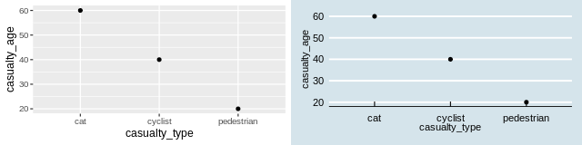

```{r cache, include=FALSE}
knitr::opts_chunk$set(cache = TRUE)
```

```{r upload, eval=FALSE, echo=FALSE}
# Upload exercises
file.copy("inst/stats-19-exercises.pdf", ".")
piggyback::pb_upload("stats-19-exercises.pdf")
# to run this for the first time:
download.file("https://github.com/ITSLeeds/TDS/archive/master.zip", "tds-master.zip")
unzip("tds-master.zip")
file.rename("TDS-master/courses/2day/images/", "inst/images")
```


# Introduction

This document provides information, code and, vitally, exercises to test and improve your R skills.
It starts with introductory R skills that will be of use in any domain but the focus is on R for Road Safety, in support of a [2 day course](https://www.racfoundation.org/introduction-to-r-for-road-safety).
Code and data supporting the content can be found in the GitHub repository (repo) https://github.com/ropensci/stats19/.
The '[issue tracker](https://github.com/ropensci/stats19/issues)' associated with that repo is a good place to ask questions about the course. 

Course pre-requisites are outlined in the [stats19-training-setup](https://docs.ropensci.org/stats19/articles/stats19-training-setup.html) hosted at [docs.ropensci.org/stats19](https://docs.ropensci.org/stats19).
It makes use of a number of packages which can be installed with `install.packages()` and loaded as follows:

```{r, message=FALSE, warning=FALSE, eval=FALSE}
library(pct)      # access travel data from DfT-funded PCT project 
library(sf)       # spatial vector data classes
library(stats19)  # get stats19 data
library(stplanr)  # transport planning tools
library(tidyverse)# packages for 'data science'
library(tmap)     # interactive maps
```

You should type, run and ensure you understand each line of code in this document.

# R and RStudio

The learning outcomes of this first session are to learn: 
RStudio main features and scripts,
R objects and functions,
subsetting,
basic plotting, and
getting help.

The first exercise is to open up RStudio and take a look around and identify the main components, shown in the figure below.
**Explore each of the main components of RStudio.**
Try changing the Global Settings (in the Tools menu) and see RStudio's short cuts by pressing `Alt-Shift-K` (or `Option+Shift+K` on Mac).

```{r rstudioui, echo=FALSE, out.width="80%"}
knitr::include_graphics("images/rstudio-ui.png")
```

## Projects and scripts

Projects are a way to organise related work together. Each project has its own folder and Rproj file. **Advice: always working from projects will make your life easier!** Start a new project with:

> File > New Project
You can choose to create a new directory (folder) or associate a project with an existing directory. Make a new project called stats1-course and save it in a sensible place on your computer. Notice that stats1-course now appears in the top right of RStudio.

Scripts are the files where R code is stored.
**Keeping your code in sensibly named, well organised and reproducible scripts will make your life easier:**
you could simply type all our code into the console, but that require retyping commands each time you run it.
Instead, code that you want to keep and share should be saved script files, plain text files that have the `.R` extension.

Make a new script:

> Flie > New File > Rscript
Or use the new script button on the toolbar.
Or Ctl+Shift+N

Save the script and give it a sensible name like `stats19-lesson-1.R` with:

> File > Save
Or the save button on the toolbar.

**Pro tip:** You can also create new R scripts by typing and running this command in the R console:

```{r edit, eval=FALSE}
file.edit("stats19-lesson-1.R")
```

Keeping scripts and other files associated with a project in a single folder per project (in an RStudio project) will help you find things you need and develop an efficient workflow.

## Writing and running code

Let's start with some basic R operations.
Write this code into your new `stats19-lesson-1.R` R script and execute the result line-by-line by pressing Ctl+Enter

```{r, eval=FALSE}
x = 1:5
y = c(0, 1, 3, 9, 18)
plot(x, y)
```

This code creates two objects, both are vectors of 5 elements, and then plots them (bonus: check their length using the `length()` function).
Save the script by pressing Ctl+S.

There are several ways to run code within a script and it is worth becoming familiar with each.
Try running the the code you saved in the previous section using each of these methods:

1. Place the cursor in different places on each line of code and press `Ctlr+Enter` to run that line of code.
1. Highlight a block of code or part of a line of code and press `Ctlr+Enter` to run the highlighted code.
1. Press `Ctlr+Shift+Enter` to run all the code in a script.
1. Press the Run button on the toolbar to run all the code in a script.
1. Use the function `source()` to run all the code in a script e.g. `source("stats19-lesson-1.R")`
<!-- (but don't create an infinite loop!) -->

**Pro tip:** Try jumping between the console and the source editor by pressing Ctl+1 and Ctl+2.

## Vewing Objects

Create new objects by typing and running the following code chunk in a new script, e.g. called `objects.R`.

```{r}
vehicle_type = c("car", "bus", "tank")
casualty_type = c("pedestrian", "cyclist", "cat")
casualty_age = seq(from = 20, to = 60, by = 20)
set.seed(1)
dark = sample(x = c(TRUE, FALSE), size = 3, replace = TRUE)
small_matrix = matrix(1:24, nrow = 12)
crashes = data.frame(
  vehicle_type,
  casualty_type,
  casualty_age,
  dark
)
```

We can view the objects in a range of ways:

1. Type the name of the object into the console e.g. `crashes`, what happens if we try to view all the 24 numbers included in the object `small_matrix`?
1. Use the `head()` function to view just the first 6 rows e.g. `head(small_matrix)`
1. Bonus: use the `n` argument in the previous function call to show only the first 2 rows of `small_matrix`
1. Use the view table button next to matrix or data.frame objects in the environment tab.
1. Run the command `View(vehicle_type)`. What just happened?

We can also get an overview of an object using a range of functions, including 
`summary()`,
`class()`,
`typeof()`,
`dim()`, and
`length()`.

You can, for example, view a summary of the `casualty_age` variable by running the following line of code:

```{r summary}
summary(casualty_age)
```

**Exercise** try these functions on each of the objects, what results do they give?

```{r summary-answers, echo=FALSE, eval=FALSE}
summary(vehicle_type)
class(vehicle_type)
typeof(vehicle_type)
dim(vehicle_type)
length(vehicle_type)
```

**Bonus**: Find out the class of the column `vehicle_type` in the data frame `crashes` with the command `class(crashes$vehicle_type)`.
Why has it changed? 
Create a new object called `crashes_char` that keeps the class of the character vectors intact by using the function `tibble::tibble()` (see [tibble.tidyverse.org](https://tibble.tidyverse.org/) and Section \@ref(what-are-packages) for details).

```{r tibble1, echo=FALSE, eval=FALSE}
tibble::tibble(
  vehicle_type,
  casualty_type,
  casualty_age,
  dark
)
```

## Autocompletion

RStudio can help you write code by autocompleting it. RStudio will look for similar objects and functions after typing the first three letters of a name.

```{r autocomp, echo=FALSE}
knitr::include_graphics("images/autocomplete.jpg")
```

When there is more than one option you can select from the list using the mouse or arrow keys.

Within a function, you can get a list of arguments by pressing Tab.

```{r help, echo=FALSE}
knitr::include_graphics("images/fucntionhelp.jpg")
```

Notice the help popup.

## Getting help

Every function in R has a help page. You can view the help using `?` for example `?sum`. Many packages also contain vignettes, these are long form help documents containing examples and guides. `vignette()` will show a list of all the vignettes available, or you can show a specific vignette for example `vignette(topic = "sf1", package = "sf")`.

## Commenting Code

It is good practice to use comments in your code to explain what it does. You can comment code using `#`

For example:

```{r}
# Create vector objects (a whole line comment)
x = 1:5 # a seqence of consecutive integers (inline comment)
y = c(0, 1, 3, 9, 18.1) 
```

You can comment/uncomment a whole block of text by selecting it and using `Ctlr+Shift+C`.
<!-- not sure about the next statement so commenting out (RL) -->
<!-- and you can reformat a block of code using `Ctlr+Shift  + /`.  -->

**Pro tip:** You can add a comment section using Ctlr + Shift + R


## The global environment

The Environment tab shows all the objects in your environment, this includes datasets, parameters, and any functions you have created.
By default, new objects appear in the Global Environment but you can see other environments with the drop-down menu.
For example, each package has its own environment.

Sometimes you wish to remove things from your environment, perhaps because you no longer need them or things are getting cluttered.

You can remove an object with the `rm()` function e.g. `rm(x)` or `rm(x, y)` or you can clear your whole environment with the broom button on the Environment Tab.

1. Remove the object `x` that was created in a previous section.
1. What happens when you try to print the `x` by entering it into the console?
1. Try running the following commands in order: `save.image(); rm(list = ls()); load(".RData")`. What happened?
1. How big (how many bytes) is the `.RData` file in your project's folder?
1. Tidy up by removing the `.Rdata` file with `file.remove(".Rdata")`.

## Debugging Code

All the code shown so far is reproducible.
To test RStudio's debugging features, let's write some code that fails, as illustrated in the figure below.

```{r debug, echo=FALSE, out.width="60%"}
knitr::include_graphics("rstudio-autocomplete.png")
```

1. What is the problem with the code shown in the figure?
1. Create other types of error in the code you have run (e.g. no symetrical brackets and other typos)
1. Does RStudio pick up on the errors? And what happens when you try to run buggy code?

**Always address debugging prompts to ensure your code is reproducible**

## Saving R objects

We have already seen that you can save R scripts.
You can also save individual R objects in the RDS format.

```{r}
saveRDS(crashes, "crashes.Rds")
```

We can also read back in our data.

```{r}
crashes2 = readRDS("crashes.Rds")
identical(crashes, crashes2)
```

R also supports many other formats, including CSV files, which can be created and imported with the functions `readr::read_csv()` and `readr::write_csv()` (see also the [readr](https://readr.tidyverse.org/) package).

```{r readr-write, eval=FALSE}
readr::write_csv(crashes, "crashes.csv")
crashes3 = readr::read_csv("crashes.csv")
identical(crashes3, crashes) 
```

Notice that `crashes3` and `crashes` are not identical, what has changed? Hint: read the help page associated with `?readr::write_csv`.

# Manipulating R objects

## Subsetting by index or name

Subsetting returns part of an R object. 
It can be done by providing numbers representing the positions of the elements we want (e.g. the 2^nd^ element) or with a logical vector, with values associated with `TRUE` returned. 
Two dimension object such as matrices and data frames can be subset by rows and columns.
Subsetting in base R is done with square brackets `[]` after the name of an object. **Run the following commands to practice subsetting.**

```{r, eval=FALSE}
casualty_age[2:3] # second and third casualty_age
crashes[c(1, 2), ] # first and second row of crashes
crashes$vehicle_type # returns just one column
crashes[, c("casualty_type", "casualty_age")] # first and third columns
```

```{r, eval=FALSE, echo=FALSE}
crashes[, c(1, 3)] # first and third column of crashes by positional numbers
crashes[c(2), c(3)]
crashes[c(2), c(2, 3)]
class(crashes[, c(1, 3)])
class(crashes[c(2), c(3)])
```

1. Use the `$` operator to print the `dark` column of `crashes`.
1. Subset the crashes with the `[,]` syntax so that only the first and third columns of `crashes` are returned.
1. Return the 2^nd^ row and the 3^rd^ column of the `crashes` dataset. 
1. Return the 2^nd^ row and the columns 2:3 of the `crashes` dataset. 
1. **Bonus**: what class resulted from each of the previous exercises?

## Subsetting by values

It is also possible to subset objects by the values of their elements.
This works because the `[` operator accepts logical vectors returned by queries such as 'is it less than 3?' (`x < 3` in R) and 'was it light?' (`crashes$dark == FALSE`), as demonstrated below:

```{r, eval=FALSE}
x[c(TRUE, FALSE, TRUE, FALSE, TRUE)] # 1st, 3rd, and 5th element in x
x[x == 5] # only when x == 5 (notice the use of double equals)
x[x < 3] # less than 3
x[x < 3] = 0 # assign specific elements
casualty_age[casualty_age %% 6 == 0] # just the ages that are a multiple of 6
crashes[crashes$dark == FALSE, ]
```

1. Subset the `casualty_age` object using the inequality (`<`) so that only elements less than 50 are returned.
1. Subset the `crashes` data frame so that only tanks are returned using the `==` operator.
1. **Bonus**: assign the age of all all tanks to 61.

```{r, eval=FALSE, echo=FALSE}
casualty_age[casualty_age < 50] # the  casualty_age less than 50
crashes[crashes$vehicle_type == "tank", ] # rows where the name is tank
crashes$casualty_age[crashes$vehicle_type == "tank"] = 61
```

## Dealing with NAs

R objects can have a value of NA. This is how R represents missing data.

```{r, eval=FALSE}
z = c(4, 5, NA, 7)
```

NA values are common in real-world data but can cause trouble, for example

```{r, eval=FALSE}
sum(z) # Result is NA
```

Some functions can be told to ignore NA values.

```{r, eval=FALSE}
sum(z, na.rm = TRUE) # Result is equal to 4 + 5 + 7
```

You can find NAs using the `is.na()` function, and then remove them

```{r, eval=FALSE}
is.na(z)
z_nona = z[!is.na(z)] #Note the use of the not operator !
sum(z)
```

Be careful of NAs especially in statistical analysis, for example, the average of a value excluding NAs may not be representative of the whole.

## Changing class

Sometimes you may want to change the class of an object.
This is called class coercion, and can be done with functions such as `as.logical()`, `as.numeric()` and `as.matrix()`.

1. Coerce the `vehicle_type` column of `crashes` to the class `character`.
1. Coerce the `crashes` object into a matrix. What happened to the values?
1. **Bonus:** What is the difference between the output of `summary()` on `character` and `factor` variables?

```{r, echo=FALSE, eval=FALSE}
crashes$vehicle_type = as.character(crashes$vehicle_type)
as.matrix(crashes)
```

## Now you are ready to use R

**Bonus: reproduce the following plot**

```{r smile, out.width="50%", fig.align="center"}
eyes = c(2.3, 4, 3.7, 4)
eyes = matrix(eyes, ncol = 2, byrow = T)
mouth = c(2, 2, 2.5, 1.3, 3, 1, 3.5, 1.3, 4, 2)
mouth = matrix(mouth, ncol = 2, byrow = T)
plot(
  eyes,
  type = "p",
  main = "Smile, you're using R!",
  cex = 2,
  xlim = c(1, 5),
  ylim = c(0, 5)
)
lines(mouth, type = "l", col = "red")
```

\newpage

# R Packages

## What are packages?

R has over 15,000 packages, extending it in almost every direction of statistics and computing.
Packages provide additional functions, data and documentation.
There are two main stages to using a package: installing it and loading it.
A third stage is updating it, this is also important.

<!-- installing it... -->
Install new packages from [The Comprehensive R Archive Network](https://cran.r-project.org/) with the command `install.packages()` (or `remotes::install_github()` to install from GitHub).
Update packages with the command `update.package()` or in Tools > Check for Package Updates in RStudio.
You only need to install a package once.
<!-- **Note: avoid `install.packages()` within a script** -->
<!-- Packages only need to be installed once. -->
<!-- You can use `remotes::install_cran()` or `remotes::install_github()` to only install a package if it is not yet installed and up-to-date (note: you only need to use one of these): -->

```{r, eval=FALSE}
install.packages("sf")
# remotes::install_github("r-spatial/sf")
```

<!-- now talk about loading packages -->
Installed packages are loaded with the command `library()`.
Usually, the package will load silently.
In some cases the package will provide a message, as illustrated below.

```{r}
library(sf)
```

To use a function in a package without first loading the package, use double colons, as shown below (this calls the `tibble()` function from the `tibble` package).

```{r tibble2, eval=FALSE}
crashes_tibble = tibble::tibble(
  vehicle_type,
  casualty_type,
  casualty_age,
  dark
)
```

1. Take a look in the Packages tab in the Files pane in RStudio (bottom right by default).
1. What version of the `stats19` package is installed on your computer?
1. Run the command `update.packages()`. What happens? Why?

## ggplot2

Let's take a look at a particular package.
`ggplot2` is a generic plotting package that is part of the ['tidyverse'](https://www.tidyverse.org/) meta-package, which is an "opinionated collection of R packages designed for data science". 
All packages in the tidyverse "share an underlying design philosophy, grammar, and data structures". 
`ggplot2` is flexible, popular, and has dozens of add-on packages which build on it, such as `gganimate`.
To plot non-spatial data, it works as follows (see figure below, left for result):

```{r, message=FALSE, out.width="40%", eval=FALSE}
library(ggplot2)
ggplot(crashes) + geom_point(aes(x = casualty_type, y = casualty_age))
```

Note that the `+` operator adds layers onto one another.

1. Install a package that build on `ggplot2` that begins with with `gg`. Hint: enter `install.packages(gg)` and hit Tab when your cursor is between the `g` and the `)`.
1. Open a help page in the newly installed package with the `?package_name::function()` syntax.
1. Attach the package.
1. **Bonus:** try using functionality from the new 'gg' package building on the example above (hint: the right plot below uses the economist theme from the `ggthemes` package, try other themes).

```{r gg-extend, echo=FALSE, message=FALSE, eval=FALSE}
library(ggplot2)
g1 = ggplot(crashes) + geom_point(aes(x = casualty_type, y = casualty_age)) ] th
# install.packages("ggthemes")
g2 = ggplot(crashes) + geom_point(aes(x = casualty_type, y = casualty_age)) +
  ggthemes::theme_economist()
g3 = cowplot::plot_grid(g1, g2)
ggsave(filename = "inst/ggtheme-plot.png", width = 8, height = 2, dpi = 80)
```

```{r gg2, echo=FALSE, out.width="80%", fig.align="center"}
library(ggplot2)

```

## dplyr and pipes

Another useful package in the tidyverse is `dplyr`.
It provides functions for manipulating data frames and using the pipe operator ` %>% `. 
The pipe puts the output of one command into the first argument of the next, as shown below (note the results are the same):

```{r}
library(dplyr)
class(crashes)       
crashes %>% class()
```

Useful `dplyr` functions are demonstrated below.

```{r, eval=FALSE}
crashes %>%
  filter(casualty_age > 50) # filter rows
crashes %>%
  select(casualty_type) # select just one column
crashes %>%
  group_by(dark) %>% 
  summarise(mean_age = mean(casualty_age))
```

1. Use `dplyr` to filter row in which `casualty_age` is less than 18, and then 28.
1. Use the `arrange` function to sort the `crashes` object in descending order of age (hint: see the `?arrange` help page).
1. Read the help page of `dplyr::mutate()`. What does the function do?
1. Use the mutate function to create a new variable, `birth_year`, the current year minus their age.
1. **Bonus:** Use the ` %>% ` operator to filter the output from the previous exercise so that only observations with `birth_year` after 1969 are returned.

```{r dplyr, eval=FALSE, echo=FALSE}
# answers
crashes %>% 
  arrange(desc(casualty_age))
crashes %>% filter(casualty_age > 21)
crashes %>% 
  mutate(birth_year = 2019 - casualty_age) %>% 
  filter(birth_year > 1969)
```

# Temporal data

For the analysis and manipulation of temporal data we will first load the R package `lubridate`:

```{r, message=FALSE}
library(lubridate)
```

The simplest example of a Date object that we can analyze is just the current date, i.e.

```{r}
today()
```

We can manipulate this object using several `lubridate` functions to extract the current day, month, year, weekday and so on...

```{r, eval=FALSE}
x = today()
day(x)
month(x)
year(x)
weekdays(x)
```

Exercises: 

1. Look at the help page of the function `month` to see how it is possible to extract the current month as character vector 
1. Look at other functions in lubridate to extract the current weekday as a number, the week of year and the day of the year

Date variables are often stored simply as a character vectors.
This is a problem, since R is not always smart enough to distinguish between character vectors representing Dates.
`lubridate` provides functions that can translate a wide range of date encodings such as `ymd()`, which extracts the Year Month and Day from a character string, as demonstrated below.

```{r, eval=FALSE}
as.Date("2019-10-17") # works
as.Date("2019 10 17") # fails
ymd("2019 10 17") # works
dmy("17/10/2019") # works
```

Import function such as `read_csv` try to recognize the Date variables.
Sometimes this fails.
You can manually create Date objects, as shown below.

```{r}
x = c("2009-01-01", "2009-02-02", "2009-03-03")
x_date = ymd(x)
x_date
```

Exercises: 

1. Extract the day, the year-day, the month and the weekday (as a non-abbreviated character vector) of each element of `x_date`. 
1. Convert `"09/09/93"` into a date object and extract its weekday. 
1. **Bonus:** Read the help page of `as.Date` and `strptime` for further details on the format argument in base R. 

```{r, echo=FALSE, eval=FALSE}
# 1. Extract the day, the year-day, the month and the weekday (as a non-abbreviated character vector) of each element of `x_date`. 
day(x_date)
yday(x_date)
month(x_date)
weekdays(x_date, abbreviate = FALSE)
# 1. Modify the previous example to parse the following character string: `"09/09/1993"` and extract its weekday. 
weekdays(dmy("09/09/93"))
wday(dmy("09/09/93"))
```

We can use Dates also for subsetting events in a dataframe. For example, if we define `x_date` as before and add it to the `crash` dataset, i.e.

```{r}
crashes$casualty_day = x_date
```

then we can subset events using Dates. For example

```{r}
filter(crashes, day(casualty_day) < 7) # the events that ocurred in the first week of the month
filter(crashes, weekdays(casualty_day) == "Monday") # the events occurred on monday
```

Exercises: 

1. Select only the events (rows in `crashes`) that occurred in January
1. Select only the events that ocurred in an odd year-day 
1. Select only the events that ocurred in a leap-year (HINT: check the function `leap_year`)
1. Select only the events that ocurred during the weekend or in June
1. Select only the events that ocurred during the weekend and in June
1. Count how many events that ocurred during each day of the week. 

Now we'll take a look at the time components of a Date. Using the function `hms` (acronym for Hour Minutes Seconds) and its subfunctions such as `hm` or `ms`, we can parse a character vector representing several times as an Hour object (which is tecnically called a Period object). 

```{r}
x = c("18:23:35", "00:00:01", "12:34:56")
x_hour = hms(x)
x_hour
```

We can manipulate these objects using several `lubridate` functions to extract the hour component, the minutes and so on:

```{r}
hour(x_hour)
minute(x_hour)
second(x_hour)
```

If the Hour data do not specify the seconds, then we just have to use a subfunction of `hms`, namely `hm`, and everything works as before. 

```{r}
x = c("18:23", "00:00", "12:34")
(x_hour = hm(x))
```

We can use Hour data also for subsetting events, like we did for Dates. Let's add a new column to crashes data, 

```{r}
crashes$casualty_hms = hms(c("18:23:35", "00:00:01", "12:34:56"))
crashes$casualty_hour = hour(crashes$casualty_hms)
```

Exercises: 

1. Filter only the events that ocurred after midday (i.e. the PM events). Hint: your answer may include `>= 12`.
1. Filter only the events that ocurred between 15:00 and 19:00
<!-- 1. Round all hours to the next hour. Hint: Look at the help page of the `round_date` function.  -->
1. **Bonus:** (difficult): run the following code, which downloades data for car crashes occurred during 2017.

```{r, eval=FALSE}
library(stats19)
crashes_2017 = stats19::get_stats19(year = 2017, type = "ac")
crashes_2017
```

Extract the weekday from the variable called `date`.
How many crashes happened on Monday?

**Advanced challenge:** calculate how many crashes occurred for each day of the week. Then plot it with ggplot2. Repeat the same exercises extracting the hour of the car accident from the variable called time. How would you combine the two informations in a single plot? 

```{r, eval=FALSE, echo=FALSE}
# solutions
crashes %>% filter(casualty_hour >= 12)
crashes %>% filter(casualty_hour > 15 & casualty_hour < 19)

crashes_2017 %>% 
  mutate(my_weekdays = weekdays(date)) %>%
  filter(my_weekdays == "Monday") %>% 
  nrow()
crashes_2017 %>% 
  mutate(my_weekdays = weekdays(date)) %>%
  filter(my_weekdays == "Friday") %>% 
  nrow()

crashes_2017 %>% 
  mutate(my_weekdays = weekdays(date)) %>% 
  group_by(my_weekdays) %>% 
  summarize(n = n()) %>% 
  ggplot() + 
  geom_col(aes(x = my_weekdays, y = n))

crashes_2017 %>% 
  mutate(my_hours = hour(hm(time))) %>% 
  group_by(my_hours) %>% 
  summarize(n = n()) %>% 
  ggplot() + 
  geom_col(aes(x = my_hours, y = n))

crashes_2017 %>% 
  mutate(my_weekdays = weekdays(date), my_hours = hour(hm(time))) %>% 
  group_by(my_weekdays, my_hours) %>% 
  summarise(n = n()) %>% 
  ggplot() + 
  geom_line(aes(x = my_hours, y = n, col = my_weekdays), size = 1.05)
# the legend needs some reordering
```

# Spatial data

All road crashes happen somewhere and, in the UK at least, all collisions recorded by the police are given geographic coordinates, something that can help prioritise interventions to save lives by intervening in and around 'crash hotspots'.
R has strong geographic data capabilities, with the `sf` package provides a generic class for spatial vector data: points, lines and polygons, are represented in `sf` objects as a special 'geometry column', typically called 'geom' or 'geometry', extending the data frame class we've already seen in `crashes`.

Create an `sf` data frame called `crashes_sf` as follows:


```{r crashes-sf}
crashes_sf = crashes # create copy of crashes dataset
crashes_sf$longitude = c(-1.3, -1.2, -1.1)
crashes_sf$latitude = c(50.7, 50.7, 50.68)
crashes_sf = st_as_sf(crashes_sf, coords = c("longitude", "latitude"), crs = 4326)
# mapview::mapview(crashes_sf) # 
```

1. **Bonus**: Where did the tank runover the cat?

`sf` objects can also represent administrative zones.
This is illustrated below with reference to `iow`, an `sf` object representing the Isle of Wight, that we will download using the `pct` package (note: the `[1:9]` appended to the function selects only the first 9 columns).

```{r}
iow = pct::get_pct_zones("isle-of-wight")[1:9]
class(iow)
names(iow)
iow[1:2, c(1, 5, 6, 7, 8)]
```

## CRSs

```{r crs1}
crashes_osgb = st_transform(crashes_sf, 27700)
```

## Buffers


## Attribute operations on sf objects

One of the nice things about the `sf` package is that an `sf data.frame` behaves just like a normal `data.frame` for non-spatial operations.
Load the example dataset for Isle of Wight.

```{r, eval=TRUE}
# load example dataset if it doesn't already exist
if(!exists("iow")) {
  iow = pct::get_pct_zones("isle-of-wight")
}
sel = iow$all > 3000  # create a subsetting object
iow_large = iow[sel, ] # subset areas with a popualtion over 100,000
iow_2 = iow[iow$geo_name == "Isle of Wight 002",] # subset based on 'equality' query
five_in_name = iow[grepl(pattern = "5", x = iow$geo_name), ] # subset based on string match
iow_first_and_third_column = iow[c(1, 3)]
iow_just_all = iow["all"]
```


1. Practice subsetting techniques you have learned on the `sf data.frame` object `iow`:
     1. Create an object called `iow_small` which contains only regions with less than 3000 people in the `all` column
     1. Create a selection object called `sel_high_car` which is `TRUE` for regions with above median numbers of people who travel by car and `FALSE` otherwise
     1. How many regions have the number '1' in the column 'geo_name'? What percentage of the regions in the Isle of Wight is this? Hint: Look at the help page of the function 'grepl'.  
     1. Create an object called `iow_foot` which contains only the foot attribute from `iow`
     1. Bonus: plot `iow_foot` using the function `plot` to show where walking is a popular mode of travel to work
     1. Bonus: bulding on your answers to previous questions, use `filter()` from the `dplyr` package to subset small regions where car use is high. 
1. Bonus: What is the population density of each region (hint: you may need to use the functions `st_area()`, `as.numeric()` and use the 'all' column)?
1. Bonus: Which zone has the highest percentage of people who cycle?
1. Bonus: Find the proportion of people who drive to work (`car_driver`) in areas in which more than 500 people walk to work

```{r, echo=FALSE, eval=FALSE}
# 1. Practice subsetting techniques you have learned on the `sf data.frame` object `iow`:
#      1. Create an object called `iow_small` which contains only regions with less than 3000 people in the `all` column
# in base R
iow_small = iow[iow$all < 3000, ]
# with dplyr
iow_small = iow %>% 
  filter(all < 3000)
#      1. Create a selection object called `sel_high_car` which is `TRUE` for regions with above median numbers of people who travel by car and `FALSE` otherwise
median_car = median(iow$car_driver)
sel_high_car = iow$car_driver > median_car 
#      1. How many regions have the number '1' in the column 'geo_name'? What percentage of the regions in the Isle of Wight is this?
sel_region_name_contains_1 = grepl("1", x = iow$geo_name)
sum(sel_region_name_contains_1) / nrow(iow)
#      1. Create an object called `iow_foot` which contains only the foot attribute from `iow`
# using base R
iow_foot = iow["foot"]
# dplyr
iow_foot = iow %>% 
  select(foot)
#      1. Bonus: plot the result to show where walking is a popular mode of travel to work
plot(iow_foot)
#      1. Bonus: bulding on your answers to previous questions, use `filter()` from the `dplyr` package to subset small regions where high car use is high
iow_small_car_high = iow %>% 
  filter(all < 3000, car_driver > median_car)
# 1. Bonus: What is the population density of each region (hint: you may need to use the functions `st_area()`, `as.numeric()` and use the 'all' column)?
iow$area_km2 = as.numeric(st_area(iow)) /1000000
iow$population_density = iow$all / iow$area_km2
plot(iow["population_density"])
# in dplyr
iow_density = iow %>% 
  mutate(area_km2 = as.numeric(st_area(geometry)) / 1000000) %>% 
  mutate(population_density = all / area_km2)
plot(iow_density %>% select(population_density))
# 1. Bonus: Which zone has the highest percentage who cycle?
iow %>% 
  mutate(pcycle = bicycle / all) %>% 
  top_n(n = 1, wt = pcycle)
# 1. Bonus: Find the proportion of people who drive to work (`car_driver`) in areas in which more than 500 people walk to work
iow %>% 
  group_by(foot > 500) %>% 
  summarise(mean_car = sum(car_driver) / sum(all) )
```

## Matching roads to crashes


<!-- # Spatial data analysis -->

<!-- Should some of this go into the spatial section? Probably. -->

<!-- What makes an `sf data.frame` different from a normal `data.frame` is the inclusion of a geometry column and spatial operations. -->

<!-- ## Projections and Coordinate Reference Systems -->

<!-- When plotting a map you need X and Y coordinates to specify where objects should appear. While this is simple on a flat surface spatial data must fit onto the curved surface of the earth. You may know that it is impossible to unwrap a sphere into a single flat surface without distorting (stretching, twisting, cutting) the surface in some way. The process of making a flat map from a curved Earth is known as projection, and there are many valid ways to project a map. -->

<!-- Coordinate Reference Systems (CRS) refer to different ways of defining the X and Y coordinates used in different projections. Largely they fall into two categories, **geographic** and **projected**. These are illustrated in the figure below, from Chapter 2 of Geocomputation with R, in which location of London (the red X) is represented with reference to an origin (the blue circle). The left plot represents a geographic CRS with an origin at 0° longitude and latitude. The right plot represents a projected CRS with an origin located in the sea west of the South West Peninsula. -->

<!-- ```{r vectorplots, out.width="40%", fig.show='hold', echo=FALSE} -->
<!-- download.file("https://geocompr.robinlovelace.net/figures/vector_lonlat.png", "vector_lonlat.png", mode = "wb") -->
<!-- download.file("https://geocompr.robinlovelace.net/figures/vector_projected.png", "vector_projected.png", mode = "wb") -->
<!-- knitr::include_graphics(c("vector_lonlat.png", "vector_projected.png")) -->
<!-- ``` -->

<!-- * Geographical Coordinate Systems: use latitude and longitude to represent any place on the Earth -->

<!-- * Projected Coordinate Systems: use distances from an origin point to represent a small part of the Earth, e.g. a country. The advantage of a projects CRS is that it is easier to calculate properties such as distance and area as coordinates are in metres. -->

<!-- You can find a catalogue of different CRSs at http://spatialreference.org/ -->

<!-- CRSs are often referred to by the EPSG number. The European Petroleum Survey Group publish a database of different coordinate systems. Two useful projections to commit to memory are: -->

<!-- * 4326 - the World Geodetic System 1984 which is a widely used geographical coordinate system, used in GPS datasets and the .geojson file format, for example. -->
<!-- * 27700 - the British National Grid -->

<!-- Every `sf data.frame` has a CRS. -->

<!-- ```{r} -->
<!-- st_crs(iow) # 4326 is a geographic (lon/lat) projection -->
<!-- iow_projected = st_transform(iow, 27700) # transfrom to projected CRS -->
<!-- st_crs(iow_projected) # updated CRS -->
<!-- iow_lonlat = st_transform(iow, 4326) # transfrom back -->
<!-- ``` -->
<!-- **Warning** It is possible to change the CRS without reprojecting the data as follows (not recommended): -->
<!-- ```{r, eval=FALSE} -->
<!-- st_crs(iow_projected) = 4326 -->
<!-- ``` -->

<!-- This is risky as you may confuse your data by having the wrong CRS. -->

<!-- For more information see [Chapter 6](https://geocompr.robinlovelace.net/reproj-geo-data.html) of Geocompuation with R. -->

<!-- ## Spatial operations -->

<!-- It is possible to subset an `sf data.frame` by location as well as attributes. -->

<!-- Let's load some centroids and find out which are in differe `iow` areas. -->

<!-- ```{r, warning=FALSE, out.width="30%"} -->
<!-- iow_cents = pct::get_pct_centroids(region = "isle-of-wight", geography = "lsoa") # Load the iow_cents data -->
<!-- iow_cents2 = iow_cents[iow_2,] -->
<!-- plot(iow$geometry) -->
<!-- plot(iow_cents, col = "black", add = TRUE) -->
<!-- plot(iow_cents2, col = "red", add = TRUE) -->
<!-- ``` -->

<!-- `st_intersects()` is a 'binary predicate' that identifies which features in one `sf` object intersect with another `sf` object in geographic space:  -->

<!-- ```{r, eval=FALSE} -->
<!-- st_intersects(iow_cents, iow_large) -->
<!-- ``` -->

<!-- There are many spatial predicates, including `st_overlaps()` and `st_difference()`. You can see a list of them in the help. -->

<!-- ```{r, eval=FALSE} -->
<!-- ?st_intersects -->
<!-- ``` -->

<!-- You could use a different function by adding the `op` argument -->

<!-- ```{r, eval=TRUE} -->
<!-- iow_cents3 = iow_cents[iow_2, , op = st_disjoint] -->
<!-- ``` -->

<!-- ## Aggregation -->

<!-- With a normal data.frame it is possible to group and aggregate variables using the `dplyr` packages.  -->

<!-- > group_by() %>% summarise() -->
<!-- It is also possible to do this for sf `data.frames` by default a `st_union` is performed on the geometries.  -->

<!-- The input data for this part will be point and polygon data representing New Zealand (`nz`), from Chapter 4 of *Geocomputation with R*. -->
<!-- The best place to start is to plot the data so the first exercise is: -->

<!-- - Create a plot of the data so it looks like the map of New Zealand below (hint: use the `add = TRUE` argument). -->

<!-- ```{r, out.width="40%"} -->
<!-- library(spData) -->
<!-- plot(nz$geom) -->
<!-- plot(nz_height["elevation"], add = TRUE) -->
<!-- ``` -->

<!-- ```{r, eval=TRUE, out.width="30%"} -->
<!-- nz_islands = nz %>% -->
<!--   group_by(Island) %>% -->
<!--   summarise(Population = sum(Population)) -->
<!-- plot(nz_islands) -->
<!-- ``` -->

<!-- Note that the implicit `st_union` has resolved all the internal boundaries of each island. If you wished to keep the boundaries you can use `st_combine`. -->

<!-- ```{r, eval=TRUE, out.width="40%"} -->
<!-- nz_islands = nz %>% -->
<!--   group_by(Island) %>% -->
<!--   summarise(Population = sum(Population), do_union = FALSE) -->
<!-- plot(nz_islands) -->
<!-- ``` -->

<!-- ## Geometric Operations -->

<!-- Geometric operation change or derive from the geometry of our data. The most commonly used functions are: -->

<!-- - `st_simplify` To simplify a complex shape -->
<!-- - `st_centroid` To find the geographical centre of a shape -->
<!-- - `st_buffer` To create a buffer around a shape -->

<!-- For more see [Section 5.2 of Geocompuation with R](https://geocompr.robinlovelace.net/geometric-operations.html#geo-vec) -->

<!-- 1. Canterbury is the region of New Zealand containing most of the 100 highest points in the country. Create an object called `canterbury` and use this to subset all points within the region. How many of these high points does the Canterbury region contain? -->
<!-- ```{r 04-spatial-operations-45, eval=FALSE, echo=FALSE} -->
<!-- library(tmap) -->
<!-- tmap_mode("view") -->
<!-- qtm(nz) + qtm(nz_height) -->
<!-- canterbury = nz %>% filter(Name == "Canterbury") -->
<!-- canterbury_height = nz_height[canterbury, ] -->
<!-- nrow(canterbury_height) # answer: 70 -->
<!-- ``` -->
<!-- 1. Which region has the second highest number of `nz_height` points in, and how many does it have? -->
<!-- ```{r 04-spatial-operations-46, eval=FALSE, echo=FALSE} -->
<!-- nz_height_count = aggregate(nz_height, nz, length) -->
<!-- nz_height_combined = cbind(nz, count = nz_height_count$elevation) -->
<!-- nz_height_combined %>%  -->
<!--   st_drop_geometry() %>%  -->
<!--   dplyr::select(Name, count) %>%  -->
<!--   arrange(desc(count)) %>%  -->
<!--   slice(2) -->
<!-- ``` -->
<!--     - Bonus: generalizing the question to all regions, how many of New Zealand's 16 regions contain points which belong to the top 100 highest points in the country? Which regions? -->
<!--     - Bonus: create a table listing these regions in order of the number of points and their name. -->
<!-- ```{r 04-spatial-operations-47, echo=FALSE, eval=FALSE} -->
<!-- nz_height_count = aggregate(nz_height, nz, length) -->
<!-- nz_height_combined = cbind(nz, count = nz_height_count$elevation) -->
<!-- nz_height_combined %>%  -->
<!--   st_drop_geometry() %>%  -->
<!--   dplyr::select(Name, count) %>%  -->
<!--   arrange(desc(count)) %>%  -->
<!--   na.omit() -->
<!-- ``` -->


# Visualising spatial datasets

Many packages can be used to create maps in R.
The most basic is with the `plot()` function.
`ggplot2` is a powerful plotting package that is part of the `tidyverse`, that can create maps with the function `geom_sf()`.
However, for publication maps, we recommend using `tmap` for reasons outlined in Chapter 8 of Geocomputation with R.
Load the package as follows:

```{r}
library(tmap)
```


Create the following plots using `plot()` and `tm_shape() + tm_polygons()` functions.

```{r, fig.show='hold', out.width="49%", echo=FALSE}
plot(iow[c("all", "bicycle")])
tm_shape(iow) + 
  tm_polygons(c("all", "bicycle"))
```

These exercises rely on the object `europe`.
Create it using the `world` and `worldbank_df` datasets from the **spData** package as follows (see Section [2.2](https://geocompr.robinlovelace.net/spatial-class.html#intro-sf) of Geocomputation with R for details):

```{r 08-mapping-41, warning=FALSE}
# europe = world %>% 
#   filter(continent == "Europe", !is.na(iso_a2)) %>% 
#   left_join(worldbank_df, by = "iso_a2") %>% 
#   dplyr::select(name, subregion, gdpPercap, HDI, pop_growth) %>% 
#   st_transform("+proj=aea +lat_1=20 +lat_2=-23 +lat_0=0 +lon_0=25")
```

1. Create a map showing the geographic distribution of the `gdpPercap` across Europe with base **graphics** (hint: use `plot()`) and **tmap** packages (hint: use `tm_shape(europe) + ...`).
1. Extend the **tmap** created for the previous exercise so the legend has three bins: "High" (above 30000), "Medium" (between 30000 and 20000) and "Low" (below 20000).
    - Bonus: improve the map aesthetics, for example by changing the legend title, class labels and colour palette.
1. Represent `europe`'s subregions on the map. 

```{r, echo=FALSE, out.width="50%"}
# plot(europe["subregion"])
```

# Analysing point data from stats19 

1. Download and plot all crashes reported in Great Britain in 2017 (hint: see [the stats19 vignette](https://cran.r-project.org/web/packages/stats19/vignettes/stats19.html))
1. Find the function in the `stats19` package that converts a `data.frame` object into an `sf` data frame. Use this function to convert the road crashes into an `sf` object, called `crashes_sf`, for example.
1. Filter crashes that happened in the Isle of Wight based on attribute data (hint: the relevant column contains the word `local`)
1. Filter crashes happened in the Isle of Wight using geographic subsetting (hint: remember `st_crs()`?)
1. Bonus: Which type of subsetting yielded more results and why? 
1. Bonus: how many crashes happened in each zone?
1. Create a new column called `month` in the crash data using the function `lubridate::month()` and the `date` column.
1. Create an object called `a_iow_may` representing all the crashes that happened in the Isle of Wight in the month of May
1. Bonus: Calculate the average (`mean`) speed limit associated with each crash that happened in May across the zones of the Isle of Wight (the result is shown in the map)


```{r, echo=FALSE, results='hide', message=FALSE, eval=FALSE}
library(stats19)
library(dplyr)
library(sf)
a = get_stats19(2017, "ac", ask = FALSE)
asf = format_sf(a)
a_iow = asf %>% 
  filter(local_authority_district == "Isle of Wight")
nrow(a_iow)
iow = pct::get_pct_zones(region = "isle-of-wight")
iow_osbg = st_transform(iow, 27700)
a_iow_sf = a_iow[iow_osbg, ]
nrow(a_iow_sf)
# mapview::mapview(iow) +
#   mapview::mapview(a_iow)
class(a$date)
class(a$time)
a_iow$month = lubridate::month(a_iow$date)
a_iow_may = a_iow %>% 
  filter(month == 5)
a_agg = aggregate(a_iow_may["speed_limit"], iow_osbg, mean)
plot(a_agg)
class(crashes$date)
```

# Analysing crash data on road networks

# Bonus exercises

Identify a region and zonal units of interest from http://geoportal.statistics.gov.uk/

1. Read them into R as an `sf` object
1. Identify the average speed limit associated with crashes in each zone
